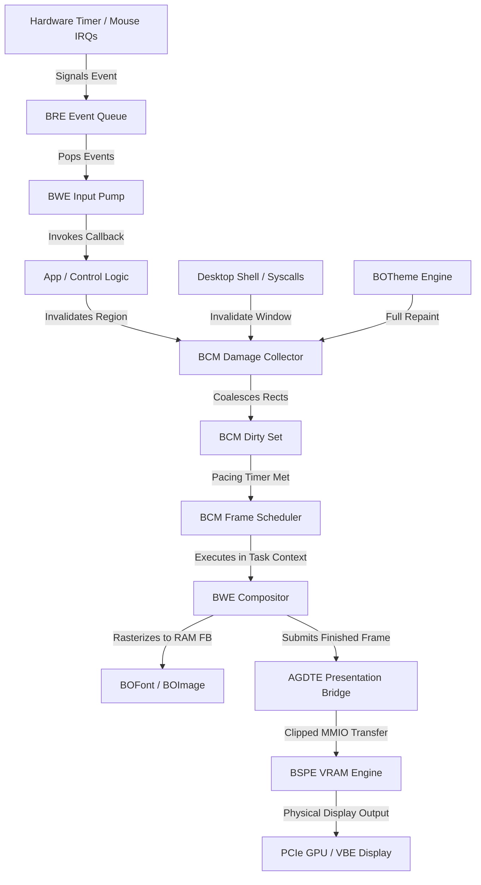

# BOS COMPOSITION MANAGER (BCM) — COMPLETE ARCHITECTURE MAP

**Document ID:** `BCM_ARCHITECTURE_MAP.md`  
**Classification:** System Architecture & Component Mapping (Phase 0 Deliverable)  
**Status:** **DESIGN & ARCHITECTURE ONLY — ZERO CODE MODIFIED**  

---

## 1. Top-Level Architectural System Map

```text
+═════════════════════════════════════════════════════════════════════════════════════════+
║                                   ATOMS OS GUI RUNTIME                                  ║
+═════════════════════════════════════════════════════════════════════════════════════════+
                                            │
  ┌─────────────────────────────────────────┼──────────────────────────────────────────┐
  │                                         │                                          │
  ▼                                         ▼                                          ▼
[HARDWARE INTERRUPTS]              [USERSPACE APPLICATIONS]                   [KERNEL SUBSYSTEMS]
• Timer IRQ 0 (1000 Hz)            • Desktop Shell (PID 200)                  • BWE Window Manager
• Mouse IRQ 12 / xHCI              • Explorer / File Manager                  • BOTheme Engine
• PS/2 Keyboard IRQ 1              • Interactive Terminal                     • Task Panel & Start Menu
• Realtek LAN IRQ 11               • Calculator Engine                        • AME Motion Engine
  │                                         │                                          │
  │ (Non-blocking damage request)           │ (Syscall Invalidate)                     │ (BWE_InvalidateWindow)
  └─────────────────────────────────────────┼──────────────────────────────────────────┘
                                            │
                                            ▼
+═════════════════════════════════════════════════════════════════════════════════════════+
║                         BOS COMPOSITION MANAGER (BCM) ENGINE                            ║
║                                                                                         ║
║  ┌────────────────────────────────┐       ┌──────────────────────────────────────────┐  ║
║  │   Damage Ingestion Engine      │       │       Frame State Machine Controller     │  ║
║  │  • BCM_RequestWindowDamage()   │       │  • IDLE -> REQUESTED -> SCHEDULED        │  ║
║  │  • BCM_RequestSubRectDamage()  │       │  • COMPOSING -> COMPOSED -> PRESENTING   │  ║
║  │  • BCM_RequestCursorDamage()   │       │  • PRESENTED -> IDLE                     │  ║
║  │  • BCM_RequestFullDamage()     │       └──────────────────────────────────────────┘  ║
║  └────────────────────────────────┘                                                     ║
║                  │                                             ▲                        ║
║                  ▼                                             │                        ║
║  ┌────────────────────────────────┐       ┌──────────────────────────────────────────┐  ║
║  │    Dirty Region Coalescer      │       │         Frame Pacer & Rate Limiter       │  ║
║  │  • Max 32 Bounding Boxes       │──────▶│  • 60 FPS Target Pacing (16.6 ms)        │  ║
║  │  • Overlap Merge Logic         │       │  • 10 ms Min Inter-Frame Gap             │  ║
║  │  • 65% Full-Damage Fallback    │       │  • Frame Budget: 8 ms Render, 4 ms Copy  │  ║
║  └────────────────────────────────┘       └──────────────────────────────────────────┘  ║
+═════════════════════════════════════════════════════════════════════════════════════════+
                                            │
                                            ▼ (Invoked in Task Context, IF=1)
+═════════════════════════════════════════════════════════════════════════════════════════+
║                                RENDERING & PRESENTATION                                 ║
║                                                                                         ║
║  ┌────────────────────────────────┐       ┌──────────────────────────────────────────┐  ║
║  │       BWE Compositor Core      │       │     AGDTE & BSPE Presentation Engine     │  ║
║  │  • Z-Order Stack Traversal     │       │  • AGDTE Presentation Bridge             │  ║
║  │  • compose_window_recursive()  │──────▶│  • BSPE Effective Damage Clipper         │  ║
║  │  • RAM FB Software Backbuffer  │       │  • PCIe MMIO Physical VRAM Memcpy        │  ║
║  │  • BOFont / BOImage Glyph Atlas│       │  • Double-Buffered VBE Back Page Swap    │  ║
║  └────────────────────────────────┘       └──────────────────────────────────────────┘  ║
+═════════════════════════════════════════════════════════════════════════════════════════+
```

---

## 2. Complete Execution-Context Authority Matrix

| Function / Operation | Authorized Caller | Execution Context | `RFLAGS.IF` | May Allocate? | May Block/Sleep? | May Render? | May Copy to VRAM? |
|---|---|---|---|---|---|---|---|
| `timer_tick_handler()` | CPU Vector 32 | **Ring 0 Hardware ISR** | **`0` (Disabled)** | ❌ NO | ❌ NO | ❌ NO | ❌ NO |
| `BRE_DispatchPending()`| Timer ISR | **Ring 0 Hardware ISR** | **`0` (Disabled)** | ❌ NO | ❌ NO | ❌ NO | ❌ NO |
| `BWE_PumpEvents()` | Input Worker / Task | **Cooperative Task** | **`1` (Enabled)** | ❌ NO | ❌ NO | ❌ NO | ❌ NO |
| `BCM_RequestDamage()` | Any (ISR, App, WM) | **Any (ISR Safe)** | **Any (`0` or `1`)** | ❌ NO | ❌ NO | ❌ NO | ❌ NO |
| `BCM_Process()` | Compositor Task Loop | **Ring 0 Kernel Task** | **`1` (Enabled)** | ❌ NO | ❌ NO | ❌ NO | ❌ NO |
| `BWE_ComposeFrame()` | BCM Core | **Ring 0 Kernel Task** | **`1` (Enabled)** | ❌ NO | ❌ NO | **✅ YES** | ❌ NO |
| `BSPE_VRAM_Copy()` | BCM / AGDTE | **Ring 0 Kernel Task** | **`1` (Enabled)** | ❌ NO | ❌ NO | ❌ NO | **✅ YES** |
| `BOS_CreateWindow()` | Apps, Shell, Syscall | **Task / Syscall** | **`1` (Enabled)** | **✅ YES** | ❌ NO | ❌ NO | ❌ NO |
| `BOS_DestroyWindow()` | Apps, Shell, Syscall | **Task / Syscall** | **`1` (Enabled)** | ❌ NO | ❌ NO | ❌ NO | ❌ NO |

---

## 3. Dependency Graph



---

## 4. Ownership Map

```text
1. WINDOWS & SURFACES:
   Owner: BWE Window Manager (kernel/wm/bwe/src/bwe_window.c)
   Stores: g_windows[BWE_MAX_WINDOWS], g_z_order_stack[BWE_MAX_WINDOWS]
   Authority: BOS_CreateWindow, BOS_DestroyWindow, BOS_SetBounds, BOS_SetFocus

2. DAMAGE & DIRTY BOUNDS:
   Owner: BOS Composition Manager (BCM)
   Stores: BCM_DirtySet (up to 32 coalesced bounding boxes)
   Authority: BCM_RequestDamage, BCM_CoalesceDamage, BCM_ResetDamage

3. FRAME STATE & PACING:
   Owner: BOS Composition Manager (BCM)
   Stores: BCM_FrameState, last_compose_timestamp, frame_budget_us
   Authority: BCM_ScheduleFrame, BCM_BeginFrame, BCM_EndFrame

4. FRAMEBUFFERS:
   Owner: VBE Driver & BOVisual (kernel/drivers/video/vbe/vbe.c)
   Stores:
     - ram_fb: 1920x1080 System RAM Backbuffer (CPU drawing surface)
     - back_vram_ptr: 1920x1080 Physical GPU VRAM Back Page
     - front_vram_ptr: 1920x1080 Physical GPU VRAM Front Page (Active Scanout)
   Authority: vbe_init, vbe_get_framebuffer, vbe_get_back_page_ptr

5. PRESENTATION & PACING:
   Owner: AGDTE & BSPE (kernel/graphics/AGDTE/ and kernel/graphics/BSPE/)
   Stores: AGDTE_Queue, AGDTE_DisplayState, BSPE_DamageTracker
   Authority: AGDTE_Presenter_PresentBridgeBSPE, BSPE_DualPage_PresentFrame
```
