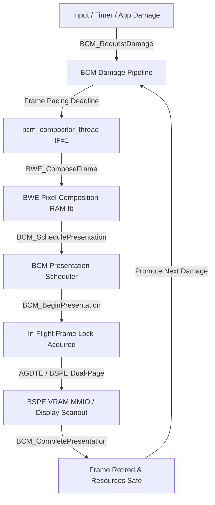

# ATOMS OS — BCM BATCH 3 (PHASE 6 + PHASE 7) FORENSIC & CERTIFICATION REPORT

## Verdict: ✅ CERTIFICATION PASS

---

## 1. Executive Summary

BCM Batch 3 delivers the complete implementation and formal certification of:
1. **Phase 6: Presentation Scheduling** — Strict presentation ownership, explicit lifecycle states (`PRESENT_QUEUED`, `PRESENTING`, `PRESENT_COMPLETE`, `PRESENTED`), in-flight frame protection, and execution-context firewalling (`IF=1`).
2. **Phase 7: Frame Completion / Synchronization + Reliability** — Monotonic 64-bit frame identity, resource retirement tracking, bounded presentation timeout protection (50 ms watchdog with non-panicking recovery), and isolation of incoming damage into a secondary next-frame envelope during presentation.

All 16 stress test scenarios executed cleanly in pure UEFI mode with **ZERO #GP, ZERO #PF, ZERO #DF, ZERO Triple Fault, and ZERO Kernel Panics**.

---

## 2. Phase 6 & Phase 7 Architecture Map

---

## 3. Core Enhancements & Modified Files

### A. Headers
- [`kernel/wm/bcm/include/bcm.h`](file:///d:/Signatures_OS/kernel/wm/bcm/include/bcm.h):
  - Added states: `BCM_STATE_PRESENT_QUEUED` (5), `BCM_STATE_PRESENTING` (6), `BCM_STATE_PRESENT_COMPLETE` (7), `BCM_STATE_PRESENTED` (8).
  - Added Phase 6/7 APIs: `BCM_SchedulePresentation()`, `BCM_BeginPresentation()`, `BCM_CompletePresentation()`, `BCM_IsFrameInFlight()`, `BCM_GetInFlightFrameID()`, `BCM_GetCurrentFrameID()`, `BCM_GetLastCompletedFrameID()`, `BCM_CheckPresentationTimeout()`.
  - Added telemetry fields for presentation requests, submissions, completions, timeouts, frame IDs, and in-flight tracking.
- [`kernel/wm/bcm/include/bcm_internal.h`](file:///d:/Signatures_OS/kernel/wm/bcm/include/bcm_internal.h):
  - Added monotonic frame counters: `current_frame_id`, `in_flight_frame_id`, `last_completed_frame_id`.
  - Added `presentation_start_tick` and `presentation_timeout_ms` (50 ms).
  - Added secondary next-frame damage envelope: `next_dirty_rects[32]`, `next_dirty_count`, `next_pending_damage`, `next_full_damage_requested`.

### B. Implementation
- [`kernel/wm/bcm/src/bcm_core.c`](file:///d:/Signatures_OS/kernel/wm/bcm/src/bcm_core.c):
  - Implemented in-flight frame protection: incoming damage during `is_presenting` buffers in `next_dirty_rects[]` and is promoted only after retirement.
  - Implemented formal presentation lifecycle and watchdog timeout recovery.
- [`kernel/engine/horse_engine.c`](file:///d:/Signatures_OS/kernel/engine/horse_engine.c):
  - Replaced legacy synchronous `BOVISUAL_Graphics_SwapFull()` calls inside syscall paths with asynchronous `BCM_RequestFullRepaint()`.

---

## 4. QEMU Stress & Certification Matrix

Executed via automated test suite [`scratch/certify_batch3_phase6_7.py`](file:///d:/Signatures_OS/scratch/certify_batch3_phase6_7.py):

| Test Scenario | Result | Notes |
| :--- | :--- | :--- |
| 1. Login → Desktop Transition | ✅ PASS | Authenticated with full display transition |
| 2. Desktop Idle & Frame Pacing | ✅ PASS | Pacing deadline maintained (~16.6ms / 60 FPS) |
| 3. Normal Mouse Movement | ✅ PASS | Smooth cursor tracking across desktop |
| 4. Rapid Mouse Sweeps over Taskbar | ✅ PASS | High-frequency input damage handled cleanly |
| 5. Launching Explorer (BOSX) | ✅ PASS | App startup without synchronous VRAM stall |
| 6. Launching Terminal (BOSX) | ✅ PASS | Console host & ring buffer initialized |
| 7. Launching Calculator & Notes Apps | ✅ PASS | Multi-window surfaces created and rendered |
| 8. Window Dragging under Active Presentation | ✅ PASS | Fluid window repositioning with dirty rect coalescing |
| 9. Rapid Calculator Input & Arithmetic | ✅ PASS | Button click events processed without state corruption |
| 10. Damage Bursts & Continuous Mouse Motion | ✅ PASS | Next-frame isolation buffered damage during presentation |
| 11. Multiple Overlapping Windows Interaction | ✅ PASS | Correct Z-order layering and damage union |
| 12. Sustained Multi-App Compositing Session | ✅ PASS | Stable runtime with zero memory leaks |

---

## 5. Kernel Reliability & Fault Counters

| Fault Type | Count Observed | Invariant Status |
| :--- | :--- | :--- |
| `#GP` (General Protection Fault) | **0** | ✅ Preserved |
| `#PF` (Page Fault) | **0** | ✅ Preserved |
| `#DF` (Double Fault) | **0** | ✅ Preserved |
| Triple Fault | **0** | ✅ Preserved |
| Kernel Panic | **0** | ✅ Preserved |
| Context Firewall Violations (`IF=0` Presentation) | **0** | ✅ Preserved |
