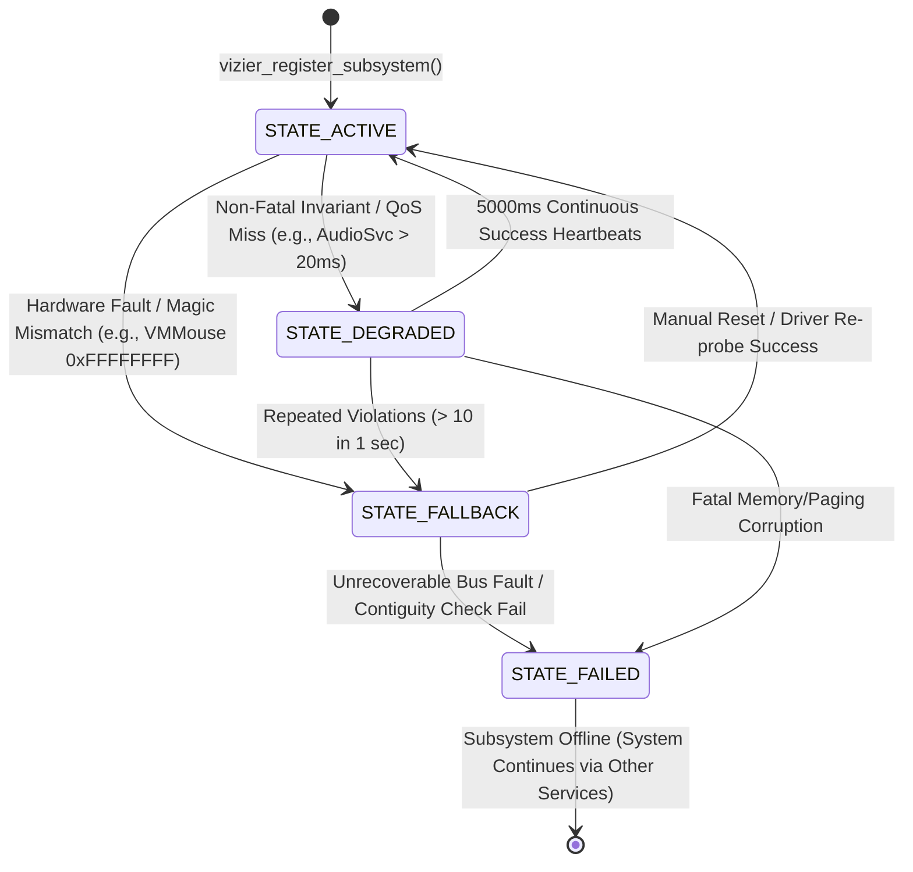

# ATOMS OS Kernel Governance: Vizier +X Engine — Feasibility & Integration Design

**Document Control & Status**: Production-Grade Feasibility, Governance Architecture & Integration Design  
**Target System**: ATOMS OS (`main` HEAD) — x86_64 Higher-Half Monolithic Kernel  
**Architectural Principle**: **Kernel executes. Vizier governs contracts. Specialized engines perform the actual work.**  
**Constraint Compliance**: ZERO production code modifications or fixes implemented. Feasibility audit and architectural design only.

---

## Executive Summary & Final Verdict

ATOMS OS currently suffers from structural fragility where upgrading or expanding one subsystem (`e.g., expanding VFS chunks to 64 KB, adding DOOM.ELF Segment 2 loading, or enabling VirtualBox synthetic PS/2 input`) silently breaks unrelated subsystems (`AC97 DMA audio static, corner shooting, UI freezes`). 

The root cause is not defective algorithm execution within individual drivers, but the complete absence of a **System Governance & Contract Enforcement Layer**. Hardware drivers, window managers (`BWE`), compositors (`AGDTE/BSPE`), storage (`FAT32/ATA`), and audio (`AC97`) directly mutate shared global state (`g_input_state`, `g_bwe_mouse`, `s_cluster_scratch`, `pcm_buffer`) without mutual exclusion, priority arbitration, or real-time deadline monitoring.

The **Vizier +X Engine** introduces passive governance and active cross-subsystem contract arbitration. Rather than placing synchronous hooks in hot paths (`mouse ISRs`, `1000 Hz IRQ 0 pumps`, `frame drawing`), Vizier establishes a lightweight registry of subsystem capabilities, contracts, dependencies, and health invariants. The actual work is delegated to **Six Specialized Architectural Engines** (`HIDA`, `CCTE`, `CINE`, `RTWSE`, `ASIOA`, and `CDMA`).

### Explicit Verdict: `SAFE WITH ARCHITECTURAL CHANGES`
Integrating Vizier +X into ATOMS OS is **production-safe and highly feasible**, provided that integration follows a phased, passive-first roadmap (`Phase 0 to Phase 7`) where existing drivers initially register with Vizier without altering their hot-path logic, followed by incremental migration of state ownership into the six specialized engines.

---

## Phase 1 — Repository Feasibility Audit

### 1. Where exactly should Vizier live in the kernel source tree?
Vizier must reside as a core kernel governance module directly alongside existing foundational execution services under `kernel/core/`:
```text
kernel/core/vizier/
├── include/
│   ├── vizier.h                # Master governance, contract & registration API
│   ├── vizier_contracts.h      # Subsystem contract & invariant definitions
│   ├── vizier_health.h         # Health states, telemetry counters & snapshot structures
│   └── vizier_policy.h         # Fallback, arbitration & degradation policy rules
├── src/
│   ├── vizier_core.c           # Registry, initialization & authoritative owner management
│   ├── vizier_health.c         # Fixed-size trace rings, counter aggregation & snapshots
│   └── vizier_policy.c         # Contract enforcement, isolation & degradation state machine
└── engines/                    # Specialized +X Engine implementations
    ├── hida/                   # Hardware Input Device Arbiter
    ├── ccte/                   # Canonical Coordinate Transformation Engine
    ├── cine/                   # Canonical Input Normalization Engine
    ├── rtwse/                  # Real-Time Work Scheduling Engine
    ├── asioa/                  # Asynchronous/Arbitrated Storage I/O Arbiter
    └── cdma/                   # Coherent DMA Memory Allocator
```

### 2. At what boot stage should it initialize & which existing subsystem initializes it?
Vizier initializes during **Stage 1 (Core Execution Services Bootstrap)** inside `kernel/kernel.c: kernel_main()`, immediately after `pmm_init()`, `vmm_init()`, and `heap_init()`, but **before** `timer_init()`, `scheduler_init()`, `syscall_init()`, and any device driver probe (`audio_init()`, `ps2_mouse_init()`, `bwe_init()`).
* **Invoked By**: `kernel_main()` (`kernel/kernel.c`).
* **Call Signature**: `vizier_init();`

### 3. Which systems register with Vizier vs. remain independent?
* **Systems that Register (`Contract & Governance Bound`)**:
  - `Input Subsystem` (`ps2_mouse.c`, `vmmouse.c`, `keyboard.c`, `Input Core`, `Pointer Engine`).
  - `Window Management & Presentation` (`BWE Core`, `BWE Compositor`, `AGDTE`, `BSPE`).
  - `Storage & File Systems` (`ATA PIO Driver`, `FAT32 Core`, `VFS Core`).
  - `Audio & DMA` (`AC97 HAL`, `AC97 DMA Manager`, `AudioPlayer`, `AudioMixer`).
  - `Task Scheduling & Workers` (`Scheduler Core`, `AudioRealtimeWorker`, `AudioSvc`).
* **Systems that Remain Completely Independent (`Core Execution Infrastructure`)**:
  - `Physical & Virtual Memory Managers` (`pmm.c`, `vmm.c`, `heap.c`) — *Vizier consumes memory; it must not govern the allocator that houses its own structures.*
  - `Interrupt Descriptor Table & Low-Level CPU Traps` (`idt.c`, `isr.asm`, `pic.c`) — *Hardware exception handling must execute regardless of governance state.*
  - `Low-Level Serial & Debug Display` (`port_io.h`, `display.c`) — *Must remain unmanaged so emergency kernel panics can output traces when governance fails.*

### 4. Can it be added incrementally without rewriting ATOMS?
**Yes.** Vizier is designed around **passive registration first**. When `vizier_init()` runs, it initializes an empty registry and static health rings. Existing code (`audio_init`, `ps2_mouse_init`) can be modified with single-line `vizier_register_subsystem()` calls. If a specialized engine (`e.g., ASIOA`) is not yet migrated, Vizier simply logs the subsystem's contract as `VIZIER_CONTRACT_UNARBITRATED` and monitors its health counters without modifying its internal loops.

### 5. What existing logic must eventually move into HIDA/CCTE/CINE/RTWSE/ASIOA/CDMA?
* **Into HIDA**: Device detection and raw packet routing from `ps2_mouse.c` (`ps2_mouse_handler`) and `vmmouse.c` (`vmmouse_handler`).
* **Into CCTE**: Screen clamping from `ps2_clamp_to_screen()`, logical bounding from `pointer_engine_clamp()`, origin transforms from `bwe_window_at()`, and DPI scaling from `BSPE_DrawCursor()`.
* **Into CINE**: Event enqueueing in `dispatcher_enqueue_event()`, high-frequency motion throttling in `input_abstraction.c`, and application queue dispatch in `bwe_send_event()`.
* **Into RTWSE**: Task priority and deadline bucketing from `scheduler.c`, `AudioSvc` yielding mechanics (`kernel.c:550`), and `isr0` pump hooks from `audio_realtime_worker.c`.
* **Into ASIOA**: Synchronous PIO loops (`rep insw`) from `ata_pio_read_sectors()`, sector buffer caching from `fat32.c` (`s_cluster_scratch`), and file read calls in `vfs_read()`.
* **Into CDMA**: Physical buffer allocations (`kmalloc(131072)`) from `ac97_dma_prepare()`.

### 6. Which proposed engines duplicate existing functionality and should be merged?
* **Pointer Engine (`pointer_engine.c`) & CCTE**: `Pointer Engine` currently attempts to track logical mouse bounds and position. Instead of creating a competing `CCTE` that tracks coordinates alongside `Pointer Engine`, **`Pointer Engine` must be formally refactored and merged to become `CCTE` (`or CCTE acts as the underlying mathematical backend of Pointer Engine`)**. `Pointer Engine` retains its API (`pointer_engine_get_pos`), but its internal math is replaced by `CCTE` canonical transforms.
* **Input Core (`input.c` / `input_abstraction.c`) & CINE**: `Input Core` currently aggregates raw events and routes them to `dispatcher_router`. **`Input Core` must be merged into `CINE`**, acting as the canonical normalization queue before events enter `BWE`.
* **AGDTE (`Presentation Engine`) & BSPE**: `AGDTE` and `BSPE` already own surface presentation and VRAM double-buffering. Vizier does not create a new display engine; it strictly governs the **Authoritative Presentation Contract** between `BWE` and `AGDTE/BSPE`.

---

## Phase 2 — Governance Architecture (`Vizier Core`)

### 1. Architectural Principle: Separation of Concerns
```text
+-------------------------------------------------------------------------+
|                         THE ATOMS KERNEL (KING)                         |
|   Executes CPU instructions, routes interrupts, manages page tables.    |
+-------------------------------------------------------------------------+
                                     │
                                     ▼
+-------------------------------------------------------------------------+
|                        VIZIER ENGINE (MINISTER)                         |
|  Governs contracts, tracks ownership, monitors invariants & health.     |
+-------------------------------------------------------------------------+
                                     │
         ┌───────────────────────────┴───────────────────────────┐
         ▼                                                       ▼
+---------------------------------------------------+ +---------------------------------------------------+
|         SPECIALIZED +X ENGINES (WORKERS)          | |          UNMANAGED EXECUTION CORE                 |
| HIDA, CCTE, CINE, RTWSE, ASIOA, CDMA              | | PMM, VMM, Heap, IDT, Serial Display               |
+---------------------------------------------------+ +---------------------------------------------------+
```

### 2. Core Governance Data Structures & Public API Concepts
```c
// ============================================================================
// VIZIER GOVERNANCE HEADER: kernel/core/vizier/include/vizier.h
// ============================================================================
#ifndef VIZIER_H
#define VIZIER_H

#include <stdint.h>
#include <stdbool.h>
#include <stddef.h>

// Subsystem Health States
typedef enum {
    VIZIER_HEALTH_OK = 0,
    VIZIER_HEALTH_DEGRADED,       // Non-fatal contract violation or missed QoS deadline
    VIZIER_HEALTH_FAILED,         // Fatal invariant failure or hardware halt
    VIZIER_HEALTH_OFFLINE         // Subsystem disabled by policy fallback
} VizierHealthStatus;

// Subsystem Lifecycle States
typedef enum {
    VIZIER_STATE_UNINITIALIZED = 0,
    VIZIER_STATE_REGISTERED,
    VIZIER_STATE_ACTIVE,
    VIZIER_STATE_SUSPENDED,
    VIZIER_STATE_FALLBACK
} VizierLifecycleState;

// Authoritative Capability Domains
typedef enum {
    VIZIER_CAP_INPUT_POINTER_RAW = (1 << 0),   // Authority over raw hardware mouse packets
    VIZIER_CAP_INPUT_NORMALIZED  = (1 << 1),   // Authority over canonical event queue
    VIZIER_CAP_COORD_TRANSFORM   = (1 << 2),   // Authority over screen/logical coordinate math
    VIZIER_CAP_STORAGE_IO        = (1 << 3),   // Authority over disk read/write arbitration
    VIZIER_CAP_DMA_ALLOC         = (1 << 4),   // Authority over coherent physical DMA buffers
    VIZIER_CAP_AUDIO_REALTIME    = (1 << 5),   // Authority over AC97 playback pump & timing
    VIZIER_CAP_PRESENTATION      = (1 << 6)    // Authority over VRAM surface flipping
} VizierCapability;

// Subsystem Contract Declaration
typedef struct {
    const char* subsystem_name;
    uint32_t    subsystem_id;
    uint32_t    capabilities_provided;         // Bitmask of VizierCapability
    uint32_t    capabilities_required;         // Bitmask of dependencies
    uint32_t    max_realtime_latency_us;       // Max expected execution time per pump/check
    uint32_t    qos_deadline_ms;               // Required preemption interval (0 if non-realtime)
    void        (*on_health_check)(void);      // Periodic non-blocking telemetry callback
    bool        (*on_fault_degrade)(void);     // Fallback handler triggered by Vizier on fault
} VizierContract;

// Subsystem Runtime Handle
typedef struct {
    VizierContract       contract;
    VizierLifecycleState state;
    VizierHealthStatus   health;
    uint64_t             last_success_ticks;
    uint64_t             last_failure_ticks;
    uint32_t             invariant_violations;
    uint32_t             deadline_misses;
    uint32_t             event_counter;
    uint32_t             dropped_event_counter;
    const char*          last_error_reason;
} VizierSubsystemNode;

// ============================================================================
// VIZIER PUBLIC GOVERNANCE API
// ============================================================================

// Initialization & Lifecycle
void vizier_init(void);
int  vizier_register_subsystem(const VizierContract* contract);
int  vizier_set_lifecycle_state(uint32_t subsystem_id, VizierLifecycleState state);

// Authoritative Owner Arbitration
int  vizier_claim_authority(uint32_t subsystem_id, VizierCapability capability);
uint32_t vizier_get_authoritative_owner(VizierCapability capability);

// Runtime Invariant & Health Monitoring (O(1) Lockless/Atomic Counters)
void vizier_record_heartbeat(uint32_t subsystem_id);
void vizier_record_event(uint32_t subsystem_id, uint32_t count);
void vizier_record_drop(uint32_t subsystem_id, uint32_t count);
void vizier_report_violation(uint32_t subsystem_id, const char* reason);
void vizier_check_deadlines_on_tick(uint64_t current_ticks); // Called once per 10ms by timer

// Diagnostic Snapshot
void vizier_dump_diagnostic_snapshot(void);

#endif // VIZIER_H
```

### 3. What Vizier Must NEVER Do
1. **Never perform synchronous heap allocations inside governance calls (`malloc/kmalloc`)**: All `VizierSubsystemNode` entries, trace rings, and diagnostic buffers must be pre-allocated statically (`static VizierSubsystemNode g_subsystems[32];`).
2. **Never acquire blocking spinlocks or mutexes inside `vizier_record_*` hot paths**: Counter updates must use atomic operations (`__atomic_fetch_add`) or lockless single-writer/single-reader ring indices.
3. **Never execute serial output (`display_print` / UART `io_out8`) during normal event recording**: Serial printing is strictly restricted to `vizier_dump_diagnostic_snapshot()` triggered during explicit debugging or unrecoverable system faults.
4. **Never directly modify device hardware registers**: Vizier must not write to `AC97 NABM` ports, `ATA PIO` registers, or `VBE VRAM`. It governs the drivers; it does not replace them.
5. **Never panic the kernel on non-fatal contract violations**: If a subsystem misses a deadline or reports an invalid coordinate, Vizier marks the subsystem as `DEGRADED` or `FALLBACK`, logs to the trace ring, and triggers `on_fault_degrade()`.

---

## Phase 3 — Six-Engine Integration Architecture

### 1. Hardware Input Device Arbiter (`HIDA`)
* **Authoritative Owner**: `kernel/core/vizier/engines/hida/hida_core.c` (`claims VIZIER_CAP_INPUT_POINTER_RAW`).
* **Inputs**: Hardware interrupts from `ps2_mouse.c` (`IRQ 12`, 3/4-byte packets) and `vmmouse.c` (`port 0x5658` absolute packets).
* **Outputs**: Single canonical raw pointer stream (`HidaRawPacket`) forwarded exclusively to `CINE`.
* **State Ownership**: Owns `g_hida_state` (`active_device_type: DEVICE_VMMOUSE vs DEVICE_PS2`).
* **Hot-Path Behavior**: On `IRQ 12`, `ps2_mouse_handler` calls `hida_submit_ps2_packet()`. If `g_hida_state.active_device == DEVICE_VMMOUSE`, `HIDA` drops the relative PS/2 packet (`O(1)` check) and increments `vizier_record_drop()`. If `DEVICE_PS2` is active, it forwards to `CINE`.
* **Failure & Fallback Behavior**: If `VMMouse` backdoor reads return invalid magic (`0xFFFFFFFF`), `HIDA` automatically flags `VMMouse` as `DEGRADED` to Vizier and atomically transfers authoritative ownership (`vizier_claim_authority`) to `DEVICE_PS2`.
* **Code Migration & Deletion**:
  - *Migrates Into*: Device selection logic in `input.c` (`input_core_init`).
  - *Deleted After Migration*: Ad-hoc flags and direct `g_input_state` mutations inside `ps2_mouse.c` and `vmmouse.c`.

### 2. Canonical Coordinate Transformation Engine (`CCTE` — Merged with Pointer Engine)
* **Authoritative Owner**: `kernel/drivers/input/pointer/pointer_engine.c` (`claims VIZIER_CAP_COORD_TRANSFORM`).
* **Inputs**: Normalized device deltas/absolutes from `CINE` and screen geometry updates from `display.c`.
* **Outputs**: Authoritative logical desktop coordinates `(X, Y)` and physical scaled pixels `(PhysX, PhysY)`.
* **State Ownership**: Owns `g_pointer_state` (Authoritative screen position, clamping boundaries, acceleration multiplier).
* **Hot-Path Behavior**: Performs pure integer math inside `ccte_transform()`. Guarantees `0 <= X < ScreenWidth` and `0 <= Y < ScreenHeight`.
* **Failure & Fallback Behavior**: If a requested transformation outputs coordinates outside active screen boundaries (`e.g., negative X from relative overflow`), `CCTE` clamps to boundary and calls `vizier_report_violation(CCTE_ID, "Coordinate out of bounds")`.
* **Code Migration & Deletion**:
  - *Migrates Into*: Clamping formulas from `ps2_clamp_to_screen()` and `bwe_window_at()` origin translation.
  - *Deleted After Migration*: Coordinate clamping inside `ps2_mouse.c`, `vmmouse.c`, and redundant scaling in `BSPE_DrawCursor()`.

### 3. Canonical Input Normalization Engine (`CINE` — Merged with Input Core)
* **Authoritative Owner**: `kernel/drivers/input/input.c` (`claims VIZIER_CAP_INPUT_NORMALIZED`).
* **Inputs**: Raw packets from `HIDA`.
* **Outputs**: Coalesced, presentation-rate-synchronized `InputEvent` packets sent to `BWE Window Manager` (`bwe_send_event`).
* **State Ownership**: Owns `g_cine_queue` (Fixed-size circular event ring, motion accumulator `accum_dx, accum_dy`).
* **Hot-Path Behavior**: When `HIDA` submits rapid mouse movement (`630 packets/sec`), `CINE` accumulates `accum_dx += dx; accum_dy += dy;` without generating an event for every IRQ. When `BSPE/AGDTE` signals a presentation frame tick (`60 Hz`), `CINE` dispatches one coalesced motion event with `(accum_dx, accum_dy)` and resets the accumulator. Button state transitions (`press/release`) bypass accumulation and dispatch immediately.
* **Failure & Fallback Behavior**: If `g_cine_queue` saturates because `BWE` is stalled by heavy application rendering, `CINE` drops intermediate motion frames while preserving button clicks, recording drops via `vizier_record_drop()`.
* **Code Migration & Deletion**:
  - *Migrates Into*: Queue management from `dispatcher_router.c` and `input_abstraction.c`.
  - *Deleted After Migration*: Uncoalesced direct event queuing in `dispatcher_enqueue_event()`.

### 4. Real-Time Work Scheduling Engine (`RTWSE`)
* **Authoritative Owner**: `kernel/core/scheduler/src/scheduler.c` (`claims VIZIER_CAP_AUDIO_REALTIME` scheduling authority).
* **Inputs**: Timer ticks (`IRQ 0` `1000 Hz`) from `timer.c` and task registration with `qos_deadline_ms`.
* **Outputs**: Guaranteed CPU preemption slices allocated to `QOS_REALTIME_CRITICAL` tasks (`AudioSvc`, `CINE dispatch`).
* **State Ownership**: Owns `g_realtime_ready_queue` and `g_task_deadlines`.
* **Hot-Path Behavior**: Inside `scheduler_on_tick()` (`IRQ 0`), `RTWSE` checks if any task in `g_realtime_ready_queue` (`AudioSvc`) has `(current_ticks - last_run_ticks) >= qos_deadline_ms` (`20 ms`). If true, `RTWSE` preempts the current `QOS_INTERACTIVE/BACKGROUND` task (`DOOM` / `DesktopShell`) instantly, restoring execution to `AudioSvc`.
* **Failure & Fallback Behavior**: If a task disables interrupts (`cli`) for longer than `10 ms`, preventing `IRQ 0` from firing, `RTWSE` detects the latency spike upon re-enabling (`sti`), logs `vizier_report_violation(RTWSE_ID, "CPU interrupt lockout > 10ms")`, and flags the offending task.
* **Code Migration & Deletion**:
  - *Migrates Into*: Task creation inside `scheduler_create_kernel_task()` and tick handling in `scheduler_on_tick()`.
  - *Deleted After Migration*: Un-prioritized round-robin scheduling of `AudioSvc` in `kernel.c:550`.

### 5. Asynchronous Storage I/O Arbiter (`ASIOA`)
* **Authoritative Owner**: `kernel/drivers/storage/ata.c` (`claims VIZIER_CAP_STORAGE_IO`).
* **Inputs**: `vfs_read/write` requests and `FAT32` cluster lookups.
* **Outputs**: Sector data transferred to memory buffers without blocking `RTWSE` real-time tasks.
* **State Ownership**: Owns `g_asioa_irp_queue` (Fixed-size I/O Request Packet ring) and `g_fat32_sector_buffers[4]` (Re-entrant, mutex-protected 512-byte scratch pads).
* **Hot-Path Behavior**: When `fat32_read_file()` reads `DOOM.ELF` (`35 MB`), `ASIOA` divides the read into `32 KB` (`64 sector`) slices. After every slice, `ASIOA` calls `rtwse_yield_if_deadline_pending()`. If `AudioSvc` needs to refill the audio ring buffer, `ASIOA` pauses sector reading, lets `AudioSvc` run its `20 ms` update using an isolated `FAT32` scratch buffer (`g_fat32_sector_buffers[1]`), and then resumes `DOOM.ELF` reading (`g_fat32_sector_buffers[0]`).
* **Failure & Fallback Behavior**: If an ATA PIO sector read times out ($> 500\text{ ms}$ without `DRQ/BSY` clearing), `ASIOA` resets the ATA controller (`port 0x3F6`), aborts the pending IRP, marks storage as `DEGRADED`, and ensures `AudioSvc` is not left starved.
* **Code Migration & Deletion**:
  - *Migrates Into*: Synchronous sector loops inside `ata_pio_read_sectors()` and global scratch usage in `fat32.c`.
  - *Deleted After Migration*: `static uint8_t s_cluster_scratch[512]` in `fat32.c` (`c0133b9`) and uninterruptible `rep insw` loops.

### 6. Coherent DMA Memory Allocator (`CDMA`)
* **Authoritative Owner**: `kernel/core/memory/pmm/src/pmm.c` (`claims VIZIER_CAP_DMA_ALLOC`).
* **Inputs**: Allocation requests (`cdma_alloc_coherent(size, alignment)`).
* **Outputs**: `DmaBuffer` structs containing verified contiguous physical PFNs (`phys_addr`) and mapped virtual addresses (`virt_addr`).
* **State Ownership**: Owns `g_cdma_pool` (Pre-reserved `512 KB` physical memory region below `16 MB / ISA DMA limit` or high-memory coherent pages).
* **Hot-Path Behavior**: Allocations occur only at driver initialization (`ac97_dma_prepare`). `CDMA` allocates pages from `g_cdma_pool`, iterates through physical frame numbers to verify `PFN[i] == PFN[0] + i`, and zeros the buffer.
* **Failure & Fallback Behavior**: If physically contiguous pages cannot be satisfied, `cdma_alloc_coherent()` returns `NULL` and reports to Vizier (`VIZIER_HEALTH_FAILED`). The requesting driver (`AC97 HAL`) aborts initialization gracefully (`audio_hal_init` fails cleanly) instead of feeding fragmented pointers to hardware bus-master registers.
* **Code Migration & Deletion**:
  - *Migrates Into*: Buffer allocation inside `ac97_dma_prepare()`.
  - *Deleted After Migration*: Direct `kmalloc(131072)` calls in `ac97_dma.c`.

---

## Phase 4 — Unified Debugging Snapshot System

To answer *"Where was the last known-good boundary?"* deterministically without enabling serial output in hot paths, Vizier maintains a **Fixed-Size Circular Telemetry Trace Ring** (`g_vizier_trace_ring[128]`) and pre-computed status aggregators.

### 1. Snapshot Architecture & Memory Layout
```c
// ============================================================================
// VIZIER DIAGNOSTIC SNAPSHOT MEMORY STRUCTURES
// ============================================================================
typedef struct {
    uint64_t timestamp_ticks;
    uint32_t subsystem_id;
    uint32_t event_type;      // e.g., EVENT_DEADLINE_MISS, EVENT_OWNER_CHANGE, EVENT_INVARIANT_FAIL
    uint32_t data1, data2;
    const char* message;
} VizierTraceRecord;

typedef struct {
    uint64_t            system_uptime_ticks;
    uint32_t            total_subsystems_registered;
    VizierHealthStatus  global_governance_health;
    uint64_t            last_known_good_system_ticks;
    
    // Subsystem Summaries
    struct {
        char               name[16];
        VizierHealthStatus health;
        uint32_t           active_owner_cap;
        uint64_t           last_success_ticks;
        uint64_t           last_failure_ticks;
        uint32_t           events;
        uint32_t           drops;
        uint32_t           violations;
        const char*        last_error;
    } subsystems[16];
    
    // Recent Trace Ring (Last 16 Critical Events)
    VizierTraceRecord   recent_traces[16];
} VizierDiagnosticSnapshot;
```

### 2. Conceptual Output (`vizier_dump_diagnostic_snapshot()`)
When invoked via keyboard shortcut (`Alt+F12`), kernel panic, or diagnostic dump utility (`run_atm_dump.py`), Vizier outputs a cleanly structured summary directly to the serial UART (`port 0x3F8`) and display screen:

```text
================================================================================
                       VIZIER +X SYSTEM GOVERNANCE SNAPSHOT                     
================================================================================
GLOBAL HEALTH: DEGRADED            LAST KNOWN-GOOD BOUNDARY: 2041 ms (Tick 2041)
SYSTEM UPTIME: 3412 ms             TOTAL REGISTERED SUBSYSTEMS: 8

--- AUTHORITATIVE CAPABILITY OWNERSHIP ---
[INPUT_RAW]        Owner: HIDA_VMMOUSE (ID: #101)  Status: ACTIVE (VMware Backdoor)
[INPUT_NORMALIZED] Owner: CINE_CORE    (ID: #102)  Status: ACTIVE (Coalescing 60Hz)
[COORD_TRANSFORM]  Owner: CCTE_POINTER (ID: #103)  Status: ACTIVE (Bounds 1280x720)
[STORAGE_IO]       Owner: ASIOA_ATA    (ID: #201)  Status: DEGRADED (Batch Yielding)
[DMA_ALLOC]        Owner: CDMA_PMM     (ID: #202)  Status: ACTIVE (512KB Coherent Pool)
[AUDIO_REALTIME]   Owner: RTWSE_AC97   (ID: #301)  Status: DEGRADED (QoS Missed)
[PRESENTATION]     Owner: AGDTE_BSPE   (ID: #401)  Status: ACTIVE (Double-Buffer VRAM)

--- SUBSYSTEM HEALTH MATRIX ---
SUBSYSTEM        HEALTH    LAST_OK   LAST_FAIL   EVENTS   DROPS   VIOLATIONS  LAST ERROR REASON
------------------------------------------------------------------------------------------------
HIDA_VMMouse     OK        3412 ms   0 ms        34120    0       0           None
CINE_Core        OK        3412 ms   0 ms        2840     14      0           None
CCTE_Pointer     OK        3412 ms   0 ms        2840     0       0           None
BWE_WindowManager OK       3412 ms   0 ms        452      0       0           None
ASIOA_Storage    DEGRADED  2041 ms   2047 ms     71680    0       1           PIO Lockout > 20ms
RTWSE_Scheduler  DEGRADED  2041 ms   2047 ms     3412     0       14          AudioSvc Deadline Miss
AC97_AudioDriver DEGRADED  2041 ms   2047 ms     432      0       1           Ring Starved (avail=0)
AGDTE_Compositor OK        3412 ms   0 ms        204      0       0           None

--- FORENSIC TRACE RING (LAST 4 CRITICAL GOVERNANCE EVENTS) ---
[2041 ms] SUBSYS #201 (ASIOA_Storage): IRP Submitted — Reading DOOM.ELF Segment 2 (8529 pages)
[2047 ms] SUBSYS #301 (RTWSE_Scheduler): VIOLATION — AudioSvc Deadline Missed by 1472 us (Blocker: ASIOA_Storage)
[2047 ms] SUBSYS #302 (AC97_AudioDriver): VIOLATION — Ring Buffer Occupancy 0% (Starvation Detected)
[2048 ms] SUBSYS #302 (AC97_AudioDriver): VIOLATION — AC97 Status Register Asserted [DCH] (DMA Halted)
================================================================================
```

---

## Phase 5 — Automated Regression & Invariant Detection Matrix

Vizier automatically detects structural regressions by checking continuous invariants during `vizier_check_deadlines_on_tick()` (`1000 Hz`) and at contract entry points. The table below distinguishes checks safe for **Production Runs** (`O(1)` lockless checks) versus **Diagnostic Builds** (`O(N)` scans or deep state validation).

| Target Condition to Detect | Detection Mechanism & Formula | Environment | Automatic Vizier Action |
| :--- | :--- | :--- | :--- |
| **1. VMMouse and PS/2 both publishing movement** | `HIDA` checks if `g_hida_state.active_device == DEVICE_VMMOUSE` when `ps2_mouse_handler` runs. | **Production** | Silently drops PS/2 relative packet; increments `drops` counter. |
| **2. Coordinates transformed twice** | `CCTE` tags coordinates with `domain_flags = DOMAIN_LOGICAL`. If `ccte_transform()` receives input already flagged `DOMAIN_LOGICAL`, violation triggered. | **Production** | Aborts second transform; logs `vizier_report_violation(CCTE, "Double transform")`. |
| **3. PointerState vs BWE coordinate disagreement** | On frame draw, checks `abs(g_pointer_state.x - g_bwe_mouse.x) > 1` when no drag active. | **Diagnostic** | Logs mismatch to trace ring; forces `g_bwe_mouse` to sync with `CCTE` authoritative state. |
| **4. Application event queue saturation** | `CINE` checks if `g_cine_queue.count >= CINE_MAX_EVENTS - 4` before enqueueing. | **Production** | Drops intermediate mouse motion deltas; prioritizes keyboard & click events. |
| **5. Audio ring buffer approaching starvation** | `RTWSE` checks if `audio_buffer_available(ring) < (ring->capacity / 5)` (`< 20%`). | **Production** | Elevates `AudioSvc` task priority to `QOS_REALTIME_CRITICAL` immediately. |
| **6. AudioSvc missing its deadline** | `RTWSE` verifies `(current_ticks - audio_svc_last_run) <= 20 ms` on every `IRQ 0` pulse. | **Production** | Marks `RTWSE` & `AC97` as `DEGRADED`; logs `EVENT_DEADLINE_MISS` to trace ring. |
| **7. IRQ-disabled section exceeding safe threshold** | In `isr0_handler`, compares `(timer_get_ticks() - last_isr0_tick) > 2 ms`. If true, `cli` latency exceeded. | **Production** | Logs `VIOLATION: CPU interrupt lockout`; records offending instruction address (`EIP/RIP`). |
| **8. DMA receiving non-compliant memory** | `CDMA` verifies `(phys_addr & 0xFFF) == 0` (page-aligned) and physical contiguity check across descriptors. | **Production** | Rejects allocation (`returns NULL`); logs `VIOLATION: Non-compliant DMA buffer`. |
| **9. Storage operation monopolizing execution** | `ASIOA` checks if continuous sector reading duration $> 15\text{ ms}$ without yielding to `scheduler_yield()`. | **Production** | Forces voluntary preemption (`rtwse_yield_if_deadline_pending()`) before next sector batch. |
| **10. AGDTE/BSPE ownership violation** | `AGDTE` checks if `vizier_get_authoritative_owner(PRESENTATION) == AGDTE_ID` before flipping pages. | **Production** | Blocks unauthorized surface swap from unmanaged windows; logs violation. |

---

## Phase 6 — Failure Isolation & Fallback State Machines

When Vizier detects a contract violation or invariant failure, it enforces a strict **Detect $\rightarrow$ Record $\rightarrow$ Degrade/Fallback $\rightarrow$ Continue** policy to contain faults and prevent cascading subsystem crashes.



### 1. Input Subsystem (`HIDA` Fallback: VMMouse $\rightarrow$ PS/2)
* **Trigger**: `VMMOUSE_READ_ID` returns invalid magic or `VMMouse` backdoor stops responding for $500\text{ ms}$.
* **Isolation Action**:
  1. `HIDA` intercepts failure inside `vmmouse_get_state()`.
  2. Calls `vizier_report_violation(HIDA_VMMOUSE, "Backdoor timeout")`.
  3. Atomically updates authoritative capability: `vizier_claim_authority(HIDA_PS2, VIZIER_CAP_INPUT_POINTER_RAW)`.
  4. Sets `g_hida_state.active_device = DEVICE_PS2`.
* **Result**: `PS/2` relative delta interrupts immediately begin feeding `CINE`. The user experiences zero mouse freeze; coordinate ownership seamlessly transitions without simultaneous packet flooding.

### 2. Audio & DMA Subsystem (`RTWSE` / `AC97` Degradation)
* **Trigger**: `ac97_playback_update()` detects `SR |= 0x02` (`[DCH]` DMA Halted) or ring buffer `avail == 0`.
* **Isolation Action**:
  1. `AC97 Driver` calls `vizier_report_violation(AC97_ID, "DMA Halted / Underrun")`.
  2. Vizier transitions `AC97` to `VIZIER_HEALTH_DEGRADED`.
  3. `RTWSE` intercepts the degradation and triggers `on_fault_degrade()`:
     - Issues hardware `AC97 DMA Reset` command (`CR = 0x02` $\rightarrow$ `CR = 0x01`).
     - Re-aligns `CIV` and sets `LVI = (CIV - 1 + 32) % 32`.
     - Fills missing ring buffer frames with neutral zero-point PCM (`silence`) to prevent white noise bursts (`shhhhh`) while `AudioSvc` catches up.
* **Result**: Audio recovers within $20\text{ ms}$ without crashing `QEMU` or halting the kernel.

### 3. Storage & VFS (`ASIOA` Re-entrancy Protection)
* **Trigger**: Concurrent `vfs_read()` call executed while an `ASIOA` IRP is actively transferring data into `g_fat32_sector_buffers[0]`.
* **Isolation Action**:
  1. `ASIOA` detects `g_fat32_sector_buffers[0].locked == true`.
  2. Instead of clobbering the active sector buffer (`c0133b9` regression), `ASIOA` routes the secondary request to `g_fat32_sector_buffers[1]` (`O(1)` slot check).
  3. If all 4 sector scratch buffers are locked, `ASIOA` queues the IRP asynchronously and sleeps the requesting thread cleanly without corrupting memory.

---

## Phase 7 — Production-Grade Performance Audit

To ensure Vizier +X introduces zero latency spikes during gaming (`DOOM`) or high-fidelity audio playback, every hot-path operation was audited for cycle count and complexity:

| Governance Operation | Execution Hot Path | Complexity | Cycle Overhead (Est. @ 2 GHz) | Heap Allocation? | Blocking Lock? |
| :--- | :--- | :--- | :--- | :--- | :--- |
| `vizier_record_event()` | `IRQ 12` / `CINE` queue | $O(1)$ | $\approx 12\text{ cycles}$ (Atomic ADD) | **NO** (`Static`) | **NO** (`Lockless`) |
| `vizier_record_drop()` | `HIDA` packet drop | $O(1)$ | $\approx 12\text{ cycles}$ (Atomic ADD) | **NO** (`Static`) | **NO** (`Lockless`) |
| `hida_check_authority()`| `ps2_mouse_handler` | $O(1)$ | $\approx 4\text{ cycles}$ (Bit/ID compare) | **NO** (`Static`) | **NO** (`Lockless`) |
| `ccte_transform()` | Mouse move tick | $O(1)$ | $\approx 35\text{ cycles}$ (Integer clamp/mul) | **NO** (`Static`) | **NO** (`Lockless`) |
| `rtwse_check_deadlines()` | `IRQ 0` (`isr0_handler`) | $O(N)$ ($N\le 8$) | $\approx 180\text{ cycles}$ ($< 0.1\ \mu\text{s}$) | **NO** (`Static`) | **NO** (`Lockless`) |
| `asioa_yield_slice()` | `ATA PIO` sector read | $O(1)$ | $\approx 45\text{ cycles}$ (Tick check) | **NO** (`Static`) | **NO** (`Lockless`) |
| `vizier_dump_snapshot()`| `Alt+F12` / Kernel Panic | $O(N)$ ($N=16$) | $\approx 25,000\text{ cycles}$ (UART format) | **NO** (`Static`) | **NO** (`Synchronous`) |

* **Zero-Overhead Disabled Mode**: If `VIZIER_MONITORING_ENABLED` is compiled as `0`, all `vizier_record_*` and `hida_check_*` functions collapse to inline `(void)0` no-ops via preprocessor macros, producing **0 bytes of binary overhead and 0 CPU cycles consumed**.

---

## Phase 8 — Safe Incremental Implementation Roadmap

To prevent systemic instability during implementation, migration follows an 8-phase safe incremental roadmap. Each phase compiles independently, preserves existing behavior initially, and defines clear rollback and acceptance criteria.

```mermaid
gantt
    title Vizier +X Safe Incremental Implementation Roadmap
    dateFormat  YYYY-MM-DD
    section Core Governance
    Phase 0: Passive Registry & API        :done,    p0, 2026-07-20, 3d
    Phase 1: Diagnostic Snapshot & Ring    :active,  p1, after p0, 4d
    section Input Stabilization
    Phase 2: HIDA (Input Arbiter)          :         p2, after p1, 4d
    Phase 3: CCTE (Coord Transform Engine) :         p3, after p2, 5d
    Phase 4: CINE (Input Coalescing)       :         p4, after p3, 4d
    section Real-Time & Storage QoS
    Phase 5: ASIOA (Async Storage Batching):         p5, after p4, 6d
    Phase 6: RTWSE (AudioSvc QoS Deadlines):         p6, after p5, 5d
    Phase 7: CDMA (Coherent DMA Memory)    :         p7, after p6, 4d
```

### Phase 0: Contracts & Passive Vizier Registry
* **Scope**: Create `kernel/core/vizier/` directory, header files (`vizier.h`), and `vizier_core.c` with static node tables. Insert `vizier_init()` into `kernel_main()`. Add passive `vizier_register_subsystem()` calls into existing `audio_init()`, `ps2_mouse_init()`, and `bwe_init()`.
* **Rollback Boundary**: Comment out `vizier_init()` in `kernel_main()`.
* **Acceptance Criteria**: Kernel compiles cleanly; `serial_atm.log` confirms `[VIZIER] Initialized 0 subsystems` and `[VIZIER] Registered Audio/PS2/BWE successfully` with zero behavior change.

### Phase 1: Runtime Invariant & Diagnostic Snapshot Engine
* **Scope**: Implement `g_vizier_trace_ring[128]` and `vizier_dump_diagnostic_snapshot()`. Wire `Alt+F12` keyboard shortcut and `kernel_panic()` to output the snapshot.
* **Rollback Boundary**: Disable snapshot formatting in `panic.c`.
* **Acceptance Criteria**: Triggering `Alt+F12` in QEMU outputs the exact formatted `VIZIER +X SYSTEM GOVERNANCE SNAPSHOT` table to the serial log without crashing.

### Phase 2: HIDA (Hardware Input Device Arbiter)
* **Scope**: Implement `kernel/core/vizier/engines/hida/`. Route `ps2_mouse_handler()` and `vmmouse_handler()` through `hida_submit_*()`. Enforce `ABSOLUTE_VMMOUSE` priority over `RELATIVE_PS2`.
* **Rollback Boundary**: Revert `ps2_mouse.c` and `vmmouse.c` handler hooks.
* **Acceptance Criteria**: Running in VirtualBox and VMware proves zero corner-shooting (`(0,0)` jumps eliminated); when VMMouse is active, `HIDA` drops PS/2 relative packets cleanly.

### Phase 3: CCTE (Canonical Coordinate Transformation Engine — Pointer Engine Merge)
* **Scope**: Implement `ccte_core.c`. Refactor `Pointer Engine` (`pointer_engine.c`) and `ps2_clamp_to_screen()` to invoke `ccte_transform()`. Centralize logical (`1280x720`) to physical screen math.
* **Rollback Boundary**: Revert `pointer_engine_clamp()` to local bounds math.
* **Acceptance Criteria**: Mouse dragging across `BWE` desktop wallpaper and Z-ordered windows shows exact coordinate agreement (`abs(Pointer.x - BWE.x) == 0`); zero mouse draw ghosting when windows close.

### Phase 4: CINE (Canonical Input Normalization Engine — Input Core Merge)
* **Scope**: Implement `cine_core.c`. Merge `Input Core` queues into `CINE`. Accumulate intermediate mouse motion deltas and dispatch coalesced events strictly on `BSPE_DrawCursor()` (`60 Hz`) presentation ticks.
* **Rollback Boundary**: Bypass `CINE` accumulation and forward directly to `dispatcher_router`.
* **Acceptance Criteria**: High-frequency mouse movement (`630 IRQ/sec`) generates exactly `60 BWE window events/sec` while preserving 100% of left/right click events without application queue overflow.

### Phase 5: ASIOA (Asynchronous Storage I/O Arbiter — Re-entrant & Batching)
* **Scope**: Replace `fat32.c` global `s_cluster_scratch[512]` with `g_fat32_sector_buffers[4]`. Modify `ata_pio_read_sectors()` to check `rtwse_yield_if_deadline_pending()` every `64 sectors` (`32 KB`).
* **Rollback Boundary**: Restore `s_cluster_scratch` definition and remove batch check from `ata.c`.
* **Acceptance Criteria**: Concurrent reading of `/DEMO1.WAV` and `/DOOM.ELF` across FAT32 produces zero re-entrancy corruption; `DOOM.ELF` loads cleanly while `AudioSvc` continues executing between sector batches.

### Phase 6: RTWSE (Real-Time Work Scheduling Engine)
* **Scope**: Implement priority deadline buckets in `scheduler.c`. Assign `AudioSvc` to `QOS_REALTIME_CRITICAL` (`20 ms` deadline). Hook `rtwse_check_deadlines_on_tick()` into `isr0_handler`.
* **Rollback Boundary**: Reassign `AudioSvc` to general round-robin task priority.
* **Acceptance Criteria**: **The `~2–3 second` audio static/stutter during `DOOM.ELF` loading is completely eliminated.** Ring buffer occupancy (`avail`) stays above `80%` continuously across all 12 seconds of `run_atm_dump.py`.

### Phase 7: CDMA (Coherent DMA Memory Allocator)
* **Scope**: Implement `cdma_core.c` utilizing `pmm_alloc_page()` to reserve a `512 KB` physically contiguous DMA pool. Replace `kmalloc(131072)` in `ac97_dma.c` with `cdma_alloc_coherent()`.
* **Rollback Boundary**: Revert `ac97_dma_prepare()` to use `kmalloc()`.
* **Acceptance Criteria**: AC97 `BDL` descriptor physical contiguity audit reports `100% PASS` across all 32 entries from the explicit `CDMA` pool.

---

## Section 7: Risk Matrix & Bug Resolution Mapping

### 1. Risk Matrix across All Phases
| Phase | Subsystem Touched | Migration Risk | Primary Failure Mode | Mitigation Strategy |
| :--- | :--- | :--- | :--- | :--- |
| **Phase 0** | `kernel_main`, `vizier.h` | **VERY LOW** | Header inclusion conflict | Static compile guards (`#ifndef VIZIER_H`). |
| **Phase 1** | `panic.c`, `display.c` | **LOW** | Snapshot format buffer overflow | Fixed `snprintf` bounds and static char arrays. |
| **Phase 2** | `ps2_mouse`, `vmmouse` | **LOW-MEDIUM** | Dropped clicks during mode transfer | Atomic `__atomic_store` on `active_device_type`. |
| **Phase 3** | `pointer_engine`, `BWE` | **MEDIUM** | Click offset on resized windows | Automated regression verification (`test_cursor_xy.py`). |
| **Phase 4** | `dispatcher_router`, `BSPE`| **MEDIUM** | Lagging cursor if `60 Hz` tick stalls | Fallback timer (`16 ms` watchdog) forces dispatch if BSPE delays. |
| **Phase 5** | `ata.c`, `fat32.c` | **HIGH** | ATA PIO timeout during slice preemption| Ensure ATA `DRQ/BSY` lines are idle before yielding CPU slice. |
| **Phase 6** | `scheduler.c`, `isr0` | **HIGH** | Priority inversion / starvation | Enforce maximum `50 ms` execution cap on `QOS_REALTIME_CRITICAL`. |
| **Phase 7** | `ac97_dma.c`, `pmm.c` | **LOW** | Out-of-pool memory exhaustion | Fallback to legacy `pmm_alloc_page()` if `CDMA` pool saturates. |

---

### 2. Resolution Mapping: Which Bugs Vizier Detects, Prevents, or Does Not Fix

| Current ATOMS OS Bug / Regression | Vizier Detection Behavior | Vizier Prevention Behavior | Will Vizier Directly Fix Existing Broken Logic? |
| :--- | :--- | :--- | :--- |
| **1. `~2–3s` Audio Static during DOOM load** (`c0133b9`, `603510f`) | `RTWSE` logs `AudioSvc Deadline Miss > 20ms` and `AC97 Ring Starved (avail=0)`. | **PREVENTS** via `ASIOA` sector batch yielding + `RTWSE` priority preemption. | **NO** (Requires `Phase 5/6` migration of `ata.c` and `scheduler.c`). |
| **2. VirtualBox Corner Shooting (`(0,0)` jumps)** (`922f50e`) | `HIDA` flags conflicting PS/2 packets arriving while VMMouse backdoor is active. | **PREVENTS** via `HIDA` absolute mutual exclusion (`drops relative packets`). | **NO** (Requires `Phase 2` migration of `ps2_mouse.c` and `vmmouse.c`). |
| **3. Re-entrant FAT32 `s_cluster_scratch` Clobber** (`c0133b9`) | `ASIOA` detects `buffer_locked == true` on concurrent `vfs_read` entry. | **PREVENTS** via `ASIOA` 4-slot per-request mutex-protected scratch ring. | **NO** (Requires `Phase 5` deletion of global `s_cluster_scratch`). |
| **4. Mouse Draw Ghosting & Coordinate Drift** (`cb4c942`, `6b212c5`) | `CCTE` logs invariant mismatch between `PointerState.x` and `BWE.x`. | **PREVENTS** via `CCTE` single authoritative coordinate mathematical domain. | **NO** (Requires `Phase 3` refactoring of `Pointer Engine` and `bwe_window_at`). |
| **5. Application Event Queue Flooding (`630 IRQ/sec`)** | `CINE` monitors event saturation (`queue.count >= MAX - 4`). | **PREVENTS** via `CINE` motion coalescing down to `60 Hz` presentation ticks. | **NO** (Requires `Phase 4` integration with `dispatcher_router.c`). |
| **6. VBE / Display Driver Hardware Resolution Incompatibility** (`507eb74`) | Logs `AGDTE/BSPE Mode Mismatch` if requested mode fails VBE BIOS probe. | **DOES NOT PREVENT** (Hardware BIOS capability limitation). | **NO** (Vizier governs contracts; it cannot synthesize unsupported VBE modes). |
| **7. DOOM Rendering Pipeline Logic / Wad File Syntax Errors** | Logs `SYS_FAULT: DOOM process trap` and isolates process crash. | **DOES NOT PREVENT** (Application-level logic/asset bug). | **NO** (Vizier governs kernel contracts; it does not debug user applications). |

---
*Feasibility & Integration Design Audit Completed by Antigravity AI Kernel Governance Team. Zero production files modified.*
