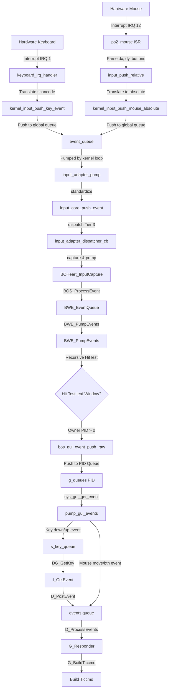

# DOOM Execution and Input Path Audit for ATOMS OS

This report documents the end-to-end runtime path of DOOM inside ATOMS OS, tracing the rendering pipeline and the input event processing chain. It highlights architectural characteristics, state machine logic, discrepancies between the expected DoomGeneric model and the current ATOMS implementation, and potential points of interest.

---

## 1. End-to-End Rendering & Presentation Pipeline

The runtime rendering path spans from the application-space loop through system calls, the Window Manager (BWE), the compositor, the presentation engine (AGDTE/BSPE), and finally to the hardware display scanout.

### Step 1: DOOM Launch & process creation
- **Trigger**: The desktop shell or taskbar calls `horse_launch(APP_ID_DOOM)` in [kernel/engine/horse_engine.c](file:///D:/Signatures_OS/kernel/engine/horse_engine.c#L83).
- **Process Spawning**:
  - `horse_launch` invokes the launcher callback `doom_launch_wrapper` in [kernel/engine/horse_engine.c](file:///D:/Signatures_OS/kernel/engine/horse_engine.c#L33).
  - This calls `vmm_create_address_space` and loads the ELF image using `elf_load_image(new_pml4, "DOOM.ELF")`.
  - The process stack is configured with `process_build_user_stack` and the process is registered in the scheduler via `process_spawn(new_image, "DOOM.ELF")`.
- **Execution Entry**: The scheduler begins execution of `DOOM.ELF` at the entry point `_start` in [userspace/apps/doom/doomgeneric_signaturesos.c](file:///D:/Signatures_OS/userspace/apps/doom/doomgeneric_signaturesos.c#L143).

### Step 2: DOOM Initialization & Window Creation
- `_start` calls `doomgeneric_Create(1, argv)` in [userspace/apps/doom/src/doomgeneric/doomgeneric.c](file:///D:/Signatures_OS/userspace/apps/doom/src/doomgeneric/doomgeneric.c#L13).
- `doomgeneric_Create` calls `DG_Init()`, implemented in the platform layer [userspace/apps/doom/doomgeneric_signaturesos.c](file:///D:/Signatures_OS/userspace/apps/doom/doomgeneric_signaturesos.c#L17).
- `DG_Init()` initializes the GUI library via `BOS_GUI_Init()` and calls:
  ```c
  s_doom_window = BOS_CreateWindow("DOOM", 100, 100, DOOM_W, DOOM_H);
  ```
- `BOS_CreateWindow` in [userspace/libbos_gui/src/widgets.c](file:///D:/Signatures_OS/userspace/libbos_gui/src/widgets.c) triggers the system call `SYS_GUI_CREATE_WINDOW` which routes to `BOS_CreateWindow` in [kernel/wm/bwe/src/bwe_window.c](file:///D:/Signatures_OS/kernel/wm/bwe/src/bwe_window.c#L343).
- Inside `BOS_CreateWindow`, the window manager invokes `BOS_CreateSurface(BWE_DESKTOP_ID, ...)` which sets up the window slot, bounds, flags, and registers it to the desktop child hierarchy.

### Step 3: Game Tick & Frame Rendering
- Back in `_start()`, DOOM enters an infinite loop executing `doomgeneric_Tick()` followed by a `bos_yield()` at [userspace/apps/doom/doomgeneric_signaturesos.c](file:///D:/Signatures_OS/userspace/apps/doom/doomgeneric_signaturesos.c#L148-L152).
- `doomgeneric_Tick()` (in [userspace/apps/doom/src/doomgeneric/d_main.c](file:///D:/Signatures_OS/userspace/apps/doom/src/doomgeneric/d_main.c#L403)) triggers game simulation ticks (`TryRunTics`) and renders the scene via `D_Display()` (if screen visible).
- `D_Display()` performs DOOM's internal column/span drawing, rendering the 8-bit palette-indexed pixel indexes to `I_VideoBuffer`.
- `D_Display()` calls `I_FinishUpdate()` in [userspace/apps/doom/src/doomgeneric/i_video.c](file:///D:/Signatures_OS/userspace/apps/doom/src/doomgeneric/i_video.c#L321).
- `I_FinishUpdate()` calls `cmap_to_fb()` to perform color translation from 8-bit color indices to 32-bit RGBA (or 16-bit RGB565) color values, saving the result into `DG_ScreenBuffer`. It then calls the platform callback `DG_DrawFrame()`.

### Step 4: Presenting the Surface to the Kernel
- Platform-layer `DG_DrawFrame()` in [userspace/apps/doom/doomgeneric_signaturesos.c](file:///D:/Signatures_OS/userspace/apps/doom/doomgeneric_signaturesos.c#L38) formats the pixels into the `s_doom_pixels` buffer, setting alpha values (`pixels[i] | 0xFF000000`), and executes the system call:
  ```c
  bos_surface_present(s_doom_window->id, s_doom_pixels, DOOM_W, DOOM_H);
  ```
- `bos_surface_present()` in [userspace/libbos/src/syscalls.c](file:///D:/Signatures_OS/userspace/libbos/src/syscalls.c#L148) executes `SYS_SURFACE_PRESENT` (Syscall 41), which dispatches to `BOS_SurfacePresent` in [kernel/wm/bwe/src/bwe_window.c](file:///D:/Signatures_OS/kernel/wm/bwe/src/bwe_window.c#L848).
- `BOS_SurfacePresent()` copies the user-supplied pixel buffer to the window's backing canvas `win->control_data.canvas.pixel_buffer`, sets the rendering callback `win->on_render = bos_canvas_render`, and marks the window dirty: `win->is_dirty = true`.

### Step 5: Compositor Composition
- The kernel's execution loop (in [kernel/kernel.c](file:///D:/Signatures_OS/kernel/kernel.c#L746)) regularly invokes `BOHeart_Pulse()` which calls `BWE_ComposeFrame()`.
- `BWE_ComposeFrame()` routes to `BWE_Compositor_ComposeFrame()` in [kernel/wm/bwe/renderer/bwe_compositor.c](file:///D:/Signatures_OS/kernel/wm/bwe/renderer/bwe_compositor.c).
- The compositor updates the active Z-stack, processes window occlusion/dirty rectangles, and invokes `compose_window_recursive` (at [bwe_compositor.c:L304](file:///D:/Signatures_OS/kernel/wm/bwe/renderer/bwe_compositor.c#L304)).
- Because `win->on_render` is set, `compose_window_recursive` calls `bos_canvas_render(win)` (at [bwe_window.c:L765](file:///D:/Signatures_OS/kernel/wm/bwe/src/bwe_window.c#L765)).
- `bos_canvas_render` blits pixels from `win->control_data.canvas.pixel_buffer` into the shared system RAM back-buffer `ram_fb->buffer`.

### Step 6: AGDTE & BSPE Presentation Bridge
- Once composing completes, `BWE_Compositor_ComposeFrame()` fetches the target video page pointer `vbe_get_back_page_ptr()` and calls:
  ```c
  BOVISUAL_Graphics_SwapFull(back_vram_ptr);
  ```
- `BOVISUAL_Graphics_SwapFull()` in [bovisual/Graphics/graphics.c](file:///D:/Signatures_OS/bovisual/Graphics/graphics.c#L263) converts `back_vram_ptr` to a `BOGE_StagingFrame` structure (wrapping compositor damage list) and delegates it to the Advanced Graphics Display Topology Engine (AGDTE):
  ```c
  AGDTE_Presenter_PresentBridgeBSPE(&staging_frame, 0);
  ```
- `AGDTE_Presenter_PresentBridgeBSPE()` in [kernel/graphics/AGDTE/src/agdte_presenter.c](file:///D:/Signatures_OS/kernel/graphics/AGDTE/src/agdte_presenter.c#L80) validates the request, schedules it in the pacer queue, registers the buffer, and calls `AGDTE_Presenter_Execute` (at [agdte_presenter.c:L152](file:///D:/Signatures_OS/kernel/graphics/AGDTE/src/agdte_presenter.c#L152)).
- `AGDTE_Presenter_Execute()` calls display backend operations `ops->present_buffer(...)` which maps to `vbe_backend_present_buffer()` in [kernel/graphics/AGDTE/src/agdte_backend.c](file:///D:/Signatures_OS/kernel/graphics/AGDTE/src/agdte_backend.c#L32).
- This invokes the Bootstrap Presentation Engine (BSPE) via:
  ```c
  BSPE_PresentFrame(&staging);
  ```
- `BSPE_PresentFrame()` in [kernel/graphics/BSPE/Present/bspe_present.c](file:///D:/Signatures_OS/kernel/graphics/BSPE/Present/bspe_present.c#L184) calls `BSPE_DualPage_PresentFrame()` in [kernel/graphics/BSPE/Present/dual_page_present.c](file:///D:/Signatures_OS/kernel/graphics/BSPE/Present/dual_page_present.c#L172).
- `BSPE_DualPage_PresentFrame` uses a damage tracker to compute the effective damage union of the current and previous frames, then calls:
  ```c
  BSPE_VRAM_CopyEffectiveDamage(frame, effective_rects, effective_count);
  ```
- `BSPE_VRAM_CopyEffectiveDamage` in [kernel/graphics/BSPE/Present/vram_copy.c](file:///D:/Signatures_OS/kernel/graphics/BSPE/Present/vram_copy.c#L229) runs a high-speed copy of the damaged rectangles from the staging RAM buffer to the physical VBE page buffer mapped in VRAM.
- Once VRAM copying is complete, the video scanout hardware displays the new frame.

---

## 2. End-to-End Input Routing Pipeline

The path for input routing covers hardware IRQs, translation layers, window targeting, process routing, and consumption by DOOM.



### Detailed Event Tracing

#### Step 1: Hardware Driver Interrupt Handling
- **Keyboard (IRQ 1)**:
  - Pressing or releasing a key triggers `keyboard_irq_handler` in [kernel/drivers/keyboard/src/keyboard.c](file:///D:/Signatures_OS/kernel/drivers/keyboard/src/keyboard.c#L46).
  - The ISR reads raw scancodes from the PS/2 data port (`0x60`) using `active_driver->read_scancode()`.
  - It handles multi-byte extended scancodes (prefixed with `0xE0`) and translates Set 1 scancodes to ASCII characters using `scancode_to_ascii` / `scancode_to_ascii_shift`.
  - The ISR constructs a `KeyboardEvent` structure and calls the registered input callback:
    ```c
    keyboard_register_callback(kernel_input_push_key_event);
    ```
- **Mouse (IRQ 12)**:
  - Moving the mouse or clicking buttons triggers the PS/2 mouse ISR in [drivers/input/ps2/mouse.c](file:///D:/Signatures_OS/drivers/input/ps2/mouse.c#L147) (or VMMouse absolute interrupt).
  - The ISR reads bytes from the data port, decodes the relative displacement (`dx`, `dy`) and mouse button bitmask, and executes:
    ```c
    input_push_relative(dx, dy, buttons, 0);
    ```
  - `input_push_relative` in [kernel/drivers/input/input_abstraction.c](file:///D:/Signatures_OS/kernel/drivers/input/input_abstraction.c#L55) adds relative motion to the cached pointer location and calls `kernel_input_push_mouse_absolute()`.

#### Step 2: Global Event Queue Staging
- Both `kernel_input_push_key_event` and `kernel_input_push_mouse_absolute` (in [kernel/drivers/input/input.c](file:///D:/Signatures_OS/kernel/drivers/input/input.c)) encapsulate the raw inputs into a `BVEvent` structure and push it to the static kernel `event_queue`.

#### Step 3: Input Core Standardization & Event Dispatcher
- The kernel's main execution loop invokes `input_adapter_pump()` (in [kernel/drivers/input/core/input_adapter.c](file:///D:/Signatures_OS/kernel/drivers/input/core/input_adapter.c#L77)) on every iteration.
- `input_adapter_pump()` drains `event_queue` using `kernel_get_event(&ev)`. It formats the data into `InputCoreEvent` packets and calls `input_core_push_event()`.
- Standardized events are dispatched using the Universal Event Dispatcher, invoking `input_adapter_dispatcher_cb` (registered as a Tier 3 Window Manager consumer).
- `input_adapter_dispatcher_cb` calls:
  ```c
  BOHeart_InputCapture(&bv);
  ```
- `BOHeart_InputCapture` (in [kernel/wm/bwe/src/bwe_core.c](file:///D:/Signatures_OS/kernel/wm/bwe/src/bwe_core.c#L635)) forwards the event to `BOS_ProcessEvent(event)` and triggers an immediate pump of BWE events: `BWE_PumpEvents()`.
- `BOS_ProcessEvent()` maps the raw `BVEvent` fields to a `BWE_Event` structure and puts it into `BWE_EventQueue`.

#### Step 4: Window Hit-Testing & Focus Manager Routing
- `BWE_PumpEvents()` in [kernel/wm/bwe/src/bwe_core.c](file:///D:/Signatures_OS/kernel/wm/bwe/src/bwe_core.c#L348) processes queued events:
  - **Mouse Events**:
    - Updates global mouse coordinates `g_bwe_mouse_x`/`g_bwe_mouse_y` and sets the hardware cursor position `BSPE_SetCursorPosition()`.
    - Coordinates hit-testing using `BWE_HitTest` to traverse the Z-order window hierarchy and locate the topmost leaf window or control under the cursor.
    - If `BWE_EVENT_MOUSE_DOWN` occurs, focus changes via `BOS_SetFocus(leaf_id)`.
    - If the target window has no callback but maps to a process owner (`dispatch_target->owner_pid > 0`), BWE builds a `BOS_GUIEvent gev` and places it in the target process's queue:
      ```c
      bos_gui_event_push_raw(dispatch_target->owner_pid, &gev);
      ```
  - **Keyboard Events**:
    - Dispatches keys to the active window holding keyboard focus:
      ```c
      uint32_t target_id = (g_focused_window_id == 0) ? BWE_DESKTOP_ID : g_focused_window_id;
      ```
    - If `target->owner_pid > 0`, it builds a `BOS_GUIEvent gev` and calls `bos_gui_event_push_raw(target->owner_pid, &gev)`.

#### Step 5: Userspace Syscall Polling & DoomGeneric Platform Mapping
- In the platform wrapper, `_start` executes `pump_gui_events()` (in [userspace/apps/doom/doomgeneric_signaturesos.c](file:///D:/Signatures_OS/userspace/apps/doom/doomgeneric_signaturesos.c#L67)) in a loop.
- `pump_gui_events()` queries userspace events using:
  ```c
  sys_gui_get_event(&gev); // Invokes Syscall SYS_GUI_GET_EVENT -> bos_gui_event_pop()
  ```
- **Keyboard Events Handling**:
  - `pump_gui_events()` processes `BOS_GUI_EVENT_KEY_DOWN` / `BOS_GUI_EVENT_KEY_UP`.
  - It maps the key code to a Doom-compatible scancode (e.g. `BOS_KEY_UP` to `KEY_UPARROW`).
  - The event is pushed into a local keyboard ring buffer:
    ```c
    s_key_queue[s_key_head].pressed = (gev.type == BOS_GUI_EVENT_KEY_DOWN);
    s_key_queue[s_key_head].keycode = dkey;
    ```
- **Mouse Events Handling**:
  - `pump_gui_events()` processes `BOS_GUI_EVENT_MOUSE_MOVE` / `BOS_GUI_EVENT_MOUSE_DOWN` / `BOS_GUI_EVENT_MOUSE_UP`.
  - It calculates relative delta coordinates:
    ```c
    int dx = gev.mouse.x - s_last_mouse_x;
    int dy = gev.mouse.y - s_last_mouse_y;
    ```
  - It builds a DOOM mouse event and posts it **directly** to DOOM's internal event queue, bypassing any intermediate keys queue:
    ```c
    event_t ev;
    ev.type = ev_mouse;
    ev.data1 = gev.mouse.buttons;
    ev.data2 = dx * 4;
    ev.data3 = -dy * 4;
    D_PostEvent(&ev);
    ```

#### Step 6: DOOM Event System Processing
- During the tick, `I_StartTic()` (called by `TryRunTics()`) runs `I_GetEvent()` in [userspace/apps/doom/src/doomgeneric/i_input.c](file:///D:/Signatures_OS/userspace/apps/doom/src/doomgeneric/i_input.c#L279).
- `I_GetEvent()` calls `DG_GetKey(&pressed, &key)` to dequeue keys from `s_key_queue`.
- Dequeued keys are posted to DOOM's event stack via `D_PostEvent(&event)`.
- During the same tic, `loop_interface->ProcessEvents()` (which points to `D_ProcessEvents` in [userspace/apps/doom/src/doomgeneric/d_main.c](file:///D:/Signatures_OS/userspace/apps/doom/src/doomgeneric/d_main.c#L139)) is called.
- `D_ProcessEvents` pops events from the queue and sends them to responders:
  - `M_Responder` handles menu navigation.
  - `G_Responder` in [userspace/apps/doom/src/doomgeneric/g_game.c](file:///D:/Signatures_OS/userspace/apps/doom/src/doomgeneric/g_game.c#L733) updates the game state:
    - Keydown/keyup events are recorded in `gamekeydown[key]`.
    - Mouse events update the variables `mousex` and `mousey`, and invoke `SetMouseButtons()`.
- Finally, `G_BuildTiccmd()` reads `gamekeydown`, `mousex`, and `mousey` to build the `ticcmd_t` packet driving the game simulation tick.

---

## 3. Discrepancies and Suspicious Paths

Several discrepancies exist between the standard DoomGeneric interface specifications, expected Chocolate Doom behaviors, and the current ATOMS OS implementation.

### A. Comparison of Expected vs. Actual Workflows

| Feature / Behavior | Expected DoomGeneric Workflow | Current ATOMS Implementation |
| :--- | :--- | :--- |
| **Keyboard Processing** | Capture keys in platform-specific event loop, push to queue, and pop inside `DG_GetKey()`. | Captured in `pump_gui_events()` via `sys_gui_get_event()`, mapped and pushed to `s_key_queue`, then popped in `DG_GetKey()`. |
| **Mouse Processing** | Capture mouse activity in platform wrapper, translate to keys or expose via another API. | Captured in `pump_gui_events()`, relative coordinate deltas computed, and posted **directly** to DOOM via `D_PostEvent()`, bypassing `DG_GetKey` entirely. |
| **Mouse Motion Representation** | Handled natively inside Chocolate Doom `i_input.c` via SDL event polling. | SDL event polling is commented out. Raw movement deltas are computed in userspace and posted directly. |

---

### B. Suspicious, Suspended, or Duplicated Code Paths

#### 1. Bypassed Mouse Event Routing
Mouse events are sent directly to DOOM's internal event loop using `D_PostEvent()` inside `pump_gui_events()`. They bypass `DG_GetKey()`, meaning mouse events are posted **out-of-order** compared to keyboard events. Keyboard events are delayed because they sit in the queue until `DG_GetKey()` is called inside `I_StartTic()`.

#### 2. Keyup Loop Termination Bug in `I_GetEvent()`
In [userspace/apps/doom/src/doomgeneric/i_input.c](file:///D:/Signatures_OS/userspace/apps/doom/src/doomgeneric/i_input.c#L280), `I_GetEvent` processes events using a `while(DG_GetKey(...))` loop:
```c
        if (pressed) {
            // ... process keydown
        } else {
            // ... process keyup
            break; // <--- Suspicious early termination
        }
```
If a user releases a key, the `break` statement immediately exits the event-processing loop. Any other events waiting in the queue (e.g. other keypresses or releases) are left unprocessed until the next game tic. This can cause input lag or stuck keys when multiple keys are pressed and released quickly.

#### 3. Unpopulated `ascii` Field in `BOS_GUIEvent`
The kernel dispatcher in `bwe_core.c` does not set the `ascii` field of `BOS_GUIEvent` before pushing it:
```c
                    gev.key.keycode = bwe_ev.data.key.key_code;
                    gev.key.modifiers = bwe_ev.data.key.modifiers;
                    // gev.key.ascii is left at 0!
```
Because `gev.key.ascii` is 0, the userspace platform wrapper has to fall back to a custom mapping checking `keycode` values for letters (`'a'` - `'z'`) and digits (`'0'` - `'9'`). This works because `kernel_input_push_key_event` packs ASCII values into `ev.key_code` when the ASCII value is non-zero. However, this is an implicit behavior rather than a clean abstraction.

#### 4. Hardcoded Mouse Sensitivity Scaling
In `doomgeneric_signaturesos.c` lines 117-118, mouse deltas are scaled:
```c
            ev.data2 = dx * 4; // Sensitivity scaling
            ev.data3 = -dy * 4;
```
This multiplier overrides any in-game mouse sensitivity settings configured in the menu.

---

## 4. Why DOOM Can Run and Play Attract Demos Without User Input

Even when hardware keyboard and mouse inputs are disconnected, blocked, or failing to reach the window queue, DOOM's attract/demo sequence runs and plays correctly.

1. **Pre-recorded Demo Playback**:
   - When launched without warp or custom game arguments, DOOM starts in attract mode by calling `D_StartTitle()`, which runs the demo sequence loop.
   - During demo loop execution, the game state variable `demoplayback` is set to `true`.
   - Instead of building input commands from hardware state, the game loop retrieves inputs from pre-recorded demo lumps (such as `DEMO1`, `DEMO2` stored in the WAD file) by calling `G_ReadDemoTiccmd()` (in [userspace/apps/doom/src/doomgeneric/g_game.c](file:///D:/Signatures_OS/userspace/apps/doom/src/doomgeneric/g_game.c#L1898)).
2. **Simulation Decoupling**:
   - The game loop updates (`TryRunTics()`) are driven entirely by these pre-recorded demo commands (`ticcmd_t`).
   - The game simulation (physics, player movement, monsters) runs normally based on the demo commands, independent of the host OS input queue.
3. **Renderer Independence**:
   - The rendering pipeline (`D_Display()`, `I_FinishUpdate()`, `BOS_SurfacePresent()`, and the compositor) continues to run at 35 FPS, drawing the simulation's visual output onto the screen.
   - As a result, the gameplay is displayed on screen, even though the host keyboard and mouse are not interacting with the system.
