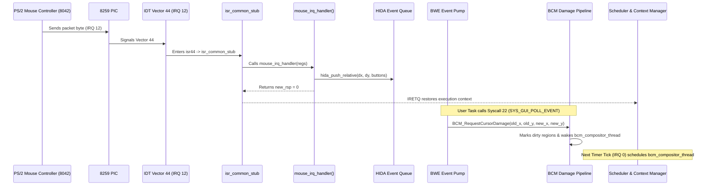

# ATOMS OS — MOUSE PATH FORENSIC REPORT

## 1. Complete Path Trace: Mouse Event to Scheduler

---

## 2. Interaction with BCM and Asynchronous Composition

1. **User Mode Polling**:
   - Applications (`desktop_shell`, `calc`) poll events via `SYS_GUI_POLL_EVENT` (Syscall 22) and yield via `SYS_YIELD` (Syscall 3).
2. **Damage Notification**:
   - `BWE_PumpEvents()` records cursor movement and submits a bounded damage request: `BCM_RequestCursorDamage()`.
3. **BCM Compositor Wakeup**:
   - `bcm_compositor_thread` (Kernel Thread, Priority 31) sleeps for bounded intervals (`scheduler_sleep(5)`).
   - When pending damage exists, `bcm_compositor_thread` wakes and executes `BCM_Process()` $\to$ `BWE_ComposeFrame()` in dedicated task context with `IF=1`.
4. **Vulnerability in Cursor State Lock**:
   - `bos_cursor_tick()` called from `timer_tick_handler()` invoked `cursor_state_unlock()`.
   - `cursor_state_unlock()` previously executed unconditional `__asm__ volatile("sti")`.
   - When the user moved the mouse during a timer tick, mouse interrupt (IRQ 12) preempted the timer tick handler, triggering a nested interrupt stack frame corruption.
