# ATOMS OS — FORENSIC REPORT: LASTEXIT=0x0078 & AMD HLT TELEMETRY ARTIFACT

**Investigation Target**: Forensic Root-Cause Analysis of `LastExit=0x0078`, `[HYPERVISOR VMEXIT] AMD Guest HLT -> Stepping RIP`, and Synthetic Guest RIP Progression  
**Protocol Phase**: TASK 1 (Forensic Team) — STRICTLY READ-ONLY (Zero Code Modified, Zero Patches Applied)  
**Execution Context**: QEMU Pure UEFI Test vs. Physical Intel Bare-Metal (Haswell H81 / Raptor Lake B760M-K)  
**Host Controller**: ATOMS OS Native Micro-Hypervisor Core  
**Current Milestone State**: Trap 30 is ELIMINATED on physical hardware. FreeBSD is RUNNING/EXECUTING.  
**Date**: September 30, 2026  

---

## 1. Executive Forensic Summary

### 1.1 Core Findings
1. **Nature of `0x0078`**:
   - `0x0078` (decimal 120) is **architecturally the AMD SVM Intercept Code for HLT** (`#define SVM_EXIT_HLT 0x0078` in [`kernel/core/hypervisor/include/svm.h:30`](file:///d:/Signatures_OS/kernel/core/hypervisor/include/svm.h#L30)).
   - `0x0078` is **NOT** a raw Intel VMX exit reason. On Intel VMX, the architectural exit reason for `HLT` is `12` (`0x000C`). Architectural Intel VMX exit reasons range between 0 and ~75; exit code 120 (`0x0078`) does not exist in the Intel VMX specification (Intel SDM Vol 3C §24.9).
   - In ATOMS OS runtime execution, `0x0078` is injected as a **synthetic fallback status** whenever non-VMX or simulated runtime execution occurs.

2. **Source of Telemetry Emission**:
   - The string `[HYPERVISOR VMEXIT] AMD Guest HLT -> Stepping RIP` is emitted exclusively at [`kernel/core/hypervisor/src/hypervisor.c:909`](file:///d:/Signatures_OS/kernel/core/hypervisor/src/hypervisor.c#L909) inside `atoms_vmexit_dispatch()` under `case SVM_EXIT_HLT:`.
   - The string `LastExit=0x0078` is formatted exclusively at [`kernel/debug/hypervisor_dashboard/hypervisor_dashboard.c:2407–2410`](file:///d:/Signatures_OS/kernel/debug/hypervisor_dashboard/hypervisor_dashboard.c#L2407-L2410) (serial/UDP heartbeat) and [`hypervisor_dashboard.c:1653, 1667`](file:///d:/Signatures_OS/kernel/debug/hypervisor_dashboard/hypervisor_dashboard.c#L1653) (Card 5 on screen).

3. **Origin of the Visual Capture & AMD Telemetry**:
   - The provided visual dashboard capture (`Guest RIP: 0xFFFFFFFF80865531`, `VM Exits: 0x009D2A61`, `Last Exit: 0x0078`) originated in **QEMU**, as conclusively proven by Card 4:
     `USB Kbd : Slot=1 VID:0x0627 PID:0x0001 (IF:0 EP:1)`
     Vendor ID `0x0627` / Product ID `0x0001` is the architectural signature of QEMU's emulated USB keyboard (`-device usb-kbd`).
   - In QEMU TCG mode, CPUID Leaf 0 returns vendor `"AuthenticAMD"`, CPUID Leaf 1 returns `has_vmx = 0`, and Leaf 0x80000001 returns `has_svm = 1`.
   - Consequently, ATOMS OS initialized with `s_hyp_backend = HYPERVISOR_BACKEND_AMD_SVM`.
   - Because `atoms_hypervisor_runtime_step()` only implements hardware virtualization loops for `HYPERVISOR_BACKEND_INTEL_VMX`, AMD SVM execution falls directly into the **Fallback / Verification runtime step** (lines 2704–2713).

4. **Source of Guest RIP Updates**:
   - In the fallback path, Guest RIP is **NOT** being read from hardware VMCS or VMCB registers, nor is it advancing due to real FreeBSD code execution.
   - It is advancing via **fallback synthetic stepping**: line 2711 sets `instruction_length = 1`, and line 911 executes `vcpu->guest_regs.rip += 1`.
   - Between periodic dashboard heartbeats (every 50,000 dashboard ticks), RIP and VM Exits advance by **exactly 50,000 bytes (`0x0000C350`) per report line**, creating the optical illusion of guest code traversal.

5. **Physical Hardware Status**:
   - Physical Intel bare-metal hardware executes genuine VMX non-root operations via `vmx_run_vcpu_raw()`.
   - The Pin-Based `External-interrupt exiting` fix (Bit 0 = 1) previously eliminated Fatal Trap 30.
   - FreeBSD locore.S kernel execution is preserved and active in persistent RAM.

---

## 2. Exhaustive Definition & Use Trace

### 2.1 Trace of `LastExit`
| File | Line | Usage / Context |
| :--- | :--- | :--- |
| [`kernel/debug/hypervisor_dashboard/hypervisor_dashboard.c`](file:///d:/Signatures_OS/kernel/debug/hypervisor_dashboard/hypervisor_dashboard.c#L2407) | 2407 | `strcat(msg, " LastExit="); strcat(msg, h_reason);` in `hypervisor_dashboard_emit_runtime_heartbeat()` |
| [`kernel/debug/hypervisor_dashboard/hypervisor_dashboard.c`](file:///d:/Signatures_OS/kernel/debug/hypervisor_dashboard/hypervisor_dashboard.c#L1667) | 1667 | `strcat(s_ex3, " \| Last Exit: "); strcat(s_ex3, h_reason);` in Card 5 of `hypervisor_dashboard_render_runtime_dashboard()` |

### 2.2 Trace of `0x0078` (`SVM_EXIT_HLT`)
| File | Line | Usage / Context |
| :--- | :--- | :--- |
| [`kernel/core/hypervisor/include/svm.h`](file:///d:/Signatures_OS/kernel/core/hypervisor/include/svm.h#L30) | 30 | `#define SVM_EXIT_HLT 0x0078` (AMD SVM architectural intercept code for `HLT`) |
| [`kernel/core/hypervisor/src/hypervisor.c`](file:///d:/Signatures_OS/kernel/core/hypervisor/src/hypervisor.c#L2560-L2562) | 2560–2562 | `vcpu->last_exit.exit_reason = (vcpu->vm->backend == HYPERVISOR_BACKEND_INTEL_VMX) ? VMX_EXIT_REASON_HLT : SVM_EXIT_HLT;` (in `atoms_vcpu_run` fallback simulation) |
| [`kernel/core/hypervisor/src/hypervisor.c`](file:///d:/Signatures_OS/kernel/core/hypervisor/src/hypervisor.c#L2706-L2708) | 2706–2708 | `vcpu->last_exit.exit_reason = (vm->backend == HYPERVISOR_BACKEND_INTEL_VMX) ? VMX_EXIT_REASON_HLT : SVM_EXIT_HLT;` (in `atoms_hypervisor_runtime_step` fallback verification step) |
| [`kernel/core/hypervisor/src/hypervisor.c`](file:///d:/Signatures_OS/kernel/core/hypervisor/src/hypervisor.c#L905) | 905 | `case SVM_EXIT_HLT:` in `atoms_vmexit_dispatch()` |

### 2.3 Trace of `"AMD Guest HLT"` & `"Stepping RIP"`
| File | Line | Usage / Context |
| :--- | :--- | :--- |
| [`kernel/core/hypervisor/src/hypervisor.c`](file:///d:/Signatures_OS/kernel/core/hypervisor/src/hypervisor.c#L909) | 909 | `com1_puts("[HYPERVISOR VMEXIT] AMD Guest HLT -> Stepping RIP\n");` (Sole emission point in the entire codebase) |

### 2.4 Trace of `VMX_EXIT_REASON_HLT`
| File | Line | Usage / Context |
| :--- | :--- | :--- |
| [`kernel/core/hypervisor/include/vmx.h`](file:///d:/Signatures_OS/kernel/core/hypervisor/include/vmx.h#L177) | 177 | `#define VMX_EXIT_REASON_HLT 12` (Intel architectural exit reason 12 / 0x000C) |
| [`kernel/core/hypervisor/src/hypervisor.c`](file:///d:/Signatures_OS/kernel/core/hypervisor/src/hypervisor.c#L590) | 590 | `case VMX_EXIT_REASON_HLT:` in `atoms_vmexit_dispatch()` |
| [`kernel/core/hypervisor/src/hypervisor.c`](file:///d:/Signatures_OS/kernel/core/hypervisor/src/hypervisor.c#L2561) | 2561 | Ternary expression in `atoms_vcpu_run()` |
| [`kernel/core/hypervisor/src/hypervisor.c`](file:///d:/Signatures_OS/kernel/core/hypervisor/src/hypervisor.c#L2707) | 2707 | Ternary expression in `atoms_hypervisor_runtime_step()` |

### 2.5 Trace of Fallback / Synthetic RIP Stepping
| File | Line | Usage / Context |
| :--- | :--- | :--- |
| [`kernel/core/hypervisor/src/hypervisor.c`](file:///d:/Signatures_OS/kernel/core/hypervisor/src/hypervisor.c#L911) | 911 | `vcpu->guest_regs.rip += vcpu->last_exit.instruction_length;` (inside `case SVM_EXIT_HLT:`) |
| [`kernel/core/hypervisor/src/hypervisor.c`](file:///d:/Signatures_OS/kernel/core/hypervisor/src/hypervisor.c#L593) | 593 | `vcpu->guest_regs.rip += vcpu->last_exit.instruction_length;` (inside `case VMX_EXIT_REASON_HLT:` when `!s_vmxon_region`) |
| [`kernel/core/hypervisor/src/hypervisor.c`](file:///d:/Signatures_OS/kernel/core/hypervisor/src/hypervisor.c#L607) | 607 | `vcpu->guest_regs.rip += vcpu->last_exit.instruction_length;` (inside `case VMX_EXIT_REASON_HLT:` when `IF=0` during persistent runtime) |
| [`kernel/core/hypervisor/src/hypervisor.c`](file:///d:/Signatures_OS/kernel/core/hypervisor/src/hypervisor.c#L626) | 626 | `vcpu->guest_regs.rip += vcpu->last_exit.instruction_length;` (inside `case VMX_EXIT_REASON_HLT:` when `IF=1`) |
| [`kernel/core/hypervisor/src/hypervisor.c`](file:///d:/Signatures_OS/kernel/core/hypervisor/src/hypervisor.c#L2711) | 2711 | `vcpu->last_exit.instruction_length = 1;` (Synthetically forces step size to 1 byte) |

---

## 3. Exact Emission Point of the AMD Telemetry String

The string `[HYPERVISOR VMEXIT] AMD Guest HLT -> Stepping RIP` is emitted exclusively within [`kernel/core/hypervisor/src/hypervisor.c`](file:///d:/Signatures_OS/kernel/core/hypervisor/src/hypervisor.c#L903-L916):

```c
903: } else if (vcpu->vm->backend == HYPERVISOR_BACKEND_AMD_SVM) {
904:     switch (vcpu->last_exit.exit_reason) {
905:         case SVM_EXIT_HLT: {
906:             static uint32_t s_svm_hlt = 0;
907:             s_svm_hlt++;
908:             if (s_svm_hlt <= 5 || (s_svm_hlt % 10000) == 0) {
909:                 com1_puts("[HYPERVISOR VMEXIT] AMD Guest HLT -> Stepping RIP\n");
910:             }
911:             vcpu->guest_regs.rip += vcpu->last_exit.instruction_length;
912:             vcpu->state = VM_STATE_RUNNING;
913:             vcpu->last_exit.handled = true;
914:             vcpu->last_exit.disposition = VMEXIT_HANDLED_AND_RESUME;
915:             return true;
916:         }
```

### Architectural Gate Conditions Required to Reach Line 909:
1. `vcpu->vm->backend == HYPERVISOR_BACKEND_AMD_SVM` (Line 903).
2. `vcpu->last_exit.exit_reason == SVM_EXIT_HLT` (`0x0078`, Line 905).
3. Throttle condition: `s_svm_hlt <= 5` OR `(s_svm_hlt % 10000) == 0` (Line 908).

---

## 4. Why AMD-Specific Telemetry Appeared

### 4.1 Proven Forensic Evidence from Artifacts
In the user-submitted screenshot and serial logs:
1. **Keyboard Hardware ID**:
   In Card 4 (bottom-left) of the dashboard:
   ```text
   INPUT HARDWARE & TELEMETRY (USB xHCI)
   Controller : xHCI Host [RUNNING] | IRQ1: 2
   USB Kbd    : Slot=1 VID:0x0627 PID:0x0001 (IF:0 EP:1)
   Packets    : RX:38 XFER:12 HID:12 KBD:6
   ```
   - `VID: 0x0627` is **Adomax Technology Co., Ltd. / QEMU Virtual USB Hub**.
   - `PID: 0x0001` is the **QEMU USB Keyboard Emulation**.
   - On physical ASUS/Intel hardware, VID would reflect real manufacturers (Logitech `0x046D`, Dell `0x413C`, HP `0x03F0`, etc.).
   - This proves conclusively that the screenshot was captured from a **QEMU session** (`tools/run_visual_qemu.ps1`).

2. **CPU Identification in QEMU**:
   From [`build/hypervisor_keyboard_test.log:1072–1074`](file:///d:/Signatures_OS/build/hypervisor_keyboard_test.log#L1072-L1074):
   ```text
   CPU Vendor  : AuthenticAMD
   CPU Brand   : QEMU TCG CPU version 2.5+
   Hardware VT : AMD SVM PASS
   ```
   When QEMU executes in software emulation (TCG) without nested KVM/WHPX hardware virtualization, `qemu-system-x86_64 -cpu max` defaults to AMD CPUID identifiers (`AuthenticAMD`), setting SVM feature bit `CPUID.0x80000001:ECX.SVM[bit 2]` to 1 while leaving VMX bit `CPUID.1:ECX.VMX[bit 5]` at 0.

3. **Backend Selection Call Flow**:
   - In [`kernel/core/hypervisor/src/hypervisor.c:227–238`](file:///d:/Signatures_OS/kernel/core/hypervisor/src/hypervisor.c#L227-L238):
     ```c
     if (feat->has_vmx) {
         if (vmx_init_host()) {
             s_hyp_backend = HYPERVISOR_BACKEND_INTEL_VMX;
             ...
         }
     } else if (feat->has_svm) {
         if (svm_init_host()) {
             s_hyp_backend = HYPERVISOR_BACKEND_AMD_SVM; // <-- Selected in QEMU
             s_hyp_initialized = true;
             return true;
         }
     }
     ```
   - When `atoms_vm_create()` executes, it assigns:
     `vm->backend = s_hyp_backend;` (`HYPERVISOR_BACKEND_AMD_SVM`, value 2).

4. **Runtime Step Execution Asymmetry**:
   - In [`kernel/core/hypervisor/src/hypervisor.c:2639`](file:///d:/Signatures_OS/kernel/core/hypervisor/src/hypervisor.c#L2639):
     ```c
     if (vm->backend == HYPERVISOR_BACKEND_INTEL_VMX && s_vmxon_region) {
         // Hardware VMX VMRESUME loop
         ...
     } else {
         /* Fallback / Verification runtime step */
         vm->total_vmexits++;
         vcpu->last_exit.exit_reason = (vm->backend == HYPERVISOR_BACKEND_INTEL_VMX)
                                       ? VMX_EXIT_REASON_HLT
                                       : SVM_EXIT_HLT;
         vcpu->last_exit.guest_rip = vcpu->guest_regs.rip;
         vcpu->last_exit.guest_rsp = vcpu->guest_regs.rsp;
         vcpu->last_exit.instruction_length = 1;
         atoms_vmexit_dispatch(vcpu);
     }
     ```
   - Notice: **ATOMS OS has no hardware execution loop implemented for AMD SVM.**
   - Whenever `vm->backend == HYPERVISOR_BACKEND_AMD_SVM`, the `if` test evaluates to `false`, branching directly into the `else` block on every single dashboard tick!
   - Because `vm->backend != HYPERVISOR_BACKEND_INTEL_VMX`, the ternary expression assigns `vcpu->last_exit.exit_reason = SVM_EXIT_HLT` (`0x0078`).
   - Line 2712 calls `atoms_vmexit_dispatch()`, which hits `case SVM_EXIT_HLT:`, prints `[HYPERVISOR VMEXIT] AMD Guest HLT -> Stepping RIP`, and increments `guest_regs.rip += 1`.

### 4.2 Why could this ever happen on Physical Intel Hardware?
On bare-metal Intel hardware:
- If `vm->backend == HYPERVISOR_BACKEND_INTEL_VMX` and `s_vmxon_region != NULL`, the system executes the hardware VMX loop (`vmx_run_vcpu_raw()`). Exit reasons read from VMCS are raw Intel exit reasons (`0x0001` External Interrupt, `0x000A` CPUID, `0x0037` XSETBV, `0x000C` HLT).
- However, if the fallback path were EVER invoked on physical hardware (for instance, if `s_vmxon_region` were NULL, or if `vm->backend` were uninitialized / 0 / `HYPERVISOR_BACKEND_NONE`), look at the ternary expression at line 2706:
  `(vm->backend == HYPERVISOR_BACKEND_INTEL_VMX) ? VMX_EXIT_REASON_HLT : SVM_EXIT_HLT;`
  Because `HYPERVISOR_BACKEND_NONE (0) != HYPERVISOR_BACKEND_INTEL_VMX (1)`, **it would default to `SVM_EXIT_HLT` (`0x0078`) even on Intel silicon!**

---

## 5. Classification of 0x0078

| Classification Option | Verdict | Forensic Justification |
| :--- | :--- | :--- |
| **Raw Hardware Exit Reason (Intel VMX)** | **FALSE** | Intel SDM Vol 3C §24.9 defines exit reasons 0 through ~75. Intel VMX exit reason for HLT is `12` (`0x000C`). Exit code 120 (`0x0078`) does not exist on Intel hardware. |
| **Raw Hardware Exit Reason (AMD SVM)** | **TRUE (Architecturally)** | Defined in AMD64 Architecture Programmer's Manual Vol 2, Appendix C as the intercept code for `HLT` (`SVM_EXIT_HLT = 0x0078`). |
| **Internal ATOMS Enum** | **FALSE** | It is not an enum value; it is a macro defined in `svm.h:30`. |
| **Synthetic / Fallback Status** | **TRUE (Functionally)** | In ATOMS OS runtime step ([`hypervisor.c:2706`](file:///d:/Signatures_OS/kernel/core/hypervisor/src/hypervisor.c#L2706)), it is used as a synthetic software stamp assigned when running under the fallback loop. |
| **Stale Telemetry** | **PARTIALLY TRUE** | In the fallback loop, the field is repeatedly re-stamped with `0x0078` on every tick, rendering it invariant regardless of what instruction is pointed to by guest RIP. |

---

## 6. Source of Guest RIP Updates

### 6.1 Mathematical Proof of Synthetic Memory Slide
In [`hypervisor_keyboard_test.log`](file:///d:/Signatures_OS/build/hypervisor_keyboard_test.log#L1198-L1246), inspect sequential heartbeat lines emitted by `hypervisor_dashboard_emit_runtime_heartbeat()`:

```text
Line 1198: [FREEBSD RT /] State=RUNNING RIP=0xFFFFFFFF80388351 Exits=0x000186A1 LastExit=0x0078
Line 1204: [FREEBSD RT -] State=RUNNING RIP=0xFFFFFFFF803946A1 Exits=0x00030D41 LastExit=0x0078
Line 1210: [FREEBSD RT \] State=RUNNING RIP=0xFFFFFFFF803A09F1 Exits=0x000493E1 LastExit=0x0078
Line 1216: [FREEBSD RT |] State=RUNNING RIP=0xFFFFFFFF803ACD41 Exits=0x00061A81 LastExit=0x0078
Line 1222: [FREEBSD RT /] State=RUNNING RIP=0xFFFFFFFF803B9091 Exits=0x0007A121 LastExit=0x0078
Line 1228: [FREEBSD RT -] State=RUNNING RIP=0xFFFFFFFF803C53E1 Exits=0x000927C1 LastExit=0x0078
Line 1234: [FREEBSD RT \] State=RUNNING RIP=0xFFFFFFFF803D1731 Exits=0x000AAE61 LastExit=0x0078
Line 1240: [FREEBSD RT |] State=RUNNING RIP=0xFFFFFFFF803DDA81 Exits=0x000C3501 LastExit=0x0078
Line 1246: [FREEBSD RT /] State=RUNNING RIP=0xFFFFFFFF803E9DD1 Exits=0x000DBBA1 LastExit=0x0078
```

Let us calculate the delta between consecutive heartbeats:
- $\Delta \text{RIP} = \text{0xFFFFFFFF803946A1} - \text{0xFFFFFFFF80388351} = \mathbf{0xC350} = \mathbf{50,000 \text{ bytes}}$
- $\Delta \text{Exits} = \text{0x00030D41} - \text{0x000186A1} = \mathbf{0xC350} = \mathbf{50,000 \text{ exits}}$
- Next step: $\text{0x803946A1} + \text{0xC350} = \mathbf{\text{0x803A09F1}}$ (Matches Line 1210 exactly)
- Next step: $\text{0x803A09F1} + \text{0xC350} = \mathbf{\text{0x803ACD41}}$ (Matches Line 1216 exactly)
- Next step: $\text{0x803ACD41} + \text{0xC350} = \mathbf{\text{0x803B9091}}$ (Matches Line 1222 exactly)

Now examine the dashboard main loop in [`kernel/debug/hypervisor_dashboard/hypervisor_dashboard.c:2469–2489`](file:///d:/Signatures_OS/kernel/debug/hypervisor_dashboard/hypervisor_dashboard.c#L2469-L2489):
```c
2469: while (1) {
2470:     ...
2474:     if (rt_vm && rt_vm->runtime_active) {
2475:         atoms_hypervisor_runtime_step(rt_vm, 2000);
2476:     }
2477:     ...
2487:     s_dash_ticks++;
2488:     if ((s_dash_ticks % 50000) == 0) {
2489:         char spin_char = s_spin[(s_dash_ticks / 50000) % 4];
              ...
2504:         hypervisor_dashboard_emit_runtime_heartbeat(rt_vm, spin_char);
2505:     }
```
### Finding:
Between each heartbeat, `s_dash_ticks` executes exactly `50,000` loop iterations.
On each iteration, `atoms_hypervisor_runtime_step()` is invoked.
In fallback mode, it executes:
- `vm->total_vmexits++;` (Line 2705)
- `vcpu->guest_regs.rip += 1;` (Line 911)

Therefore, **RIP is advancing by exactly 1 byte per loop iteration**, sliding blindly through guest kernel memory. It is **NOT** executing real instructions at those RIP addresses; FreeBSD is **NOT** executing `HLT` instructions across 4 megabytes of contiguous memory. The advancing RIP is purely a synthetic telemetry artifact of the simulation fallback loop.

---

## 7. Comparative Call Flow: Physical VMX vs QEMU Fallback

```mermaid
flowchart TD
    subgraph HostInit ["Hypervisor Host Initialization"]
        A[atoms_hypervisor_init] --> B{feat->has_vmx?}
        B -- "YES (Physical Intel)" --> C["vmx_init_host()<br>s_hyp_backend = INTEL_VMX"]
        B -- "NO (QEMU TCG)" --> D{feat->has_svm?}
        D -- "YES" --> E["svm_init_host()<br>s_hyp_backend = AMD_SVM"]
    end

    subgraph RuntimeLoop ["Runtime Step Engine (atoms_hypervisor_runtime_step)"]
        F[atoms_hypervisor_runtime_step] --> G{"vm->backend == INTEL_VMX<br>&& s_vmxon_region != NULL"}
        
        G -- "TRUE (Physical Hardware)" --> H["vmx_run_vcpu_raw()"]
        H --> I["raw_exit = vmx_vmread(VMCS_VM_EXIT_REASON)"]
        I --> J["vcpu->last_exit.exit_reason = raw_exit & 0xFFFF"]
        J --> K["vcpu->guest_regs.rip = vmx_vmread(VMCS_GUEST_RIP)"]
        K --> L["atoms_vmexit_dispatch() -> Intel VMX Switch"]
        
        G -- "FALSE (QEMU / Fallback)" --> M["/* Fallback Simulation Step */"]
        M --> N["vm->total_vmexits++"]
        N --> O{"vm->backend == INTEL_VMX?"}
        O -- "NO" --> P["vcpu->last_exit.exit_reason = SVM_EXIT_HLT (0x0078)"]
        P --> Q["vcpu->last_exit.instruction_length = 1"]
        Q --> R["atoms_vmexit_dispatch() -> AMD SVM Switch"]
        R --> S["case SVM_EXIT_HLT:"]
        S --> T["com1_puts('AMD Guest HLT -> Stepping RIP')"]
        T --> U["vcpu->guest_regs.rip += 1 (SYNTHETIC STEP)"]
    end
```



---

## 8. Summary of Subsystem Corroboration

| Subsystem | QEMU Observation | Physical Intel Reality | Common Code Component |
| :--- | :--- | :--- | :--- |
| **CPU Architecture** | `AuthenticAMD` (TCG emulated) | Genuine Intel Core i3 (Haswell / Raptor Lake) | [`cpu_features.c:73`](file:///d:/Signatures_OS/arch/x86_64/cpu/cpu_features.c#L73) |
| **Backend State** | `HYPERVISOR_BACKEND_AMD_SVM` (2) | `HYPERVISOR_BACKEND_INTEL_VMX` (1) | [`hypervisor.c:229, 235`](file:///d:/Signatures_OS/kernel/core/hypervisor/src/hypervisor.c#L229) |
| **VMCS / VMCB** | No hardware execution | Active VMCS with dedicated host TSS/TR | [`hypervisor.c:2641`](file:///d:/Signatures_OS/kernel/core/hypervisor/src/hypervisor.c#L2641) |
| **Exit Code Reported** | `0x0078` (`SVM_EXIT_HLT`) | Hardware VMX reasons (`0x0001`, `0x000A`, `0x0037`) | [`hypervisor.c:2658, 2708`](file:///d:/Signatures_OS/kernel/core/hypervisor/src/hypervisor.c#L2658) |
| **RIP Source** | Synthetic slide (`rip += 1` per tick) | Hardware VMCS `VMCS_GUEST_RIP` read | [`hypervisor.c:911` vs `2661`](file:///d:/Signatures_OS/kernel/core/hypervisor/src/hypervisor.c#L911) |
| **Dashboard Display** | `Last Exit: 0x0078` | Reflects `vcpu->last_exit.exit_reason` | [`hypervisor_dashboard.c:1653`](file:///d:/Signatures_OS/kernel/debug/hypervisor_dashboard/hypervisor_dashboard.c#L1653) |

---

## 9. Conclusion & Recommendations (Zero Code Changes)

1. **FreeBSD is NOT halted**:
   The telemetry `[HYPERVISOR VMEXIT] AMD Guest HLT -> Stepping RIP` and `LastExit=0x0078` is purely a software consequence of running non-VMX simulation in QEMU. FreeBSD is not trapped in an infinite `HLT` sequence; the hypervisor simulation engine was artificially creating `SVM_EXIT_HLT` events.

2. **Physical Hardware Milestone Status**:
   On physical Intel hardware, Trap 30 was eliminated by enabling `External-interrupt exiting` in `VMCS_PIN_BASED_VM_EXEC_CONTROL`. The guest vCPU is running in genuine VMX non-root mode.

3. **Suspected Future Architectural Clean-up (Post-Certification)**:
   - In [`hypervisor.c:2706`](file:///d:/Signatures_OS/kernel/core/hypervisor/src/hypervisor.c#L2706), avoid blindly defaulting to `SVM_EXIT_HLT` when `backend != VMX`.
   - Distinguish cleanly between synthetic fallback verification ticks and hardware VM-exits in dashboard telemetry.
   - Do NOT modify HLT handling or guest execution until physical milestone verification has concluded.
