# STEP 13 — BSPE Mouse Pipeline Forensic Investigation
## Status: FORENSIC ROOT-CAUSE AUDIT COMPLETE (NO CODE MODIFICATIONS)

---

### Executive Summary & Forensic Verdict

This forensic investigation was conducted under strict compliance with the architectural mandates of SignaturesOS: **No assumptions, no code modifications, no optimizations, and no refactoring.** Every finding, bottleneck, and conclusion presented herein is proven with exact file paths, line numbers, and symbol traces from the SignaturesOS kernel source tree.

#### Why the Mouse Still Feels Laggy ("Heavy") Despite 60 FPS
Perceived mouse latency in SignaturesOS is not caused by a single bug, but by **five interacting architectural coupling flaws** across the input, window management, compositing, and presentation subsystems:
1. **The Software Cursor / Full-Frame VRAM Copy Coupling (CRITICAL):** The system relies 100% on legacy software cursor drawing (`BVCursor_Draw`). Whenever the mouse moves, the compositor draws arrow pixels directly into the system RAM backbuffer. To present this to screen, `bwe_compositor.c` invokes `BOVISUAL_Graphics_SwapFull()`. In `graphics.c:L258`, this function constructs a staging frame with `dirty_count = 0`. When evaluated by `BSPE_DualPage_PresentFrame`, `dirty_count == 0` triggers an emergency fallback, forcing **a brute-force 3.14 MB (1024×768×4) or 3.93 MB (1280×720×4) memory copy across the PCIe bus to VRAM on every single frame**.
2. **The Rigid 16.6ms Frame Clock Coupling (HIGH):** Mouse IRQs arrive asynchronously at 100 Hz–1000 Hz and push events into memory ring buffers. However, cursor position on screen is never updated asynchronously. The main kernel loop rigidly blocks input presentation until the 16.6ms frame clock expires (`kernel.c:L586`). If an IRQ arrives immediately after a clock tick, the visual cursor update is delayed by up to 15.6 ms before rendering even starts.
3. **Synchronous $O(N \times M)$ Tree Hit-Testing (HIGH):** Inside `BOHeart_Pulse`, the compositor pumps mouse events synchronously. For every accumulated mouse move packet in the ring buffer, `BWE_PumpEvents` executes a full Z-ordered tree traversal across all desktop windows and child controls (`bwe_core.c:L388-L417`). The O(1) fast-path cache is explicitly disabled (`#if 0` at L373) due to bounding bugs in hierarchical UI.
4. **Double Ring Buffer Handoff with `cli`/`sti` Interrupt Masking (MEDIUM):** Mouse packets are first pushed into `event_queue` (Ring Buffer 1 in `input.c`) during IRQ 12. In the main loop, `kernel_get_event` disables interrupts (`cli`), pops the packet, re-enables interrupts (`sti`), and immediately pushes it into `g_event_queue` (Ring Buffer 2 in `bwe_core.c`). This double buffering adds queue latency and repeatedly masks hardware interrupts during loop draining.

#### Why the Login Screen is Significantly Worse than the Desktop
While the desktop benefits from window clipping and static background caching, the Login Screen suffers from an **unclipped, full-card immediate-mode software rasterization pass on every mouse movement**:
* When the mouse moves on the Login Screen, `bwe_compositor.c:L466-L469` generates two 32×32 dirty rectangles (for old and new cursor positions).
* The compositor invokes `Shell_PostComposeHook(&ram_fb)`, which calls `login_on_render()` (`page_login.c:L686`).
* In `login_on_render:L740`, because `g_dirty_rect_count > 0`, the function does not exit early. While Step 2 (L744-L766) correctly restores only the 32×32 dirty boxes from the background cache (`s_login_cache_buffer`), **Step 3 (the "Dynamic Controls Pass", L798-L906) executes unconditionally without any dirty rectangle checks!**
* On every single mouse move event, `login_on_render` re-draws the entire password input box border, inner background, password text/stars, caret pixels, eye icon (4 filled circles plus diagonal pixel loops), error messages, and login button border/text from scratch across RAM. This generates thousands of unclipped memory writes per frame, causing noticeable rendering stalls and heavy pointer input lag.

---

### Question 1 — Complete Input Pipeline Trace

The complete chronological lifecycle of a mouse packet from hardware IRQ 12 to VRAM presentation is traced below step-by-step:

1. **Hardware Interrupt Execution (IRQ Context):**
   * **File & Line:** `drivers/input/ps2/mouse.c:L82` (`mouse_irq_handler`)
   * **Action:** CPU hardware vector enters IRQ 12 handler. Status port `0x64` is read (L108). If data buffer is full and originates from auxiliary device, byte is read from port `0x60` (L113). Packet state machine accumulates 3 or 4 bytes (L115-L136).
   * **Lock / Interrupt State:** Executes in hardware interrupt context (CPU interrupts masked).

2. **Relative Motion Push (IRQ Context):**
   * **File & Line:** `kernel/drivers/input/input_abstraction.c:L50` (`input_push_relative`)
   * **Action:** Called from `mouse.c:L155`. Computes new absolute X and Y coordinates: `new_x = g_latest_state.mouse_x + dx; new_y = g_latest_state.mouse_y - dy;` (L51-L52). Notice Y is subtracted because PS/2 bottom-up coordinate system is inverted to top-down screen coordinates.

3. **Absolute Clamping & State Update (IRQ Context):**
   * **File & Line:** `kernel/drivers/input/input_abstraction.c:L35` (`input_push_absolute`)
   * **Action:** Clamps `abs_x` to `[0, g_screen_width - 1]` and `abs_y` to `[0, g_screen_height - 1]` (L36-L39). Updates `g_latest_state` structure (L41-L44).

4. **Bridge to Kernel Event Queue (IRQ Context):**
   * **File & Line:** `kernel/drivers/input/input.c:L110` (`kernel_input_push_mouse_absolute`)
   * **Action:** Diffs position against `global_mouse_x` and `global_mouse_y` (L112-L116). If movement occurred (`moved == true`), updates global variables (L118-L119) and constructs a `BVEvent` structure of type `BV_EVENT_MOUSE_MOVE` (L121-L128).

5. **Ring Buffer 1 Push (IRQ Context):**
   * **File & Line:** `kernel/drivers/input/input.c:L79` (`push_event`)
   * **Action:** Called from `input.c:L129`. Computes `next_head = (queue_head + 1) % MAX_EVENTS` (L80). If `next_head == queue_tail`, drops packet (`bmde_state.dropped_events++`, L84). Otherwise, writes event into `event_queue[queue_head]` and advances `queue_head` (L88-L89).
   * **Lock / Interrupt State:** No lock required; `queue_head` is modified exclusively by IRQ 12 producer. IRQ handler exits (`return 0;`, `mouse.c:L165`).

6. **Timing Delay 1 — Waiting for Main Loop Wakeup:**
   * **Context Transition:** Execution transitions from IRQ 12 Handler Context to Main Kernel Thread Context.
   * **Delay:** The packet sits asynchronously in `event_queue` in RAM while the main kernel thread (`kernel.c:L558`) is executing other tasks (such as a previous frame's compositing pass or yielding CPU).

7. **Main Loop Event Pop & Ring Buffer 2 Push (Main Kernel Thread):**
   * **File & Line:** `kernel/kernel.c:L564` (`while (kernel_get_event(&ev))`) & `kernel/drivers/input/input.c:L95` (`kernel_get_event`)
   * **Action:** Main loop calls `kernel_get_event(&ev)`. Inside `kernel_get_event`, CPU interrupts are explicitly disabled via `__asm__ volatile("cli");` (L96). If `queue_head != queue_tail`, event is read from `event_queue[queue_tail]` (L101), `queue_tail` is advanced (L102), and interrupts are re-enabled via `__asm__ volatile("sti");` (L106).
   * **Handoff:** Main loop passes event to `BOHeart_InputCapture(&ev)` (`kernel.c:L569`/`L573`), which routes to `BOS_ProcessEvent(event)` (`bwe_core.c:L290`). Here, `BVEvent` is translated into `BWE_Event` (L294-L332) and pushed into Ring Buffer 2 (`g_event_queue`) via `BWE_EventQueue_Push(&bwe_ev)` (`bwe_core.c:L335`).

8. **Timing Delay 2 — The 16.6ms Rigid Frame Clock:**
   * **File & Line:** `kernel/kernel.c:L586-L598`
   * **Delay:** After draining `event_queue` into `g_event_queue`, the main kernel loop evaluates elapsed time since last frame: `uint64_t elapsed = current_ticks - last_frame_ticks;` (L584). If `elapsed < 15` ticks (~16.6ms), the loop executes `scheduler_yield();` (L589) and `continue;` (L591). **The mouse packet sits trapped in `g_event_queue` until the 16.6ms frame clock expires.**

9. **BOHeart Pulse & Synchronous Input Pumping (Main Kernel Thread):**
   * **File & Line:** `kernel/kernel.c:L604` (`BOHeart_Pulse(hw_fb)`) & `kernel/wm/bwe/src/bwe_core.c:L556`
   * **Action:** When `elapsed >= 15`, `BOHeart_Pulse` is invoked. It immediately calls `BWE_PumpEvents()` (`bwe_core.c:L558` -> `L339`).
   * **Hit Testing:** `BWE_PumpEvents` pops packets from `g_event_queue` via `BWE_EventQueue_Pop(&bwe_ev)` (L344). For each mouse move event, `g_bwe_mouse_x` and `g_bwe_mouse_y` are updated (L347-L348). It then executes `BWE_ProcessMouseInteraction` (L351) and performs an $O(N \times M)$ Z-ordered tree hit-test across all windows and controls (`L388-L417`) to dispatch hover/enter/leave events.

10. **Compositing & Damage Rectangle Generation (Main Kernel Thread):**
    * **File & Line:** `kernel/wm/bwe/src/bwe_core.c:L563` (`BWE_ComposeFrame(hw_fb)`) & `kernel/wm/bwe/renderer/bwe_compositor.c:L438`
    * **Action:** `BWE_ComposeFrame` detects mouse movement by comparing `g_bwe_mouse_x` against `s_last_compose_mouse_x` (L463). It generates **two 32×32 dirty rectangles**: one for the old cursor position (`L466`) and one for the new cursor position (`L469`). It calls `BWE_MergeDirtyRects()` (L481) and rasterizes all dirty window regions from bottom to top into system RAM (`ram_fb`) (`L494-L529`).

11. **Software Cursor Rasterization (Main Kernel Thread):**
    * **File & Line:** `kernel/wm/bwe/renderer/bwe_compositor.c:L546` (`BVCursor_Draw(g_bwe_mouse_x, g_bwe_mouse_y)`) & `bovisual/Cursor/cursor_manager.c:L37`
    * **Action:** Once window compositing and shell overlay hooks complete, `BVCursor_Draw` draws the 12×18 pixel white/black arrow bitmap directly into the system RAM backbuffer (`ram_fb.buffer`) using `SafeDrawLine` loops (L47-L54).

12. **Full-Frame PCIe VRAM Copy & Page Flip (Main Kernel Thread):**
    * **File & Line:** `kernel/wm/bwe/renderer/bwe_compositor.c:L551` (`BOVISUAL_Graphics_SwapFull(&back_vram)`) -> `bovisual/Graphics/graphics.c:L249`
    * **Action:** `BOVISUAL_Graphics_SwapFull` constructs a `BOGE_StagingFrame` with **`dirty_count = 0`** (L258) and calls `BSPE_PresentFrame(&staging_frame)` (L260).
    * **Fallback Execution:** Inside `BSPE_DualPage_PresentFrame` (`dual_page_present.c:L172`), because `frame->dirty_count == 0`, `effective_count` evaluates to 0, triggering emergency fallback (`trigger_fallback = true` at L209). It calls `BOVISUAL_Graphics_LegacySwapFull_Backend(frame->buffer_virtual_address)` (`dual_page_present.c:L225` -> `graphics.c:L236`), which executes a brute-force memory copy of the entire 3.14 MB / 3.93 MB RAM backbuffer across the PCIe bus to physical VRAM (`hw_fb->buffer`) (`graphics.c:L239-L245`).
    * **Page Flip:** Finally, `vbe_swap_page()` is called (`bwe_compositor.c:L554`), updating VGA hardware registers to display the newly rendered frame.

---

### Question 2 — Control Flow & Execution Context Call Graph

```mermaid
graph TD
    subgraph IRQ_CONTEXT ["INTERRUPT CONTEXT (Hardware IRQ 12 - CPU Interrupts Masked)"]
        A["mouse_irq_handler()<br/>[ps2/mouse.c:L82]"] -->|Read Ports 0x64/0x60| B["input_push_relative(dx,dy,btns)<br/>[input_abstraction.c:L50]"]
        B -->|Compute new_x, new_y| C["input_push_absolute(x,y,btns)<br/>[input_abstraction.c:L35]"]
        C -->|Clamp to screen bounds| D["kernel_input_push_mouse_absolute(x,y,btns)<br/>[input.c:L110]"]
        D -->|Construct BVEvent| E["push_event(&ev)<br/>[input.c:L79]"]
        E -->|Write to event_queue| F[("Ring Buffer 1: event_queue<br/>[input.c:L15]<br/>Size: 256 events")]
    end

    subgraph KERNEL_THREAD ["MAIN KERNEL THREAD CONTEXT (kernel.c Main Loop)"]
        F -.->|Async Queue Handoff| G["while (kernel_get_event(&ev))<br/>[kernel.c:L564]"]
        G -->|cli / sti block| H["kernel_get_event(&ev)<br/>[input.c:L95]"]
        H -->|Pop event_queue| I["BOHeart_InputCapture(&ev)<br/>[bwe_core.c:L543]"]
        I -->|Translate to BWE_Event| J["BOS_ProcessEvent(event)<br/>[bwe_core.c:L290]"]
        J -->|BWE_EventQueue_Push| K[("Ring Buffer 2: g_event_queue<br/>[bwe_core.c:L13]<br/>Size: 256 events")]
        
        K -.->|Blocked by Clock| L{"Frame Clock Check<br/>elapsed >= 15 ticks?<br/>[kernel.c:L586]"}
        L -->|No: Yield / Continue| L
        L -->|Yes: 16.6ms Pulse| M["BOHeart_Pulse(hw_fb)<br/>[bwe_core.c:L556]"]
        
        M -->|1. Synchronous Pump| N["BWE_PumpEvents()<br/>[bwe_core.c:L339]"]
        N -->|Pop g_event_queue| O["BWE_ProcessMouseInteraction() &<br/>O(N*M) Tree Hit-Testing<br/>[bwe_core.c:L388-L417]"]
        
        M -->|2. Compose Frame| P["BWE_ComposeFrame(hw_fb)<br/>[bwe_compositor.c:L438]"]
        P -->|Mark 32x32 Old/New Dirty Rects| Q["BWE_AddCompositorDirtyRect()<br/>[bwe_compositor.c:L466-L469]"]
        Q -->|Rasterize Windows to RAM| R["compose_window_recursive(&ram_fb)<br/>[bwe_compositor.c:L524]"]
        R -->|Login Shell Overlay Hook| S["Shell_PostComposeHook(&ram_fb)<br/>[desktop_shell.c:L481]"]
        S -->|Login Dynamic Controls Pass| T["login_on_render()<br/>[page_login.c:L798-L906]"]
        
        T -->|3. Draw Cursor| U["BVCursor_Draw(g_bwe_mouse_x, g_bwe_mouse_y)<br/>[bwe_compositor.c:L546]"]
        U -->|Mutate RAM Backbuffer| V["SafeDrawLine() Arrow Bitmap<br/>[cursor_manager.c:L37]"]
        
        V -->|4. Present Frame| W["BOVISUAL_Graphics_SwapFull(&back_vram)<br/>[bwe_compositor.c:L551]"]
        W -->|dirty_count = 0| X["BSPE_PresentFrame(&staging_frame)<br/>[graphics.c:L260]"]
        X -->|trigger_fallback = true| Y["BSPE_DualPage_PresentFrame()<br/>[dual_page_present.c:L209]"]
        Y -->|3.14 MB PCIe memcpy| Z["BOVISUAL_Graphics_LegacySwapFull_Backend()<br/>[graphics.c:L236]"]
        Z -->|5. Flip Display| AA["vbe_swap_page()<br/>[bwe_compositor.c:L554]"]
    end
```



---

### Question 3 — Ranked Bottlenecks Table

| Rank | Component Name | Exact File & Line Number | Root Cause Explanation | Why Previous Attempts Failed to Fix It | Severity |
| :---: | :--- | :--- | :--- | :--- | :---: |
| **1** | **Software Cursor / Full-Frame VRAM Copy Coupling** | `bwe_compositor.c:L546`<br/>`bwe_compositor.c:L551`<br/>`graphics.c:L258` | `BVCursor_Draw` draws arrow sprite directly into system RAM (`ram_fb`). To push this to screen, `BOVISUAL_Graphics_SwapFull` is called. In `graphics.c:L258`, it sets `dirty_count = 0`. When passed to `BSPE_DualPage_PresentFrame`, `dirty_count == 0` triggers emergency fallback (`trigger_fallback = true` at `dual_page_present.c:L209`), forcing a brute-force **3.14 MB memcpy across PCIe to VRAM on every single frame**. | Previous steps (11–12) implemented Partial VRAM Copying and Dual-Page Damage Tracking in BSPE, but never connected the compositor's dirty rectangle list (`g_dirty_rects`) to `BOVISUAL_Graphics_SwapFull`! They left `dirty_count = 0`, leaving partial copying 100% bypassed and dead code during normal desktop compositing. | **CRITICAL** |
| **2** | **Login Screen Unclipped Dynamic Controls Pass** | `page_login.c:L798-L906`<br/>(`login_on_render`) | When mouse moves on Login Screen, `bwe_compositor.c:L466` marks two 32×32 dirty rects and calls `login_on_render`. Because `g_dirty_rect_count > 0`, it does not return early. While L744 restores background rects from cache, **lines 798–906 unconditionally re-draw the entire input box, password text/stars, caret, eye icon (4 circles + pixel loop), error message, and login button from scratch across RAM** without any clipping or dirty rect checks! | Previous attempts focused on general compositor damage tracking or desktop window trails, completely overlooking that `login_on_render` has an unconditional immediate-mode drawing pass (Step 3) that ignores `g_dirty_rects` whenever any dirty rectangle exists. | **CRITICAL** |
| **3** | **Synchronous $O(N \times M)$ Tree Hit-Testing** | `bwe_core.c:L356-L418`<br/>(`BWE_PumpEvents`) | Inside `BOHeart_Pulse`, `BWE_PumpEvents()` pumps mouse events synchronously. For **every single accumulated mouse move event** in the ring buffer, if not dragging/resizing, it executes a nested loop over all windows (`g_z_order_stack`), calls `BWE_HitTest`, and loops over all child controls (`curr->child_count`). The O(1) fast-path cache is explicitly disabled (`#if 0` at L373) due to hierarchical bounding bugs. | Previous attempts tried adding caching or synthetic mouse events, but failed because caching broke hierarchical UI events (as documented in `#if 0` comment at L369), forcing a revert to brute-force $O(N \times M)$ synchronous hit testing. | **HIGH** |
| **4** | **Rigid 16.6ms Frame Clock Coupling** | `kernel.c:L586-L598`<br/>(`while(1)` loop) | The main kernel loop enforces a rigid frame clock check: `if (elapsed < 15) { ... continue; }`. Mouse IRQs arrive asynchronously at up to 1000 Hz, but visual cursor position is NEVER updated asynchronously. If an IRQ arrives 1 ms after a clock tick, it sits trapped in `g_event_queue` for up to 15.6 ms before `BOHeart_Pulse` runs, pumps the event, draws the software cursor, and flips the VBE page. This creates a hard baseline latency floor of ~20–25ms. | Previous attempts built a Hardware Cursor Plane abstraction in Step 9 (`BSPE_CursorPlane_SetPosition` in `cursor_plane.c`), but due to strict rules in Steps 10–12 ("DO NOT touch mouse rendering"), they never hooked it into the IRQ handler or input pipeline! The hardware cursor plane sits 100% unused during runtime. | **HIGH** |
| **5** | **Double Ring Buffer Handoff with `cli`/`sti` Masking** | `input.c:L96-L106`<br/>`kernel.c:L564-L575`<br/>`bwe_core.c:L335` | IRQ 12 pushes packets into Ring Buffer 1 (`event_queue`, size 256). In the main loop, `while (kernel_get_event(&ev))` pops from Ring Buffer 1 by disabling interrupts (`cli`), popping, and re-enabling (`sti`), then immediately pushes the exact same event into Ring Buffer 2 (`g_event_queue`, size 256 in `bwe_core.c`). This double-buffering wastes CPU cycles and repeatedly masks hardware interrupts during loop draining. | Previous attempts added abstraction layers (`input_abstraction.c`, `mouse_engine`, `BWE_EventQueue`) for architectural separation without removing the legacy kernel ring buffer, resulting in two redundant ring buffers chained in series. | **MEDIUM** |

---

### Question 4 — BOHeart & Frame Clock Forensic Analysis

* **Does BOHeart run faster when the mouse moves?** **NO.**
  * **Proof:** In `kernel/kernel.c:L586`, the main kernel loop evaluates elapsed ticks since the last frame:
    ```c
    if (elapsed < 15) {
      if (15 - elapsed > 2) {
        extern void scheduler_yield(void);
        scheduler_yield();
      }
      continue;
    }
    ```
    There is no conditional check for pending input events or mouse movement to bypass or accelerate this timer. Whether 0 mouse packets or 100 mouse packets sit in `event_queue`, the loop rigidly yields and waits for `elapsed >= 15` ticks (~16.6 ms).
* **Does the frame clock change when the mouse moves?** **NO.**
  * **Proof:** In `kernel/kernel.c:L594-L598`, the frame tick increment is strictly hardcoded:
    ```c
    if (elapsed >= 64 || last_frame_ticks == 0) {
      last_frame_ticks = current_ticks;
    } else {
      last_frame_ticks += 16;
    }
    ```
    The clock advances by exactly 16 ticks per pulse. The clock rate is immutable.
* **Does `BOHeart_Pulse` block input?** **YES.**
  * **Proof:** In `kernel/kernel.c:L604`, `BOHeart_Pulse(hw_fb)` is invoked synchronously on the single main kernel thread. Inside `BOHeart_Pulse` (`bwe_core.c:L556`):
    ```c
    void BOHeart_Pulse(const BVFramebuffer* hw_fb) {
        extern void BWE_PumpEvents(void);
        BWE_PumpEvents();
        extern void animation_scheduler_update(uint32_t delta_time_ms);
        animation_scheduler_update(16);
        BWE_ComposeFrame(hw_fb);
    }
    ```
    While `BWE_ComposeFrame(hw_fb)` is executing (performing window compositing, software cursor drawing, and the 3.14 MB PCIe VRAM copy), the main kernel thread is entirely occupied. It cannot return to the outer loop (`kernel.c:L564`) to execute `while (kernel_get_event(&ev))`. While hardware IRQ 12 can still fire and push packets into `event_queue` (Ring Buffer 1), **event popping, UI dispatch, and visual presentation are blocked until the entire synchronous rendering and VRAM copy cycle finishes**.

---

### Question 5 — BSPE Hardware Cursor Plane Verification

* **Is the BSPE Cursor Plane actually used, or is the legacy software cursor still rendering?**
  * **Verdict:** **BSPE Cursor Plane is 100% UNUSED during runtime. The system is rendering 100% Legacy Software Cursor.**
* **Code Proof:**
  1. In `kernel/wm/bwe/renderer/bwe_compositor.c:L545-L546`, immediately after window compositing and shell overlays, the compositor explicitly calls the legacy software cursor draw function:
     ```c
     extern void BVCursor_Draw(int32_t cx, int32_t cy);
     BVCursor_Draw(g_bwe_mouse_x, g_bwe_mouse_y);
     ```
  2. In `bovisual/Cursor/cursor_manager.c:L37-L55`, `BVCursor_Draw` is defined. It draws the 12×18 arrow bitmap directly into the system RAM backbuffer (`ram_fb.buffer`) using `SafeDrawLine` loops:
     ```c
     void BVCursor_Draw(int32_t cx, int32_t cy) {
         last_cursor_x = cx; last_cursor_y = cy; cursor_saved = true;
         BOVISUAL_Color cursor_color = 0xFFFFFFFF; // White
         BOVISUAL_Color outline_color = 0xFF000000; // Black
         SafeDrawLine(cx, cy, cx, cy + 15, outline_color);
         // ... draws arrow lines directly into memory ...
     }
     ```
  3. A global symbol search across the entire SignaturesOS project codebase for `BSPE_CursorPlane_SetPosition` reveals that it is **only referenced inside `kernel/graphics/BSPE/Cursor/cursor_plane.c` and its header `cursor_plane.h`**. It is never called from `mouse.c`, `input.c`, `input_abstraction.c`, `bwe_core.c`, or `bwe_compositor.c`!
  4. In `docs/BOGE_V2/CURRENT_RENDER_CALL_GRAPH.md:L81`, the architectural flaw is explicitly acknowledged:
     >*"**The Software Cursor Coupling Flaw.** Draws cursor pixels directly onto `ram_fb`. Moving the mouse mutates backbuffer memory, forcing dirty rect generation, window re-rasterization, and `SwapFull`."*

---

### Question 6 — Damage Tracking & Dirty Rectangle Generation on Mouse Move

* **When only moving the mouse (no clicks, no dragging, no resizing), are dirty rectangles generated?** **YES.**
* **Where?** In `kernel/wm/bwe/renderer/bwe_compositor.c:L463-L473` inside `BWE_ComposeFrame()`.
* **Why?** Because the mouse cursor is a software sprite drawn directly onto the system RAM backbuffer (`ram_fb`). When the mouse moves from `(old_x, old_y)` to `(new_x, new_y)`, the pixels of the old arrow sprite must be erased by re-rasterizing the window backgrounds underneath it, and the new arrow sprite must be drawn at the new coordinates.
* **Who?** `BWE_ComposeFrame()` compares `g_bwe_mouse_x` against `s_last_compose_mouse_x`. If different, it adds two 32×32 pixel dirty rectangles to the compositor's dirty region list via `BWE_AddCompositorDirtyRect()`:
  ```c
  if (g_bwe_mouse_x != s_last_compose_mouse_x || g_bwe_mouse_y != s_last_compose_mouse_y) {
      if (s_last_compose_mouse_x != -9999) {
          BWE_Rect old_mouse_rect = { s_last_compose_mouse_x, s_last_compose_mouse_y, 32, 32 };
          BWE_AddCompositorDirtyRect(&old_mouse_rect);
      }
      BWE_Rect new_mouse_rect = { g_bwe_mouse_x, g_bwe_mouse_y, 32, 32 };
      BWE_AddCompositorDirtyRect(&new_mouse_rect);
      s_last_compose_mouse_x = g_bwe_mouse_x;
      s_last_compose_mouse_y = g_bwe_mouse_y;
  }
  ```
  These two dirty rectangles force `BWE_ComposeFrame` to execute `compose_window_recursive(&ram_fb, win)` for any window intersecting those 32×32 boxes (`L524`).

---

### Question 7 — Presentation Mode on Mouse Move (Partial vs. Full VRAM Copy)

* **When the mouse moves, does Partial VRAM Copy execute, or Legacy SwapFull?**
  * **Verdict:** **Legacy SwapFull (`BOVISUAL_Graphics_LegacySwapFull_Backend`) executes on EVERY SINGLE FRAME. Partial VRAM Copy NEVER executes during normal desktop compositing.**
* **Call Graph Proof:**
  1. In `kernel/wm/bwe/renderer/bwe_compositor.c:L551`, after window compositing and software cursor drawing complete, the compositor calls:
     ```c
     BOVISUAL_Graphics_SwapFull(&back_vram);
     ```
  2. In `bovisual/Graphics/graphics.c:L249-L261`, `BOVISUAL_Graphics_SwapFull` acts as the Step 10 BSPE adapter. It constructs a `BOGE_StagingFrame`:
     ```c
     void BOVISUAL_Graphics_SwapFull(const BVFramebuffer* hw_fb) {
         if (!hw_fb) return;
         BOGE_StagingFrame staging_frame;
         staging_frame.buffer_virtual_address = (void*)hw_fb;
         staging_frame.width = hw_fb->width;
         staging_frame.height = hw_fb->height;
         staging_frame.pitch = hw_fb->pitch;
         staging_frame.dirty_count = 0; /* Full frame copy in Step 10 */
         BSPE_PresentFrame(&staging_frame);
     }
     ```
     **Notice line 258: `staging_frame.dirty_count = 0;`!** The compositor's internal dirty rectangle list (`g_dirty_rects`) is completely discarded and never passed to BSPE!
  3. In `kernel/graphics/BSPE/Present/bspe_present.c:L41`, `BSPE_PresentFrame(&staging_frame)` delegates presentation to `BSPE_DualPage_PresentFrame(g_bspe_damage, frame)`.
  4. In `kernel/graphics/BSPE/Present/dual_page_present.c:L190-L209`, `BSPE_DualPage_PresentFrame` evaluates effective damage:
     ```c
     g_dual_telemetry.current_rect_count = frame->dirty_count; // Sets to 0!
     // ... evaluates effective damage ...
     bool trigger_fallback = (!damage_tracker || !bspe_use_partial_present || !eval_ok || effective_count == 0);
     ```
     Because `frame->dirty_count == 0`, `effective_count` evaluates to 0, which causes **`trigger_fallback` to evaluate to `true` (L209)**!
  5. In `dual_page_present.c:L223-L227`, the fallback branch executes:
     ```c
     if (trigger_fallback) {
         /* Automatically execute Legacy SwapFull Backend */
         BOVISUAL_Graphics_LegacySwapFull_Backend(frame->buffer_virtual_address);
         g_dual_telemetry.fallback_count++;
         present_err = BSPE_OK;
     }
     ```
  6. In `bovisual/Graphics/graphics.c:L236-L246`, `BOVISUAL_Graphics_LegacySwapFull_Backend` executes an unrolled row-by-row memory copy of the entire 3.14 MB / 3.93 MB framebuffer across the PCIe bus to physical VRAM!

---

### Question 8 — Cursor Rendering Classification

* **Classification:** **100% Legacy Software Cursor.**
* **Exact Evidence:**
  1. The hardware cursor plane API (`BSPE_CursorPlane_SetPosition` in `cursor_plane.c:L151`, manipulating Bochs VGA registers `0x03D4`/`0x03D5`) is never invoked outside of standalone unit tests.
  2. Cursor rendering is explicitly executed via `BVCursor_Draw(g_bwe_mouse_x, g_bwe_mouse_y)` in `bwe_compositor.c:L546`.
  3. `BVCursor_Draw` (`cursor_manager.c:L37`) draws pixel lines directly into the system RAM backbuffer (`ram_fb`).
  4. To support this software cursor, `bwe_compositor.c:L466-L469` injects two 32×32 pixel dirty rectangles into the compositor on every mouse move, forcing window background re-rasterization under the cursor.
  5. Because the backbuffer is mutated by software cursor drawing, `BOVISUAL_Graphics_SwapFull` is invoked (`bwe_compositor.c:L551`), triggering the 3.14 MB full VRAM copy fallback.

---

### Question 9 — Login Screen vs. Desktop Forensic Comparison

* **Why is the Login Screen significantly worse than the Desktop when moving the mouse?**
  While the desktop compositor renders windows only within the two 32×32 mouse dirty rectangles, the Login Screen hook (`login_on_render` in `page_login.c`) executes an **unclipped, immediate-mode software rasterization of all UI controls across the entire login card on every single mouse movement**!
* **Exact Call Path & Rendering Comparison:**
  1. When the mouse moves on the Login Screen, `bwe_compositor.c:L466-L469` marks two 32×32 dirty rectangles in `g_dirty_rects` (so `g_dirty_rect_count = 2`).
  2. In `bwe_compositor.c:L540`, `Shell_PostComposeHook(&ram_fb)` is called.
  3. In `desktop_shell.c:L481-L491`:
     ```c
     if (s_boot_state == BOOT_LOGIN) {
         rook_page_t* l = rook_page_login_get();
         if (l && l->ops.on_render) {
             l->ops.on_render(l, (uint32_t*)fb->buffer, fb->pitch);
         }
         return;
     }
     ```
  4. In `kernel/shell/rook/pages/page_login.c:L686`, `login_on_render()` executes:
     * **Step 1 (L707-L737): DWM Cache Initialization / Static Pass.** If `!s_cache_valid`, it renders the wallpaper, galaxy, atom logo, and card background into `s_login_cache_buffer`. (This only happens once).
     * **Step 2 (L739-L766): Dirty Rectangle Background Restore.**
       ```c
       if (g_dirty_rect_count == 0 && shake_offset == 0) return 0;
       if (shake_offset == 0 && s_login_cache_buffer && s_cache_valid) {
           for (uint32_t d = 0; d < g_dirty_rect_count; d++) {
               // ... copies ONLY the 32x32 dirty rects from s_login_cache_buffer to fb ...
           }
       }
       ```
       If `g_dirty_rect_count == 0` (mouse did not move), it correctly returns 0! But when the mouse moves, `g_dirty_rect_count == 2`, so it restores the two 32×32 background boxes from cache and proceeds to Step 3.
     * **Step 3 (L798-L906): Dynamic Controls Pass (THE FATAL BOTTLENECK).**
       ```c
       /* 3. Dynamic Controls Pass */
       int input_w = 300; int input_h = 42; ...
       draw_box(fb, width, height, input_x - 1, input_y - 1, input_w + 2, input_h + 2, border_col, 0);
       draw_box(fb, width, height, input_x, input_y, input_w, input_h, border_col, 0xFF040404);
       // ... draws password text, stars, caret pixels ...
       /* Show Password Eye Icon */
       login_fill_circle(fb, width, height, eye_x, eye_y, 8, 0xFF222222);
       login_fill_circle(fb, width, height, eye_x, eye_y, 7, eye_col);
       login_fill_circle(fb, width, height, eye_x, eye_y, 4, 0xFF040404);
       login_fill_circle(fb, width, height, eye_x, eye_y, 2, ...);
       // ... draws eye diagonal lines pixel by pixel ...
       /* LOGIN Button */
       draw_box(fb, width, height, btn_x, btn_y, btn_w, btn_h, btn_border, btn_fill);
       draw_centered_str(fb, width, height, btn_text, btn_y + 11, text_col, 1, 4, shake_offset);
       ```
       **Notice that Step 3 has ZERO dirty rectangle checks and ZERO clipping!** Whenever `g_dirty_rect_count > 0` (such as when the mouse moves 1 pixel), Step 3 unconditionally executes full software rasterization of the input box borders, password text, caret, eye icon (4 filled circles + pixel loops), error strings, and login button across memory!
  5. While the desktop compositor only rasterizes windows within the 32×32 dirty clip box (`compose_window_recursive` checks `current_dirty` intersection at `bwe_compositor.c:L515`), the Login Screen re-draws hundreds of thousands of unclipped pixels across the 460×320 login card on every single mouse movement, causing severe rendering stalls and heavy input lag.

---

### Question 10 — BMDE Telemetry Blind Spot Analysis

* **Where is BMDE (Built-in Motion Diagnostic Engine) hooked?**
  1. `drivers/input/ps2/mouse.c:L88-L162`: Hooks IRQ execution count (`irq_count`), last IRQ timestamp (`last_irq_time`), total packets received (`total_packets`), raw dx/dy, overflow flags, and IRQ handler execution duration (`perf_irq`).
  2. `kernel/drivers/input/mouse_engine/mouse_engine.c:L36-L38`: Hooks filtered dx/dy in the 512-entry packet history buffer.
  3. `kernel/drivers/input/mouse_engine/pointer_manager.c:L29-L40`: Hooks pre-clamp and post-clamp absolute X/Y coordinates and clamped boolean flags.
  4. `kernel/drivers/input/input.c:L84-L104`: Hooks dropped event counts (`dropped_events`) and ring buffer queue size (`queue_size`).
* **What data does BMDE capture?**
  `BMDE_State` (`bmde.h:L105`) captures raw PS/2 packet bytes, driver filtering deltas, clamping bounds, IRQ execution speed (`perf_irq`), queue overflow drops, and boot timestamps.
* **Why did previous telemetry not highlight the root cause?**
  BMDE was designed exclusively as an **Input Packet & Driver Diagnostic Tool**, not a **Full-Stack Presentation Latency Diagnostic Tool**. It suffers from four critical telemetry blind spots:
  1. **No Queue-to-Pulse Latency Tracking:** BMDE records when an IRQ arrives (`last_irq_time`), but never records when that packet is popped by `kernel_get_event` or pumped by `BOHeart_Pulse`. It cannot measure how many milliseconds a packet sat trapped in `event_queue` or `g_event_queue` waiting for the 16.6ms frame clock.
  2. **No Compositor or Hit-Test Timing:** BMDE stops tracking the moment coordinates leave `pointer_manager.c`. It has zero visibility into the duration of `BWE_PumpEvents()`, the $O(N \times M)$ hit-testing loops, or window compositing time.
  3. **No Software Cursor vs. Hardware Cursor Tracking:** BMDE does not monitor `BVCursor_Draw()` execution time, nor does it track that software cursor drawing mutates system RAM backbuffers and generates dirty rectangles.
  4. **No Presentation Mode Visibility:** BMDE does not track `BOVISUAL_Graphics_SwapFull()` or `BSPE_DualPage_PresentFrame()`. It is completely blind to the fact that `dirty_count = 0` forces a 3.14 MB full VRAM PCIe copy fallback on every frame, nor does it measure Login Screen unclipped drawing time.

---

### Architectural Recommendations for Future Steps (No Code Changes in Step 13)

To permanently resolve mouse latency and achieve instant, lightweight pointer responsiveness in future engineering steps without violating system stability, the following architectural upgrades should be planned:

1. **Phase 2 — Activate BSPE Hardware Cursor Plane:**
   * Hook `BSPE_CursorPlane_SetPosition(cp, abs_x, abs_y)` directly into `input_push_absolute()` (`input_abstraction.c:L35`) or `BWE_PumpEvents()`.
   * Deprecate and remove `BVCursor_Draw()` from `bwe_compositor.c:L546`.
   * Remove the artificial 32×32 mouse dirty rectangles (`bwe_compositor.c:L466-L469`). When the mouse moves without clicking or dragging, `g_dirty_rect_count` will remain 0, allowing the compositor and VRAM copy engine to remain 100% idle (`L476: return;`) while the hardware VGA registers update cursor position instantly at 0 ms CPU cost!
2. **Phase 2 — Connect Compositor Damage to BSPE Presentation:**
   * Modify `BOVISUAL_Graphics_SwapFull` (or introduce `BOVISUAL_Graphics_PresentDamaged`) in `graphics.c` to pass the compositor's merged dirty rectangle list (`g_dirty_rects` and `g_dirty_rect_count`) into `BOGE_StagingFrame.dirty_rects`.
   * This will allow `BSPE_DualPage_PresentFrame` to execute `BSPE_VRAM_CopyEffectiveDamage()` instead of falling back to a full 3.14 MB VRAM copy, reducing PCIe presentation bandwidth by over 95%.
3. **Phase 2 — Optimize Login Screen Dynamic Controls Pass:**
   * In `page_login.c:L798` (`login_on_render`), wrap Step 3 (the Dynamic Controls Pass) inside dirty rectangle intersection checks or move static elements (input box border, login button border, eye icon background) into the Step 1 static DWM cache (`s_login_cache_buffer`).
   * Only re-rasterize dynamic elements (caret blink, password asterisks, button hover opacity) when their specific bounding box is marked dirty.
4. **Phase 3 — Decouple Input Pumping from Compositor Clock:**
   * Move input event pumping (`while (kernel_get_event(&ev))` and `BWE_PumpEvents()`) out of the rigid 16.6ms `BOHeart_Pulse` clock check. Allow input state and hardware cursor position to update asynchronously at the native IRQ rate (up to 1000 Hz), completely eliminating the 16.6ms queue trapping delay.

---
**END OF FORENSIC AUDIT — PROCEED TO STEP 14 WHEN APPROVED.**
