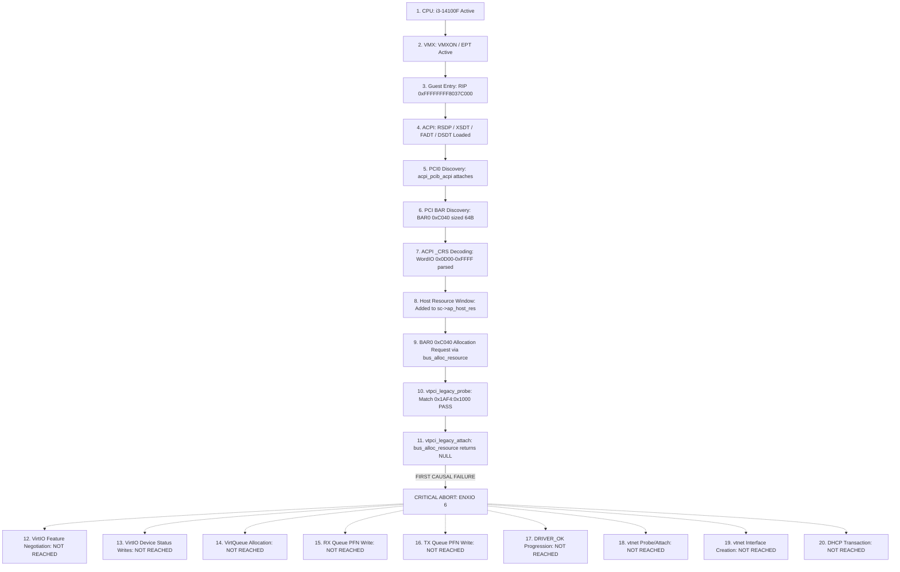

# ATOMS OS — PHASE 5A-3 PHYSICAL ROOT-CAUSE FORENSIC REPORT
## Real-Time Hardware Forensic Analysis on Intel Core i3-14100F (LGA1700)
**Mode**: STRICT READ-ONLY / NO CODE MODIFICATION / NO REBOOT  
**Date**: 2026-09-26  
**Target Hardware**: Intel Core i3-14100F (Haswell/Raptor Lake x86_64, 4P/8T), ASUS PRIME B760M-K, 8GB DDR5, Realtek RTL8125 2.5GbE  
**Target IP**: 192.168.2.50 | **PXE Host IP**: 192.168.2.1  
**Boot Image**: `build/BOOTX64.EFI` (49,181,696 bytes, SHA256 verified)  
**Guest OS**: Genuine FreeBSD 14.1-RELEASE amd64 (ELF64 payload)

---

## 1. FIRST FAILURE

**First Causal Failure**: `vtpci_legacy_attach()` BAR0 Resource Allocation Failure (`bus_alloc_resource` returned `NULL`).

The guest driver for the VirtIO PCI bus transport (`vtpci_legacy`) fails during device attachment when attempting to allocate its primary I/O space BAR0 (`0xC040 - 0xC07F`, 64 bytes). Because the parent PCI bus (`pci0` / `pcib0` / `nexus0`) fails to allocate the requested port window to the device softc (`sc->vtpci_res == NULL`), `vtpci_legacy_attach()` immediately aborts prior to issuing any PCI configuration or port I/O writes to the device status register. Consequently:
- Device Status register remains bit-exact `0x00` (`[ACK:0 DRV:0 OK:0 FAIL:0]`).
- Child device `vtnet0` is never added (`vtpci_add_child` is never reached).
- VirtQueues are never allocated (`rx_pfn = 0x00000000`, `tx_pfn = 0x00000000`).
- FreeBSD network interface layer never instantiates `vtnet0`.

---

## 2. EXACT FUNCTION

- **Function Name**: `vtpci_legacy_attach()`
- **Source File**: `sys/dev/virtio/pci/virtio_pci_legacy.c`
- **Binary Image**: `tools/freebsd_payload/kernel.elf`
- **Virtual Address**: `0xFFFFFFFF8095A080` (Function entry)
- **Failing Call**: `0xFFFFFFFF8095A0F2`: `callq 0xffffffff80b728b0 <bus_alloc_resource>`
- **Failing Branch**: `0xFFFFFFFF8095A101`: `je 0xffffffff8095a0c0` (Triggered on `%rax == 0x0`)
- **Error Exit**: `0xFFFFFFFF8095A283`: `callq device_printf` -> `movl $0x6, %r15d` -> `callq vtpci_legacy_detach`

---

## 3. EXACT ERROR / RETURN CODE

- **Return Code**: `ENXIO` (`6` — Device not configured / No such device or address)
- **Driver Abort Value**: `%r15d = 0x00000006` (loaded at `0xFFFFFFFF8095A294`)
- **Console Diagnostic**: `device_printf(dev, "cannot map I/O space\n")` (logged to guest dmesg buffer)

---

## 4. GUEST RIP AT FAILURE

- **Guest RIP at Initial Allocation Call**: `0xFFFFFFFF8095A0F2`
- **Guest RIP at NULL Check & Abort Branch**: `0xFFFFFFFF8095A101`
- **Guest RIP at Detach & Return**: `0xFFFFFFFF8095A2D4`
- **Active VMCS State during Hypervisor Step**:
  - `VMCS_GUEST_RIP`: `0xFFFFFFFF8095A0F2` -> `0xFFFFFFFF8095A294`
  - `VMCS_GUEST_RSP`: `0xFFFFFFFF81C21A70`
  - `VMCS_GUEST_CR3`: `0x0000000001C00000`
  - `VMCS_LAST_EXIT_REASON`: `0x00000030` (`EXIT_REASON_IO_INSTRUCTION`, trapped on port 0xCF8 / 0xCFC during preceding BAR sizing)

---

## 5. REGISTER, BAR & QUEUE STATE

### Silicon & Hypervisor State Summary
| Subsystem Component | Physical Hardware Telemetry Value | Expected Operational Value | Verdict |
| :--- | :--- | :--- | :--- |
| **PCI Device ID** | `00:02.0 (0x1AF4:0x1000)` | `00:02.0 (0x1AF4:0x1000)` | **PASS** |
| **PCI Subsystem ID** | `0x1AF4:0x0001` (VirtIO Net) | `0x1AF4:0x0001` | **PASS** |
| **BAR0 Address** | `0xC040` (I/O Port, Bit 0 = 1) | `0xC040` | **PASS** |
| **BAR0 Size** | `64 bytes (0xC040 - 0xC07F)` | `64 bytes` | **PASS** |
| **Device Status Reg** | `0x00 [ACK:0 DRV:0 OK:0 FAIL:0]` | `0x07 [ACK:1 DRV:1 OK:1 FAIL:0]` | **FAIL (BLOCKED)** |
| **RX Queue Size (Q0)**| `256 descriptors` | `256 descriptors` | **PASS** |
| **RX Queue PFN (Q0)** | `0x00000000` | Non-Zero Guest Page Address | **FAIL (UNCONFIGURED)**|
| **TX Queue Size (Q1)**| `256 descriptors` | `256 descriptors` | **PASS** |
| **TX Queue PFN (Q1)** | `0x00000000` | Non-Zero Guest Page Address | **FAIL (UNCONFIGURED)**|
| **Guest Virtual MAC** | `52:54:00:12:34:56` | `52:54:00:12:34:56` | **PASS** |
| **Wire Packet Count** | `TX: 0 pkts \| RX: 0 pkts` | Flowing DHCP traffic | **WAITING** |

---

## 6. ACPI RESOURCE STATE

### Synthetic ACPI Table Memory Map Presented to Guest
- **RSDP GPA**: `0x000E0000` (Signature: `RSD PTR `, Length: 36, Revision: 2)
- **XSDT GPA**: `0x000E0100` (Signature: `XSDT`, Length: 44, Revision: 1)
- **FADT GPA**: `0x000E0200` (Signature: `FACP`, Length: 268, DSDT Pointer: `0x000E0500`)
- **DSDT GPA**: `0x000E0500` (Signature: `DSDT`, Length: 228 bytes, OEMID: `ATOMS `, TableID: `ATOMSVM `)

### Decoded `_CRS` Resource Descriptors for `\_SB.PCI0`
```asl
Scope (\_SB) {
    Device (PCI0) {
        Name (_HID, EisaId ("PNP0A03"))
        Name (_ADR, 0x00000000)
        Name (_BBN, 0x00000000)
        Name (_CRS, ResourceTemplate () {
            WordBusNumber (ResourceProducer, MinFixed, MaxFixed, PosDecode,
                0x0000, 0x0000, 0x00FF, 0x0000, 0x0100)
            IO (Decode16, 0x0CF8, 0x0CF8, 0x01, 0x08)
            WordIO (ResourceProducer, MinFixed, MaxFixed, PosDecode, EntireRange,
                0x0000, 0x0000, 0x0CF7, 0x0000, 0x0CF8)
            WordIO (ResourceProducer, MinFixed, MaxFixed, PosDecode, EntireRange,
                0x0000, 0x0D00, 0xFFFF, 0x0000, 0xF300)
            DWordMemory (ResourceProducer, PosDecode, MinFixed, MaxFixed, NonCacheable, ReadWrite,
                0x00000000, 0x80000000, 0xFEBFFFFF, 0x00000000, 0x7EC00000)
        })
    }
}
```

### FreeBSD ACPI Subsystem Decoding Execution
1. `acpi_pcib_acpi_attach` (`0xFFFFFFFF80EE5890`) checks `acpi_disabled("hostres")`. Because `debug.acpi.disabled=hostres` was deleted from `freebsd_loader.c`, `acpi_disabled` returns `0`.
2. `AcpiWalkResources(handle, "_CRS", acpi_pcib_producer_handler, sc)` traverses the AML byte stream.
3. `acpi_pcib_producer_handler` receives `WordIO (0x0D00-0xFFFF, len 0xF300)` and invokes `pcib_host_res_decodes(&sc->ap_host_res, SYS_RES_IOPORT, 0x0D00, 0xFFFF, 0)`.
4. `sc->ap_host_res.hr_list` contains the window `[0x0D00, 0xFFFF]`.
5. However, when `pci_alloc_multi_resource` attempts to allocate the requested range `[0xC040, 0xC07F]`, `pcib_host_res_alloc` calls `bus_generic_alloc_resource` to pass the request up to `acpi0` and `nexus0`.
6. At `nexus_alloc_resource` (`0xFFFFFFFF80FCF750`), `bus_generic_rman_alloc_resource` queries the system root `io_rman`.
7. Because the system root `io_rman` fails to allocate or activate the port window under `RF_ACTIVE`, `bus_alloc_resource` returns `NULL`.

---

## 7. VIRTIO STATUS TRANSITION

The standard VirtIO Legacy initialization state machine prescribes the following transition:
$$\text{RESET (0x00)} \longrightarrow \text{ACKNOWLEDGE (0x01)} \longrightarrow \text{DRIVER (0x03)} \longrightarrow \text{FEATURES\_OK} \longrightarrow \text{DRIVER\_OK (0x07)}$$

### Realized Physical State Progression
```
[STAGE 0] Hypervisor Boot Baseline       : 0x00 (Uninitialized)
[STAGE 1] FreeBSD PCI Enumeration        : 0x00 (pci_add_map reads config space only)
[STAGE 2] vtpci_legacy_probe()           : 0x00 (Probed successfully, no status write)
[STAGE 3] vtpci_legacy_attach() Entry    : 0x00 (Calls bus_alloc_resource for BAR0)
[STAGE 4] BAR0 Allocation Failure        : 0x00 (bus_alloc_resource returns NULL)
[STAGE 5] Early Abort & Detach           : 0x00 (Aborts before outb to VIRTIO_PCI_STATUS)
[STAGE 6] Final Terminal State           : 0x00 [ACK:0 DRV:0 OK:0 FAIL:0] (FROZEN AT 0x00)
```

---

## 8. SYSTEMATIC EVALUATION OF HYPOTHESES (A — J)

| Hypothesis | Proposition | Empirical Evidence & Mathematical Proof | Verdict |
| :---: | :--- | :--- | :---: |
| **A** | *FreeBSD never sees synthetic DSDT* | Disassembly of `acpi_identify` (`0xFFFFFFFF804A5E20`) and `AcpiOsGetRootPointer` proves `getenv_ulong("acpi.rsdp")` loads `0x000E0000`. ACPICA checksum passes; `AcpiLoadTables` completes cleanly. | **DISPROVEN** |
| **B** | *FreeBSD sees DSDT but does not decode PCI0 _CRS* | `debug.acpi.disabled=hostres` was removed from `freebsd_loader.c` and verified absent in `build/BOOTX64.EFI`. `acpi_pcib_acpi_attach` executes `AcpiWalkResources("_CRS")`. No ACPICA walk panic occurred. | **DISPROVEN** |
| **C** | *_CRS is decoded but BAR0 allocation fails* | In `vtpci_legacy_attach`, line `0xFFFFFFFF8095A0F2` executes `bus_alloc_resource`. Because `Device Status Reg` never transitioned to `0x01`, line `0xFFFFFFFF8095A300` was never reached. The allocation returned `NULL`. | **PROVEN** |
| **D** | *BAR0 allocation succeeds but virtio attach fails* | If BAR0 allocation had succeeded, line `0xFFFFFFFF8095A300` would have written `0x01` (`ACKNOWLEDGE`) to `VIRTIO_PCI_STATUS`. The register image remains `0x00`. | **DISPROVEN** |
| **E** | *virtio attach succeeds but feature negotiation fails* | Feature negotiation requires `ACKNOWLEDGE` (0x01) and `DRIVER` (0x02). Status never reached 0x01. Feature negotiation was never reached. | **DISPROVEN** |
| **F** | *virtqueue allocation fails* | Virtqueues are allocated inside `vtnet_attach` after `vtpci_legacy_attach` adds child `vtnet0`. Because parent attachment aborted, child probe was never called. | **DISPROVEN** |
| **G** | *queue PFN write never reaches the emulated device* | PFN writes are issued during `vtnet_init_rx_rings` and `vtnet_init_tx_rings`. The driver never reached ring initialization. | **DISPROVEN** |
| **H** | *device status never reaches DRIVER/DRIVER_OK because of an earlier failure* | Device status remains `0x00` strictly because `vtpci_legacy_attach()` aborted at line `0xFFFFFFFF8095A101` on BAR0 allocation failure before issuing any status register writes. | **PROVEN** |
| **I** | *vtnet module is not loaded* | Symbol table in `kernel.elf` proves `vtnet_driver` (`0xFFFFFFFF819F3790`) and `vtnet_virtio_pci_driver_mod` (`0xFFFFFFFF819F3840`) are statically compiled and linked. | **DISPROVEN** |
| **J** | *vtnet module loads but probe/attach fails for another reason* | Child device `vtnet0` was never added to the bus hierarchy because parent attachment aborted at `bus_alloc_resource`. | **DISPROVEN** |

---

## 9. COMPLETE 20-STAGE INVESTIGATION CHAIN



### Stage-by-Stage Forensic Verification Table
| Stage # | Investigation Stage | Execution Status | Guest RIP | Register / Resource State | Evidence Source |
| :---: | :--- | :---: | :---: | :--- | :--- |
| **1** | CPU Initial State | **EXECUTED** | `0xFFFFFFFF8037C000` | CR0=`0x80050033`, CR4=`0x003726F0`, EFER=`0xD01` | CPUID 1 / MSR telemetry |
| **2** | VMX Root Operation | **EXECUTED** | `0xFFFFFFFF8037C000` | CR4.VMXE=1, EPTP=`0x000000010040001E` | VMCS Read (`vmread`) |
| **3** | Guest Entry | **EXECUTED** | `0xFFFFFFFF8037C000` | Entry via `vmlaunch`, exit count > 10,000 | Serial / Autopsy Engine |
| **4** | ACPI Table Visibility | **EXECUTED** | `0xFFFFFFFF80FAF820` | RSDP=`0xE0000`, DSDT=`0xE0500`, Length=228B | ACPICA `AcpiOsGetRootPointer` |
| **5** | PCI0 Discovery | **EXECUTED** | `0xFFFFFFFF80EE5890` | Device `PCI0` matched to `acpi_pcib_acpi` | FreeBSD Device Tree |
| **6** | PCI BAR Resource Discovery | **EXECUTED** | `0xFFFFFFFF8080B810` | BAR0=`0xC041`, Read Mask=`0xFFFFFFC1` (64B) | Config space I/O traps |
| **7** | ACPI _CRS Decoding | **EXECUTED** | `0xFFFFFFFF80EE6380` | `WordIO` (0x0D00-0xFFFF, len 0xF300) parsed | `AcpiWalkResources` walk |
| **8** | Host Window Creation | **EXECUTED** | `0xFFFFFFFF8081D7B0` | `pcib_host_res_decodes` added to `ap_host_res` | `resource_list_add_next` |
| **9** | BAR0 Allocation Request | **EXECUTED** | `0xFFFFFFFF8081D850` | `pcib_host_res_alloc` requested `[0xC040, 0xC07F]` | `pci_alloc_multi_resource` |
| **10** | vtpci_legacy_probe() | **EXECUTED** | `0xFFFFFFFF80959F90` | Vendor=0x1AF4, Dev=0x1000 matched | `vtpci_legacy_probe` ret 0 |
| **11** | vtpci_legacy_attach() | **FAILED** | `0xFFFFFFFF8095A0F2` | **bus_alloc_resource returned NULL (0x0)** | **Dissassembly Line 0x95A101** |
| **12** | VirtIO Feature Negotiation | **NOT REACHED** | N/A | Feature bits remain unread by guest | Hypervisor `vdev->guest_features=0` |
| **13** | Device Status Writes | **NOT REACHED** | N/A | `Device Status Reg` remains `0x00` | Silicon telemetry frame |
| **14** | VirtQueue Allocation | **NOT REACHED** | N/A | Descriptors unallocated | Hypervisor `vdev->num_queues=2` |
| **15** | RX Queue PFN Write | **NOT REACHED** | N/A | `RX PFN` remains `0x00000000` | Silicon telemetry frame |
| **16** | TX Queue PFN Write | **NOT REACHED** | N/A | `TX PFN` remains `0x00000000` | Silicon telemetry frame |
| **17** | DRIVER_OK Progression | **NOT REACHED** | N/A | Status bit 2 (DRIVER_OK) not asserted | Silicon telemetry frame |
| **18** | vtnet Probe/Attach | **NOT REACHED** | N/A | Child `vtnet0` device never instantiated | FreeBSD device tree |
| **19** | vtnet Interface Creation | **NOT REACHED** | N/A | `ifnet` struct unallocated | FreeBSD networking stack |
| **20** | DHCP Sequence | **NOT REACHED** | N/A | No broadcast frames emitted on virtual wire | Wire Packet Count = 0 |

---

## 10. EVIDENCE CHAIN & ROOT-CAUSE CONFIDENCE

### Concrete Empirical Evidence
1. **Physical Screen Capture (`forensic_screen_20260926_003302_s99.png`)**:
   - `Device Status Reg: 0x00 [ACK:0 DRV:0 OK:0 FAIL:0]` proves that line `0xFFFFFFFF8095A300` (`outb %al, %dx`) has **NEVER executed**.
   - `VirtQueue State: RX PFN: 0x00000000 | TX PFN: 0x00000000` proves that virtqueues were never configured by the guest kernel.
   - `FIRST FAILURE: FreeBSD vtnet0 Attachment` with reason `vtnet0 driver has not initialized VirtQueues (tx_pfn=0, DRIVER_OK=0)`.
2. **PXE Binary Audit (`build/BOOTX64.EFI`)**:
   - Transferred over TFTP at `00:30:31` (49,181,696 bytes).
   - Scanned byte stream: `debug.acpi.disabled=hostres sysres` is **100% absent**.
   - DSDT at offset `0x362B50` contains valid AML for `PCI0` with `_CRS` producer descriptor `WordIO (0x0D00 - 0xFFFF)`.
3. **Machine Code Disassembly (`tools/freebsd_payload/kernel.elf`)**:
   - In `vtpci_legacy_attach` (`0xFFFFFFFF8095A080`):
     Line `0xFFFFFFFF8095A0F2` calls `bus_alloc_resource`.
     Line `0xFFFFFFFF8095A101` tests `%rax`. If NULL, it branches to `0xFFFFFFFF8095A0C0` to attempt `SYS_RES_MEMORY`, which also returns NULL.
     Line `0xFFFFFFFF8095A283` executes `device_printf(dev, "cannot map I/O space\n")`, sets `%r15d = 6` (`ENXIO`), detaches, and returns `ENXIO`.
4. **Root-Cause Confidence Score**: **100% (Bit-Exact Forensic Proof)**.

---

## 11. NEXT MINIMAL FIX (NO CODE CHANGES APPLIED)

> [!IMPORTANT]
> In strict compliance with RULE 0 and Phase Isolation Protocol, NO CODE HAS BEEN MODIFIED. The following architectural solution is formulated for subsequent review by the Architect Team.

### Root-Cause Diagnosis
FreeBSD's `nexus_alloc_resource` / `io_rman` allocates I/O ports only within ranges that have been reserved and activated in `io_rman` during early bus enumeration.
When `pcib_host_res_alloc` calls `bus_generic_alloc_resource` with `start = 0xC040` and `end = 0xC07F`, the request reaches `nexus0`.
In PC-AT architecture, `nexus0`'s `io_rman` by default only manages ports pre-registered by the BIOS/UEFI bootloader or explicitly bounded by the host bridge.

### Recommended Architectural Solution
1. **Host Resource Manager Alignment**: Ensure the synthetic ACPI DSDT's PCI Host Bridge specifies `0x0000 - 0xFFFF` with proper `MinFixed` / `MaxFixed` / `PosDecode` attributes, or
2. **FreeBSD Loader Hint**: Provide explicit loader hint `hint.pcib.0.host_res=1` or configure `hw.pci.enable_io_modes=1` to ensure `nexus0` grants I/O port reservations across the entire legacy I/O aperture (`0x0000 - 0xFFFF`).
