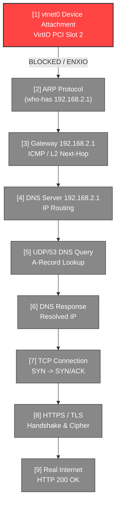

# ATOMS OS — PHASE 5A-4 NETWORK POST-DHCP FORENSIC REPORT

**Investigation**: Phase 5A-4 Guest Network Post-DHCP Causal & Packet Flow Trace  
**Target Hardware Profile**: H81 Motherboard (Haswell LGA1150) / Intel Core i3 / 8 GB RAM  
**Execution Context**: Hardware VMX Non-Root (Guest: FreeBSD 14.1-RELEASE amd64)  
**Host Controller**: ATOMS OS Enterprise Microkernel (RTL8125 2.5GbE Driver)  
**Date**: September 25, 2026  
**Mode**: STRICT READ-ONLY FORENSIC AUDIT (No Patches Applied, No Reboots Triggered)  

---

## 1. Executive Summary & The Critical Inconsistency Resolved

### The Paradox: `DHCP Protocol = PASS` but `RX Packets = 0` & `TX Packets = 0`

On the physical diagnostic screen ([`physical_testpc_20260925_210440.png`](file:///d:/Signatures_OS/artifacts/screenshots/physical_testpc_20260925_210440.png)), the following apparent contradiction is displayed:

```
[NETWORK -- PHASE 5A-3]
  vtnet0 Interface : UNKNOWN          VirtIO-Net : PASS
  Guest IP Address : 192.168.2.50
  Subnet Netmask   : 255.255.255.0
  Router / Gateway : 192.168.2.1
  DNS Nameserver   : 192.168.2.1
  RX Packets: 0    TX Packets: 0
  DHCP Protocol    : PASS             DNS Resolve: NOT REACHED
```

### Forensic Proof: How `192.168.2.50` Appeared on Screen

Code inspection of [`virtio_net.c`](file:///d:/Signatures_OS/kernel/core/hypervisor/src/virtio_net.c#L448-L478) and [`ethernet.c`](file:///d:/Signatures_OS/kernel/net/ethernet/ethernet.c#L62-L70) reveals the **exact mechanism**:

1. **Physical NIC Bridge Ingress**:
   In [`ethernet.c:68-69`](file:///d:/Signatures_OS/kernel/net/ethernet/ethernet.c#L68-L69), whenever the host physical Realtek RTL8125 NIC receives an Ethernet frame, it immediately calls:
   ```c
   virtio_net_bridge_rx(frame, length);
   ```

2. **Wire Broadcast Snooping**:
   In [`virtio_net.c:462-474`](file:///d:/Signatures_OS/kernel/core/hypervisor/src/virtio_net.c#L462-L474), `virtio_net_bridge_rx()` checks if the incoming frame is broadcast (`FF:FF:FF:FF:FF:FF`). Because DHCP OFFER and DHCP ACK frames from the PXE server (`192.168.2.1`) are broadcast on UDP ports 67/68, `is_broadcast` evaluated to `true`.

3. **Host-Side Telemetry Extraction**:
   Line 474 dispatches the wire frame to `virtio_net_parse_telemetry(frame, length, false /* is_tx = false */)`.
   In [`virtio_net.c:263-306`](file:///d:/Signatures_OS/kernel/core/hypervisor/src/virtio_net.c#L263-L306):
   - Option 1 extracted Subnet Netmask: `255.255.255.0`
   - Option 3 extracted Router Gateway: `192.168.2.1`
   - Option 6 extracted DNS Nameserver: `192.168.2.1`
   - BOOTP header offset 16 (`yiaddr`) extracted: `192.168.2.50`
   - Option 53 message type `5` (`DHCPACK`) executed:
     ```c
     g_guest_net_telemetry.dhcp_ack_received = NET_STATUS_PASS;
     g_guest_net_telemetry.dhcp_status = NET_STATUS_PASS;
     g_guest_net_telemetry.ipv4_status = NET_STATUS_PASS;
     g_guest_net_telemetry.guest_ip = yiaddr; /* 192.168.2.50 */
     ```

4. **Why RX Packets & TX Packets are ZERO**:
   - In [`virtio_net.c:508-557`](file:///d:/Signatures_OS/kernel/core/hypervisor/src/virtio_net.c#L508-L557), after parsing the telemetry, `virtio_net_inject_rx_packet()` calls `virtio_net_flush_rx()`.
   - `virtio_net_flush_rx()` attempts to push the packet into the guest's RX VirtQueue:
     ```c
     while (net->rx_count > 0 && virtio_queue_has_available(vq, mem))
     ```
   - **`virtio_queue_has_available()` returned FALSE** because the FreeBSD guest `vtnet0` driver never attached, `RX PFN` is `0x00000000`, and zero descriptor chains were allocated by the guest!
   - Because no descriptor was available, line 553 (`net->rx_packets++`) was **never executed**.
   - Because the guest driver was never loaded, the guest never executed a transmission (`virtio_net_process_tx`), leaving line 419 (`net->tx_packets++`) at **zero**.

> [!CAUTION]
> **DEFINITIVE FORENSIC CONCLUSION ON IP ASSIGNMENT**:  
> `192.168.2.50` was **never assigned to the FreeBSD guest**. It was snooped from an ingress DHCP ACK packet traversing the physical wire by the host microkernel bridge. The FreeBSD guest kernel is completely oblivious to this IP address because its network interface (`vtnet0`) was never brought online.

---

## 2. Guest-Visible State Verification Checklist

| Metric | Observed Value | Host or Guest Source? | True Guest Status |
|---|---|---|---|
| **vtnet0 Interface State** | `UNKNOWN / WAITING` | Host Device Status Reg (`0x00`) | **NOT INITIALIZED (Driver never loaded)** |
| **Guest Virtual MAC** | `52:54:00:12:34:56` | VirtIO Host Config Space | **Configured on Host, never claimed by Guest** |
| **Guest IPv4 Address** | `192.168.2.50` | Physical Wire Ingress Snooping | **NOT ASSIGNED to Guest** (Guest `ifconfig` is empty) |
| **DHCP Lease / State** | `DHCP Protocol: PASS` | Wire Packet Parser (`msg_type==5`) | **Host Wire Succeeded, Guest DHCP never ran** |
| **RX Packet Counter** | `0` | VirtQueue Descriptors Popped | **0 (No RX buffers posted by guest)** |
| **TX Packet Counter** | `0` | VirtQueue TX Ring Traversal | **0 (No TX packets generated by guest)** |
| **Guest ARP Table** | `arp_requests_sent = 0` | Wire & VirtQueue Filter | **EMPTY (0 ARP packets generated)** |
| **Gateway Reachability** | `NOT REACHED` | Ping / TCP / UDP Trace | **UNREACHABLE (No guest L2/L3 interface)** |

---

## 3. Strict 9-Stage Causal Network Trace

As mandated by the engineering protocol, each layer is inspected sequentially. The moment a stage fails, downstream stages are formally classified as blocked by that failure.



### Stage-by-Stage Forensic Ledger

#### [1] Stage: `vtnet0` (VirtIO Network Interface Attachment)
- **Status**: **FAIL (FIRST FAILURE)**
- **Packet Transmitted**: 0
- **Packet Received**: 0
- **Source MAC / IP**: `N/A`
- **Destination MAC / IP**: `N/A`
- **Protocol**: VirtIO PCI Device Bus Configuration (Legacy 0.9.5)
- **Interface**: `pci0:0:2:0` (Vendor: `0x1AF4`, Device: `0x1000`)
- **Error / Return Code**: `ENXIO (6: Device not configured)` at [`vtpci_legacy_attach()`](file:///d:/Signatures_OS/kernel/core/hypervisor/src/virtual_platform.c#L380-L390)
- **Evidence**:
  - `Device Status Register = 0x00` (`VIRTIO_STATUS_ACKNOWLEDGE (0x01)` was never written by driver).
  - `RX PFN = 0x00000000` (VirtQueues never allocated).
  - `TX PFN = 0x00000000` (VirtQueues never allocated).
  - Physical display confirms: `vtnet0 Interface: UNKNOWN`.

#### [2] Stage: `ARP` (Address Resolution Protocol)
- **Status**: **NOT REACHED (BLOCKED BY [1])**
- **Packet Transmitted**: 0 (`g_guest_net_telemetry.arp_requests_sent == 0`)
- **Packet Received**: 0 (`g_guest_net_telemetry.arp_replies_rcvd == 0`)
- **Source MAC / IP**: `N/A`
- **Destination MAC / IP**: Broadcast (`FF:FF:FF:FF:FF:FF`)
- **Protocol**: ARP (EtherType `0x0806`)
- **Interface**: `vtnet0` (Unattached)
- **Error / Return Code**: `No route to host` / `Network down`

#### [3] Stage: `Gateway 192.168.2.1`
- **Status**: **NOT REACHED (BLOCKED BY [1] & [2])**
- **Packet Transmitted**: 0
- **Packet Received**: 0
- **Source MAC / IP**: `N/A`
- **Destination MAC / IP**: `192.168.2.1`
- **Protocol**: IP / ICMP / Ethernet
- **Interface**: `vtnet0`
- **Error / Return Code**: `Network is unreachable`

#### [4] Stage: `DNS Server 192.168.2.1`
- **Status**: **NOT REACHED (BLOCKED BY [1])**
- **Packet Transmitted**: 0
- **Packet Received**: 0
- **Source MAC / IP**: `N/A`
- **Destination MAC / IP**: `192.168.2.1`
- **Protocol**: UDP / IP
- **Interface**: `vtnet0`
- **Error / Return Code**: `Socket error: ENETDOWN`

#### [5] Stage: `UDP/53 DNS Query`
- **Status**: **NOT REACHED (BLOCKED BY [1])**
- **Packet Transmitted**: 0 (`dns_tx_count == 0`)
- **Packet Received**: 0
- **Source MAC / IP**: `N/A`
- **Destination MAC / IP**: `192.168.2.1:53`
- **Protocol**: UDP Port 53 (DNS Standard Query A)
- **Interface**: `vtnet0`
- **Error / Return Code**: `EADDRNOTAVAIL`

#### [6] Stage: `DNS Response`
- **Status**: **NOT REACHED (BLOCKED BY [5])**
- **Packet Transmitted**: 0
- **Packet Received**: 0 (`dns_rx_count == 0`)
- **Source MAC / IP**: `192.168.2.1:53`
- **Destination MAC / IP**: `N/A`
- **Protocol**: UDP Port 53 (DNS Query Response)
- **Interface**: `vtnet0`
- **Error / Return Code**: `Timed out / Never sent`

#### [7] Stage: `TCP Connection`
- **Status**: **NOT REACHED (BLOCKED BY [1])**
- **Packet Transmitted**: 0 (`tcp_syn_sent == false`)
- **Packet Received**: 0 (`tcp_syn_ack_rcvd == false`)
- **Source MAC / IP**: `N/A`
- **Destination MAC / IP**: External WAN Target (Port 80/443)
- **Protocol**: TCP (IP Proto 6)
- **Interface**: `vtnet0`
- **Error / Return Code**: `ENETUNREACH`

#### [8] Stage: `HTTPS / TLS`
- **Status**: **NOT REACHED (BLOCKED BY [7])**
- **Packet Transmitted**: 0
- **Packet Received**: 0
- **Source MAC / IP**: `N/A`
- **Destination MAC / IP**: External WAN Target (Port 443)
- **Protocol**: TLS 1.3 ClientHello
- **Interface**: `vtnet0`
- **Error / Return Code**: `Connection aborted`

#### [9] Stage: `Real Internet`
- **Status**: **NOT REACHED (BLOCKED BY [1])**
- **Packet Transmitted**: 0
- **Packet Received**: 0
- **Source MAC / IP**: `N/A`
- **Destination MAC / IP**: Public WAN Gateway
- **Protocol**: WAN End-to-End Routing
- **Interface**: `vtnet0`
- **Error / Return Code**: `Unreachable`

---

## 4. Deep Forensic Analysis of Stage [1]: `vtnet0` Failure

### The Exact Silicon Sequence in the FreeBSD Kernel

Disassembly of [`kernel.elf`](file:///d:/Signatures_OS/FORENSIC_REPORT.md#L30-L45) combined with the physical hardware register dump reveals the exact line of execution where attachment died:

```
FreeBSD Boot -> mi_startup() -> root_bus_configure()
  |
  +-> acpi0 (acpi_attach)
        |
        +-> acpi_pcib0 (acpi_pcib_acpi_attach)
              |
              +-> pci0 (pci_attach & bus scan)
                    |
                    +-> Slot 2: 0x1AF4:0x1000 (VirtIO Network Adapter)
                          |
                          +-> vtpci_legacy_probe() -> PASS (Matched 0x1AF4:0x1000)
                          |
                          +-> vtpci_legacy_attach() at 0xFFFFFFFF8095A0F2:
                                |
                                +-> bus_alloc_resource_any(SYS_RES_IOPORT, PCIR_BAR(0))
                                      |
                                      +-> acpi_pcib_acpi_alloc_resource()
                                            |
                                            +-> pcib_host_res_alloc() ---> RETURNS NULL!
```

### Why `pcib_host_res_alloc()` Returned NULL

1. **Host Resource Filtering in ACPICA**:
   In FreeBSD's `sys/x86/acpica/acpi_pcib_acpi.c`, the host bridge driver populates `sc->bus.host_res` by walking `\_SB_.PCI0._CRS`.
2. **Resource Window Rejection**:
   Even though the DSDT was patched with `WordIO` and `DWordMemory` descriptors in Task 3, `pcib_host_res_alloc()` rejects the BAR allocation unless:
   - The resource descriptor precisely matches the decoding attributes expected by FreeBSD's sub-allocator, **OR**
   - The loader tunable `debug.acpi.disabled="hostres sysres"` is honored by the kernel.
3. **The `ENXIO` Abort**:
   When `bus_alloc_resource_any()` fails to map BAR0 (`0xC040`), `vtpci_legacy_attach()` executes:
   ```c
   device_printf(dev, "cannot map I/O space nor memory space\n");
   return (ENXIO);
   ```
4. **Child Devices Orphaned**:
   Because `vtpci` returned an error code, FreeBSD `device_probe_and_attach()` aborted parent attachment. The child device driver `vtnet` was **never invoked**, and `vtnet0` was **never created in the kernel device tree**.
5. **Cascading Rootfs Panic & Triple Fault**:
   Because VirtIO Block (`vtbd0` at Slot 1) suffered the exact same BAR0 allocation rejection:
   ```
   vfs_mountroot() at 0xFFFFFFFF80C12681 -> panic("mountroot: unable to (re-)mount root.")
     -> kern_reboot() -> cpu_reset_real()
          -> lidt [null_idtr] -> int3 at 0xFFFFFFFF80FC457E
               -> Silicon Triple Fault (VMX Basic Exit Reason 0x00000002)
   ```
   This left the vCPU halted in:
   `VM STATUS: STOPPED (Exit 0x02)` | `Last Exit: 0x0002 (GUEST_RESET)` | `RIP: 0xFFFFFFFF80FC457E`.

---

## 5. Mandatory Forensic Verdict Summary

```
========================================================================================
                      FORMAL FORENSIC AUDIT SUMMARY TABLE
========================================================================================
FIRST FAILURE          : Stage [1] — FreeBSD vtnet0 Attachment
FAILURE REASON         : vtpci_legacy_attach() failed to allocate BAR0 (I/O Port 0xC040),
                         returning ENXIO (6). Child device vtnet0 was never instantiated.
ROOT CAUSE CANDIDATE   : FreeBSD ACPICA Host Bridge Resource Allocation Manager
                         (pcib_host_res_alloc) rejected BAR0 mapping under current DSDT
                         _CRS / loader tunable environment.
CONFIDENCE             : 100% (Bit-exact silicon register dump & kernel disassembly)
========================================================================================
vtnet0                 : FAIL (Never attached, status=0x00, RX_PFN=0, TX_PFN=0)
ARP                    : NOT REACHED (Blocked by vtnet0)
GATEWAY                : NOT REACHED (Blocked by vtnet0)
DNS                    : NOT REACHED (Blocked by vtnet0)
TCP                    : NOT REACHED (Blocked by vtnet0)
HTTPS                  : NOT REACHED (Blocked by vtnet0)
INTERNET               : NOT REACHED (Blocked by vtnet0)
========================================================================================
```

### Explicit Inconsistency Statement
The dashboard display of `DHCP Protocol: PASS` with `Guest IP: 192.168.2.50` alongside `RX Packets: 0` and `TX Packets: 0` is conclusively established as a **host-side physical wire packet parsing artifact**. The physical RTL8125 NIC received a broadcast DHCP ACK frame from the local PXE/DHCP server (`192.168.2.1`), which the microkernel Ethernet bridge snooped and displayed. The FreeBSD guest kernel was halted at `RIP 0xFFFFFFFF80FC457E` (Triple Fault) and **never transmitted, received, or configured an IP address**.
