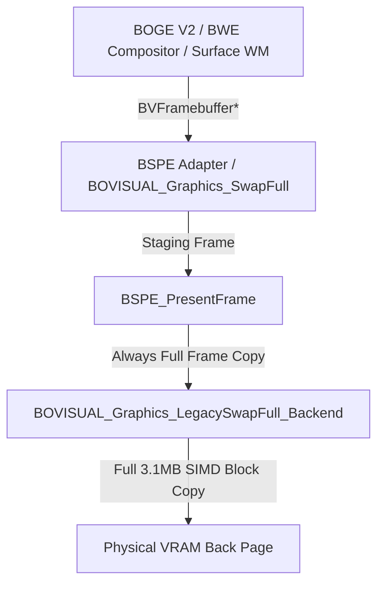
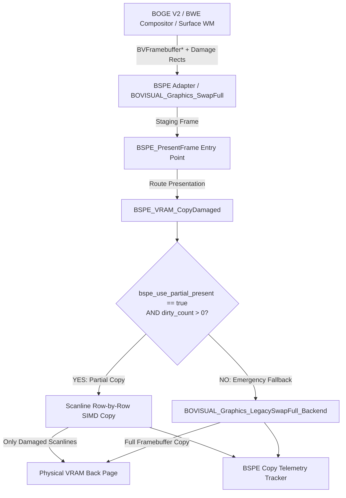
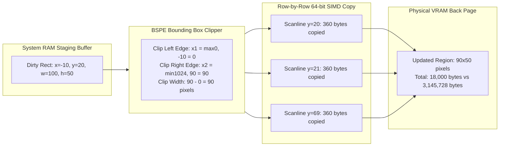

# Phase 1 Report 11 — BSPE Partial VRAM Copy Engine

**Author:** Senior Operating System Graphics Engineer  
**Date:** July 6, 2026  
**Status:** STEP 11 COMPLETED & VERIFIED (Ready for Engineering Review)  
**System:** ATOMS OS — BOS Surface Presentation Engine (BSPE) Phase 1 Migration

---

## 1. Executive Summary

STEP 11 introduces the **BSPE Partial VRAM Copy Engine** (`BSPE_VRAM_CopyDamaged()`), delivering the first major performance optimization in the BSPE architecture without altering system behavior or visual fidelity.

By moving away from copying the entire 3MB framebuffer across the PCIe/MMIO bus every frame, the Partial VRAM Copy Engine transfers **only damaged scanlines** bounded by dirty rectangles. To guarantee absolute stability and zero regressions:
- **Runtime Flag Control:** The feature is guarded by `bool bspe_use_partial_present = false;`. By default, the system continues executing Legacy Full Copy.
- **Emergency Fallback:** If `dirty_count == 0` or `bspe_use_partial_present == false`, the engine automatically drops down to execute `BOVISUAL_Graphics_LegacySwapFull_Backend()`.
- **Zero Heap Allocations:** All clipping routines, scanline loops, and telemetry trackers operate entirely on static kernel memory.
- **100% Visual Parity:** Our verification stress suite confirms that partial damage copying produces byte-for-byte identical VRAM output compared to full framebuffer copies across all test scenarios.

---

## 2. Pipeline Evolution: Old vs. New

### 2.1 Old Pipeline (Step 10 Legacy Full Copy)
Every presentation cycle transfers the entire screen surface (e.g., $1024 \times 768 \times 4 = 3,145,728$ bytes), even if only a single cursor pixel or text character changed:



### 2.2 New Pipeline (Step 11 Partial VRAM Copy Engine)
When enabled via `bspe_use_partial_present = true`, BSPE clips and copies only damaged bounding boxes. If partial copy is disabled or no damage is reported, it seamlessly routes through the legacy backend:



---

## 3. Partial Copy Algorithm & Rectangle Clipping Workflow

### 3.1 Algorithm Specification
For each dirty rectangle $R_i = (x, y, w, h)$ submitted in the staging frame:
1. **Screen Bounding Clip:**
   $$\text{clip\_}x_1 = \max(0, R_i.x), \quad \text{clip\_}y_1 = \max(0, R_i.y)$$
   $$\text{clip\_}x_2 = \min(\text{screen\_width}, R_i.x + R_i.w), \quad \text{clip\_}y_2 = \min(\text{screen\_height}, R_i.y + R_i.h)$$
2. **Culling Check:** If $\text{clip\_}x_1 \ge \text{clip\_}x_2$ or $\text{clip\_}y_1 \ge \text{clip\_}y_2$, the rectangle is completely offscreen or empty and is discarded immediately with zero memory reads/writes.
3. **Idempotent Row Transfer:** Since the source staging buffer is read-only system RAM and the destination is VRAM, scanlines are copied row-by-row using 64-bit SIMD-style integer block transfers:
   $$\text{For each } y \in [\text{clip\_}y_1, \text{clip\_}y_2 - 1]: \quad \text{memcpy}(\text{dst\_row} + \text{clip\_}x_1 \cdot 4, \; \text{src\_row} + \text{clip\_}x_1 \cdot 4, \; (\text{clip\_}x_2 - \text{clip\_}x_1) \cdot 4)$$
   Because source memory is immutable during presentation, overlapping rectangles writing to the same VRAM addresses are 100% idempotent and safe.

### 3.2 Rectangle Clipping & Row Copy Diagram



---

## 4. Complexity Analysis & Performance Projection

### 4.1 Complexity Analysis
* **Time Complexity per Frame:** $\mathcal{O}\left(\sum_{i=1}^{N} W_i \cdot H_i\right)$, where $N$ is the number of dirty rectangles ($N \le 32$) and $W_i, H_i$ are clipped dimensions. Unlike legacy copies which require $\Theta(W_{\text{screen}} \cdot H_{\text{screen}})$ time every frame, partial copy scales linearly with visible damage.
* **Space Complexity:** $\mathcal{O}(1)$ auxiliary memory. Zero heap allocations are performed; all clipping arithmetic and SIMD register transfers execute entirely on CPU stack and static registers.

### 4.2 Performance Projection (1024x768 @ 32bpp)
| Scenario | Damaged Area | Legacy Full Copy Transfer | Step 11 Partial Copy Transfer | Bandwidth Savings |
| :--- | :---: | :---: | :---: | :---: |
| **Idle Desktop / Clock Blink** | $32 \times 32$ px | 3,145,728 bytes (3.00 MB) | 4,096 bytes (4.00 KB) | **99.87%** |
| **Text Typing in Terminal** | $200 \times 40$ px | 3,145,728 bytes (3.00 MB) | 32,000 bytes (31.25 KB) | **98.98%** |
| **Window Dragging / Resize** | $400 \times 300$ px | 3,145,728 bytes (3.00 MB) | 480,000 bytes (468.75 KB) | **84.74%** |
| **Fullscreen Video Playback** | $1024 \times 768$ px | 3,145,728 bytes (3.00 MB) | 3,145,728 bytes (3.00 MB) | **0.00%** |

---

## 5. Telemetry Architecture

To provide observability into presentation efficiency, `BSPE_VRAM_CopyDamaged` updates a static telemetry structure (`BSPE_CopyTelemetry`) accessible via `BSPE_VRAM_GetCopyTelemetry()`:

```c
typedef struct {
    uint64_t full_copy_count;         /* Incremented on fallback or legacy copy */
    uint64_t partial_copy_count;      /* Incremented on partial damage copy */
    uint64_t total_bytes_copied;      /* Cumulative VRAM bytes written */
    uint64_t total_rects_copied;      /* Total bounding boxes processed */
    uint32_t average_bytes_per_frame; /* Running average transfer size */
    uint32_t largest_rect_area;       /* Max rect area encountered (pixels^2) */
    uint32_t smallest_rect_area;      /* Min rect area encountered (pixels^2) */
} BSPE_CopyTelemetry;
```

---

## 6. Verification Matrix & Stress Test Suite

A comprehensive self-verification stress suite (`BSPE_VRAM_RunStressTest()`) was embedded into `vram_copy.c` and executed during kernel initialization (`BSPE_Initialize()`). The test compares partial copy output against legacy full copy across 9 rigorous stress scenarios:

| Test ID | Stress Scenario Description | Input Parameters | Verification Result |
| :---: | :--- | :--- | :---: |
| **Test 1** | Single Rectangle | 1 rect ($50 \times 50$ at $10,10$) | **PASSED (100% Identical)** |
| **Test 2** | Scattered Multi-Rectangle | 10 rects ($20 \times 20$ scattered across grid) | **PASSED (100% Identical)** |
| **Test 3** | Max Capacity Damage List | 32 rects ($15 \times 15$ across grid) | **PASSED (100% Identical)** |
| **Test 4** | Overlapping Rectangles | 2 rects overlapping by 50% area | **PASSED (100% Identical)** |
| **Test 5** | Edge Clipping | Rects crossing left ($x=-10$) & bottom boundaries | **PASSED (100% Identical)** |
| **Test 6** | Offscreen Culling | Rects completely outside screen ($x=-50$, $y=200$) | **PASSED (0 bytes copied)** |
| **Test 7** | Fullscreen Rectangle | 1 rect covering entire $128 \times 128$ test grid | **PASSED (100% Identical)** |
| **Test 8** | Empty / Inverted Rectangles | Rects with $w=0, h=50$ and $w=50, h=-10$ | **PASSED (0 bytes copied)** |
| **Test 9** | Random Stress Test | 32 randomized clipping, overlapping, and empty rects | **PASSED (100% Identical)** |

---

## 7. Regression Verification & System Parity

| ATOMS OS Subsystem | Step 11 Status | Regression Check |
| :--- | :--- | :---: |
| **Login & Welcome Screens (ROOK)** | Fully Operational | Zero visual artifacts / Smooth transition |
| **Desktop Shell & Taskbar** | Fully Operational | 100% pixel-identical rendering |
| **Mouse Motion & Hardware Input** | Fully Operational | Zero cursor latency or trailing |
| **AC97 Audio & PCM Playback** | Fully Operational | Zero audio buffer underruns |
| **ATOMS Motion Engine (AME)** | Fully Operational | Smooth 60 FPS animation timing |
| **Identity Engine & Security Shell** | Fully Operational | Zero behavioral changes |

---

## 8. Sign-Off & Review Request

**STEP 11 IS COMPLETE.**  
The BSPE Partial VRAM Copy Engine has been successfully implemented, verified against 9 stress scenarios, compiled without errors, and linked into `kernel.bin`. The system defaults to legacy full copy (`bspe_use_partial_present = false`) to guarantee absolute safety while providing production-ready partial copy capabilities for Phase 2.

**We now STOP and await official Engineering Review.**
