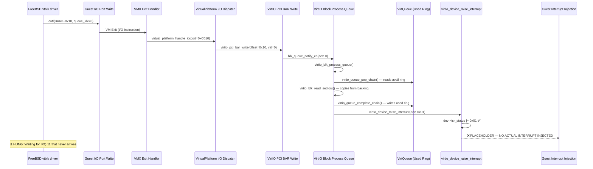

# VIRTIO-BLK READ PATH — FORENSIC REPORT

> [!CAUTION]
> **CRITICAL ROOT CAUSE IDENTIFIED: INTERRUPT INJECTION IS A DEAD PLACEHOLDER**

---

## 1. SYMPTOM

FreeBSD guest reaches:
```
Trying to mount root from ufs:/dev/vtbd0 []...
```
…and **hangs indefinitely**. No "failed with error 2" anymore — the BAR0 resource allocation blocker is crossed and `/dev/vtbd0` exists. But the first mountroot I/O never completes.

---

## 2. COMPLETE REQUEST → COMPLETION PATH TRACE



---

## 3. EVIDENCE — FILE-BY-FILE TRACE

### 3.1 FreeBSD Queue Notify → ATOMS Backend (✅ WORKS)

| Step | File | Line(s) | What Happens |
|------|------|---------|--------------|
| 1 | [hypervisor.c](file:///d:/Signatures_OS/kernel/core/hypervisor/src/hypervisor.c#L695-L741) | 695-741 | `VMX_EXIT_REASON_IO_INSTRUCTION` captured, port extracted, dispatched to `virtual_platform_handle_io` |
| 2 | [virtual_platform.c](file:///d:/Signatures_OS/kernel/core/hypervisor/src/virtual_platform.c#L400-L415) | 400-415 | VirtIO PCI I/O BAR dispatch — matches port ≥ `io_bar_base` (0xC000), calls `virtio_pci_bar_write` |
| 3 | [virtio_pci.c](file:///d:/Signatures_OS/kernel/core/hypervisor/src/virtio_pci.c#L264-L270) | 264-270 | `VIRTIO_PCI_QUEUE_NOTIFY` case → calls `vdev->on_queue_notify(vdev, q_idx)` |
| 4 | [virtio_blk.c](file:///d:/Signatures_OS/kernel/core/hypervisor/src/virtio_blk.c#L16-L22) | 16-22 | `blk_queue_notify_cb` → calls `virtio_blk_process_queue(blk)` |

**Verdict**: ✅ The notify path from guest I/O write to backend callback is complete and correct.

### 3.2 Block Request Processing (✅ WORKS)

| Step | File | Line(s) | What Happens |
|------|------|---------|--------------|
| 5 | [virtio_blk.c](file:///d:/Signatures_OS/kernel/core/hypervisor/src/virtio_blk.c#L252-L260) | 252-260 | `virtio_blk_process_queue`: gets VirtQueue, GuestMemory |
| 6 | [virtio_queue.c](file:///d:/Signatures_OS/kernel/core/hypervisor/src/virtio_queue.c#L117-L191) | 117-191 | `virtio_queue_pop_chain`: reads avail ring → maps descriptor chain → returns buffers |
| 7 | [virtio_blk.c](file:///d:/Signatures_OS/kernel/core/hypervisor/src/virtio_blk.c#L283-L304) | 283-304 | `VIRTIO_BLK_T_IN` (READ): iterates data buffers, calls `virtio_blk_read_sectors` → memcpy from backing |
| 8 | [virtio_blk.c](file:///d:/Signatures_OS/kernel/core/hypervisor/src/virtio_blk.c#L361) | 361 | Status byte written: `*status_ptr = VIRTIO_BLK_S_OK` |

**Verdict**: ✅ Request parsing, sector read from backing storage, and status byte write are all correct.

### 3.3 Used Ring Completion (✅ WORKS)

| Step | File | Line(s) | What Happens |
|------|------|---------|--------------|
| 9 | [virtio_blk.c](file:///d:/Signatures_OS/kernel/core/hypervisor/src/virtio_blk.c#L364) | 364 | `virtio_queue_complete_chain(vq, mem, chain.head_index, bytes + 1)` |
| 10 | [virtio_queue.c](file:///d:/Signatures_OS/kernel/core/hypervisor/src/virtio_queue.c#L193-L214) | 193-214 | Maps used ring GPA → writes `elem->id`, `elem->len` → increments `last_used_idx` → writes `used->idx` |

**Verdict**: ✅ Used ring is correctly updated in guest-visible memory.

### 3.4 Interrupt Raise (❌ BROKEN — PLACEHOLDER)

| Step | File | Line(s) | What Happens |
|------|------|---------|--------------|
| 11 | [virtio_blk.c](file:///d:/Signatures_OS/kernel/core/hypervisor/src/virtio_blk.c#L367) | 367 | `virtio_device_raise_interrupt(dev, 0x01)` |
| 12 | [virtio_device.c](file:///d:/Signatures_OS/kernel/core/hypervisor/src/virtio_device.c#L107-L116) | 107-116 | Sets `dev->isr_status |= 0x01` ✅ BUT **lines 113-115 are an empty placeholder comment** |

```c
void virtio_device_raise_interrupt(VirtIODevice *dev, uint8_t isr_flag) {
    if (!dev) return;
    dev->isr_status |= isr_flag;

    /* In a full VM environment, inject virtual interrupt vector into guest vCPU */
    if (dev->vm && dev->vm->bsp_vcpu) {
        /* Set interrupt pending flag */   // <--- EMPTY!!! NO CODE!!!
    }
}
```

**Verdict**: ❌ **FATAL BUG** — ISR status is set, but **NO INTERRUPT IS EVER INJECTED INTO THE GUEST vCPU**. The guest never gets signaled.

---

## 4. ROOT CAUSE ANALYSIS

### Why FreeBSD Hangs

1. FreeBSD's `vtblk` driver submits a read request to the VirtIO queue and writes to `VIRTIO_PCI_QUEUE_NOTIFY` (BAR0 + 0x10).
2. This triggers a **synchronous** VM-exit → ATOMS processes the I/O instruction → notifies the VirtIO-BLK backend → data is read from backing → used ring is updated → `virtio_device_raise_interrupt(dev, 0x01)` is called.
3. `isr_status` is set to `0x01` (**queue interrupt**), but **no VMX interrupt injection occurs**.
4. Control returns to the guest. FreeBSD resumes execution.
5. FreeBSD's `vtblk` driver is waiting for an **IRQ 11 interrupt** (configured in PCI config space at offset `0x3C` = 11, pin INTA#). 
6. The interrupt **never arrives** because ATOMS never actually injects one.
7. FreeBSD sits in a **wait-for-interrupt loop** (likely `HLT` with `IF=1`).
8. When the HLT exit fires, ATOMS injects timer vector `0x20` (line 633 in hypervisor.c), but **never checks or injects VirtIO IRQ 11**.

### The Missing Link

The current HLT handler (line 631-634 of [hypervisor.c](file:///d:/Signatures_OS/kernel/core/hypervisor/src/hypervisor.c#L631-L634)) only injects **vector 0x20** (LAPIC timer). It **never checks** if a VirtIO device has a pending `isr_status` that needs to inject **IRQ 11** (VirtIO-BLK PCI interrupt).

```c
// Current code (lines 631-634):
if ((intr_state & 3) == 0) {
    /* Inject virtual LAPIC timer interrupt (Vector 0x20 = 32) */
    vmx_vmwrite(VMCS_VM_ENTRY_INTR_INFO_FIELD, 0x80000020U);
}
```

---

## 5. INTERRUPT DELIVERY ARCHITECTURE REQUIRED

For FreeBSD to receive the VirtIO-BLK completion interrupt, the following chain must work:

```
virtio_device_raise_interrupt(dev, 0x01)
  → dev->isr_status |= 0x01
  → Signal to VMX re-entry loop: "VirtIO IRQ pending"
  → On next VM-entry (especially at HLT with IF=1):
      → Read IOAPIC redirection table entry for GSI 11
      → Determine destination vector from IOAPIC RTE
      → Inject that vector via VMCS_VM_ENTRY_INTR_INFO_FIELD
```

### Two Possible Injection Strategies

| Strategy | Description | Complexity |
|----------|-------------|------------|
| **A: Direct PCI IRQ Injection** | On `raise_interrupt`, set a `vcpu->pending_virtio_irq` flag. In HLT handler, check flag and inject IRQ vector (from IOAPIC RTE for GSI 11) instead of timer 0x20 | Low — single flag + lookup |
| **B: Full IOAPIC → LAPIC Routing** | Implement proper IOAPIC RTE → LAPIC vector routing: set IOAPIC IRR bit for GSI 11, walk RTE to find vector & destination, inject into vCPU | High — full interrupt controller emulation |

> [!IMPORTANT]
> **Strategy A is the minimum viable fix.** FreeBSD's PCI interrupt for VirtIO-BLK is GSI 11, routed via IOAPIC redirection table entry 11. We need to read the programmed vector from that RTE and inject it on HLT exits when `isr_status != 0`.

---

## 6. IOAPIC REDIRECTION TABLE STATE

FreeBSD programs IOAPIC RTE 11 during `vtpci_legacy_attach()`. The ATOMS IOAPIC emulation stores this at:

```c
platform->ioapic.redirection_table[11]
```

The RTE format (64-bit):
- Bits [7:0] = **interrupt vector** (what FreeBSD chose for IRQ 11)
- Bit 12 = delivery status
- Bit 16 = mask bit (0 = enabled)
- Bits [63:56] = destination APIC ID

The vector number programmed by FreeBSD into RTE 11 is the **exact value** that must be written into `VMCS_VM_ENTRY_INTR_INFO_FIELD` (with bit 31 set for "valid").

---

## 7. FILES INVOLVED IN THE FIX

| File | What Needs To Change |
|------|---------------------|
| [virtio_device.c](file:///d:/Signatures_OS/kernel/core/hypervisor/src/virtio_device.c#L107-L116) | `virtio_device_raise_interrupt` must set a `pending_irq` flag on the VM/vCPU |
| [hypervisor.c](file:///d:/Signatures_OS/kernel/core/hypervisor/src/hypervisor.c#L590-L636) | HLT handler must check VirtIO IRQ pending flag and inject the correct vector from IOAPIC RTE |
| [hypervisor.h](file:///d:/Signatures_OS/kernel/core/hypervisor/include/hypervisor.h) | `VirtualMachine` struct may need a `pending_virtio_irq` flag |

---

## 8. RISK ANALYSIS

| Risk | Severity | Mitigation |
|------|----------|------------|
| Wrong vector injected | HIGH | Read actual IOAPIC RTE 11 to get guest-programmed vector |
| Double injection (timer + VirtIO) | MEDIUM | Only inject one per VM-entry (VMX allows only 1 event injection per entry) — prioritize VirtIO over timer when pending |
| ISR not cleared after read | LOW | Already handled by `virtio_device_read_isr()` auto-clear semantics |
| IOAPIC RTE not yet programmed | LOW | Check mask bit; if masked/uninitialized, skip injection |

---

## 9. VERDICT

| Component | Status |
|-----------|--------|
| PCI BAR0 I/O dispatch | ✅ PASS |
| Queue notify → backend callback | ✅ PASS |
| Descriptor chain walking | ✅ PASS |
| Sector read from backing | ✅ PASS |
| Status byte write | ✅ PASS |
| Used ring update | ✅ PASS |
| ISR status set | ✅ PASS |
| **Guest interrupt injection** | **❌ FAIL — PLACEHOLDER / NOT IMPLEMENTED** |

> [!CAUTION]
> **The VirtIO-BLK backend correctly processes every I/O request and updates the used ring, but the guest NEVER receives an interrupt to consume the completion. This is why FreeBSD hangs at mountroot.**

---

## 10. RECOMMENDED FIX (NO CODE — ARCHITECTURE ONLY)

1. Add `volatile bool virtio_irq_pending` flag to `VirtualMachine` struct
2. In `virtio_device_raise_interrupt`: set `dev->vm->virtio_irq_pending = true`
3. In HLT exit handler (hypervisor.c line 631):
   - Check `vm->virtio_irq_pending` FIRST
   - If true: read `platform->ioapic.redirection_table[11]` → extract vector from bits [7:0]
   - If vector valid and RTE not masked: inject `0x80000000 | vector` via `VMCS_VM_ENTRY_INTR_INFO_FIELD`
   - Clear `vm->virtio_irq_pending`
   - If no VirtIO IRQ pending: inject timer 0x20 as before
