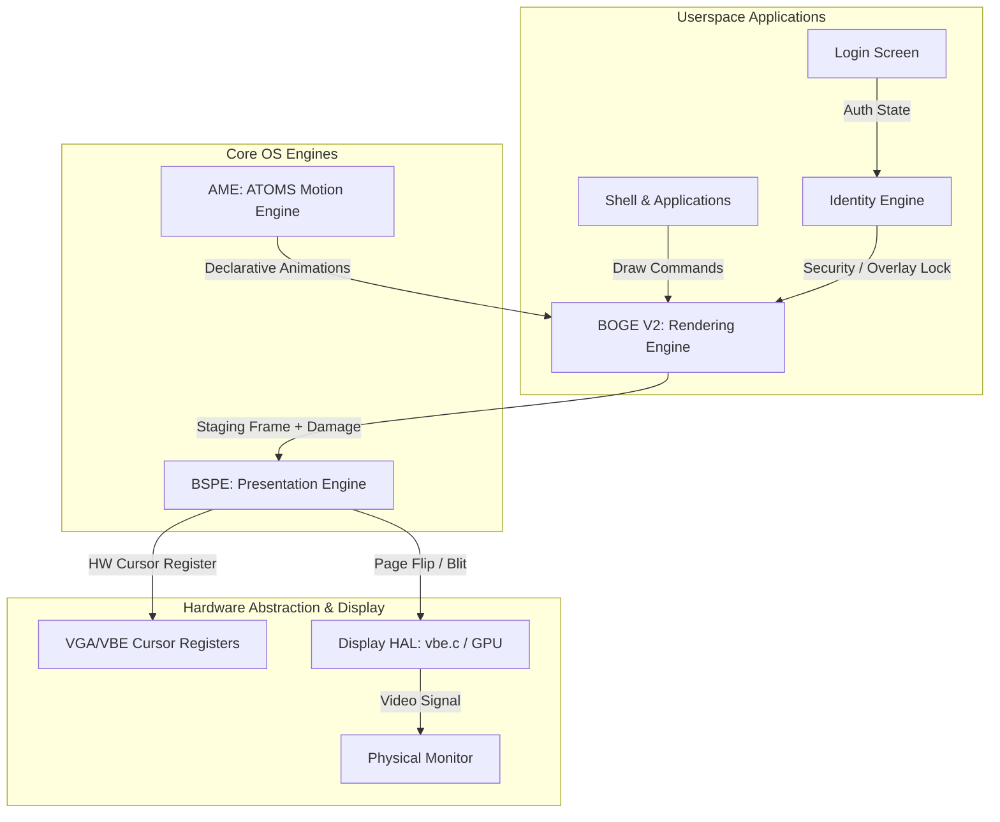
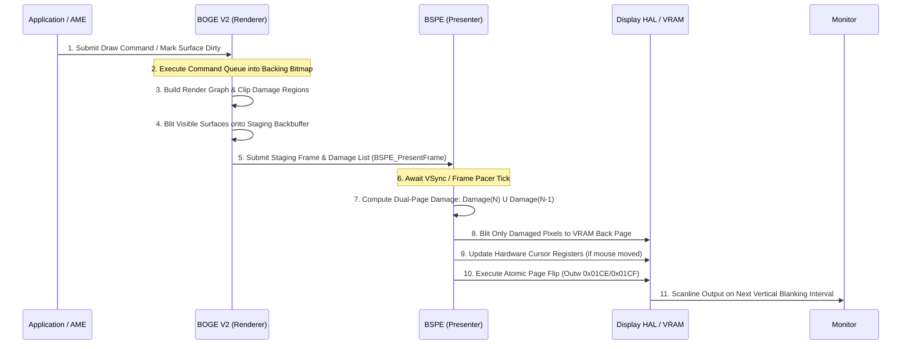

# 01. Engine Overview: BOGE V2 & BSPE Architecture

> **Module:** Core Architectural Specification  
> **Status:** Phase 0 Frozen  
> **Design Parity:** Windows DWM / DXGI, Wayland Compositor, Apple Quartz  

---

## 1. Purpose

The purpose of this specification is to establish the structural boundary between **rendering** and **presentation** in ATOMS OS. In BOGE V1, rendering, window clipping, cursor drawing, and VRAM memory copying were conflated within a single synchronous loop (`BWE_ComposeFrame`). This led to severe CPU stalling and memory bus saturation.

To achieve modern OS graphics performance, ATOMS OS splits the graphics stack into two distinct, specialized engines:
1. **BOGE V2 (BOS Graphics Engine V2):** The high-speed 2D rendering and compositing engine.
2. **BSPE (BOS Surface Presentation Engine):** The deterministic display presentation and swapchain engine.

---

## 2. Responsibilities & Separation of Concerns

```
┌────────────────────────────────────────────────────────────────────────────────────────────┐
│ RESPONSIBILITY MATRIX: BOGE V2 vs BSPE                                                     │
├────────────────────────────────────────────────────────────────────────────────────────────┤
│ BOGE V2 (Rendering Engine)                │ BSPE (Presentation Engine)                     │
├───────────────────────────────────────────┼────────────────────────────────────────────────┤
│ • Retained Surface Bitmap Cache           │ • Frame Pacing & VSync Synchronization         │
│ • Command Buffer & Draw Queue Execution   │ • Present Queue Management                     │
│ • Font Glyph Texture Atlas (ASCII/Unicode)│ • Dual-Page VRAM Damage History Tracking       │
│ • Image & Bitmap Pre-decoded Cache        │ • Double / Triple Buffer Swapchain Control     │
│ • Hierarchical Region Damage Clipping     │ • Hardware Cursor Plane (VGA/VBE Registers)    │
│ • 64-bit / SIMD Texture Blitting          │ • Display HAL & Video Driver Interfacing       │
│ • Staging Backbuffer Generation           │ • Asynchronous Page Flipping to VRAM           │
└───────────────────────────────────────────┴────────────────────────────────────────────────┘
```

---

## 3. Connected Engines & OS Hierarchy

BOGE V2 and BSPE operate within the core ATOMS OS kernel and userspace ecosystem, interfacing directly with **AME (ATOMS Motion Engine)** and **Identity Engine**:



---

## 4. Internal Workflow & Call Flow

When a window updates its content or an animation ticks, the two engines collaborate across a strict, unidirectional pipeline:



---

## 5. Memory Ownership & Thread Ownership

- **Memory Ownership:** BOGE V2 strictly owns all system RAM backing bitmaps (`BOGE_Surface`), font atlases, and staging buffers. BSPE strictly owns physical VRAM page allocations, swapchain metadata, and hardware cursor sprites. Neither engine accesses the other's internal memory pools without passing through formal API handles.
- **Thread Ownership:** BOGE V2 executes on the **Compositor Thread** (or asynchronously via application threads during command queue submission). BSPE executes on the high-priority **Presentation / VSync IRQ Thread**, ensuring that long rendering tasks in BOGE never stall monitor refresh cycles.

---

## 6. Future Expansion Readiness

The decoupled overview ensures immediate readiness for:
- **DirectX / Vulkan GPU Backends:** BSPE's Display HAL can swap out software VRAM blitting for GPU DMA command buffers without altering BOGE V2 surface logic.
- **Hardware Cursor Overlays:** Direct integration with hardware cursor planes eliminates 100% of mouse movement rendering overhead.
- **Multi-Monitor & HDR:** BSPE manages independent present queues and color spaces per physical display output.
