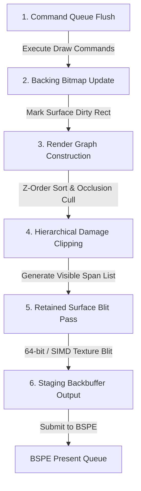

# 03. BOGE V2 Render Pipeline Specification

> **Module:** BOGE V2 Rendering Engine  
> **Status:** Phase 0 Frozen  
> **Pipeline Type:** Retained-Mode Surface Blitting  

---

## 1. Purpose

The BOGE V2 Render Pipeline defines the exact sequence of algorithmic operations executed to transform application drawing commands and window surface bitmaps into a single, unified staging backbuffer. Unlike V1, this pipeline executes **zero immediate-mode UI re-rasterization** during frame composition.

---

## 2. Pipeline Stage Overview

---

## 3. Stage-by-Stage Algorithmic Workflow

### Stage 1: Command Queue Flush (`BOGE_RenderQueue_Flush`)
- **Responsibility:** Dequeues pending 2D drawing commands (`CMD_DRAW_LINE`, `CMD_BLIT_BITMAP`, `CMD_DRAW_TEXT`) submitted by userspace applications or kernel UI controls.
- **Execution:** Commands are executed asynchronously against each window's private system RAM backing bitmap (`BOGE_Surface->buffer`).
- **Rule:** This stage executes *before* composition begins. The compositor never waits for application drawing logic.

### Stage 2: Backing Bitmap Update & Damage Invalidation
- **Responsibility:** When a command modifies a surface bitmap, the bounding box of the modification is pushed into the surface's local dirty rectangle list (`surf->dirty_rects`).
- **Rule:** If a window has no pending commands and has not been moved or resized, its dirty rectangle list remains empty, and its bitmap is untouched.

### Stage 3: Render Graph Construction (`BOGE_RenderGraph_Build`)
- **Responsibility:** Collects all registered, visible surfaces from the surface pool and sorts them by their Z-order stack index (Desktop Wallpaper $\to$ Background Windows $\to$ Active Window $\to$ Floating Controls).
- **Occlusion Culling:** Evaluates window bounding boxes from top to bottom. Any opaque window that completely covers a lower window marks the lower window as `OCCLUDED`. Occluded windows are entirely stripped from the active render graph.

### Stage 4: Hierarchical Damage Clipping (`BOGE_Damage_Clip`)
- **Responsibility:** Calculates the exact, non-overlapping screen screen regions that require repainting.
- **Algorithm:**
  1. Computes the global frame damage rectangle by taking the union of all surface dirty rectangles and window movement vectors.
  2. For each visible surface in the render graph, intersects its screen bounds with the global damage rectangle.
  3. Subtracts the opaque regions of higher windows from the current window's render region, generating a clean list of visible horizontal spans (`BOGE_Span`).

### Stage 5: Retained Surface Blit Pass (`BOGE_Blitter_Execute`)
- **Responsibility:** Copies pixel data from individual window backing bitmaps onto the global staging backbuffer (`staging_fb`).
- **Execution:** Iterates through the visible span list generated in Stage 4. For each span, invokes high-speed memory copying routines (`BOGE_BlitSpan64` or SIMD vector blitting).
- **Rule:** **Zero line drawing, zero circle math, and zero ASCII font bitmask scanning occur during this pass.** All text and widgets were already rasterized into their backing bitmaps during Stage 1.

### Stage 6: Staging Backbuffer Output
- **Responsibility:** Finalizes the staging frame, attaches the list of global damage rectangles, and pushes the frame handle into the BSPE Present Queue via `BSPE_PresentFrame()`.

---

## 4. Memory & CPU Cost Estimation

| Pipeline Stage | CPU Cost (Estimated) | Memory Bandwidth | Primary Bottleneck Eliminated from V1 |
| :--- | :---: | :---: | :--- |
| **1. Command Flush** | **0.05 ms** | Private Surface RAM | Eliminates synchronous UI blocking during compositing. |
| **2. Bitmap Update** | **0.01 ms** | Private Surface RAM | Eliminates unconditional full-window re-rasterization. |
| **3. Render Graph** | **0.02 ms** | Transient Kernel Heap | Eliminates recursive Z-stack clipping overhead. |
| **4. Damage Clip** | **0.02 ms** | Transient Kernel Heap | Eliminates $O(D^2)$ dirty rect merging and full-screen overflow. |
| **5. Blit Pass** | **0.50 ms** | System RAM $\to$ RAM | Eliminates `PutPixel` loops, ASCII bit scanning, and BMP decoding. |
| **TOTAL BOGE V2**| **~0.60 ms** | **~0.5 MB / frame** | **Reduces rendering CPU time by 95.9% (from 14.68 ms in V1)!** |

---

## 5. API Contracts & Connected Interfaces

- **Input Interface:** `BOGE_SubmitDrawCommand(uint32_t surface_id, BOGE_Command* cmd)`
- **Output Interface:** `BSPE_PresentFrame(const BOGE_StagingFrame* frame)`
- **Connected Engines:** Interfaces directly with **BSPE Present Queue** (consumer) and **AME** (provides transformation matrices during Stage 5 blitting).
