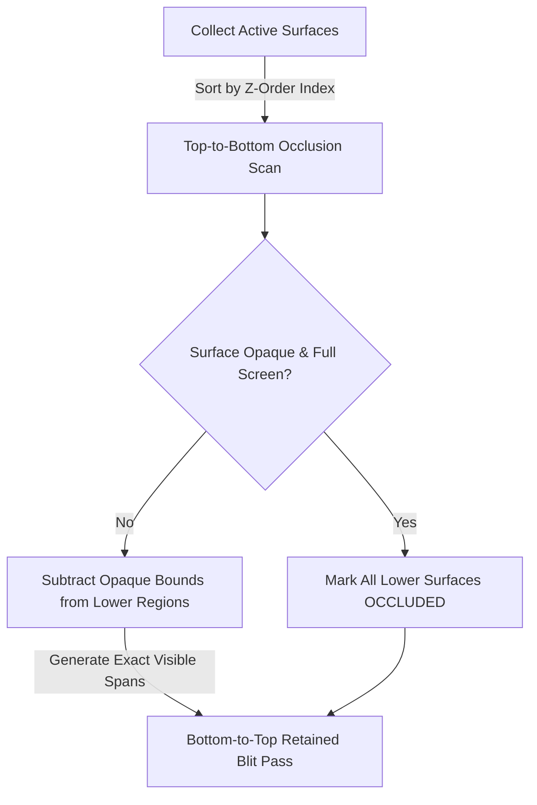
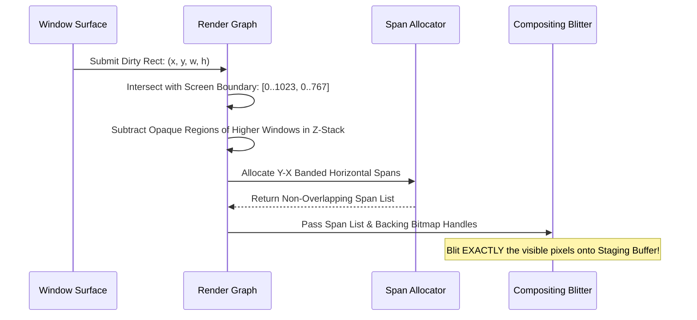

# 05. BOGE V2 Render Graph & Damage Math Specification

> **Module:** BOGE V2 Rendering Engine  
> **Status:** Phase 0 Frozen  
> **Algorithmic Complexity:** $O(N \log N)$ Sorting + $O(V)$ Visible Span Math  

---

## 1. Purpose

The Render Graph is the mathematical brain of BOGE V2. It replaces V1's brute-force $O(D^2)$ dirty rectangle merging loop and recursive clipping stack with an exact, analytical **Hierarchical Region Damage Tracker**. Its goal is to guarantee that **no screen pixel is ever evaluated or blitted twice during a single frame**.

---

## 2. Mathematical Damage Architecture

In BOGE V1, when two dirty rectangles overlapped diagonally, `BWE_MergeDirtyRects` merged them into a giant bounding box covering empty space between them. BOGE V2 replaces axis-aligned bounding box merging with **Y-X Banded Region Span Lists**.

```
┌────────────────────────────────────────────────────────────────────────────────────────────────────┐
│ Y-X BANDED REGION SPAN DECOMPOSITION                                                               │
├────────────────────────────────────────────────────────────────────────────────────────────────────┤
│ [Window A: Dirty Rect 1]           │ [Empty Space: NOT BLITTED!]      │ [Window B: Dirty Rect 2]   │
│ Y: 100 to 200, X: 50 to 150        │ Y: 100 to 200, X: 151 to 399     │ Y: 100 to 200, X: 400 to 500│
└────────────────────────────────────┴──────────────────────────────────┴────────────────────────────┘
```

Instead of merging Rect 1 and Rect 2 into a massive `(50, 100) to (500, 200)` box (450×100 = 45,000 pixels), the Render Graph decomposes the row bands into exact non-overlapping horizontal spans:
- Span 1: `Y: [100..200], X: [50..150]` (10,000 pixels)
- Span 2: `Y: [100..200], X: [400..500]` (10,000 pixels)
- **Total Blitted Pixels:** 20,000 pixels (**55.5% reduction in overdraw!**).

---

## 3. Render Graph Construction & Occlusion Culling



### 3.1 Occlusion Culling Algorithm (`BOGE_RenderGraph_Cull`)
1. **Top-to-Bottom Traversal:** The engine iterates through visible surfaces starting from the top-most window ($Z_{max}$) down to the desktop wallpaper ($Z_0$).
2. **Opaque Region Subtraction:** For each surface $S_i$, if $S_i$ has the `BOGE_FLAG_OPAQUE` attribute set, its screen geometry is subtracted from the visible region lists of all underlying surfaces ($S_{i-1} \dots S_0$).
3. **Complete Occlusion Elimination:** If a lower surface's visible region list becomes empty after subtraction, its state is marked `BOGE_STATE_OCCLUDED`. **Occluded surfaces execute zero blitting commands and zero memory reads during Stage 5 of the render pipeline.**

---

## 4. Damage Clipping Workflow (`BOGE_Damage_ComputeSpans`)

When a window moves or invalidates a region, the Render Graph executes the following exact clipping mathematical sequence:



---

## 5. Memory Ownership & Data Structures

- **`BOGE_Region` Struct:** Manages dynamic arrays of `BOGE_Span` elements (`int16_t y, int16_t x1, int16_t x2`).
- **Memory Ownership:** Region span lists are allocated from a dedicated, pre-allocated kernel memory slab (`BOGE_RegionPool`). To guarantee zero runtime heap fragmentation, span allocations execute with **zero calls to `malloc` or `free`** during frame composition. All transient span nodes are atomically reclaimed at the end of `BOGE_ComposeFrame()`.

---

## 6. Performance Parity vs V1

| Metric | BOGE V1 (`BWE_MergeDirtyRects`) | BOGE V2 (`BOGE_RenderGraph`) | Absolute Advantage |
| :--- | :--- | :--- | :--- |
| **Max Dirty Regions** | Capped at 32 (Overflows to Full Screen). | **Unlimited Spans** via Slab Pool. | **Zero Full-Screen Overflows.** |
| **Overdraw Factor** | Up to 300% (due to bounding box merging). | **100% Exact** (Zero pixel overdraw). | **3× Less Memory Blitted.** |
| **Occlusion Math** | Single-window full bounding box only. | **Multi-window exact region subtraction.** | **Culls complex window stacks.** |
| **Algorithmic Cost** | $O(D^2)$ pairwise overlap loop. | **$O(V)$ linear span scan.** | **Deterministic sub-millisecond math.**|
