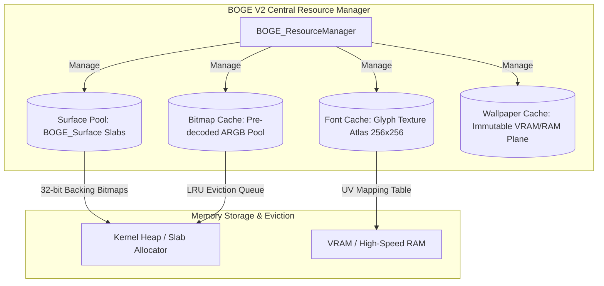

# 06. BOGE V2 Resource Manager & Cache Architecture

> **Module:** BOGE V2 Resource & Memory Management  
> **Status:** Phase 0 Frozen  
> **Allocation Model:** Slab Pooling & LRU Eviction  

---

## 1. Purpose

The BOGE V2 Resource Manager governs all graphics memory allocations across system RAM and VRAM. In V1, fonts were un-cached bitmasks, images were decoded pixel-by-pixel on every frame, and windows lacked backing bitmaps. The Resource Manager replaces ad-hoc memory access with centralized **Slab Allocators** and **LRU Texture Caches**, guaranteeing zero runtime heap fragmentation and instant resource retrieval.

---

## 2. Resource Hierarchy & Caching Engines

---

## 3. Subsystem Specifications

### 3.1 Font Cache & Glyph Atlas (`BOGE_FontAtlas`)
- **Problem Solved:** Eliminates V1's bit-by-bit ASCII array scanning (`BOVISUAL_Draw_String`, ~1.50 ms CPU cost).
- **Architecture:** Upon kernel initialization or font loading, all 128 ASCII characters (and active Unicode glyphs) are rendered **once** into a 256×256 32-bit ARGB texture atlas stored in high-speed RAM or VRAM.
- **Workflow:** When an application draws text, `BOGE_BlitGlyphString()` looks up character UV coordinates in an $O(1)$ lookup table and blits glyph spans directly into the target surface bitmap using 64-bit memory copies.

### 3.2 Bitmap & Image Cache (`BOGE_BitmapCache`)
- **Problem Solved:** Eliminates V1's uncompressed BMP pixel-by-pixel decoder (`BOVISUAL_Draw_BMP`, ~1.00 ms CPU cost).
- **Architecture:** Images (BMP, PNG, icons) loaded by applications or desktop shells are decoded **once** into uncompressed, pre-multiplied ARGB 32-bit textures.
- **LRU Eviction:** Manages a fixed memory pool (e.g. 16 MB). When texture memory is exhausted, the least recently used image is evicted. If an evicted image is requested again, it is re-decoded asynchronously.

### 3.3 Wallpaper Cache (`BOGE_WallpaperCache`)
- **Problem Solved:** Eliminates V1's CPU wallpaper copying (`Shell_DrawWallpaper`) during window compositing.
- **Architecture:** The desktop background is stored as an immutable 1024×768 ARGB texture in VRAM Page 0/1 or a dedicated GPU background plane. It is blitted only within the exact damage rectangles uncovered by moving windows.

---

## 4. Memory Ownership & Lifecycle

- **Ownership:** All cache textures and surface bitmaps are strictly owned by `BOGE_ResourceManager`. Userspace applications receive opaque handles (`uint32_t resource_id`).
- **Lifecycle:** Resources are reference-counted (`ref_count`). When a window closes or an image is released, its reference count decrements. When `ref_count == 0`, the memory block is returned immediately to the internal slab allocator without calling system `free()`.

---

## 5. API Contracts

- **Allocation API:** `uint32_t BOGE_Resource_CreateBitmap(uint32_t width, uint32_t height, const void* initial_data)`
- **Lookup API:** `const BOGE_Texture* BOGE_Resource_GetTexture(uint32_t resource_id)`
- **Release API:** `void BOGE_Resource_Release(uint32_t resource_id)`
