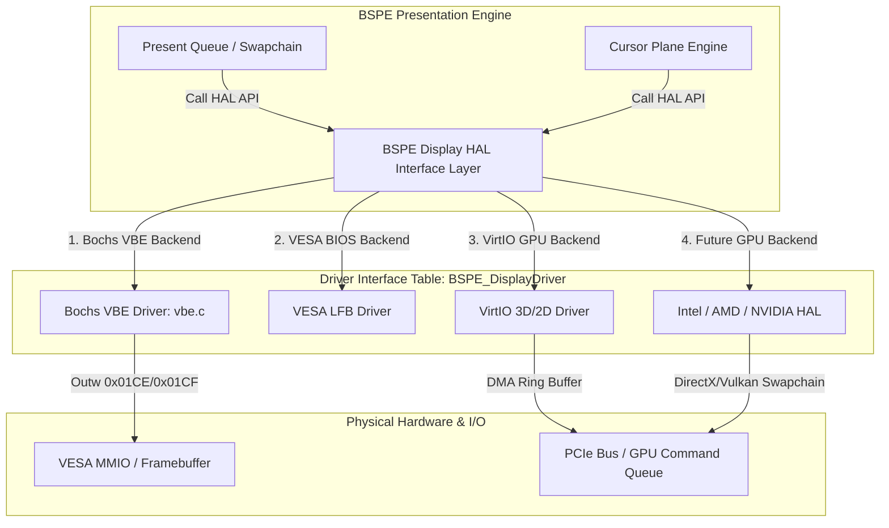

# 07. BSPE Display HAL (Hardware Abstraction Layer) Specification

> **Module:** BSPE Hardware Abstraction Layer  
> **Status:** Phase 0 Frozen  
> **Target Drivers:** Bochs VBE, Standard VGA, VESA BIOS, VirtIO GPU, Intel/AMD/NVIDIA HAL  

---

## 1. Purpose

The Display HAL decouples BSPE presentation logic from physical video hardware. In BOGE V1, compositing code directly referenced Bochs VBE global variables and hardcoded VGA I/O ports (`0x01CE` / `0x01CF`). The BSPE Display HAL establishes a formal **Driver Interface Table (`BSPE_DisplayDriver`)**, allowing ATOMS OS to seamlessly transition from software VESA page flipping to hardware GPU command buffers without altering a single line of presentation or compositing code.

---

## 2. HAL Architecture & Driver Hierarchy



---

## 3. Driver Interface Contract (`BSPE_DisplayDriver`)

Every video driver registered with ATOMS OS must implement the following standardized function pointer table:

```c
typedef struct {
    const char* driver_name;
    uint32_t max_width;
    uint32_t max_height;
    uint32_t VRAM_total_bytes;
    
    // Hardware initialization & mode setting
    bool (*init)(uint32_t width, uint32_t height, uint32_t bpp);
    void (*shutdown)(void);
    
    // Memory mapping
    void* (*get_framebuffer_base)(void);
    
    // Presentation & Page Flipping
    void (*swap_page)(uint32_t y_offset);
    void (*wait_vsync)(void);
    
    // Asynchronous VRAM Blitting (For Partial Damage Copying)
    void (*copy_rect_to_vram)(const void* src_ram, uint32_t dest_x, uint32_t dest_y, uint32_t width, uint32_t height);
    
    // Hardware Cursor Plane Controls
    bool (*cursor_set_position)(int32_t x, int32_t y);
    bool (*cursor_set_image)(const uint32_t* argb_32x32);
    void (*cursor_enable)(bool enable);
} BSPE_DisplayDriver;
```

---

## 4. Backend Specifications

### 4.1 Bochs VBE Driver Backend (`BSPE_Driver_BochsVBE`)
- **Primary Target:** ATOMS OS standard development environment (QEMU / Bochs / VirtualBox).
- **Page Flipping:** Implements `swap_page` via atomic 16-bit word writes to Bochs VGA I/O ports `0x01CE` (Index 0x09) and `0x01CF` (Y-Offset).
- **Damage Blitting:** Implements `copy_rect_to_vram` using 64-bit unrolled write-combining memory loops (`BSPE_Memcpy64_WC`).
- **Hardware Cursor:** Utilizes Bochs VGA hardware cursor registers or QEMU VBE cursor MMIO extensions, achieving **zero-cost mouse movement**.

### 4.2 Future GPU Backend Readiness (`BSPE_Driver_GPU`)
- **Command Buffer Mapping:** For VirtIO GPU or physical PCIe GPUs, `copy_rect_to_vram` maps directly to asynchronous 2D DMA transfer commands (`VIRTIO_GPU_CMD_TRANSFER_TO_HOST_2D`).
- **Page Flipping:** `swap_page` maps to GPU resource flush commands (`VIRTIO_GPU_CMD_RESOURCE_FLUSH`), allowing hardware display controllers to composite front buffers asynchronously.

---

## 5. Memory Ownership & Threading

- **Ownership:** The active `BSPE_DisplayDriver` instance owns all physical VRAM MMIO mappings and I/O port reservations. Neither BOGE V2 nor userspace apps may map VRAM addresses directly.
- **Threading:** HAL functions are invoked strictly from the high-priority BSPE Presentation Thread during VSync intervals.
