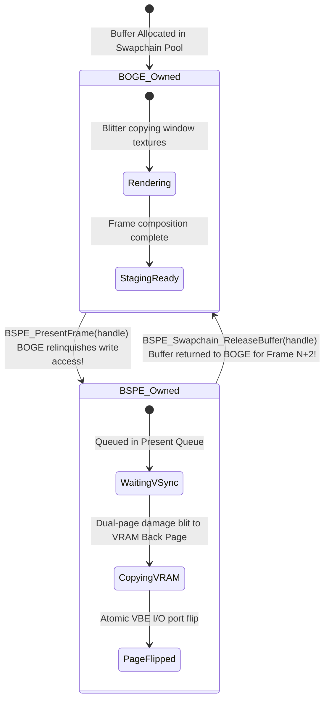

# 08. BOGE V2 & BSPE Memory Ownership Model

> **Module:** System-Wide Memory Governance  
> **Status:** Phase 0 Frozen  
> **Core Commandment:** **Zero Shared Ownership. Zero Ambiguity.**  

---

## 1. Purpose

Memory leaks, race conditions, and visual corruption in operating system window managers almost universally stem from ambiguous memory ownership between applications, rendering compositors, and video drivers. This document establishes an immutable **Memory Ownership Matrix** for ATOMS OS. Every byte of graphics memory has exactly **one** legal owner at any point in its lifecycle.

---

## 2. Memory Ownership Matrix

| Memory Resource / Buffer | Legal Owner | Storage Location | Read Access Rights | Write Access Rights | Transfer / Borrowing Rule |
| :--- | :--- | :--- | :--- | :--- | :--- |
| **Window Backing Bitmap** (`BOGE_Surface->buffer`) | **BOGE V2 Surface Manager** | System RAM (Slab Heap) | BOGE Compositor, App (via API) | App (via `BOGE_SubmitDrawCommand`) | Application never receives raw pointer; must draw via command queue or locked API map/unmap. |
| **Staging Backbuffer** (`staging_fb`) | **BOGE V2 Compositor** | System RAM / VRAM Page | BOGE Compositor, BSPE Presenter | BOGE Compositor Blitter | Handle passed to BSPE via `BSPE_PresentFrame()`. BOGE relinquishes write access until frame completes. |
| **VRAM Front Page (Page 0)** | **BSPE Swapchain** | Physical VRAM (`0x000000`) | Monitor Display Controller | **NONE (Locked by Hardware)** | Immutable while actively scanned by physical monitor. |
| **VRAM Back Page (Page 1)** | **BSPE Swapchain** | Physical VRAM (`0x300000`) | BSPE VRAM Blitter | BSPE VRAM Blitter | Written strictly during Stage 4 of BSPE Presentation Pipeline. |
| **Hardware Cursor Sprite** | **BSPE Cursor Engine** | VGA/VBE HW Registers / VRAM | Display Controller Hardware | BSPE Cursor Engine | Updated strictly via `BSPE_Cursor_SetPosition` / `SetImage`. |
| **Glyph Texture Atlas** | **BOGE V2 Font Cache** | System RAM / VRAM | BOGE Compositor Blitter | BOGE Font Builder | Read-only during frame composition; updated only upon font load. |
| **Decoded Image Cache** | **BOGE V2 Bitmap Cache** | System RAM (LRU Pool) | BOGE Compositor Blitter | BOGE Image Decoder | Read-only after decoding; managed by LRU reference counting. |
| **Desktop Wallpaper** | **BOGE V2 Wallpaper Cache**| System RAM / VRAM Plane| BOGE Compositor Blitter | Desktop Shell (on change)| Read-only during window compositing. |
| **Damage Region Spans** | **BOGE / BSPE Region Pools**| Kernel Heap Slabs | BOGE / BSPE Pipelines | BOGE / BSPE Pipelines | Allocated from static slab pools; atomically reclaimed at frame end. |

---

## 3. Buffer Borrowing & Handshake Lifecycle

To prevent race conditions between BOGE V2 rendering and BSPE presentation without using heavy mutexes, buffers transition between engines via an **Ownership Handshake Protocol**:

---

## 4. Architectural Enforcement Rules

1. **No Raw VRAM Pointers in Userspace:** Applications and kernel UI pages (`page_login.c`) shall never receive direct pointers to VRAM or global staging backbuffers. All drawing occurs inside private surface bitmaps.
2. **No Mutex Contention in Render Loop:** Because memory ownership is transferred atomically via ring buffer pointer swaps (`BSPE_PresentFrame`), the rendering and presentation loops execute with **zero mutex locking**, eliminating priority inversion and thread stalling.
3. **Zero Allocation in Compositing Pass:** All memory slabs for surfaces, spans, and staging buffers are pre-allocated during kernel boot. The compositing and presentation loops execute **zero calls to `malloc()` or `free()`**.
