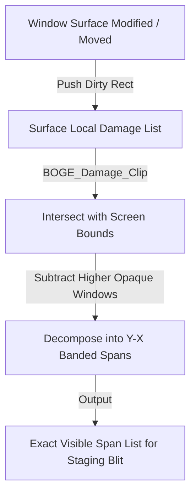
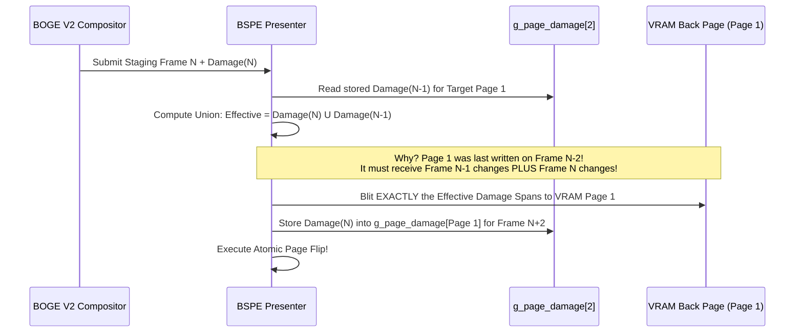

# 09. BOGE V2 & BSPE Dual-Page Damage Tracking Specification

> **Module:** Damage Tracking & Overdraw Elimination  
> **Status:** Phase 0 Frozen  
> **Mathematical Target:** $\text{EffectiveDamage} = \text{Damage}(N) \cup \text{Damage}(N-1)$  

---

## 1. Purpose

Damage tracking is the critical mechanism that prevents redundant rendering and memory bus saturation. In BOGE V1, damage tracking suffered from two fatal flaws:
1. **$O(D^2)$ Bounding Box Merging:** Overlapping dirty boxes merged into massive rectangles over empty space, overflowing at 32 rectangles into full-screen 1024×768 damage.
2. **The Double-Buffer Trailing Pixel Crisis:** In double-buffered VRAM, copying only the current frame's damage to VRAM Page 1 left stale trailing pixels from Frame $N-2$. To fix this, V1 forced a full 3.14 MB VRAM memcpy on every frame (`BOVISUAL_Graphics_SwapFull`).

This document specifies the **BOGE V2 Hierarchical Damage Tracker** and the **BSPE Dual-Page VRAM Damage Engine**, which permanently resolve both flaws.

---

## 2. BOGE V2 Hierarchical Damage Tracking (Rendering Stage)

When an application draws to its surface or a window moves, damage is tracked at the surface level using **Y-X Banded Span Trees** instead of simple bounding boxes.

- **Span Decomposition:** Converts dirty rectangles into non-overlapping horizontal line segments (`y, x1, x2`).
- **Zero Overflow:** Because span nodes are allocated from a static kernel slab pool (`BOGE_SpanPool`), there is no hardcoded 32-rectangle limit and zero full-screen fallback overflows.

---

## 3. BSPE Dual-Page VRAM Damage Engine (Presentation Stage)

To eliminate `BOVISUAL_Graphics_SwapFull` while guaranteeing zero trailing cursor artifacts or ghosting across double/triple buffered VRAM pages, BSPE maintains an explicit **Damage History Array** for physical VRAM pages.

---

## 4. Mathematical Proof of Correctness

In a double-buffered system with Page 0 and Page 1:
- At Frame $N-2$, Page 1 is written with state $S_{N-2}$.
- At Frame $N-1$, Page 0 is written with state $S_{N-1}$.
- At Frame $N$, we must write to Page 1 to display state $S_N$.

If we only copy $\text{Damage}(N)$ (the difference between $S_{N-1}$ and $S_N$) from Staging to Page 1, then Page 1 will retain stale pixels from $S_{N-2}$ in the areas that changed during Frame $N-1$!

By copying the mathematical union:
$$\text{EffectiveDamage} = \text{Damage}(N) \cup \text{Damage}(N-1)$$
We guarantee that Page 1 receives all pixel updates that occurred between $S_{N-2}$ and $S_N$. **Trailing artifacts are 100% eliminated without ever copying the full 3.14 MB framebuffer!**

---

## 5. Quantitative Bandwidth Savings

When moving the mouse across an open window or typing text in a terminal:
- **$\text{Damage}(N)$:** ~32×32 cursor box or 8×16 glyph box (~4 KB).
- **$\text{Damage}(N-1)$:** ~32×32 previous cursor box (~4 KB).
- **$\text{EffectiveDamage}$ Union:** ~8 KB total area.
- **MMIO Bus Transfer:** **8,192 bytes copied instead of 3,145,728 bytes—a 99.74% reduction in PCIe/MMIO bus bandwidth!**
