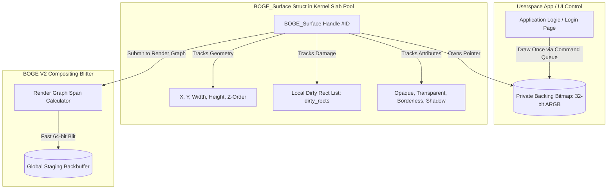

# 10. BOGE V2 Retained Surface System Specification

> **Module:** BOGE V2 Surface & Window Management  
> **Status:** Phase 0 Frozen  
> **Design Model:** Retained Backing Bitmaps (Windows DWM / Wayland Parity)  

---

## 1. Purpose

The Surface System is the structural foundation of BOGE V2. In V1, windows and UI widgets (`BWE_Window`, `BOSurface`) were mere coordinate boundaries without backing texture storage. Whenever a window was touched by a dirty rectangle, its `on_render` callback executed from scratch, re-drawing lines, fills, and ASCII text directly onto the global backbuffer. 

BOGE V2 replaces immediate-mode callbacks with **Retained Backing Bitmaps (`BOGE_Surface`)**. Every window renders its contents **once** into its private memory buffer; the compositor simply blits these buffers during frame generation.

---

## 2. Retained Surface Architecture (`BOGE_Surface`)



---

## 3. Surface Data Structure Contract

Every window, desktop widget, and top-level UI element is represented by the following standardized kernel structure:

```c
typedef struct BOGE_Surface {
    uint32_t surface_id;
    uint32_t owner_process_id;
    
    // Spatial Geometry & Z-Order Stack Position
    int32_t x;
    int32_t y;
    uint32_t width;
    uint32_t height;
    uint32_t z_order;
    
    // Retained Backing Bitmap Buffer (Allocated in System RAM or VRAM Slab)
    uint32_t* buffer;
    uint32_t pitch;
    uint32_t bpp; // Always 32 (ARGB) in V2.0
    
    // Surface Attributes & State Flags
    uint32_t flags; // BOGE_SURFACE_OPAQUE, BOGE_SURFACE_TRANSPARENT, BOGE_SURFACE_HIDDEN
    uint32_t alpha_opacity; // 0x00 (Transparent) to 0xFF (Opaque) for AME fading
    
    // Local Damage Tracking (Regions inside this window that changed since last frame)
    BOGE_Rect dirty_rects[BOGE_MAX_SURFACE_DAMAGE];
    uint32_t dirty_count;
    bool is_dirty;
    
    // Reference Counting & Lifecycle
    uint32_t ref_count;
} BOGE_Surface;
```

---

## 4. Retained Rendering Workflow vs V1

```
┌────────────────────────────────────────────────────────────────────────────────────────────────────┐
│ IMMEDIATE-MODE (V1) vs RETAINED-MODE (V2) EXECUTION COMPARISON                                     │
├────────────────────────────────────────────────────────────────────────────────────────────────────┤
│ BOGE V1 (Immediate-Mode Re-rasterization):                                                         │
│ [Mouse Moves 1px] ──► [Compositor Marks Window Dirty] ──► [Calls win->on_render()]                 │
│                   ──► [CPU Re-draws Lines, Boxes, Text Strings onto ram_fb] (4.20 ms CPU cost!)    │
├────────────────────────────────────────────────────────────────────────────────────────────────────┤
│ BOGE V2 (Retained Backing Bitmap Blitting):                                                        │
│ [App Draws Button]──► [Renders ONCE into BOGE_Surface->buffer] ──► [Surface Marked Clean]          │
│ [Mouse Moves 1px] ──► [Compositor Reads Cached Bitmap] ──► [Fast 64-bit Blit to Staging] (0.05 ms!)│
└────────────────────────────────────────────────────────────────────────────────────────────────────┘
```

---

## 5. Memory Allocation & Slab Pooling

To guarantee zero heap runtime fragmentation during window opening and closing:
- Surfaces are allocated from a static kernel slab pool: `g_surface_pool[BOGE_MAX_SURFACES]` (256 slots).
- Backing bitmaps (`buffer`) are allocated from `BOGE_SurfaceMemoryPool`, a dedicated 16 MB kernel memory slab divided into power-of-two block sizes (e.g. 64 KB, 256 KB, 1 MB).
- **Rule:** Closing a window returns its bitmap block instantly to the slab free-list. **Zero calls to `malloc()` or `free()` occur during surface lifecycle transitions.**

---

## 6. Public Surface API Contract

- `uint32_t BOGE_Surface_Create(uint32_t width, uint32_t height, uint32_t flags)`
- `void BOGE_Surface_Destroy(uint32_t surface_id)`
- `bool BOGE_Surface_SetBounds(uint32_t surface_id, int32_t x, int32_t y, uint32_t width, uint32_t height)`
- `bool BOGE_Surface_SetOpacity(uint32_t surface_id, uint8_t opacity)`
- `void* BOGE_Surface_LockBuffer(uint32_t surface_id, uint32_t* out_pitch)`
- `void BOGE_Surface_UnlockBufferAndInvalidate(uint32_t surface_id, BOGE_Rect dirty_rect)`
