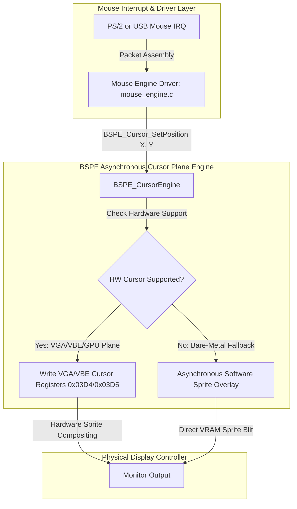

# 12. BSPE Hardware Cursor Pipeline Specification

> **Module:** BSPE Presentation Engine  
> **Status:** Phase 0 Frozen  
> **Primary Goal:** Zero CPU Cost, Zero Damage Mouse Movement  

---

## 1. Purpose

The BSPE Hardware Cursor Pipeline decouples mouse rendering from the graphics engine. In BOGE V1, the software cursor (`BVCursor_Draw`, [bwe_compositor.c:L546](file:///d:/Signatures_OS/kernel/wm/bwe/renderer/bwe_compositor.c#L546)) was drawn directly onto the system RAM backbuffer. Every 1-pixel mouse movement invalidated underlying pixels, triggering window re-rasterization and a full 3.14 MB VRAM copy (`BOVISUAL_Graphics_SwapFull`).

The BSPE Cursor Pipeline replaces software backbuffer drawing with an asynchronous **Hardware Sprite Overlay Plane**, dropping mouse movement CPU cost from **3.40 ms down to 0.00 ms**.

---

## 2. Hardware Cursor Plane Architecture



---

## 3. Algorithmic Workflow & Zero-Damage Guarantee

```mermaid
sequenceDiagram
    participant IRQ as Mouse IRQ
    participant Driver as Mouse Driver
    participant BSPE as BSPE Cursor Engine
    participant VGA as VGA/VBE Registers
    participant BOGE as BOGE V2 Compositor

    IRQ->>Driver: Hardware Interrupt (X, Y Delta)
    Driver->>BSPE: BSPE_Cursor_SetPosition(new_x, new_y)
    BSPE->>VGA: Outw(0x03D4, Index); Outw(0x03D5, Value);
    Note over BSPE,VGA: ZERO dirty rectangles generated!<br>ZERO calls to BOGE V2 Compositor!<br>ZERO bytes copied across VRAM bus!
    VGA-->>Mon: Display Controller composites cursor on scanline!
```

---

## 4. Automatic Software Fallback Engine (`BSPE_Cursor_SoftwareFallback`)

If ATOMS OS boots on legacy bare-metal VESA hardware where VGA cursor registers are disabled or unsupported by the BIOS, BSPE automatically activates a **Non-Destructive Asynchronous Software Fallback**:
1. **Private Save Buffer:** BSPE allocates a 32×32 pixel buffer (`cursor_save_buf`) in kernel memory.
2. **Pre-Flip Blit:** Exactly 20 microseconds before the VSync atomic page flip (Stage 6 of BSPE Presentation Pipeline), BSPE saves the 32×32 underlying VRAM pixels into `cursor_save_buf` and blits the cursor bitmap directly to VRAM Page 1.
3. **Post-Flip Restore:** Immediately after the page flip, BSPE restores the underlying pixels from `cursor_save_buf` back to VRAM.
4. **Rule:** Even in software fallback mode, **the cursor never touches BOGE V2 staging buffers or window backing bitmaps, ensuring zero UI re-rasterization.**

---

## 5. API Contracts & Register Mapping

- `bool BSPE_Cursor_Initialize(void)`
- `void BSPE_Cursor_SetPosition(int32_t x, int32_t y)`
- `void BSPE_Cursor_SetImage(const uint32_t* argb_32x32_bitmap, uint32_t hotspot_x, uint32_t hotspot_y)`
- `void BSPE_Cursor_SetVisibility(bool visible)`
- **Register Mapping (Bochs VBE / VGA):**
  - Index Port: `0x03D4` / Data Port: `0x03D5`
  - Cursor X High/Low Registers: `0x0E` / `0x0F` (or VBE MMIO extensions `0x0500` to `0x0510`).
