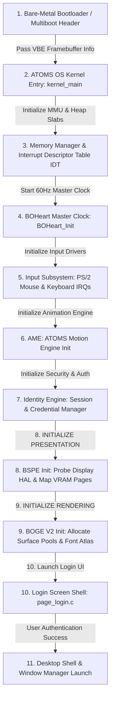

# 13. ATOMS OS Boot & Initialization Flow Specification

> **Module:** Core System Initialization  
> **Status:** Phase 0 Frozen  
> **Sequence Type:** Deterministic Engine Boot Chain  

---

## 1. Purpose

To prevent initialization race conditions and ensure clean dependency injection, this document specifies the exact sequential boot flow of ATOMS OS from raw bare-metal kernel execution up to the interactive desktop environment. It explicitly defines the startup boundary where **BOGE V2** and **BSPE** assume control of the display hardware.

---

## 2. Complete OS Boot Sequence Diagram

---

## 3. Stage-by-Stage Initialization Details

### Stage 1–5: Core Kernel & Master Clock Setup
- The kernel initializes memory paging, interrupt tables, and the **BOHeart** 60 Hz programmable interval timer (PIT).
- PS/2 and USB input event ring buffers are initialized with lock-free single-producer/single-consumer semantics.

### Stage 6–7: AME & Identity Engine Startup
- **AME** initializes its interpolation tables and animation curve evaluators.
- **Identity Engine** loads encrypted user profiles and locks down userspace execution until authentication succeeds.

### Stage 8: BSPE Presentation Engine Startup (`BSPE_Initialize`)
- **Action:** Probes the Multiboot VBE framebuffer structure (`boot_info->vbe_framebuffer`).
- **Driver Binding:** Selects the appropriate Display HAL backend (`BSPE_Driver_BochsVBE` or `BSPE_Driver_VESA`).
- **VRAM Mapping:** Maps VRAM Page 0 (`0x000000`) and VRAM Page 1 (`0x300000`) into kernel virtual address space using Write-Combining (`PAGE_PWT | PAGE_PCD`) MMIO page attributes.
- **Hardware Cursor Init:** Uploads the default 32×32 arrow sprite to Bochs VGA cursor registers and enables the hardware overlay plane.

### Stage 9: BOGE V2 Rendering Engine Startup (`BOGE_Initialize`)
- **Action:** Allocates the static surface pool (`g_surface_pool`) and region span memory slabs (`BOGE_SpanPool`).
- **Font Atlas Generation:** Reads the raw `font8x16.h` ASCII bitmasks and renders them into an immutable 256×256 32-bit ARGB texture atlas in high-speed system RAM.
- **Wallpaper Cache Init:** Decodes the default system wallpaper BMP into `BOGE_WallpaperCache`.

### Stage 10–11: Userspace Shell Handover
- The kernel invokes `LoginShell_Start()`. The login screen creates three retained surfaces (Background Wallpaper, Login Box Panel, and HUD Diagnostics) via `BOGE_Surface_Create()` and submits its initial drawing commands.
- BOGE V2 generates the first staging frame and passes it to BSPE. BSPE executes the first atomic VRAM page flip, displaying the login screen with zero visual flickering or tearing.
