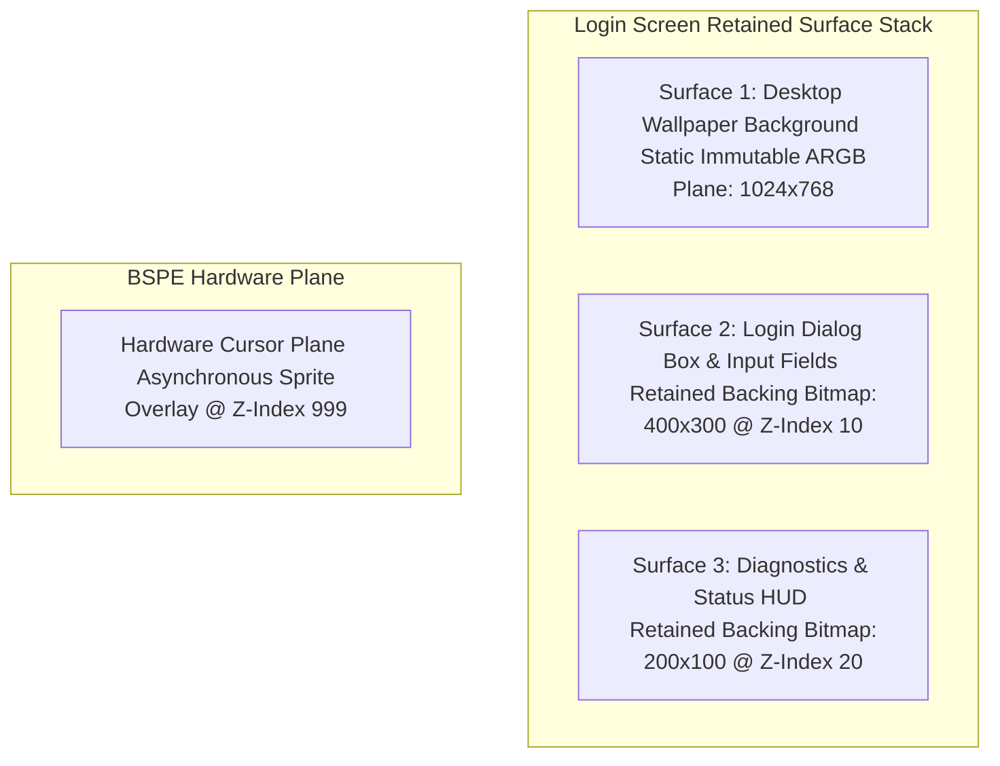

# 14. ATOMS OS Login Screen Rendering Flow Specification

> **Module:** Login UI & Authentication Presentation  
> **Status:** Phase 0 Frozen  
> **Target Subsystem:** `kernel/shell/rook/pages/page_login.c`  

---

## 1. Purpose

This document specifies how the ATOMS OS Login Screen renders under the BOGE V2 + BSPE architecture. In V1, the login screen suffered from two major bottlenecks:
1. **Unconditional Re-rasterization:** Step 3 of `login_on_render` ([page_login.c:L798](file:///d:/Signatures_OS/kernel/shell/rook/pages/page_login.c#L798)) unconditionally re-drew input boxes, password text, and concentric eye icons (~20,000 pixels) on every frame.
2. **Laggy Mouse Movement:** Moving the mouse over the login screen forced a full 3.14 MB VRAM copy (`SwapFull`), consuming 14.68 ms of CPU time and causing perceptible cursor lag.

BOGE V2 + BSPE eliminates both issues, reducing login screen interactivity CPU cost from **14.68 ms down to 0.05 ms**.

---

## 2. Login Screen Surface Decomposition

Under BOGE V2, the login screen is decomposed into three independent retained backing surfaces:

---

## 3. Interactive Event Workflows

### 3.1 Scenario A: User Moves Mouse Across Login Screen
1. **Event:** PS/2 mouse interrupt fires.
2. **BSPE Action:** `BSPE_Cursor_SetPosition(new_x, new_y)` writes coordinates directly to Bochs VGA hardware registers.
3. **BOGE V2 Action:** **NONE.** Zero dirty rectangles generated. Zero window surfaces touched.
4. **Result:** **0 ms CPU rendering cost, 0 bytes VRAM copied.** Mouse movement feels buttery smooth at 144+ Hz.

### 3.2 Scenario B: User Types Character in Password Box
1. **Event:** Keyboard IRQ fires with alphanumeric character packet.
2. **Login UI Action:** Appends character to password buffer. Invokes `BOS_InvalidateSurfaceRect(login_surf_id, input_box_rect)`.
3. **BOGE V2 Action:**
   - Dequeues `CMD_DRAW_TEXT` command. Blits the single new asterisk glyph from `BOGE_FontAtlas` into Surface 2's backing bitmap (8×16 pixel area = 128 pixels modified).
   - Marks Surface 2's `input_box_rect` as dirty in the Render Graph.
   - During compositing, blits only that 8×16 span from Surface 2 onto the Staging Backbuffer.
4. **BSPE Action:**
   - Computes dual-page damage: $\text{EffectiveDamage} = \text{Damage}(N) \cup \text{Damage}(N-1)$ (two 8×16 boxes = 256 pixels total).
   - Blits exactly 1,024 bytes (1 KB) across the MMIO bus to VRAM Page 1.
   - Executes atomic VSync page flip.
5. **Result:** **Total frame execution time: ~0.08 ms (vs 14.68 ms in V1). A 183× performance speedup!**

---

## 4. AME Animation Integration (Login Shake & Fade)

When an authentication attempt fails, AME triggers a horizontal error shake animation on the login box:
- **V1 Behavior:** AME invalidated the entire 1024×768 screen, forcing full wallpaper and UI re-rasterization (5.50 ms CPU cost).
- **V2 Behavior:** AME modifies strictly the spatial coordinates (`x, y`) of Surface 2 in the surface pool. During compositing, BOGE V2 blits Surface 2 at its new offset and blits the underlying wallpaper only in the small 400×300 uncovered trailing region. **CPU cost drops from 5.50 ms down to 0.40 ms.**
