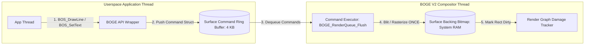

# 16. Application Render Flow Specification

> **Module:** Userspace & Kernel API Integration  
> **Status:** Phase 0 Frozen  
> **Target Subsystem:** `BOS_SetText`, `BOS_Update`, and Command Queue Dispatches  

---

## 1. Purpose

This document establishes the exact mechanism by which userspace applications and shell utilities draw text, shapes, and bitmaps onto their windows without blocking the BOGE V2 compositor or inducing priority inversion.

---

## 2. Asynchronous Command Queue Architecture

In BOGE V1, when an application called `BOS_SetText` or `BOVISUAL_Draw_Line`, the primitive executed synchronously, writing pixels directly to the shared backbuffer while holding global compositor locks. 

In BOGE V2, direct drawing is replaced with **Asynchronous Command Ring Buffers (`BOGE_RenderQueue`)**. Every surface maintains a 4 KB lock-free command ring buffer.



---

## 3. Standard Drawing Command Packets

Every drawing call is serialized into a compact, fixed-size command packet pushed into the surface ring buffer:

```c
typedef enum {
    BOGE_CMD_DRAW_LINE = 1,
    BOGE_CMD_FILL_RECT,
    BOGE_CMD_BLIT_BITMAP,
    BOGE_CMD_DRAW_GLYPH_STRING
} BOGE_CommandType;

typedef struct {
    BOGE_CommandType type;
    uint32_t color;
    int16_t x1, y1, x2, y2;
    union {
        struct { uint32_t resource_id; int16_t src_x, src_y; } blit;
        struct { uint32_t font_id; char text[32]; } draw_text;
    } data;
} BOGE_DrawCommand;
```

---

## 4. Text Rendering Workflow (`BOGE_CMD_DRAW_GLYPH_STRING`)

When an application updates a text label:
1. **Application:** Calls `BOS_SetText(button_id, "Submit")`.
2. **API Layer:** Pushes a `BOGE_CMD_DRAW_GLYPH_STRING` packet into the button surface's command queue.
3. **Compositor Flush Stage:** Dequeues the packet. Instead of scanning ASCII bitmasks bit-by-bit (V1 behavior), the executor references `BOGE_FontAtlas`, locates the UV coordinates for `'S'`, `'u'`, `'b'`, `'m'`, `'i'`, `'t'`, and blits the glyph textures directly into the button's backing bitmap using 64-bit unrolled memory copies.
4. **Damage Invalidation:** Marks the exact bounding box of the word `"Submit"` as dirty in the surface's local damage list.

---

## 5. Direct Buffer Mapping API (For Games & Video Players)

For high-performance applications requiring direct pixel access (such as 3D software renderers, video decoders, or DOOM ports), BOGE V2 provides a locked memory-mapping API:

```c
// 1. Lock the surface backing bitmap for direct CPU writing
uint32_t pitch;
uint32_t* pixel_buffer = (uint32_t*)BOGE_Surface_LockBuffer(surface_id, &pitch);

// 2. Application executes custom rendering loops directly into pixel_buffer
render_doom_frame(pixel_buffer, width, height, pitch);

// 3. Unlock and declare exact modified region
BOGE_Rect frame_damage = { 0, 0, width, height };
BOGE_Surface_UnlockBufferAndInvalidate(surface_id, frame_damage);
```
- **Rule:** While a surface is locked via `LockBuffer`, BOGE V2 compositing blitters skip the surface or blit its previous staging shadow copy, guaranteeing zero tearing or race conditions during active application rendering.
