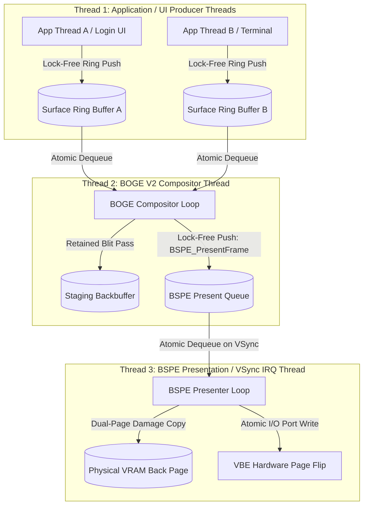

# 18. ATOMS OS Thread Model & Concurrency Specification

> **Module:** Kernel & Engine Concurrency  
> **Status:** Phase 0 Frozen  
> **Synchronization Model:** Lock-Free Ring Buffers & Atomic Memory Barriers  

---

## 1. Purpose

In BOGE V1, rendering, input pumping, window clipping, and VRAM page copying executed within a single, synchronous kernel thread (`BOHeart_Pulse`). Long rendering tasks directly stalled mouse input processing and delayed VRAM page flips.

This specification establishes a **Tri-Thread Concurrency Model** for ATOMS OS. By decoupling application producers, the rendering consumer, and the presentation pacer into independent execution threads, ATOMS OS guarantees that **rendering spikes never block display presentation or input responsiveness**.

---

## 2. Tri-Thread Concurrency Architecture

---

## 3. Thread Specifications & Priorities

### 3.1 Application / UI Producer Threads (Normal Kernel/User Priority)
- **Execution Scope:** Executes application logic, UI event handlers, and drawing command submissions (`BOS_SetText`, `BOS_Update`).
- **Rule:** Never executes compositing math or VRAM copying. Communicates strictly by pushing drawing command packets into private surface ring buffers.

### 3.2 BOGE V2 Compositor Thread (High Kernel Priority)
- **Execution Scope:** Wakes up when surface dirty flags are asserted or when AME ticks. Dequeues drawing commands, constructs the Render Graph, and blits visible spans onto the Staging Backbuffer.
- **Rule:** Never blocks waiting for monitor refresh cycles. As soon as a staging frame is pushed into the BSPE Present Queue, the Compositor Thread immediately begins rendering Frame $N+1$ (in Triple Buffer mode) or enters an idle sleep state.

### 3.3 BSPE Presentation Thread (Real-Time VSync IRQ Priority)
- **Execution Scope:** Driven directly by monitor Vertical Blanking Interval interrupts (VSync IRQ) or precision multimedia timers.
- **Rule:** Has the highest execution priority in the graphics stack. Dequeues completed staging frames, computes dual-page damage math, copies damaged pixels across the MMIO bus, updates hardware cursor registers, and executes atomic I/O port page flips.

---

## 4. Synchronization & Lock-Free Contracts

To eliminate priority inversion, deadlocks, and mutex contention:
1. **Single-Producer / Single-Consumer (SPSC) Ring Buffers:** Command queues and the BSPE Present Queue utilize lock-free circular ring buffers synchronized via atomic head/tail index CAS (`__sync_val_compare_and_swap` or C11 `stdatomic.h`) instructions.
2. **Atomic Memory Barriers:** Before BOGE V2 pushes a staging frame handle into the Present Queue, it executes a full memory release barrier (`__atomic_thread_fence(__ATOMIC_RELEASE)`), guaranteeing that all blitted pixels are visible to the BSPE CPU core before presentation begins.
3. **Zero Mutex Rule:** The rendering and presentation loops execute **zero mutex lock/unlock operations** during active frame composition and VRAM copying.
