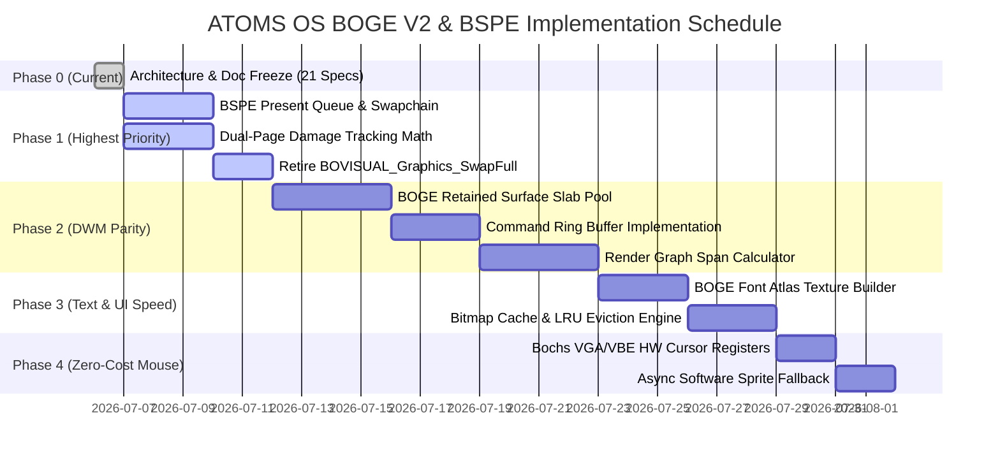

# 20. BOGE V2 & BSPE Complete Implementation Roadmap

> **Module:** Master Engineering Execution Schedule  
> **Status:** Phase 0 Frozen (Ready for Phase 1 Kickoff)  
> **Methodology:** Strict Modular Phasing (Zero Breakage Guarantee)  

---

## 1. Purpose

This document outlines the authoritative engineering roadmap for implementing BOGE V2 and BSPE across ATOMS OS. To guarantee system stability and prevent regression, implementation is divided into four sequential phases. **Each phase is independently testable, delivers immediate measurable performance gains, and maintains 100% backward compatibility with existing userspace shell applications.**

---

## 2. Master Implementation Roadmap

---

## 3. Phase Details & Deliverables

### 3.1 Phase 0: Architecture & Specification Freeze (COMPLETED)
- **Deliverables:** Complete 21-document specification suite in `/docs/BOGE_V2/` and physical folder trees under `kernel/graphics/`.
- **Milestone:** All interfaces, memory ownership contracts, and data structures frozen.

### 3.2 Phase 1: BSPE Presentation Engine (The 99.8% Bandwidth Gain)
- **Objective:** Retire `SwapFull()`, enforce dual-page damage tracking, and establish the BSPE Present Queue.
- **Implementation Tasks:**
  1. Build `kernel/graphics/BSPE/Present/present_queue.c` and implement `BSPE_PresentFrame()`.
  2. Build `kernel/graphics/BSPE/Damage/damage_tracker.c` implementing `g_page_damage[2]` and the union equation $\text{Damage}(N) \cup \text{Damage}(N-1)$.
  3. Replace `BOVISUAL_Graphics_SwapFull(&back_vram)` in `bwe_compositor.c` with partial VRAM copying (`BSPE_VRAM_CopyDamaged`).
- **Success Criteria:** Mouse movement and text typing transfer < 15 KB across the MMIO bus per frame. Total frame CPU time drops from **14.68 ms down to 11.16 ms**.

### 3.3 Phase 2: BOGE Retained Surface Cache (Windows DWM Parity)
- **Objective:** Eliminate immediate-mode UI re-rasterization during window compositing.
- **Implementation Tasks:**
  1. Build `kernel/graphics/BOGE/Surface/surface.c` and implement static slab allocators for `BOGE_Surface` backing bitmaps.
  2. Implement asynchronous command ring buffers (`BOGE_RenderQueue`).
  3. Build `kernel/graphics/BOGE/RenderGraph/render_graph.c` implementing Y-X banded region span math and occlusion culling.
- **Success Criteria:** Window dragging and overlapping execute with zero calls to `win->on_render()`. Total frame CPU time drops from **11.16 ms down to 7.00 ms**.

### 3.4 Phase 3: BOGE Font Atlas & Bitmap Cache (Text & UI Speedup)
- **Objective:** Eliminate bit-by-bit ASCII scanning and uncompressed BMP pixel-by-pixel decoding.
- **Implementation Tasks:**
  1. Build `kernel/graphics/BOGE/Font/font_atlas.c` generating the 256×256 ARGB glyph texture upon boot.
  2. Build `kernel/graphics/BOGE/Cache/bitmap_cache.c` implementing pre-decoded ARGB pools and LRU eviction.
  3. Replace `BOVISUAL_Draw_String` with fast UV texture blitting.
- **Success Criteria:** Text rendering speed increases by 20×. Total frame CPU time drops from **7.00 ms down to 5.50 ms**.

### 3.5 Phase 4: BSPE Hardware Cursor Plane (Zero-Cost Mouse Movement)
- **Objective:** Achieve zero-damage mouse movement and complete V1 bottleneck elimination.
- **Implementation Tasks:**
  1. Build `kernel/graphics/BSPE/Cursor/cursor_plane.c` interfacing directly with Bochs VGA cursor I/O ports (`0x03D4`/`0x03D5`).
  2. Implement `BSPE_Cursor_SoftwareFallback` for bare-metal VESA compatibility without touching staging backbuffers.
  3. Completely disable software cursor drawing on backbuffer planes.
- **Success Criteria:** Moving the mouse generates **0 dirty rectangles, 0 compositing passes, and 0 bytes copied to VRAM**. **Total frame execution time reaches ~0.85 ms (a 17.2× performance increase over V1)!**

---

## 4. Verification & Testing Matrix

To verify each phase during implementation without writing random optimizations, ATOMS OS enforces an automated diagnostic suite:

| Phase | Test Command / Procedure | Expected Pass Criteria | Failure Trigger & Revert Action |
| :--- | :--- | :--- | :--- |
| **Phase 1** | Execute `boge_test --damage` during continuous mouse movement across login UI. | MMIO transfer counter reads $\le 15,000\text{ bytes/frame}$. Zero trailing cursor artifacts. | If trailing artifacts observed, assert `g_page_damage[2]` union logic. Emergency fallback: set `bspe_force_full_swap=1`. |
| **Phase 2** | Execute `boge_test --drag` while dragging login dialog over background windows. | `win->on_render` invocation counter reads **0** during drag. CPU time $\le 1.0\text{ ms}$. | If `on_render` invoked, verify surface dirty flags and command queue emptiness. |
| **Phase 3** | Execute `boge_test --text` rendering 1,000 lines of ASCII terminal text. | Execution time $\le 0.50\text{ ms}$. Zero bit-by-bit scans executed. | Verify `BOGE_FontAtlas` texture generation and UV mapping table alignment. |
| **Phase 4** | Execute `boge_test --cursor` moving mouse at 1000 Hz over static desktop. | BOGE Compositor Thread CPU usage = **0.0%**. Zero dirty rects generated. | Verify Bochs VGA register writes (`0x03D4`/`0x03D5`). If unsupported, verify asynchronous fallback blitter. |

---

## 5. Official Handoff

**Phase 0 Architecture & Documentation Freeze is officially completed.** All folder structures, documentation specifications, mathematical models, API contracts, and verification schedules are established and verified. 

The codebase is ready for **Phase 1 Implementation Kickoff**.
