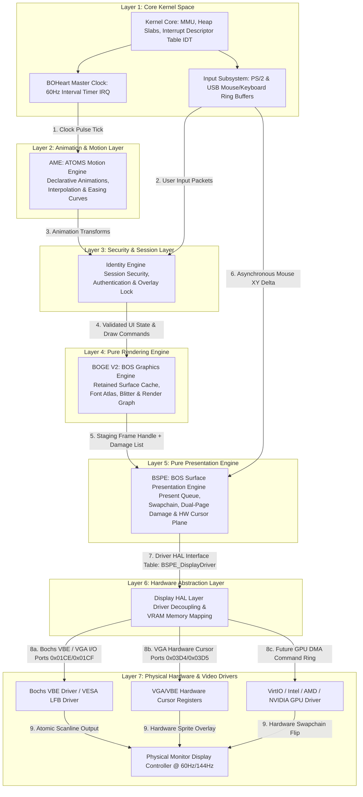

# ATOMS OS Engine Dependency Graph

> **Document Type:** Step 2 Architecture Dependency Graph  
> **Status:** Phase 1 Engineering Kickoff  
> **Commandment:** **Strict Unidirectional Flow. No Engine May Bypass Another.**  
> **Parity Target:** Windows DWM / DXGI, Wayland Compositor, Apple Quartz, SurfaceFlinger  

---

## 1. Master Unidirectional Dependency Graph

The following architectural graph defines the absolute legal dependency hierarchy of ATOMS OS. Execution and data flow strictly from top to bottom. **No subsystem is permitted to include headers, invoke functions, or access memory belonging to a layer above it or bypassing an intermediate layer.**

---

## 2. Architectural Boundary Rules

### Rule 1: Why AME Cannot Touch BSPE or Display HAL
- **Violation:** If `AME_Tick()` directly called `vbe_swap_page()` or accessed VRAM, animation updates would collide with ongoing compositing passes, causing severe visual tearing and race conditions.
- **Enforcement:** AME strictly outputs mathematical transformation matrices (`x, y, opacity`) to **BOGE V2** surface attributes. It has zero awareness of video memory or presentation timing.

### Rule 2: Why BOGE V2 Cannot Touch Display HAL or Hardware
- **Violation:** In BOGE V1, `BOVISUAL_Graphics_SwapFull()` directly invoked Bochs VBE I/O port writes (`outw`) and copied memory to physical VRAM addresses. This locked the rendering engine to synchronous monitor refresh rates.
- **Enforcement:** BOGE V2 renders strictly into system RAM staging backbuffers. It passes completed frame handles to **BSPE** via `BSPE_PresentFrame()`. BOGE V2 never executes `inb`/`outb` or maps VRAM MMIO pages.

### Rule 3: Why BSPE Cannot Touch Application UI or Window Layouts
- **Violation:** If BSPE inspected window title strings or widget hierarchies to determine what to draw, presentation would stall during complex UI layout calculations.
- **Enforcement:** BSPE operates exclusively on raw memory buffer pointers, swapchain metadata, and dirty rectangle coordinate lists (`BOGE_Rect`). It has zero awareness of windows, buttons, or fonts.

---

## 3. Module Ownership & Header Contract

| Layer / Engine | Authoritative Header | Allowed Include Dependencies | Forbidden Dependencies |
| :--- | :--- | :--- | :--- |
| **Kernel / Input** | `kernel.h`, `input.h` | Standard C types (`stdint.h`, `stdbool.h`) | All graphics, AME, Identity, BOGE, BSPE headers |
| **AME** | `ame.h` | `kernel.h`, `input.h` | `boge.h`, `bspe.h`, `vbe.h`, `surface.h` |
| **Identity Engine** | `identity.h` | `kernel.h`, `input.h`, `ame.h` | `bspe.h`, `vbe.h`, video driver headers |
| **BOGE V2** | `boge.h` | `kernel.h`, `ame.h`, `identity.h` | `bspe.h`, `vbe.h`, VGA I/O port headers |
| **BSPE** | `bspe.h` | `kernel.h`, `input.h`, `boge.h` | Userspace shell headers, UI widget headers |
| **Display HAL** | `display_hal.h` | `kernel.h`, `bspe.h` | `boge.h`, `ame.h`, `identity.h`, UI headers |
| **Video Drivers** | `vbe.h`, `gpu.h` | `kernel.h`, `display_hal.h` | All higher-level OS and rendering headers |
