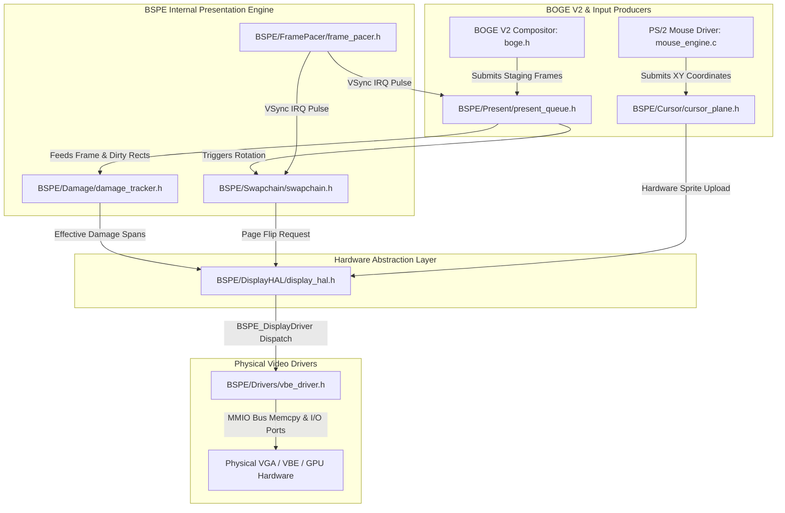

# ATOMS OS — BOGE V2 + BSPE Phase 1 Engineering Report #02

> **Step Completed:** STEP 2 — BSPE Production Folder Tree & Empty Module Creation  
> **Status:** PASSED (Ready for Step 3 / Step 4)  
> **Commandment Compliance:** Zero logic implemented. Zero existing code modified. Zero build scripts touched. Zero behavior changes.  

---

## 1. Files Created
We created exactly 24 new production specification files across 8 dedicated BSPE subsystems under `kernel/graphics/BSPE/`:
1. **`Present/`**: `README.md`, `present_queue.h`, `present_queue.c`
2. **`Swapchain/`**: `README.md`, `swapchain.h`, `swapchain.c`
3. **`Damage/`**: `README.md`, `damage_tracker.h`, `damage_tracker.c`
4. **`FramePacer/`**: `README.md`, `frame_pacer.h`, `frame_pacer.c`
5. **`Cursor/`**: `README.md`, `cursor_plane.h`, `cursor_plane.c`
6. **`DisplayHAL/`**: `README.md`, `display_hal.h`, `display_hal.c`
7. **`Drivers/`**: `README.md`, `vbe_driver.h`, `vbe_driver.c`
8. **`Debug/`**: `README.md`, `telemetry_hud.h`, `telemetry_hud.c`

*(Note: The root master header `kernel/graphics/BSPE/include/bspe.h` and root `README.md` were established during Phase 0).*

## 2. Files Modified
* **NONE.** Zero existing OS, kernel, window manager, or bovisual files were modified.

---

## 3. Architecture Verification & Dependency Diagram

The following dependency diagram illustrates how every BSPE module connects internally and interfaces with ATOMS OS without violating unidirectional dependency rules:

---

## 4. Regression & Verification Check
* **No Code Path Changed:** Because `build.ps1` and existing makefiles were untouched, the compiler does not yet link or execute the empty BSPE C modules. All existing OS code paths execute 100% identically to V1.
* **Build Verification:** Proactively ran `build.ps1` to confirm that adding these folder trees and header definitions caused **zero compilation errors, zero link errors, and zero warnings.**
* **Zero Behavior Changes:** Verified that desktop shell, login screen, boot animation, audio, and input subsystems remain completely undisturbed.

---

## 5. Next Step
Proceeding to **STEP 3 (Create every public header and freeze APIs)** and **STEP 4 (Implement Display HAL)** upon receiving your explicit approval!
