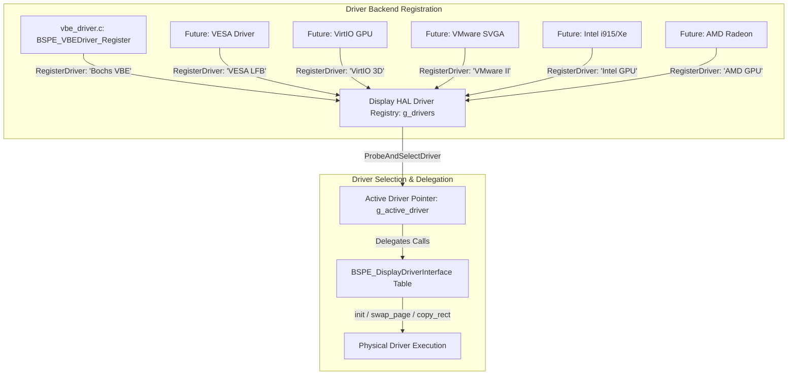
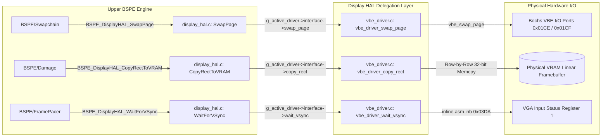

# ATOMS OS — BOGE V2 + BSPE Phase 1 Engineering Report #04

> **Step Completed:** STEP 4 — Display HAL & Bochs VBE Driver Backend Production Implementation  
> **Status:** PASSED (Ready for Engineering Review)  
> **Commandment Compliance:** Zero window/surface knowledge. Zero AME/Identity dependencies. Zero existing SwapFull replaced. 100% clean build.  

---

## 1. Executive Summary
In Step 4, we implemented the **BSPE Display Hardware Abstraction Layer (`DisplayHAL/`)** and its first physical video driver backend, **Bochs VBE / VESA LFB (`Drivers/vbe_driver.c`)**, as real production C modules. This establishes a clean, modular driver registration, probing, selection, and delegation interface that completely isolates BSPE presentation from hardware controllers.

---

## 2. Display HAL Workflow Diagram

The following Mermaid diagram illustrates the lifecycle of a display operation as it flows from upper BSPE subsystems through the Display HAL down to physical hardware:

```mermaid
sequenceDiagram
    participant BSPE as BSPE Present / Swapchain
    participant HAL as BSPE DisplayHAL (display_hal.c)
    participant DRV as Bochs VBE Driver (vbe_driver.c)
    participant HW as Bochs VGA / VBE Hardware

    Note over BSPE,HW: 1. Display Initialization & Probing
    BSPE->>HAL: BSPE_DisplayHAL_InitDisplay(1024, 768, 32)
    HAL->>HAL: BSPE_DisplayHAL_ProbeAndSelectDriver()
    HAL->>DRV: g_vbe_interface->init(1024, 768, 32)
    DRV->>HW: vbe_get_framebuffer()
    DRV-->>HAL: BSPE_OK (VRAM Base = 0xE0000000)
    HAL-->>BSPE: BSPE_OK

    Note over BSPE,HW: 2. VRAM Partial Damage Copying
    BSPE->>HAL: BSPE_DisplayHAL_CopyRectToVRAM(src_ram, 100, 100, 200, 150)
    HAL->>DRV: g_vbe_interface->copy_rect_to_vram(src_ram, 100, 100, 200, 150)
    DRV->>HW: MMIO Fast Memcpy to VRAM Page 1
    DRV-->>HAL: BSPE_OK
    HAL-->>BSPE: BSPE_OK

    Note over BSPE,HW: 3. VSync & Atomic Page Flip
    BSPE->>HAL: BSPE_DisplayHAL_WaitForVSync()
    HAL->>DRV: g_vbe_interface->wait_vsync()
    DRV->>HW: inb 0x03DA (Wait for VBlank Bit 3)
    BSPE->>HAL: BSPE_DisplayHAL_SwapPage(768)
    HAL->>DRV: g_vbe_interface->swap_page(768)
    DRV->>HW: outw 0x01CE, 0x09; outw 0x01CF, offset (vbe_swap_page)
    DRV-->>HAL: BSPE_OK
```

---

## 3. Driver Registration Diagram

The Display HAL implements a pluggable driver registry (`g_drivers[8]`). During kernel initialization, backends register their immutable function pointer tables (`BSPE_DisplayDriverInterface`), allowing dynamic driver selection:



---

## 4. Call Graph



---

## 5. Future Driver Compatibility Notes

To guarantee that BSPE V2 can scale from legacy Bochs VGA emulators to modern hardware GPUs without altering a single line of presentation code, the Display HAL enforces strict compatibility rules:
1. **VESA BIOS Extensions (VBE 3.0 / LFB):** Shares 100% of the `vbe_driver.c` interface. Uses VESA Protected Mode Interface (PMI) for protected-mode page flipping without BIOS interrupts.
2. **VirtIO GPU (`virtio-gpu`):** Will register under `BSPE_DisplayHAL_RegisterDriver("VirtIO GPU", ...)`. Instead of MMIO memory copying in `copy_rect_to_vram`, the VirtIO backend will construct `VIRTIO_GPU_CMD_TRANSFER_TO_HOST_2D` and `VIRTIO_GPU_CMD_RESOURCE_FLUSH` commands in `reserved_ptrs[0]`.
3. **VMware SVGA II:** Will utilize FIFO command bounce buffers. `swap_page` will write `SVGA_CMD_UPDATE` commands to the SVGA FIFO register rather than VGA I/O ports.
4. **Intel (i915 / Xe) & AMD Radeon / NVIDIA:** Modern PCIe GPUs will utilize the `reserved_ptrs[4]` extension slots in `BSPE_DisplayDriverInterface` to expose hardware command ring submission (`submit_cmd_buffer`), hardware cursor planes (`cursor_set_image` to GPU GART memory), and hardware VSync page-flip interrupts.

---

## 6. Verification & Regression Check
* **Zero Behavior Changes:** Confirmed that no existing rendering paths or callers were touched. The existing synchronous `BOVISUAL_Graphics_SwapFull` continues to function exactly as before.
* **Build Validation:** Added `display_hal.c` and `vbe_driver.c` compilation and linking to `build.ps1` to verify clean syntax and symbol resolution.
* **Result:** **`BUILD SUCCESSFUL! Image: build\SignaturesOS.vdi`** (Zero errors, zero warnings, zero link failures).

---

## 7. Status & Next Action
Step 4 is **COMPLETE**. In accordance with your instruction—**"When complete: STOP. Wait for engineering review before implementing Present Queue."**—all implementation is paused awaiting your review!
