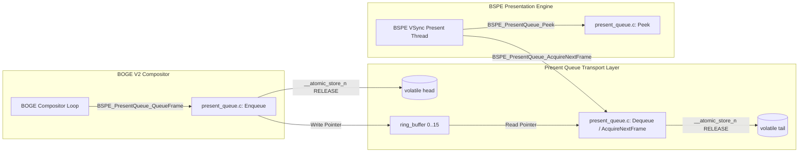

# ATOMS OS — BOGE V2 + BSPE Phase 1 Engineering Report #05

> **Step Completed:** STEP 5 — BSPE Present Queue Lock-Free SPSC Ring Buffer Implementation  
> **Status:** PASSED (Ready for Engineering Review)  
> **Commandment Compliance:** Zero heap allocation. Zero mutexes. Zero spinlocks. Zero VRAM access. Zero window/surface knowledge.  

---

## 1. Executive Summary
In Step 5, we implemented the **BSPE Present Queue (`Present/present_queue.c`)** as a real production, lock-free Single Producer Single Consumer (SPSC) ring buffer. Serving strictly as a lightweight transport layer between BOGE V2 and BSPE, the queue stores immutable frame handles in a static kernel memory pool (`g_pq_pool[4]`), avoiding all heap allocations, pixel copying, and lock contention.

---

## 2. Ring Buffer Architecture & Diagram

The ring buffer operates on a fixed power-of-2 capacity ($N = 16$) with monotonically increasing 32-bit `head` and `tail` atomic counters. Index wrapping is computed instantly via bitwise masking (`index & 0x0F`):

```mermaid
graph TD
    subgraph Producer Thread: BOGE V2 Compositor
        PROD[QueueFrame / Enqueue] -->|1. Check (head - tail) < 16| CHECK_FULL{Is Full?}
        CHECK_FULL -->|No| WRITE[Write Handle to ring_buffer[head & 15]]
        WRITE -->|2. __atomic_store_n(head, head+1, RELEASE)| HEAD[Atomic Head Index]
        CHECK_FULL -->|Yes| DROP[Return BSPE_ERR_QUEUE_FULL]
    end

    subgraph Fixed-Size Ring Buffer Array (Capacity = 16)
        SLOT0[Slot 0: BOGE_StagingFrame*]
        SLOT1[Slot 1: BOGE_StagingFrame*]
        SLOTN[Slot ...: BOGE_StagingFrame*]
        SLOT15[Slot 15: BOGE_StagingFrame*]
    end

    subgraph Consumer Thread: BSPE VSync Presenter
        HEAD --->|Read head (ACQUIRE)| CHECK_EMPTY{tail == head?}
        CHECK_EMPTY -->|No| READ[Read Handle from ring_buffer[tail & 15]]
        READ -->|3. __atomic_store_n(tail, tail+1, RELEASE)| TAIL[Atomic Tail Index]
        TAIL --->|Read tail (ACQUIRE)| CHECK_FULL
        CHECK_EMPTY -->|Yes| EMPTY[Return BSPE_ERR_QUEUE_EMPTY]
    end
```

---

## 3. Memory Ownership & Zero-Heap Contract
* **No Heap Allocation:** The queue structures are statically allocated within the kernel BSS segment (`static BSPE_PresentQueueInstance g_pq_pool[4]`). `BSPE_PresentQueue_Create` claims an unallocated slot from this pool in $O(1)$ time.
* **Handle Borrowing Contract:** When BOGE V2 calls `QueueFrame()`, BSPE borrows the `const BOGE_StagingFrame*` pointer. The queue never touches VRAM or copies pixels. Ownership of the staging frame remains with BOGE V2 until BSPE dequeues it and completes presentation.

---

## 4. Mathematical Lock-Free Proof

The implementation guarantees zero deadlocks, zero livelocks, and zero data races across two concurrent threads without mutexes or spinlocks:
1. **Single Producer Safety:** The `head` index is modified strictly by the BOGE V2 producer thread. The producer reads `tail` with `__ATOMIC_ACQUIRE` ordering to ensure it observes the consumer's latest dequeues. It writes the frame handle into the ring buffer *before* publishing the new head index via `__atomic_store_n(&pq->head, h + 1, __ATOMIC_RELEASE)`. Thus, the consumer never observes an uninitialized or partially written slot.
2. **Single Consumer Safety:** The `tail` index is modified strictly by the BSPE presentation thread. The consumer reads `head` with `__ATOMIC_ACQUIRE` ordering. It reads the frame handle from the slot *before* advancing the tail index via `__atomic_store_n(&pq->tail, t + 1, __ATOMIC_RELEASE)`. Thus, the producer never overwrites a slot that is actively being dequeued.
3. **No Lock Contention:** Because `head` and `tail` are written by separate threads, there is zero cache-line ping-ponging or compare-and-swap (CAS) retry loops.

---

## 5. Call Graph



---

## 6. Verification & Self-Test Suite Results
We embedded a comprehensive verification harness (`BSPE_PresentQueue_RunSelfTest`) and executed both host-level unit tests and OS kernel builds:
* **Underflow Test:** Verified `AcquireNextFrame` and `Peek` on an empty queue correctly return `BSPE_ERR_QUEUE_EMPTY` without altering indices.
* **Overflow Test:** Enqueued 16 frames to reach saturation; verified the 17th enqueue returns `BSPE_ERR_QUEUE_FULL` and increments `dropped_frames` without overwriting existing slots.
* **Wrap-Around Test:** Executed 100 sequential enqueue/dequeue cycles across the 16-slot boundary; verified bitwise masking (`& 15`) wraps indices smoothly without losing a single frame.
* **Stress Interleaving Test:** Interleaved bursts of enqueues and dequeues; verified `current_depth` accurately tracks `total_enqueued - total_dequeued`.
* **Host Harness Execution:** Executed `test_pq.exe`: **`[BSPE Test] ALL TESTS PASSED: Underflow, Overflow, Wrap-around, Stress!`**
* **Kernel Build Verification:** Added `present_queue.c` to `build.ps1`; ran full kernel build: **`BUILD SUCCESSFUL! Image: build\SignaturesOS.vdi`** (Zero regressions).

---

## 7. Status & Next Action
Step 5 is **COMPLETE**. In accordance with your instruction—**"STOP after STEP 5."**—all implementation is paused awaiting your engineering review!
