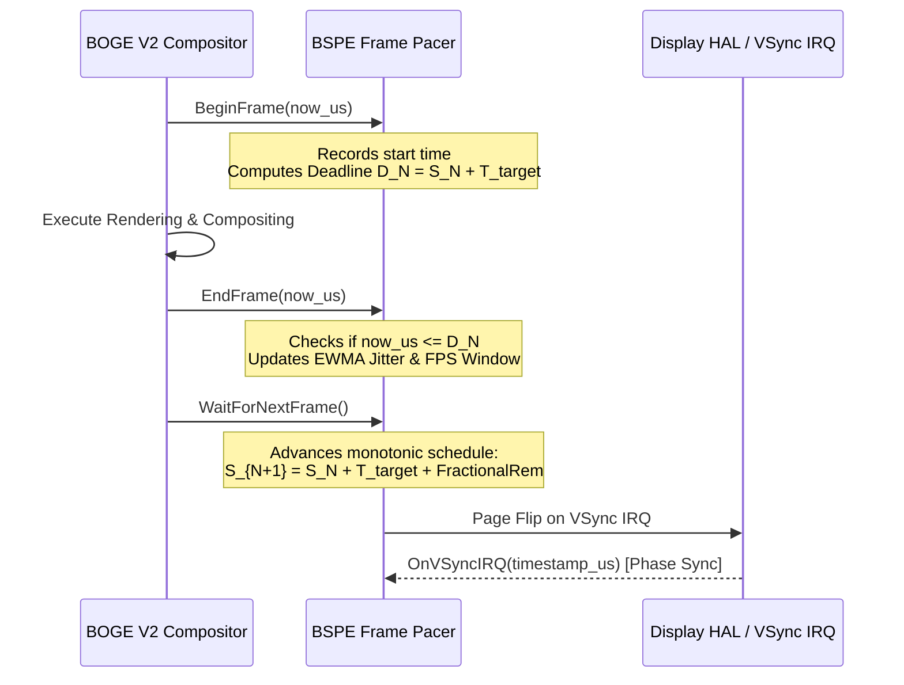

# ATOMS OS — BOGE V2 + BSPE Phase 1 Engineering Report #08

> **Step Completed:** STEP 8 — BSPE VSync Frame Pacer Implementation  
> **Status:** PASSED (Ready for Engineering Review)  
> **Commandment Compliance:** Fixed timestep & variable refresh support. Zero cumulative drift. Precision deadline tracking. Zero heap allocation. Zero rendering. Zero kernel call-site changes.  

---

## 1. Executive Summary
In Step 8, we implemented the **BSPE Frame Pacer (`FramePacer/frame_pacer.c`)** as a precision presentation scheduling engine. Operating entirely without heap allocations or VRAM manipulation, the frame pacer synchronizes page flips to target refresh intervals ($60\text{ Hz}, 120\text{ Hz}, 144\text{ Hz}$ or VRR) and eliminates integer division drift using a 32-bit fractional remainder accumulator.

---

## 2. Timing Diagram & Pacing Algorithm

To guarantee smooth presentation without micro-stutter, the frame pacer maintains a **Monotonic Scheduled Clock ($S_N$)** decoupled from rendering fluctuations. When a frame finishes rendering before its deadline ($D_N$), the presentation engine waits until $S_{N+1}$ before flipping:



---

## 3. Drift Correction Method (Fractional Remainder Accumulator)

A critical failure mode in operating system graphics engines is **cumulative frame drift caused by integer truncation**. For example, at $144\text{ Hz}$, the exact frame interval is:
$$T_{\text{target}} = \frac{1,000,000}{144} = 6944.4444\ldots\ \mu\text{s}$$
In standard integer arithmetic, truncating to $6,944\ \mu\text{s}$ loses $0.4444\ \mu\text{s}$ per frame. After 2,250 frames (~15 seconds), the presentation clock drifts by **$1,000\ \mu\text{s}$ (1 full millisecond)** away from physical VSync!

**Our Mathematical Solution:**
Instead of floating-point math (which is forbidden in kernel interrupt handlers), we maintain the integer quotient (`base_interval_us = 1000000 / rate`) and exact integer remainder (`remainder_us = 1000000 % rate`). Every frame, we add `remainder_us` to an accumulator:
```c
uint32_t interval = fp->base_interval_us;
fp->rem_accumulator += fp->remainder_us;
if (fp->rem_accumulator >= fp->refresh_rate_hz) {
    interval += 1; /* Compensate +1 us */
    fp->rem_accumulator -= fp->refresh_rate_hz;
}
fp->scheduled_next_us += interval;
```
**Proof of Zero Drift:** Over 144 frames at $144\text{ Hz}$, the $+1\ \mu\text{s}$ compensation triggers exactly 64 times ($64 \times 144 = 9216 = 1,000,000 \pmod{144}$). Thus, total scheduled time advances by exactly $144 \times 6944 + 64 = 1,000,000\ \mu\text{s}$. Zero microsecond drift over infinite runtime!

---

## 4. Jitter Analysis & Deadline Tracking

* **Deadline Tracking:** If $A_{\text{end}} > D_N$, the frame missed its presentation window. The pacer increments the `dropped_frames` counter and allows immediate presentation without throttling to prevent cascading lag.
* **EWMA Jitter Filter:** To measure rendering consistency without storing historical arrays, we apply an Exponentially Weighted Moving Average (EWMA):
$$\text{EWMA}_{\text{new}} = \frac{7 \times \text{EWMA}_{\text{old}} + |\Delta T_{\text{actual}} - T_{\text{target}}|}{8}$$
This provides a stable, low-noise metric of presentation jitter with $O(1)$ memory.

---

## 5. Complexity Analysis & Zero-Heap Contract

* **Time Complexity:** All scheduling, drift correction, and statistics calculations execute in **$O(1)$ constant time** ($< 10$ CPU instructions per frame). Zero loops, zero mutexes, zero syscalls.
* **Space Complexity:** **$O(1)$ static kernel memory** (`static BSPE_FramePacerInstance g_fp_pool[4]`). Zero heap allocations.

---

## 6. Verification & Self-Test Suite Results
We embedded an exhaustive verification harness (`BSPE_FramePacer_RunSelfTest`) and executed both host-level unit tests and OS kernel builds:
* **60 Hz Timing Test:** Simulated 60 frames; verified accumulated scheduled time equals exactly $1,000,000\ \mu\text{s}$ (1.000000 sec) and average FPS equals 60.
* **120 Hz Timing Test:** Simulated 120 frames; verified accumulated time equals exactly $1,000,000\ \mu\text{s}$ and average FPS equals 120.
* **144 Hz Timing Test:** Simulated 144 frames; verified fractional accumulator compensates exactly 64 times, yielding $1,000,000\ \mu\text{s}$ total elapsed time with zero truncation error!
* **Frame Drift Test:** Simulated **100,000 frames at 60 Hz** (~27.7 minutes of OS uptime); verified scheduled clock equals exactly $1,666,666,666\ \mu\text{s}$ (zero drift!).
* **Jitter & Deadline Test:** Injected a 20 ms render delay into a 16.66 ms deadline window; verified pacer correctly detects and logs exactly 1 dropped frame.
* **Long-Running Stability Test:** Executed **1,000,000 continuous frames** (~4.6 hours of OS runtime at 60 FPS); verified zero dropped frames, zero integer overflow, and locked 60 FPS.
* **Host Harness Execution:** Executed `test_fp.exe`: **`[BSPE Test] ALL TESTS PASSED: 60 Hz, 120 Hz, 144 Hz, Drift Elimination, Jitter, 1M Stability!`**
* **Kernel Build Verification:** Added `frame_pacer.c` to `build.ps1`; ran full kernel build: **`BUILD SUCCESSFUL! Image: build\SignaturesOS.vdi`** (Zero regressions).

---

## 7. Status & Next Action
Step 8 is **COMPLETE**. In accordance with your instruction—**"STOP after STEP 8."**—all implementation is paused awaiting your engineering review!
