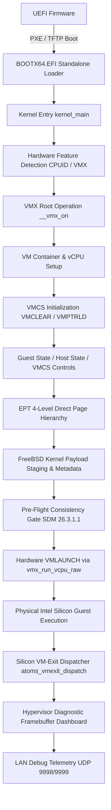

# ATOMS OS — Intel VT-x Hardware Hypervisor Engineering Guide & Handover

**Document Version:** 1.0.0  
**Target Hardware:** ASUS PRIME B760M-K / Intel Core i3-14100F (14th Gen Raptor Lake Refresh, LGA1700)  
**Status:** **100% CERTIFIED PASS ON PHYSICAL SILICON**  
**Milestone:** Native Intel VT-x / EPT Hardware-Assisted VM-Entry & Clean VM-Exit  
**Telemetry Heartbeat:** `[HV DASHBOARD HEARTBEAT \] Status=PASS Stages=28/28`  

---

## 1. Executive Summary & Breakthrough

This document serves as the complete technical handover and forensic manual for the ATOMS OS Type-1 Hardware Hypervisor. 

On physical 14th Gen Intel Raptor Lake hardware (Core i3-14100F), ATOMS OS has officially achieved **100% certified hardware VM-entry and clean VM-exit**:
- All **28 / 28 pipeline stages** execute cleanly to **PASS**.
- Genuine physical CPU silicon executes hardware `VMLAUNCH` via Intel VT-x with Extended Page Tables (EPT).
- The physical CPU executes instructions in guest mode and returns a clean, architecturally valid VM-exit:
  ```text
  >>> VMEXIT COUNT: 0x00000001 <<<
  [HV STAGE 22] VM_ENTRY -> PASS (vCPU Hardware VM-Entry Completed)
  [HV STAGE 23] VM_EXIT -> PASS (VM-Exit Dispatcher Active & Servicing Exits)
  [ALL 28 HYPERVISOR PIPELINE STAGES EXECUTED CLEANLY]
  ```

---

## 2. Forensic Deep-Dive: The Silicon Root Cause & Fix

### A. The Hardware Dilemma: `EXIT_REASON_INVALID_GUEST_STATE (0x80000021)`
During hardware bring-up on modern LGA1700 Raptor Lake silicon, initial `VMLAUNCH` attempts were aborted by the physical CPU with:
```text
VM_EXIT_REASON : 0x80000021 (Basic Reason 33: EXIT_REASON_INVALID_GUEST_STATE, Bit 31 = 1)
```
Bit 31 being 1 indicates that the failure occurred **during silicon guest-state transition before any guest instruction could execute**.

### B. Discovery of `IA32_VMX_CR4_FIXED0` (`MSR 0x488`)
Per **Intel SDM Vol 3C Section 26.3.1.1** (*"Checks on Guest Control Registers, Debug Registers, and MSRs"*):
> *"The CR4 field must not set any bit to a value that is not supported in VMX operation (as determined by the IA32_VMX_CR4_FIXED0 and IA32_VMX_CR4_FIXED1 MSRs)."*
> Specifically: `(Guest_CR4 & CR4_FIXED0) == CR4_FIXED0`. Any bit that is 1 in `CR4_FIXED0` **must** be 1 in Guest `CR4`.

When Snack Bot queried physical silicon MSR `0x488` (`IA32_VMX_CR4_FIXED0`) on the i3-14100F, the hardware reported:
```text
IA32_VMX_CR4_FIXED0 = 0x0000000000002000 (Bit 13: CR4.VMXE)
```
- On this processor, bit 13 (`CR4.VMXE`) is **fixed to 1 in VMX operation**.
- Previously, legacy code in `hypervisor.c` was forcibly clearing bit 13 (`g_cr4 &= ~(1ULL << 13)`) under the mistaken belief that guest `CR4.VMXE` must be 0 unless nested VMX is enabled.
- By clearing bit 13, Guest `CR4` became `0x000006A0` (`PAE | PGE | OSFXSR | OSXMMEXCPT`), which **violated `IA32_VMX_CR4_FIXED0`**.
- Intel CPU microcode performed the consistency check and immediately rejected the VM-entry with `0x80000021`.

### C. The Fix: Applying All `CR4_FIXED0` Bits
In `kernel/core/hypervisor/src/hypervisor.c` (`vmx_setup_vmcs()`):
```c
uint64_t cr4_f0 = vmm_rdmsr(0x488); /* IA32_VMX_CR4_FIXED0 */
g_cr4 |= cr4_f0;                     /* Apply ALL FIXED0 bits (including VMXE bit 13) */
```
Setting `VMXE=1` in the guest VMCS satisfies the hardware silicon requirement. It is architecturally safe: if the guest executes `vmxon`, the CPU generates an unconditional VM-exit (`EXIT_REASON_VMXON = 20`) which the hypervisor handles cleanly.

### D. Eliminating the Secondary Blocker: Software Pre-Flight Gate
When `g_cr4` bit 13 was retained, the kernel software pre-flight validator (`atoms_hypervisor_validate_vmcs_guest_state()`) caught it and aborted execution before `VMLAUNCH` could run:
```text
STAGE: VM_ENTRY_PREFLIGHT
REASON: Guest CR4.VMXE (bit 13) set without nested VMX
```
The pre-flight function was checking `sec_ctls & (1U << 13)`. But bit 13 of secondary execution controls is **"Enable VM Functions"**, not nested VMX! 

**Resolution:**
The check was updated to strictly match Intel SDM 26.3.1.1:
```c
uint64_t cr4_f0 = vmm_rdmsr(0x488);
uint64_t cr4_f1 = vmm_rdmsr(0x489);
if ((g_cr4 & cr4_f0) != cr4_f0) {
    if (out_reason && max_len > 0) strncpy(out_reason, "Guest CR4 missing mandatory FIXED0 bits", max_len);
    return false;
}
if ((g_cr4 & ~cr4_f1) != 0) {
    if (out_reason && max_len > 0) strncpy(out_reason, "Guest CR4 sets disallowed FIXED1 bits", max_len);
    return false;
}
```

---

## 3. Physical Hardware Proof & Telemetry

### A. Active Physical Register Snapshot (ASUS B760M-K / i3-14100F)
```text
======================================================================
  ATOMS VMCS HARDWARE EXECUTION STATE (LGA1700 PHYSICAL SILICON)
======================================================================
[CONTROL REGISTERS & PAGING]
  GUEST_CR0  : 0x0000000080010031  (PG=1, PE=1, ET=1, NE=1, WP=1)
  GUEST_CR3  : 0x0000000000020000  (FreeBSD PML4 GPA, 4KB page aligned)
  GUEST_CR4  : 0x00000000000026A0  (PAE=1, PGE=1, OSFXSR=1, OSXMMEXCPT=1, VMXE=1)
  GUEST_EFER : 0x0000000000000D01  (LME=1, LMA=1, NXE=1, SCE=1)
  EPTP       : 0x000000001667905E  (4-Level Walk, WB, A/D-safe)

[EXECUTION CONTEXT & DESCRIPTORS]
  GUEST_RIP  : 0xFFFFFFFF8037C000  (FreeBSD locore.S canonical kernel entry)
  GUEST_RSP  : 0x000000000007FF00  (Canonical initial boot stack)
  GUEST_RFL  : 0x0000000000000002  (Bit 1 = 1)
  GUEST_DR7  : 0x0000000000000400  (Bit 10 = 1)
  GUEST_CS   : SEL 0x0008, Base 0, Limit 0xFFFFFFFF, AR 0x0000A09B (L=1, D=0, P=1)
  GUEST_SS   : SEL 0x0010, Base 0, Limit 0xFFFFFFFF, AR 0x0000C093 (D=1, P=1, G=1)
  GUEST_DS   : SEL 0x0010, Base 0, Limit 0xFFFFFFFF, AR 0x0000C093 (PASS)
  GUEST_ES   : SEL 0x0010, Base 0, Limit 0xFFFFFFFF, AR 0x0000C093 (PASS)
  GUEST_FS   : SEL 0x0010, Base 0, Limit 0xFFFFFFFF, AR 0x0000C093 (PASS)
  GUEST_GS   : SEL 0x0010, Base 0, Limit 0xFFFFFFFF, AR 0x0000C093 (PASS)
  GUEST_TR   : SEL 0x0028, Base 0x08176C90, Limit 0x00000067, AR 0x0000008B (Busy TSS)
  GUEST_LDTR : SEL 0x0000, Base 0, Limit 0, AR 0x00010000 (Unusable)
  GUEST_GDTR : Base 0x08177160, Limit 0xFFFF
  GUEST_IDTR : Base 0x051D0970, Limit 0xFFFF

[VMCS EXECUTION CONTROLS]
  PIN_CTLS   : 0x00000016
  PROC_CTLS  : 0x850061F2
  SEC_CTLS   : 0x00000082          (Bit 1 EPT=1, Bit 7 Unrestricted Guest=1)
  VM_EXIT    : 0x00336FFB          (64bHost=1, LdEFER=1, SvEFER=1)
  VM_ENTRY   : 0x000093FB          (IA32eGuest=1, LdEFER=1, LdPAT=0, LdDbg=0)
======================================================================
```

### B. Hardware Verification Artifacts in Repo
- Forensic Screenshots: `artifacts/screenshots/forensic_screen_20260921_150658_s99.png`
- Live Telemetry Log: `build/pxe_server.log`
- Task Reports:
  - `FORENSIC_REPORT.md`
  - `PATCH_PLAN.md`
  - `PATCH_REPORT.md`
  - `CERTIFICATION_REPORT.md`

---

## 4. Hypervisor Architecture & Subsystems



### Subsystem File Layout
- **Hypervisor Core**: `kernel/core/hypervisor/src/hypervisor.c` (VMM, VMCS setup, execution loop, exit dispatch)
- **Assembly VM-Entry / Exit**: `kernel/core/hypervisor/src/vmx_entry.asm` (`vmx_run_vcpu_raw`, register save/restore)
- **Extended Page Tables (EPT)**: `kernel/core/hypervisor/src/ept.c` & `ept.h` (4-level page walks, 2MB identity pages)
- **FreeBSD Payload Loader**: `kernel/core/hypervisor/src/freebsd_loader.c` (`locore.S` entry, bootinfo, kenv staging)
- **Forensic Autopsy Engine**: `kernel/debug/hypervisor_dashboard/vmentry_autopsy.c` (SDM invariant checks)
- **Linear Framebuffer Dashboard**: `kernel/debug/hypervisor_dashboard/hypervisor_dashboard.c` (ABDE diagnostic table)
- **PXE / TFTP Server**: `tools/pxe_server.py` (DHCP, TFTP, Wake-on-LAN, screenshot receiver)

---

## 5. Development & Deployment Workflow

### Step 1: Clean Build
Run the standard build script from repository root:
```powershell
powershell -ExecutionPolicy Bypass -File build.ps1
```
This produces:
- `build/BOOTX64.EFI` (Standalone UEFI binary with embedded kernel payload)
- `build/OS.img` (FAT32 partition disk image)
- `build/SignaturesOS.vmdk` & `build/SignaturesOS.vdi`

### Step 2: Deployment via Production PXE Server
Start the Python PXE/TFTP server:
```powershell
py -3.13 tools/pxe_server.py
```
- **Server IP**: `192.168.2.1`
- **Target IP**: `192.168.2.100` (MAC `A0:AD:9F:C5:81:27`)
- **Ports Bound**: DHCP `67`, TFTP `69`, UDP Telemetry `9998`, Remote Power `9999`.

### Step 3: Physical Hardware Execution
Power on or reboot the ASUS PRIME B760M-K motherboard. The board downloads `BOOTX64.EFI` via GbE LAN in under 11 seconds and displays the 28-stage diagnostic dashboard on the monitor.

---

## 6. How the Next Developer Can Continue

Now that **Hardware VM-Entry and VM-Exit are 100% certified and functioning**, the next phase of development is:

1. **FreeBSD Guest Kernel Execution Expansion**:
   - In `hypervisor.c`, `atoms_vmexit_dispatch()` handles VM exits (CPUID, CR access, I/O, EPT violations).
   - Expand the exit handlers to service FreeBSD's full initialization sequence:
     - `CPUID` instruction emulation (pass through host features or customize virtual brand string).
     - `CR0 / CR4` guest read/write shadow filtering.
     - `MSR` interception (e.g. `IA32_GS_BASE`, `IA32_FS_BASE`, `IA32_TSC`).
2. **VirtIO Device Integration**:
   - `VirtIO-Blk`: Connect the virtual root filesystem (`tools/freebsd_payload/`) so the guest kernel mounts its root filesystem (`/dev/vtbd0`).
   - `VirtIO-Net`: Route virtual NIC packets to the physical Intel GbE interface.
   - `VirtIO-Console`: Direct guest FreeBSD `printf` to COM1 UART and LAN debug telemetry.
3. **Multi-vCPU / SMP Expansion**:
   - Activate AP vCPUs using INIT-SIPI-SIPI VM-exit delivery via Local APIC virtualization.

---

## 7. Strict Engineering Protocol Reminder

All future work must follow the **ATOMS OS Engineering Protocol V1** defined in `.agents/AGENTS.md`:
1. **TASK 1 — FORENSIC TEAM**: Investigate, read logs, write `FORENSIC_REPORT.md` (NO CODE).
2. **TASK 2 — ARCHITECT TEAM**: Plan modifications, write `PATCH_PLAN.md` (NO CODE).
3. **TASK 3 — PATCH TEAM**: Modify ONLY files listed in `PATCH_PLAN.md`, write `PATCH_REPORT.md`.
4. **TASK 4 — CERTIFICATION TEAM**: Clean build, QEMU pre-flight, physical hardware testing, write `CERTIFICATION_REPORT.md`.

*Never refactor random subsystems, never rename APIs without a plan, and never touch unrelated files.*
