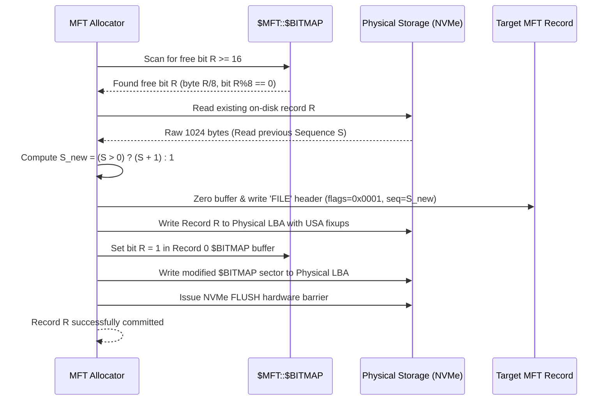

# ATOMS OS — NTFS Master File Table (MFT) Engine Specification
**Document ID:** `NTFS-MFT-V1.0`  
**Target:** Canonical MFT Geometry, Dynamic Extent Mapping, Record Allocation & Bitmap Synchronization  
**Hardware Target:** ASUS PRIME B750M-K (Intel Core i3-14100F, WD Blue SN5000 NVMe SSD)  
**Authors:** Developer A (Architecture) & Developer B (Forensics)  
**Date:** 2026-09-04  

---

## 1. MFT Architectural Overview

The Master File Table (`$MFT`, Record 0) is the central database of an NTFS volume. Every file, directory, and system metadata structure is defined by one or more 1024-byte MFT records.
On real-world Windows partitions, `$MFT` is non-contiguous and fragmented into multiple extents.

---

## 2. Canonical Extent Translation

Address calculation must **never** assume contiguous MFT storage from `vol->mft_lcn`. Every MFT record address must be resolved via the decoded extent map of Record 0's `$DATA` runlist:

$$\text{mft\_byte\_offset} = \text{record\_num} \times \text{file\_record\_size} = \text{record\_num} \times 1024$$
$$\text{target\_vcn} = \frac{\text{mft\_byte\_offset}}{\text{bytes\_per\_cluster}}$$
$$\text{intra\_cluster\_byte} = \text{mft\_byte\_offset} \pmod{\text{bytes\_per\_cluster}}$$

Using the extent map:
$$\text{Extent } E \text{ where } E\to\text{vcn\_start} \le \text{target\_vcn} < E\to\text{vcn\_start} + E\to\text{cluster\_count}$$
$$\text{LCN} = E\to\text{lcn\_start} + (\text{target\_vcn} - E\to\text{vcn\_start})$$
$$\text{Physical Partition LBA} = (\text{LCN} \times \text{sectors\_per\_cluster}) + \frac{\text{intra\_cluster\_byte}}{\text{bytes\_per\_sector}}$$

---

## 3. MFT Record Allocation Lifecycle

An atomic MFT allocation follows an exact 7-step sequence:



### Allocation Rules
1. **System Reserve Zone:** Records $0$ through $15$ are strictly reserved for NTFS system metadata. User allocations must always target records $R \ge 16$.
2. **Dual-Gate Verification:** A record is considered available if and only if:
   - Its bit in Record 0's `$BITMAP` is `0` (`FREE`).
   - The on-disk record header at that physical LBA has `!(flags & NTFS_FILE_IN_USE)`.
3. **Sequence Number Incrementation:**
   - If the candidate record was previously used, its existing `sequence_number` $S$ must be read and incremented:
     $$S_{new} = S_{old} + 1$$
   - If the record is virgin ($0$), initialize $S_{new} = 1$.
   - Sequence number must never be reset to 1 on an existing slot.

---

## 4. $MFT::$BITMAP Read / Modify / Write Engine

The allocation status of every MFT record is governed by the unnamed `$BITMAP` attribute inside Record 0:
- **Bit Mapping:** Record $R$ is tracked at:
  $$\text{Byte Offset} = \left\lfloor \frac{R}{8} \right\rfloor$$
  $$\text{Bit Offset} = R \pmod 8$$
  $$\text{Mask} = 1 \ll (R \pmod 8)$$

### Modifying the Allocation State
```c
bool ntfs_mft_set_record_allocated(NTFS_VOLUME* vol, uint32_t record_num, bool allocated) {
    uint32_t byte_off = record_num / 8;
    uint8_t bit_off = (uint8_t)(record_num % 8);

    // Read MFT Record 0
    NTFS_FileRecord* rec0 = ntfs_mft_read_record(vol, 0);
    if (!rec0) return false;

    NTFS_Attribute bmp_attr;
    if (!ntfs_attr_find(rec0, NTFS_ATTR_BITMAP, NULL, &bmp_attr)) {
        ntfs_mft_free_record(rec0);
        return false;
    }

    if (!bmp_attr.non_resident) {
        // Resident Bitmap (small MFT)
        uint8_t* val_ptr = (uint8_t*)rec0->buffer + bmp_attr.resident_value_offset +
                           (bmp_attr.raw_attr_ptr - rec0->buffer);
        if (allocated) val_ptr[byte_off] |= (1 << bit_off);
        else           val_ptr[byte_off] &= ~(1 << bit_off);
        ntfs_write_mft_record_raw(vol, 0, rec0->buffer);
    } else {
        // Non-Resident Bitmap (standard partitions)
        NTFS_ExtentMap map = {0};
        const char* err = NULL;
        ntfs_decode_data_runs(bmp_attr.raw_attr_ptr + bmp_attr.mapping_pairs_offset,
                              bmp_attr.length - bmp_attr.mapping_pairs_offset,
                              bmp_attr.starting_vcn, &map, &err);

        uint64_t clus_idx = byte_off / vol->bytes_per_cluster;
        uint32_t intra_clus = byte_off % vol->bytes_per_cluster;
        NTFS_Extent ext;
        if (ntfs_extent_map_lookup(&map, clus_idx, &ext) && ext.lcn_start > 0) {
            uint64_t phys_lcn = (uint64_t)ext.lcn_start + (clus_idx - ext.vcn_start);
            uint64_t sec_lba = (phys_lcn * vol->sectors_per_cluster) + (intra_clus / vol->bytes_per_sector);
            uint8_t sec_buf[512];
            ntfs_read_sector(vol->device, sec_lba, 1, sec_buf);

            uint32_t intra_sec = intra_clus % vol->bytes_per_sector;
            if (allocated) sec_buf[intra_sec] |= (1 << bit_off);
            else           sec_buf[intra_sec] &= ~(1 << bit_off);

            ntfs_write_sector(vol->device, sec_lba, 1, sec_buf);
        }
        ntfs_extent_map_free(&map);
    }

    ntfs_mft_free_record(rec0);
    return true;
}
```

---

## 5. Attribute Construction & Sorting Rules

Every MFT record consists of a sequence of attributes. Attributes **must be sorted in strictly ascending numerical order by Attribute Type Code**:
1. `$STANDARD_INFORMATION` (`0x10`)
2. `$ATTRIBUTE_LIST` (`0x20`) [Optional]
3. `$FILE_NAME` (`0x30`) [Primary / Win32+DOS]
4. `$FILE_NAME` (`0x30`) [Optional DOS 8.3 Alias]
5. `$OBJECT_ID` (`0x40`) [Optional]
6. `$SECURITY_DESCRIPTOR` (`0x50`) [Optional]
7. `$DATA` (`0x80`) [Default unnamed data stream]
8. `$INDEX_ROOT` (`0x90`) [Directories only]
9. `$INDEX_ALLOCATION` (`0xA0`) [Large directories only]
10. `$BITMAP` (`0xB0`) [Large directories only]
11. `$END` (`0xFFFFFFFF`) [Required terminator]

Any out-of-order attribute causes Microsoft `ntfs.sys` to immediately raise `BugCheck 0x24 (NTFS_FILE_SYSTEM)`.
