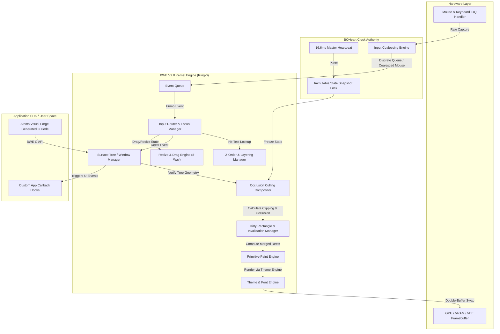
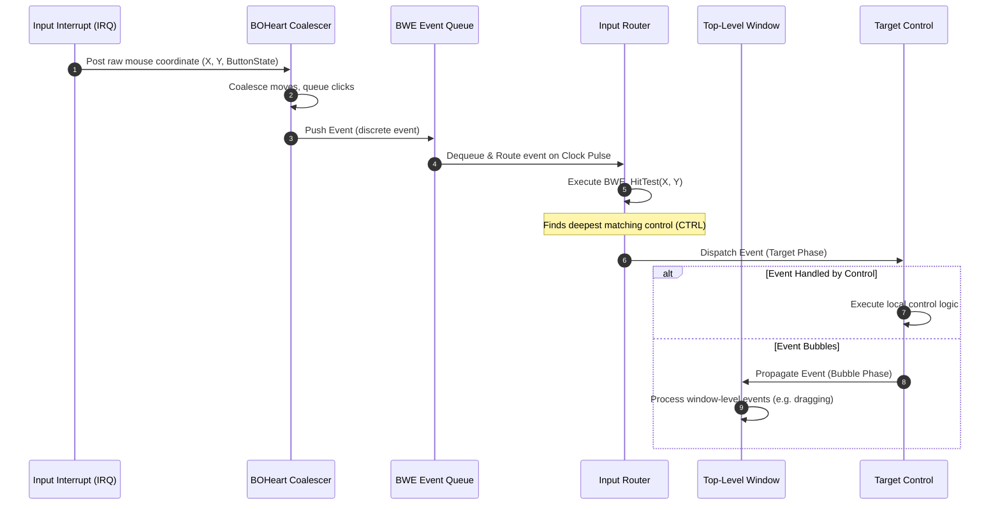
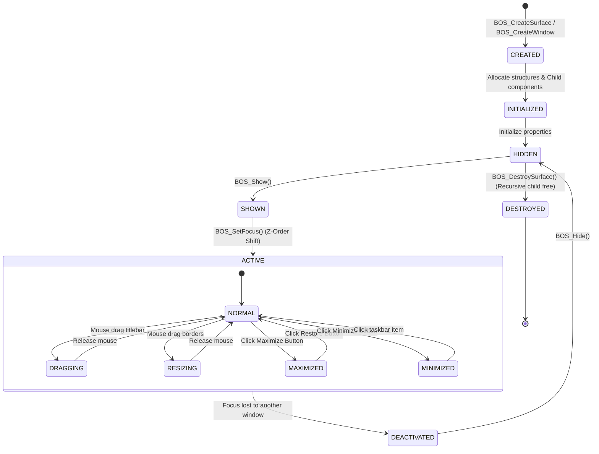
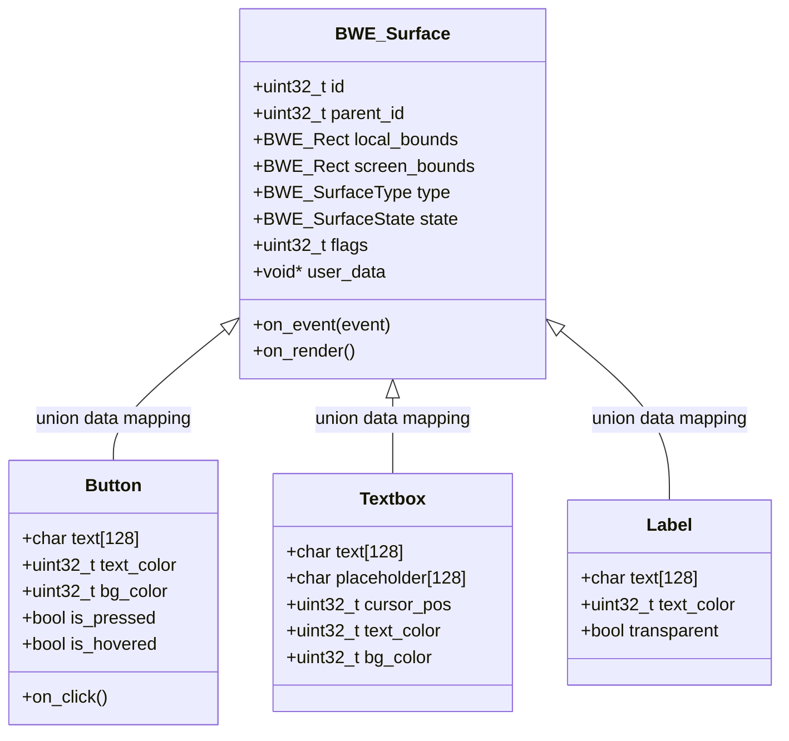

# ATOMS OS — BOSurface Window Engine (BWE) V2.0
## Production Architecture Specification

**Document Reference:** `BOS-KERNEL-ARCH-005_BWE_V2_Specification`  
**Version:** 2.0-RELEASE  
**Classification:** Kernel-Core Spec (Ring-0)  
**Status:** Approved  
**Target Architecture:** ATOMS OS Core Graphics  

---

## 1. Executive Architecture

The **BOSurface Window Engine (BWE) V2.0** is the native, Ring-0 window management and graphical user interface framework for ATOMS OS. BWE V2.0 sits directly on top of the physical framebuffer/VBE hardware layers and works in tandem with the **BOHeart Master Clock** to deliver high-performance, deterministic 60 FPS system rendering.

Every visible entity on the ATOMS OS desktop—including the Explorer shell, terminal sessions, welcome page, dialog boxes, and individual interactive UI controls—is represented as a `BOSurface` object. 

### 1.1 Architectural Topology



---

## 2. Philosophy: "Everything is a BOSurface Window"

BWE V2.0 is built on the unified paradigm that **everything is a window**. 

There is no separate, ad-hoc drawing code inside individual applications, nor is there a separate rendering pathway for system controls. A simple button is represented using the same structural archetype as the main application container. 

This philosophy enforces the following design rules:
1. **Structural Homogeneity**: Any interactive element is a node in the global Surface Tree. Controls inherit window properties (geometry, visibility, parent-child relations, focusability).
2. **Zero Duplicate Rendering**: Rendering is entirely delegated to the BWE Paint Engine using style properties processed by the Theme Engine. Applications modify *state*, never raw pixels.
3. **Implicit Clipping**: Coordinate spaces are inherited hierarchically. A child node is always clipped by the bounding rectangle of its parent node.
4. **Deterministic Update Cycle**: Controls never trigger immediate screen updates. State changes register damage areas in the **Dirty Rectangle Manager** to be composed in the next BOHeart pulse.

---

## 3. Module Breakdown & Folder Structure

To support the architecture, BWE V2.0 is organized into specialized modules:

```
kernel/
└── bwe/
    ├── include/
    │   ├── bwe.h                # Master include file for kernel subsystems
    │   ├── bwe_types.h          # BWE Rects, Colors, Fonts and base struct definitions
    │   └── bwe_events.h         # Mouse/Keyboard event structures & propagation flags
    ├── src/
    │   ├── bwe_core.c           # Engine initialization, Master Pool memory, and API entries
    │   ├── bwe_window.c         # Window creation, hierarchy management, and destruction
    │   └── bwe_lifecycle.c      # State transitions and lifecycle callbacks
    ├── renderer/
    │   ├── bwe_compositor.c     # Z-order composer, occlusion culling, and backbuffer swapping
    │   ├── bwe_dirty_rect.c     # Invalidation queue and regional rectangle merging
    │   └── bwe_paint_engine.c   # Drawing primitives (clip, draw line, text, bitmap)
    ├── controls/
    │   ├── bwe_control_base.c   # Base class helpers and virtual dispatch stubs
    │   ├── bwe_button.c         # Button state handling & click callbacks
    │   ├── bwe_textbox.c        # Text editing, selection ranges, cursor blinks
    │   ├── bwe_scroll.c         # Scrollbar logic & canvas clipping shifts
    │   └── bwe_menu.c           # Context menus & dropdown system
    ├── themes/
    │   ├── bwe_theme_engine.c   # Color token resolver, dark/light toggle, borders
    │   └── bwe_theme_classic.c  # Default classic metallic design styling rules
    ├── input/
    │   ├── bwe_input_router.c   # Z-order hit testing and focus distribution
    │   ├── bwe_drag_engine.c    # Mouse-capture dragging, clamping, and window snapping
    │   └── bwe_resize_engine.c  # 8-way resize geometry recalculations
    ├── cursor/
    │   └── bwe_cursor_manager.c # System cursors (Arrow, ResizeNS, ResizeWE, IBeam, Hand)
    ├── animation/
    │   └── bwe_animation.c      # Window snap previews and state transition animations
    └── diagnostics/
        └── bwe_debug_hud.c      # In-frame telemetry overlay (FPS, Dirty Rects, Memory)
```

---

## 4. Data Flow & Event Routing

The event pipeline translates hardware-level mouse/keyboard interrupts into structured events and delivers them to the correct node in the Surface Tree.

### 4.1 Event Propagation Mechanics

1. **Hardware Interrupt**: Mouse and keyboard drivers submit raw packets to the BOHeart Input Coalescer.
2. **Coalescing**: Mouse moves overwrite the relative coordinates of the current frame; mouse button clicks and keyboard key events are pushed to the discrete Event Queue.
3. **Capture Phase**: When checking mouse interaction, BWE traverses the Surface Tree from the **Root Desktop** down to the deepest child control containing the coordinates (using `BWE_HitTest`).
4. **Target Phase**: The event is fired at the deepest matching child node (the target).
5. **Bubble Phase**: If the target control does not mark the event as handled (`BWE_EVENT_HANDLED`), the event propagates up to its parent window. This bubbles up to the top-level window.
6. **Focus Lock**: If a modal window or a control has captured focus, events are directly routed to the capture target, bypassing normal hit-testing.



---

## 5. Window Lifecycle & States

Every `BOSurface` object follows a strict deterministic lifecycle. 



### 5.1 Lifecycle Stage Details

- **`Create`**: Allocates the surface structure from the master static pool. Assigns a globally unique ID.
- **`Initialize`**: Sets geometry, hierarchy indices, surface type, and registers the rendering callback.
- **`Show`**: Marks the surface flags with `BWE_FLAG_VISIBLE`. Adds its bounding area to the compositor invalidation queue.
- **`Activate`**: Assigns focus to the surface, sets state to active, pushes the ID to the top of the focus stack, and shifts Z-order to front.
- **`Update`**: Periodically invoked to execute custom application state updates or layout updates.
- **`Render`**: Resolves theme elements and invokes internal painting functions. Modifies only the dirty region cache.
- **`Deactivate`**: Clears focus flags, updates decoration visuals to inactive styling, and alerts sub-controls.
- **`Hide`**: Removes visible flags, invalidates coordinates, and forces redraw of exposed layers underneath.
- **`Destroy`**: Detaches node from parent, recursively destroys all child nodes, and returns slots to the static pool.

---

## 6. Window Object Properties & Flags

### 6.1 Structural Design

```c
typedef struct BWE_Window {
    // Identity & Hierarchy
    uint32_t            id;                 // Globally unique Window ID
    uint32_t            parent_id;          // Parent surface ID (0 = Desktop)
    uint32_t            owner_pid;          // Owner process ID (for resource isolation)
    uint32_t            children[16];       // Fixed child surface array
    uint32_t            child_count;        // Count of active child surfaces
    uint32_t            z_order;            // Rendering depth index
    BWE_SurfaceType     type;               // Type (Surface, Window, Button, etc.)
    BWE_SurfaceState    state;              // Lifecycle state enum

    // Geometry System
    BWE_Rect            local_bounds;       // Bounds relative to parent coordinate space
    BWE_Rect            screen_bounds;      // Absolute bounds in screen space
    BWE_Rect            restore_bounds;     // Saved geometry before maximize/fullscreen
    BWE_Rect            min_size;           // Minimum size bounds (prevent shrink to zero)
    BWE_Rect            max_size;           // Maximum size bounds

    // Flags & Opacity
    uint32_t            flags;              // Behavior and styling flags
    uint8_t             opacity;            // Alpha rendering value (0 = transparent, 255 = opaque)
    bool                is_dirty;           // Invalidation state indicator
    BWE_Rect            old_screen_bounds;  // Previous frame screen bounds (for damage clearing)

    // Data Customization
    void*               user_data;          // Custom user-app context data
    
    // Control Union data (used for basic controls)
    union {
        struct {
            uint32_t bg_color;
        } panel;
        struct {
            char     text[128];
            uint32_t text_color;
            uint32_t bg_color;
            bool     is_pressed;
            bool     is_hovered;
            void     (*on_click)(uint32_t btn_id);
        } button;
        struct {
            char     text[128];
            uint32_t text_color;
            bool     transparent;
        } label;
        struct {
            char     text[128];
            char     placeholder[128];
            uint32_t cursor_pos;
            uint32_t bg_color;
            uint32_t text_color;
        } textbox;
    } control_data;

    // Hooks & Event Callbacks
    void (*on_event)(uint32_t window_id, const BWE_Event* event);
    void (*on_render)(struct BWE_Window* self);
} BWE_Window;
```

### 6.2 Window Flags

| Flag | Value | Description |
|---|---|---|
| `BWE_WINDOW_RESIZABLE` | `0x00000001` | Allows borders to respond to hit-test resizing |
| `BWE_WINDOW_MOVABLE` | `0x00000002` | Allows dragging via the title bar |
| `BWE_WINDOW_MODAL` | `0x00000004` | Restricts user interaction to this window in the process |
| `BWE_WINDOW_TOPMOST` | `0x00000008` | Forces the window to render above normal windows |
| `BWE_WINDOW_CHILD` | `0x00000010` | Embedded inside another window; inherits parent motion |
| `BWE_WINDOW_BORDERLESS` | `0x00000020` | Bypasses titlebar and border rendering entirely |
| `BWE_WINDOW_TRANSPARENT`| `0x00000040` | Enables alpha blending composition on the buffer |
| `BWE_WINDOW_FULLSCREEN` | `0x00000080` | Forces bounds to match hardware screen; disables borders |

---

## 7. Window Decorations & 8-Way Resize/Drag Engine

Every non-borderless window requires chrome to manage layout, movement, and resizing.

### 7.1 Visual Elements

- **Title Bar**: A 30-pixel tall band containing the window icon, descriptive text, and control buttons (Minimize, Maximize, Close).
- **Controls**: Button hover and click states are resolved with accent color shifts (e.g. close button uses dark red hover, light red click).
- **Resize Border**: A 5-pixel active border padding around the frame.
- **Drop Shadow**: A soft blurred transparent border drawn under the bottom and right edges to raise the window depth perception.

### 7.2 8-Way Resize Engine

Hit testing checks the mouse coordinates relative to the window boundary rectangle. 

```
   (0,0)  [Top-Left] ─── [Top-Border] ─── [Top-Right]  (W,0)
              │                               │
         [Left-Border]   Active Window   [Right-Border]
              │                               │
  (0,H) [Bottom-Left] ─ [Bottom-Border] ─ [Bottom-Right] (W,H)
```

**Border Division Calculations:**
- **Edges**: Corner zones are defined by a `12x12` pixel box.
- **Border Thickness**: `5px`.
- **Resize Cursor Mapping**:
  - Top-Left / Bottom-Right: `BWE_CURSOR_RESIZE_NWSE`
  - Top-Right / Bottom-Left: `BWE_CURSOR_RESIZE_NESW`
  - Left / Right: `BWE_CURSOR_RESIZE_WE`
  - Top / Bottom: `BWE_CURSOR_RESIZE_NS`

When resizing, the engine calculates geometry offsets using the initial click coordinates, updating `local_bounds` and registering damage areas corresponding to the union of the old and new dimensions.

### 7.3 Drag Engine & Snapping

- **Drag Threshold**: Dragging begins only after the mouse moves more than `4 pixels` from the mouse-down point, preventing accidental micro-drags during clicks.
- **Screen Clamping**: The window cannot be dragged completely off-screen. BWE clamps the position so that at least `50x30` pixels of the titlebar remain visible on-screen.
- **Window Snapping**: When the mouse cursor hits the top, left, or right screen borders while dragging:
  - **Top Edge**: Triggers maximize snapping preview.
  - **Left/Right Edge**: Triggers half-screen snap tile previews.
  - A transparent preview rectangle is overlayed. Releasing the mouse button triggers the geometry resize.

---

## 8. Focus & Z-Order Manager

Managing keyboard inputs, mouse captures, and window layering.

### 8.1 Focus Manager

1. **Active Window**: The top-level window currently receiving keyboard input. Drawn with active theme colors.
2. **Focus Stack**: A LIFO list of active windows. Closing or minimizing the active window pops the stack and activates the next window.
3. **Modal Focus**: If a modal window (`BWE_WINDOW_MODAL`) is shown, BWE blocks input to all other windows owned by the same process. It forces the modal window to remain on top of the focus stack.

### 8.2 Z-Order Layering

Z-order decides draw sequence. Windows are sorted in ascending Z-order (Desktop drawn first, popups drawn last). BWE allocates layers as bands to prevent overlaps:

```
[Layer 5: Cursor & Overlay]   --> Rendered on top of everything
[Layer 4: Popups & Tooltips]  --> Floating above modal dialogs
[Layer 3: Modal Dialogs]      --> Overlaying active applications
[Layer 2: Topmost Windows]    --> Windows with BWE_WINDOW_TOPMOST
[Layer 1: Normal Windows]     --> Standard applications
[Layer 0: Desktop & Wallpaper] --> Root backdrop
```

---

## 9. Surface Rendering & Paint Engine

### 9.1 Render Pipeline (Composition)

To minimize CPU cycles, BWE uses an invalidation rendering architecture combined with occlusion culling.

```
State Change (SetText / Move)
      │
      ▼
BOS_InvalidateSurface(window_id)
      │
      ▼
Dirty Rectangle Added to Queue
      │
      ▼
[ BOHEART PULSE (16.6ms) ]
      │
      ▼
Merge Overlapping Dirty Rectangles (Region Merge)
      │
      ▼
Occlusion Culling (Calculate hidden window fragments)
      │
      ▼
Render only visible damaged rectangles into Backbuffer
      │
      ▼
Swap Backbuffer to VRAM Framebuffer
```

### 9.2 Paint Engine Primitives

Drawing operations are restricted within the calculated clipping rects.

```c
// Core paint primitives
void BWE_PaintClear(BWE_Rect* clip, uint32_t color);
void BWE_PaintClip(BWE_Rect* parent, BWE_Rect* child, BWE_Rect* out_clipped);
void BWE_DrawRect(BWE_Rect* bounds, uint32_t color, uint32_t thickness);
void BWE_FillRect(BWE_Rect* bounds, uint32_t color);
void BWE_DrawLine(int32_t x1, int32_t y1, int32_t x2, int32_t y2, uint32_t color);
void BWE_DrawText(const char* text, int32_t x, int32_t y, uint32_t color, BWE_Font* font);
void BWE_DrawBitmap(const uint32_t* pixel_data, BWE_Rect* dest, BWE_Rect* src);
void BWE_DrawIcon(uint32_t icon_id, int32_t x, int32_t y);
void BWE_DrawCursor(int32_t x, int32_t y, uint32_t type);
```

---

## 10. Controls Framework

BWE implements a lightweight control inheritance model in C using a union structure and callback hooks. Since controls are node surfaces, they reuse core window features.



Every control inherits the base attributes of a `BWE_Surface`. This means a button can contain child labels or icons, inherit clipping, bubble up events, and be dynamically moved or resized.

---

## 11. Theme Engine & Desktop Integration

### 11.1 Theme Engine Design

Themes are defined as structs of style parameters:

```c
typedef struct {
    uint32_t bg_window_active;
    uint32_t bg_window_inactive;
    uint32_t border_active;
    uint32_t border_inactive;
    uint32_t titlebar_active;
    uint32_t titlebar_inactive;
    uint32_t text_active;
    uint32_t text_inactive;
    
    uint32_t bg_control;
    uint32_t fg_control;
    uint32_t accent_color;
    uint32_t font_family_id;
} BWE_Theme;
```

The Theme Engine provides visual style resolvers. When a control renders, it queries the current theme parameters to determine fill colors, border drawing styles, and font sizes. Dark and light themes simply load alternate configuration mappings.

### 11.2 Desktop Integration

BWE integrates directly with the **Rook Engine** screen manager and the shell:
- **Wallpaper (Desktop ID 0)**: Backing surface that handles click events on icons.
- **Taskbar**: Topmost surface fixed at the bottom of the screen. Holds buttons representing open top-level surfaces.
- **Explorer Shell**: Integrates with virtual file systems (VFS) to display folder panels, files, and load associated execution binaries.

---

## 12. Performance Optimizations

To target 60 FPS under Ring-0 constraints, BWE V2.0 leverages optimized memory and processing architectures:

1. **Static Master Pool**: Up to 64 window instances are pre-allocated on initialization. There are no allocations or deallocations during dragging, resizing, or normal app loops.
2. **Rectangle Merging (Region Merge)**: The Dirty Rectangle Manager evaluates damaged areas. If two dirty rectangles intersect or are close, they merge to prevent redrawing overlapped regions twice.
3. **SIMD Software Drawing**: Framebuffer copying and solid color fills utilize 128-bit SIMD registers (SSE/AVX stubs) to clear and swap buffers quickly.
4. **Branch Prediction Friendly**: Code paths for common states are structured linearly, ensuring focus shifts and event updates occur in $O(1)$ lookup times.

---

## 13. Debug HUD & Error Handling

### 13.1 Debug HUD Subsystem

The diagnostic HUD renders a telemetry layer on top of all windows at the end of the compositing pass:

```
+---------------------------------------------------+
| ATOMS OS BWE V2.0 DIAGNOSTICS HUD                 |
| FPS: 60.00 | Frame Time: 4.21 ms                  |
| Active Windows: 4 | Surfaces: 22                  |
| Dirty Regions: 2  | Cache Hits: 98.4%             |
| Memory Heap Free: 8,432 KB                        |
| Focused Surface ID: 12                            |
| Hovered Surface ID: 15 (Button Control)           |
+---------------------------------------------------+
```

### 13.2 Error Registry & Recovery

BWE maps all errors to structured return values:

| Error Code | Hex Value | Cause | Recovery Action |
|---|---|---|---|
| `BWE_SUCCESS` | `0x0000` | No Error | Continue |
| `BWE0001` | `0x1001` | Invalid window pointer or ID | Ignore reference and log warning |
| `BWE0002` | `0x1002` | Parent surface not found | Set parent to Desktop ID 0 |
| `BWE0003` | `0x1003` | Screen buffer render failed | Reinitialize frame, force full refresh |
| `BWE0004` | `0x1004` | Memory pool allocation limit | Trigger garbage collection, reject request |
| `BWE0005` | `0x1005` | Focus target does not exist | Focus fallback to Desktop (0) |
| `BWE0006` | `0x1006` | Dirty regions buffer overflow | Clear dirty list, trigger full refresh |

---

## 14. API Design (C SDK)

```c
// Engine Initialization
bwe_error_t BWE_Initialize(void);

// Surface Creation & Destruction
bwe_error_t BOS_CreateSurface(uint32_t parent_id, uint32_t x, uint32_t y, uint32_t width, uint32_t height, uint32_t flags, uint32_t* out_id);
bwe_error_t BOS_DestroySurface(uint32_t surface_id);
bwe_error_t BOS_CreateWindow(int32_t x, int32_t y, int32_t width, int32_t height, const char* title, uint32_t* out_id);

// Visual State Management
bwe_error_t BOS_Show(uint32_t target_id);
bwe_error_t BOS_Hide(uint32_t target_id);
bwe_error_t BOS_MinimizeSurface(uint32_t surface_id);
bwe_error_t BOS_MaximizeSurface(uint32_t surface_id);
bwe_error_t BOS_RestoreSurface(uint32_t surface_id);

// Geometry Manipulation
bwe_error_t BOS_SetBounds(uint32_t target_id, uint32_t x, uint32_t y, uint32_t width, uint32_t height);
bwe_error_t BOS_GetBounds(uint32_t target_id, BWE_Rect* out_bounds);

// Focus & Window Properties
bwe_error_t BOS_SetFocus(uint32_t surface_id);
uint32_t    BOS_GetFocus(void);
bwe_error_t BOS_SetTitle(uint32_t surface_id, const char* title);
bwe_error_t BOS_SetIcon(uint32_t surface_id, uint32_t icon_id);
bwe_error_t BOS_SetTheme(BWE_Theme* theme);

// Control Creation
bwe_error_t BOS_CreatePanel(uint32_t parent_id, uint32_t x, uint32_t y, uint32_t width, uint32_t height, uint32_t color_bg, uint32_t* out_control_id);
bwe_error_t BOS_CreateButton(uint32_t parent_id, uint32_t x, uint32_t y, uint32_t width, uint32_t height, const char* text, void (*on_click)(uint32_t), uint32_t* out_control_id);
bwe_error_t BOS_CreateLabel(uint32_t parent_id, uint32_t x, uint32_t y, const char* text, uint32_t color_fg, uint32_t* out_control_id);
bwe_error_t BOS_CreateTextbox(uint32_t parent_id, uint32_t x, uint32_t y, uint32_t width, uint32_t height, const char* placeholder, uint32_t* out_control_id);
bwe_error_t BOS_SetText(uint32_t target_id, const char* text);

// Event Loop Integration
void        BOS_ProcessEvent(const BWE_Event* event);
void        BWE_Compose(void);
```

---

## 15. Future Strategy & Roadmap

BWE V2.0 is designed to support the future growth of ATOMS OS:

- **GPU Acceleration Integration**: The API abstractions restrict application direct pixel manipulation, allowing the compositor to transition from software rendering to an OpenGL/Vulkan pipeline without breaking existing apps.
- **Atoms Visual Forge (AVF) Compiler**: ACE (Atoms Convert Engine) converts C# layout templates into native `BOS_Create*` C commands, matching the BWE control structs.
- **HiDPI Scaling**: Surface bounds will scale using a logical coordinate system. Pixels are translated inside the clipping engine using global scale configuration settings.
- **Multi-Monitor Compositing**: Surfaces will sit on a virtual coordinate grid. A secondary hardware framebuffer device driver will map sections of the grid to multiple video devices.
- **Plugin System**: Native modules can register drawing hooks to apply special effects like blurred transparency, window drop shadows, and sliding animations.
