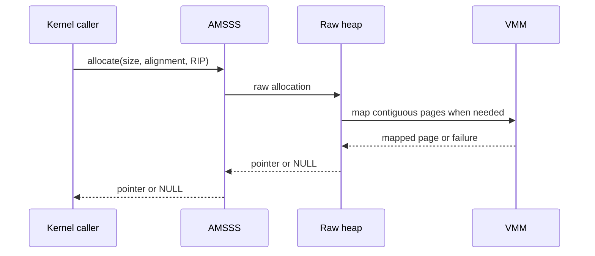

# System Overview

AMSSS v2 coordinates allocation, pressure observation, reclaim, health reporting, and bounded telemetry. It does not replace the heap allocator or VMM.

```mermaid
sequenceDiagram
  participant K as Kernel caller
  participant A as AMSSS
  participant H as Raw heap
  participant V as VMM
  K->>A: allocate(size, alignment, RIP)
  A->>H: raw allocation
  H->>V: map contiguous pages when needed
  V-->>H: mapped page or failure
  H-->>A: pointer or NULL
  A-->>K: pointer or NULL
```
