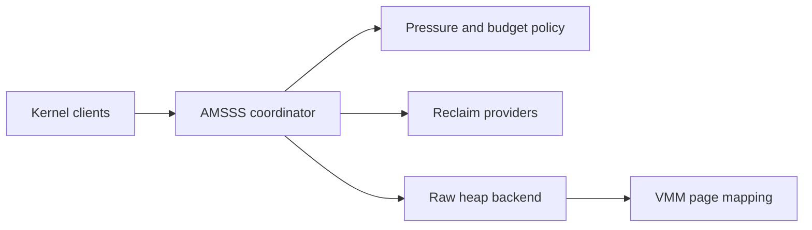

# AMSSS v2 Architecture

AMSSS v2 is the bounded memory coordination layer between kernel allocation clients and the legacy diagnostic heap. Public allocation requests flow through the coordinator; backend calls never re-enter public allocation APIs.

## Guarantees

- Static bounded metadata: 16 providers, 16 cache entries, and 64 forensic events.
- Existing heap canaries, caller RIP, BMLE accounting, and diagnostics remain authoritative.
- Ordinary allocation exhaustion returns `NULL` after bounded expansion and reclaim attempts.

## Current limits

The implementation has no NUMA policy, swapping, compaction, huge-page manager, or asynchronous worker. Expansion is contiguous in the heap virtual range and uses the existing VMM only.
