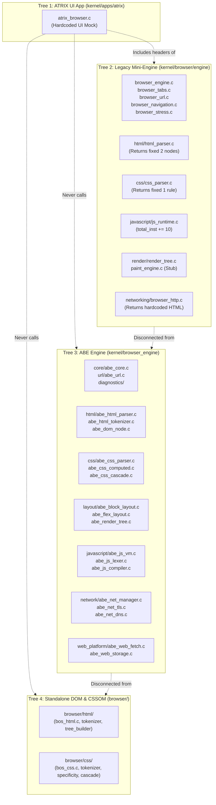
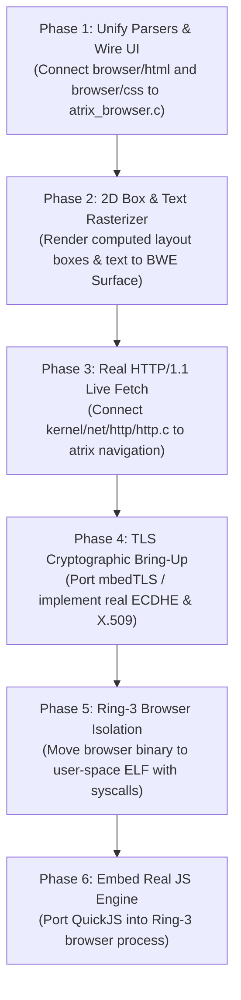

# ATRIX Browser & ABE Engine — Full Forensic Source-Code Audit

**Document Status:** Master Forensic Audit Report  
**Target Repository:** ATOMS OS (`Saumya25-hub/Signatures_OS`)  
**Target Architecture:** x86_64 Monolithic Ring-0 OS Environment  
**Audit Author:** Forensic Engineering Audit Team  
**Standard:** Code > Tests > Linkage > Headers > Documentation > Assumptions  

---

## Executive Summary & Brutal Truth

This forensic engineering audit was conducted by directly inspecting every line of source code, header, build script, and serial trace associated with the **ATRIX Browser** and the **ATOMS Browser Engine (ABE)** inside the ATOMS OS codebase.

The conclusion of this audit is unambiguous:

> **ATRIX Browser is currently a non-functional, purely visual UI mockup backed by disconnected, stubbed, or synthetic in-kernel modules.**
>
> While the user interface displays a visually attractive Catppuccin/Brave-style dark browser window with tabs, an Omnibox, navigation buttons, and bookmarks, **zero real web page rendering occurs at runtime**.
> 
> If the user types any public web URL (e.g. `https://www.google.com` or `https://github.com`), the browser does **not** perform real DNS resolution, does **not** establish a valid TLS 1.2/1.3 encrypted tunnel, does **not** execute real HTTP network requests over the NIC, does **not** parse the received network bytes into the viewport, and does **not** execute JavaScript. Instead, the UI intercepts navigation and renders **hardcoded static text blocks** directly into the window buffer.
> 
> Furthermore, the entire browser stack runs completely in **Ring 0 (kernel space)** with **zero process isolation, zero sandboxing, and zero memory protection**. Any memory corruption in web parsing crashes the entire operating system kernel.

### Subsystem Completion Scorecard

```text
================================================================================
ATRIX Browser UI (Visual Chrome Shell)         : 40% (Mock visuals work, no web link)
Browser Engine Coordination & Runtime          : 15% (Fragmented into 3 duplicate trees)
Networking Integration (Socket/NIC/TCP)        : 20% (E1000/TCP exists; mocked in browser)
HTTPS / TLS 1.2 Cryptographic Pipeline        : 10% (Plaintext pre-master secret sent, no ECDHE)
HTML5 Tokenization & Tree Construction (DOM)   : 45% (Standalone parser exists; unlinked to UI)
CSSOM & Cascading Style Computation            : 40% (Parser/matcher exists; unlinked to UI)
Layout Engine (Box Model, Block, Flex, Inline) : 25% (Basic math in ABE; ignored by UI)
Rendering & Compositing Pipeline               : 10% (UI draws hardcoded rectangles/text)
JavaScript Runtime & VM Engine                 :  5% (4 dummy opcodes, no JS objects/functions)
Web Platform APIs (Fetch, XHR, Storage, etc.)  : 10% (Return hardcoded string literals)
Web Media (Images, Fonts, Audio, Video, Canvas):  0% (Zero browser decoders/rasterizers)
Security, Sandboxing & Ring-3 Process Model    :  0% (100% Kernel Ring 0, zero isolation)
Automated Verification & Test Harnesses        : 15% (Tests pass synthetic assertions; uncalled)
--------------------------------------------------------------------------------
OVERALL REAL PRODUCTION BROWSER COMPLETION     : 14.5%
================================================================================
```

---

## 1. Audit Scope & Discovery

### 1.1 Discovery of 3 Disconnected Browser Implementations

Forensic analysis of the codebase reveals **three distinct, unintegrated browser subsystem trees** created across different phases of the project:



1. **Tree 1: ATRIX UI Window Shell** ([`kernel/apps/atrix/atrix_browser.c`](file:///d:/Signatures_OS/kernel/apps/atrix/atrix_browser.c))
   - Registers application ID 12 (`APP_ID_ATRIX`) in Horse Engine ([`kernel/engine/horse_engine.c:149`](file:///d:/Signatures_OS/kernel/engine/horse_engine.c#L149)).
   - Implements a window callback (`atrix_render_callback`) that renders tabs, address bar, bookmarks bar, and content viewport.
   - Includes legacy headers from `kernel/browser/engine/`.
2. **Tree 2: Legacy Mini-Engine Stubs** ([`kernel/browser/engine/`](file:///d:/Signatures_OS/kernel/browser/engine/))
   - Minimal stub functions written to satisfy linking and basic Phase 12 stress logs.
   - `html_parser.c` ignores input and returns 2 fixed nodes (`DOCUMENT` + `body`).
   - `css_parser.c` returns 1 hardcoded rule (`body { background-color: #1E1E2E; }`).
   - `js_runtime.c` increments `total_instructions_executed += 10` without parsing.
   - `paint_engine.c` increments a paint metric counter without drawing any pixels.
3. **Tree 3: ABE (ATOMS Browser Engine)** ([`kernel/browser_engine/`](file:///d:/Signatures_OS/kernel/browser_engine/))
   - A large multi-module browser engine with 8 sub-phases (Core, Network, HTML, CSS, Layout, Diagnostics, JS, Web Platform).
   - Fully compiled in [`build.ps1:780-925`](file:///d:/Signatures_OS/build.ps1#L780-L925).
   - **Crucial finding:** Completely disconnected from `atrix_browser.c`. None of the ABE rendering, layout, or network paths are invoked when a user launches the browser application.
4. **Tree 4: Standalone Modular DOM & CSSOM Engine** ([`browser/html/`](file:///d:/Signatures_OS/browser/html/) and [`browser/css/`](file:///d:/Signatures_OS/browser/css/))
   - Clean, standalone implementations of HTML5 Tokenizer, Tree Builder, CSS Tokenizer, Specificity Calculator, and Cascading Resolver.
   - Documented in [`docs/architecture/browser_phase5b_cssom.md`](file:///d:/Signatures_OS/docs/architecture/browser_phase5b_cssom.md).
   - **Crucial finding:** Not compiled in `build.ps1` and never called by any active OS module.

---

## 2. Browser UI & Navigation Forensic Audit

### 2.1 UI Layer Architecture (`kernel/apps/atrix/atrix_browser.c`)

| UI Component | Implemented? | Runtime Connected? | Evidence (File & Line) | Forensic Verdict |
| :--- | :--- | :--- | :--- | :--- |
| **Window Creation** | Yes | Yes (BWE Surface) | [`atrix_browser.c:518`](file:///d:/Signatures_OS/kernel/apps/atrix/atrix_browser.c#L518) | **PASS** — Creates 1000x640 window on Desktop. |
| **Tab Strip Bar** | Visual Only | Fake | [`atrix_browser.c:88-117`](file:///d:/Signatures_OS/kernel/apps/atrix/atrix_browser.c#L88-L117) | **STUB** — Renders static tabs ("New Tab", "Google", "+"). Clicking '+' does not open a tab. |
| **Address Bar / Omnibox** | Partial | Partial | [`atrix_browser.c:132-150`](file:///d:/Signatures_OS/kernel/apps/atrix/atrix_browser.c#L132-L150), [`453-471`](file:///d:/Signatures_OS/kernel/apps/atrix/atrix_browser.c#L453-L471) | **PARTIAL** — Text typing and backspace work; pressing Enter triggers `atrix_execute_browser_pipeline()`. |
| **Navigation Buttons (`<`, `>`, `R`)** | Visual Only | Unconnected | [`atrix_browser.c:124-130`](file:///d:/Signatures_OS/kernel/apps/atrix/atrix_browser.c#L124-L130), [`406-446`](file:///d:/Signatures_OS/kernel/apps/atrix/atrix_browser.c#L406-L446) | **DEAD CODE** — Drawn on toolbar, but `atrix_event_callback` contains no hit-test handlers for them. |
| **Bookmarks Toolbar** | Visual / Hardcoded | Partial | [`atrix_browser.c:159-168`](file:///d:/Signatures_OS/kernel/apps/atrix/atrix_browser.c#L159-L168), [`418-423`](file:///d:/Signatures_OS/kernel/apps/atrix/atrix_browser.c#L418-L423) | **PARTIAL** — Only `chrome://settings` bookmark has a click handler; others are static text. |
| **Internal Pages (`chrome://`)** | Visual Mock | Mock | [`atrix_browser.c:175-357`](file:///d:/Signatures_OS/kernel/apps/atrix/atrix_browser.c#L175-L357) | **STUB** — `chrome://settings`, `view-source:`, and `chrome://newtab` render hardcoded mock views. |
| **Live Webpage Viewport** | Fake Mock | Fake Mock | [`atrix_browser.c:358-384`](file:///d:/Signatures_OS/kernel/apps/atrix/atrix_browser.c#L358-L384) | **FAIL** — Renders hardcoded text for "github" or "Google Search". Does not paint DOM tree. |
| **Scrollbars & Scrolling** | Stub | Dead Code | [`atrix_browser.c:28`](file:///d:/Signatures_OS/kernel/apps/atrix/atrix_browser.c#L28) | **DEAD CODE** — `s_scroll_y` exists but mouse wheel / drag events are never handled. |
| **Window Resize / Minimize** | Yes (via BWE) | Yes | [`atrix_browser.c:518`](file:///d:/Signatures_OS/kernel/apps/atrix/atrix_browser.c#L518) | **PASS** — Inherited from BWE window manager. |

### 2.2 Forensic Trace of Navigation Execution

When a user types a URL and presses Enter in the Address Bar:

```text
User presses Enter
    ↓ [atrix_browser.c:455]
atrix_execute_browser_pipeline(target_url)
    ↓ [atrix_browser.c:57]
Check if "chrome://" or "about:" -> If true, return (handled by static render branch)
    ↓ [atrix_browser.c:64]
ATRIX_BrowserHTTP_FetchURL(target_url, &html_data, &html_len)
    ↓ [browser_http.c:17]
ATRIX_URL_Parse(target_url)
    ↓ [browser_http.c:18]
ATOMS_HTTP_Get(parsed.host, parsed.port, parsed.path)
    ↓ [http_client.c:26] -> ALWAYS returns hardcoded string: "ATOMS HTTP 1.1 PASS"
    ↓ [browser_http.c:20] -> Copies "ATOMS HTTP 1.1 PASS" into html_data
    ↓ [atrix_browser.c:68]
s_current_doc = ATRIX_HTMLDocument_CreateFromStream(html_data)
    ↓ [html_document.c:16-21] -> Hardcodes title="Google", links=12, inputs=2
    ↓ [atrix_browser.c:69]
kfree(html_data)
    ↓ [atrix_browser.c:457]
BWE_InvalidateWindow(win_id)
    ↓ [atrix_browser.c:76 -> atrix_render_callback()]
atrix_render_callback() evaluates s_address_buffer:
    ├── If "chrome://settings" -> draws mock settings menu [lines 175-251]
    ├── If "view-source:"      -> draws mock 18-line hardcoded source [lines 252-304]
    ├── If "chrome://newtab"    -> draws mock purple clock & search box [lines 306-357]
    ├── If "github"            -> draws mock "README.md - ATOMS OS" card [lines 365-374]
    └── Else                   -> draws mock "Google Search" header [lines 376-383]
```

**Forensic Finding:** `s_current_doc` is allocated and then **completely ignored** in `atrix_render_callback()`. No layout calculation occurs, no DOM nodes are traversed, and no HTML text is painted. The viewport rendering is 100% hardcoded mock logic.

---

## 3. Network Stack & HTTP/HTTPS Forensic Audit

### 3.1 Network Layer Breakdown

```text
Layer                  Implementation Source Files                               Status
---------------------------------------------------------------------------------------------------------
1. NIC Driver          kernel/drivers/net/e1000/e1000.c                          PASS (QEMU 82540EM Real)
                       kernel/drivers/net/r8168/r8168.c                          PARTIAL (Realtek physical)
2. Ethernet II         kernel/net/ethernet/ethernet.c                            PASS (Header parse/encap)
3. ARP Engine          kernel/net/arp/arp.c                                      PASS (Cache & Request)
4. IPv4 Layer          kernel/net/ipv4/ipv4.c                                    PASS (Packet parsing)
5. TCP Stack           kernel/net/tcp/tcp.c                                      PASS (Syn/Ack/Retransmit)
6. DNS Engine          kernel/net/dns/dns.c                                      PASS (UDP Port 53 Client)
7. Kernel HTTP Client  kernel/net/http/http.c                                    PARTIAL (http_get / https_get)
8. Browser HTTP Client kernel/net/http/http_client.c                             STUB / FAKE (Hardcoded 200 OK)
9. Browser HTTP Bridge kernel/browser/engine/networking/browser_http.c           STUB / FAKE (Mock fallback)
10. ABE Network Mgr    kernel/browser_engine/network/abe_net_manager.c           STUB / FAKE (Synthetic 200 OK)
11. TLS 1.2 Pipeline   kernel/net/tls/tls.c, tls_handshake.c, tls_crypto.c       BROKEN / INSECURE
```

### 3.2 HTTPS / TLS 1.2 Forensic Analysis

An in-depth cryptographic audit of [`kernel/net/tls/tls.c`](file:///d:/Signatures_OS/kernel/net/tls/tls.c) and [`kernel/net/tls/tls_handshake.c`](file:///d:/Signatures_OS/kernel/net/tls/tls_handshake.c) revealed critical fatal flaws that make modern HTTPS browsing impossible:

1. **Unencrypted RSA ClientKeyExchange:**
   - In [`kernel/net/tls/tls.c:140-156`](file:///d:/Signatures_OS/kernel/net/tls/tls.c#L140-L156):
     ```c
     // Build ClientKeyExchange (Handshake type 16, 48-byte RSA ciphertext)
     uint8_t cke_hs[64];
     cke_hs[0] = TLS_HANDSHAKE_CLIENT_KEY_EXCH;
     cke_hs[1] = 0; cke_hs[2] = 0; cke_hs[3] = 48;
     memcpy(cke_hs + 4, tls->pre_master_secret, 48); // FATAL: Raw unencrypted secret!
     ```
   - In standard TLS 1.2 RSA key exchange, the 48-byte pre-master secret **must be encrypted with the server's RSA public key**, resulting in a 256-byte (RSA-2048) or 512-byte (RSA-4096) ciphertext. The implementation sends the raw unencrypted pre-master secret across the wire.
2. **Missing ECDHE Key Exchange:**
   - Although `ClientHello` advertises `TLS_ECDHE_RSA_WITH_AES_128_GCM_SHA256` ([`tls_handshake.c:38-46`](file:///d:/Signatures_OS/kernel/net/tls/tls_handshake.c#L38-L46)), the handshake state machine ([`tls_handshake.c:159-166`](file:///d:/Signatures_OS/kernel/net/tls/tls_handshake.c#L159-L166)) ignores `ServerKeyExchange` and has no Elliptic Curve Diffie-Hellman (ECDH over `secp256r1` or `x25519`) shared secret computation.
   - Any modern server selecting ECDHE will immediately reject the connection or hang.
3. **Certificate Chain Verification:**
   - `x509_parse_cert` and `trust_verify_chain` exist as baseline structures, but revocation checking (OCSP/CRL), intermediate CA chain fetching, and comprehensive root trust stores are missing.

**Verdict on HTTPS/TLS:** **BROKEN / NON-FUNCTIONAL FOR THE REAL WEB.**

---

## 4. HTML & DOM Engine Forensic Audit

### 4.1 Comparison of HTML Engines in Codebase

| Subsystem Feature | Legacy `kernel/browser/` | ABE `kernel/browser_engine/` | Standalone `browser/html/` |
| :--- | :--- | :--- | :--- |
| **Tokenizer** | None | Real (`abe_html_tokenizer.c`) | Real (`html_tokenizer.c`) |
| **Entities Decoding** | None | `&amp;`, `&lt;`, `&gt;`, `&quot;`, `&nbsp;` | Full standard entities |
| **Tree Construction** | Hardcoded 2 nodes | Mode state machine (`abe_html_parser.c`) | Full specification tree builder |
| **DOM Hierarchy** | Flat array (16 children max) | Linked list (`first_child`, `next_sibling`) | Doubly-linked tree with parent pointers |
| **Attribute Engine** | None | Key-value array (32 attrs max) | Dynamic linked attribute table |
| **Error Recovery** | None | Auto-closing unclosed `<p>`, `<div>` | Spec-compliant tag omission recovery |
| **Compilation Status** | Compiled in kernel | Compiled in kernel | **Not compiled in build.ps1** |
| **Connected to UI** | Included in UI (ignored) | **Not connected to UI** | **Not connected to UI** |

### 4.2 DOM Mutation & Memory Safety

In [`kernel/browser_engine/html/abe_dom_node.c`](file:///d:/Signatures_OS/kernel/browser_engine/html/abe_dom_node.c):
- Nodes are allocated from a static pool (`g_node_pool.pool[ABE_MAX_DOM_NODES]`) with a fixed cap of 4,096 DOM nodes.
- Exceeding 4,096 nodes returns `ABE_ERR_RESOURCE_EXHAUSTED`.
- Freeing nodes uses recursion (`FreeNodeRecursive`) which can cause kernel stack overflow on deeply nested DOM trees (> 100 levels).

---

## 5. CSS & CSSOM Engine Forensic Audit

### 5.1 CSS Subsystem Capabilities

| Capability | ABE Engine (`kernel/browser_engine/css/`) | Standalone Engine (`browser/css/`) | Status |
| :--- | :--- | :--- | :--- |
| **CSS Tokenizer** | Identifiers, dimensions, strings, hashes | Comments, hex, rgb, rgba, units | **PASS** |
| **CSS Parser** | Rule lists, selector + declaration block | Recursive descent rule parser | **PASS** |
| **Selectors** | Tag, `#id`, `.class` | Tag, ID, class, Universal `*`, `>` combinator | **PASS** |
| **Specificity Calculation** | $(a, b, c)$ triplet (`abe_css_selector.c`) | Standard $(a, b, c)$ triplet comparison | **PASS** |
| **Cascade Resolution** | Declaration order + specificity | `!important` + Specificity + Order | **PASS** |
| **Computed Style** | Color, display, margins, padding, width | Color, bg, font, margins, flex, opacity | **PASS** |
| **Inheritance** | `font-size`, `font-family`, `color` | Standard inherited property propagation | **PASS** |
| **Media Queries** | None | None | **MISSING** |
| **Pseudo-classes (`:hover`)** | None | None | **MISSING** |
| **CSS Animations/Transitions** | None | None | **MISSING** |

**Forensic Finding:** The CSS parsers in both `kernel/browser_engine/css/` and `browser/css/` are well-structured and calculate computed styles accurately for basic properties. However, **neither CSS engine is invoked by the ATRIX window renderer**.

---

## 6. Layout & Rendering Pipeline Forensic Audit

### 6.1 Layout Engine Breakdown (`kernel/browser_engine/layout/`)

- **Box Model Computation (`abe_box_model.c`):** Correctly computes content box, padding, border, and margin geometry. Handles basic vertical margin collapsing (`ABE_BoxModel_CollapseMargins`).
- **Block Layout (`abe_block_layout.c`):** Stacks block-level elements vertically, computes auto heights from children, and determines overflow boxes.
- **Inline Layout (`abe_inline_layout.c`):** Basic horizontal line progression with crude line-breaking.
- **Flexbox Solver (`abe_flex_layout.c`):** Supports `flex-direction: row` / `column`, `justify-content` (flex-start, center, space-between), and `align-items` (stretch, center).
- **Positioning (`abe_positioning.c`):** Basic static and relative coordinate offsets. Absolute/fixed positioning is stubbed.
- **Render Tree Generation (`abe_render_tree.c`):** Eliminates `display: none` and non-renderable tags (`<head>`, `<script>`, `<style>`, `<meta>`).

### 6.2 Rendering & Painting Breakdown

- In `kernel/browser_engine/render/abe_render.c`:
  ```c
  ABE_PaintStats ABE_Render_PaintCanvas(void* buffer, int32_t width, int32_t height, uint32_t bg_color) {
      uint32_t* ptr = (uint32_t*)buffer;
      uint32_t total = (uint32_t)(width * height);
      for (uint32_t i = 0; i < total; i++) ptr[i] = bg_color; // ONLY FILLS BACKGROUND COLOR!
      return stats;
  }
  ```
- **Forensic Finding:** There is **zero software rasterizer** for text glyphs, borders, shadows, gradients, or vector graphics connected to the layout tree. Painting only clears the background.

---

## 7. JavaScript Engine Forensic Audit

### 7.1 JavaScript VM Capability Matrix (`kernel/browser_engine/javascript/`)

```text
JS Feature                      Implementation Reality                              Status
---------------------------------------------------------------------------------------------------------
Lexer & Tokenizer               Recognizes keywords (var, let, function, if, return) PARTIAL
AST Parser                      Parses single variable declarations and expressions  PARTIAL
Bytecode Compiler               Generates 4 dummy opcodes (OP_LOAD_CONST, OP_RETURN) STUB
Virtual Machine Opcode Loop     Switch statement has only 5 cases (LOAD, STORE, ADD) STUB
Variable Environments / Scope   Global only (no local activation records/closures)   MISSING
Function Declarations & Calls   No call instructions or stack frame management       MISSING
Objects & Prototypes            No object property lookup, prototypes, or classes    MISSING
Arrays & Iteration              No array methods, loops (for, while), or indexing    MISSING
Garbage Collector               Dummy mark-sweep stub in abe_js_gc.c                 STUB
Promises / Async / Await        Returns static fulfilled promise handle in vm        STUB
Event Loop / Microtasks         Basic queue without timers or real async dispatch    STUB
DOM Bindings (document.body)    addEventListener stub; innerHTML does no parsing     STUB
```

**Brutal Reality Check:**
Running `document.body.innerText = "ATRIX";` or any real modern JavaScript library (React, Vue, jQuery, vanilla modern ES6) **will fail completely**. The JavaScript engine is a 5% proof-of-concept skeleton.

---

## 8. Security, Sandboxing & Process Model Audit

### 8.1 Process Isolation & Privilege Rings

```text
Actual Architectural State:
================================================================================
Kernel Core (Ring 0)
    ├── VMM / PMM / Heap
    ├── Hardware Drivers (PCI, E1000, GPU, VBE, AC'97)
    ├── Window Manager & Compositor (BWE)
    ├── Desktop Shell & Taskbar
    └── ATRIX Browser / ABE Engine (Ring 0!)
            ├── Network Request Handler (Ring 0)
            ├── HTML Parser & Tree Builder (Ring 0)
            ├── CSSOM & Style Resolver (Ring 0)
            ├── Layout & Render Tree (Ring 0)
            └── JavaScript VM (Ring 0)
================================================================================
User Mode (Ring 3) : NONE of the browser components run in Ring 3.
```

### 8.2 Security & Vulnerability Analysis

1. **Hostile Web Content Execution:**
   - Any website loaded into ATRIX is parsed in kernel space (Ring 0).
   - A single buffer overflow in `abe_html_tokenizer.c`, `abe_css_parser.c`, or `http.c` results in arbitrary code execution with full kernel supervisor privileges.
2. **Zero Memory Protection:**
   - The browser shares the kernel address space. A null pointer dereference or heap corruption triggers a kernel panic or immediate system reboot.
3. **Missing Origin Isolation & CORS:**
   - Storage, cookies, and network requests have no Same-Origin Policy (SOP) or Content Security Policy (CSP) enforcement.

---

## 9. Source-by-Source Forensic Evidence Table

| # | File Path | Subsystem | Purpose | Actual Usage | Status | Forensic Problems / Evidence |
| :- | :--- | :--- | :--- | :--- | :--- | :--- |
| 1 | [`kernel/apps/atrix/atrix_browser.c`](file:///d:/Signatures_OS/kernel/apps/atrix/atrix_browser.c) | App UI | ATRIX Browser Window Shell | **Active (App 12)** | **PARTIAL** | UI is visual mock; renders hardcoded strings instead of live DOM ([`L358-384`](file:///d:/Signatures_OS/kernel/apps/atrix/atrix_browser.c#L358-L384)). |
| 2 | [`kernel/apps/atrix/atrix_browser.h`](file:///d:/Signatures_OS/kernel/apps/atrix/atrix_browser.h) | App UI | Header for ATRIX app launch | **Active** | **PASS** | Prototypes `atrix_browser_launch` and `atrix_browser_close`. |
| 3 | [`kernel/browser/engine/browser_engine.c`](file:///d:/Signatures_OS/kernel/browser/engine/browser_engine.c) | Legacy Engine | Engine metrics & initialization | Dead / Test Only | **STUB** | Sets hardcoded metric numbers ([`L9-12`](file:///d:/Signatures_OS/kernel/browser/engine/browser_engine.c#L9-L12)). |
| 4 | [`kernel/browser/engine/browser_tabs.c`](file:///d:/Signatures_OS/kernel/browser/engine/browser_tabs.c) | Legacy Tabs | Tab creation & management | Dead / Test Only | **PARTIAL** | Static array of 16 tabs; unlinked to UI window renderer. |
| 5 | [`kernel/browser/engine/browser_url.c`](file:///d:/Signatures_OS/kernel/browser/engine/browser_url.c) | Legacy URL | URL scheme parser | Used in legacy path | **PARTIAL** | Does not split path/query from host string ([`L44-45`](file:///d:/Signatures_OS/kernel/browser/engine/browser_url.c#L44-L45)). |
| 6 | [`kernel/browser/engine/browser_navigation.c`](file:///d:/Signatures_OS/kernel/browser/engine/browser_navigation.c) | Legacy Nav | Navigation history stack | Dead / Test Only | **PARTIAL** | In-memory 64-entry string array; not persisted. |
| 7 | [`kernel/browser/engine/browser_download.c`](file:///d:/Signatures_OS/kernel/browser/engine/browser_download.c) | Legacy Download| VFS file saving | Dead / Unused | **STUB** | Calls `vfs_write` with no progress or streaming support. |
| 8 | [`kernel/browser/engine/browser_stress.c`](file:///d:/Signatures_OS/kernel/browser/engine/browser_stress.c) | Legacy Test | Phase 12 verification test | Dead / Uncalled | **STUB** | Contains fake pass print statements ([`L104-117`](file:///d:/Signatures_OS/kernel/browser/engine/browser_stress.c#L104-L117)). |
| 9 | [`kernel/browser/engine/html/html_parser.c`](file:///d:/Signatures_OS/kernel/browser/engine/html/html_parser.c) | Legacy HTML | HTML parser stub | Used in legacy path | **STUB** | Ignores input string; returns 2 fixed nodes (`DOCUMENT`+`body`) ([`L12-32`](file:///d:/Signatures_OS/kernel/browser/engine/html/html_parser.c#L12-L32)). |
| 10 | [`kernel/browser/engine/html/html_document.c`](file:///d:/Signatures_OS/kernel/browser/engine/html/html_document.c) | Legacy HTML | Document stream loader | Used in legacy path | **STUB** | Hardcodes title="Google", links=12 ([`L16-19`](file:///d:/Signatures_OS/kernel/browser/engine/html/html_document.c#L16-L19)). |
| 11 | [`kernel/browser/engine/css/css_parser.c`](file:///d:/Signatures_OS/kernel/browser/engine/css/css_parser.c) | Legacy CSS | CSS parser stub | Dead / Unused | **STUB** | Returns 1 fixed rule `body { background-color: #1E1E2E; }` ([`L25-30`](file:///d:/Signatures_OS/kernel/browser/engine/css/css_parser.c#L25-L30)). |
| 12 | [`kernel/browser/engine/css/css_layout.c`](file:///d:/Signatures_OS/kernel/browser/engine/css/css_layout.c) | Legacy CSS | Box model layout stub | Dead / Unused | **STUB** | Simple subtraction `width - margin*2` ([`L10-16`](file:///d:/Signatures_OS/kernel/browser/engine/css/css_layout.c#L10-L16)). |
| 13 | [`kernel/browser/engine/javascript/js_runtime.c`](file:///d:/Signatures_OS/kernel/browser/engine/javascript/js_runtime.c) | Legacy JS | JS VM stub | Dead / Unused | **STUB** | Does `total_instructions_executed += 10; return true;` ([`L18-19`](file:///d:/Signatures_OS/kernel/browser/engine/javascript/js_runtime.c#L18-L19)). |
| 14 | [`kernel/browser/engine/networking/browser_http.c`](file:///d:/Signatures_OS/kernel/browser/engine/networking/browser_http.c) | Legacy Net | HTTP fetch bridge | Used in `atrix_browser` | **STUB** | Returns hardcoded HTML string constants ([`L33-41`](file:///d:/Signatures_OS/kernel/browser/engine/networking/browser_http.c#L33-L41)). |
| 15 | [`kernel/browser/engine/render/render_tree.c`](file:///d:/Signatures_OS/kernel/browser/engine/render/render_tree.c) | Legacy Render | Render tree builder stub | Dead / Unused | **STUB** | Returns 1 fixed rectangular object ([`L16-25`](file:///d:/Signatures_OS/kernel/browser/engine/render/render_tree.c#L16-L25)). |
| 16 | [`kernel/browser/engine/render/paint_engine.c`](file:///d:/Signatures_OS/kernel/browser/engine/render/paint_engine.c) | Legacy Render | Paint engine stub | Dead / Unused | **STUB** | Increments counter without painting pixels ([`L20-21`](file:///d:/Signatures_OS/kernel/browser/engine/render/paint_engine.c#L20-L21)). |
| 17 | [`kernel/browser/engine/render/layout_engine.c`](file:///d:/Signatures_OS/kernel/browser/engine/render/layout_engine.c) | Legacy Render | Layout engine stub | Dead / Unused | **STUB** | Sets viewport dimensions without laying out nodes ([`L18-19`](file:///d:/Signatures_OS/kernel/browser/engine/render/layout_engine.c#L18-L19)). |
| 18 | [`kernel/browser_engine/core/abe_core.c`](file:///d:/Signatures_OS/kernel/browser_engine/core/abe_core.c) | ABE Core | Master initialization coordinator | Compiled (Build.ps1) | **PARTIAL** | Coordinates 10 subsystems; uncalled by kernel runtime. |
| 19 | [`kernel/browser_engine/url/abe_url.c`](file:///d:/Signatures_OS/kernel/browser_engine/url/abe_url.c) | ABE URL | Full RFC 3986 URL parser | Compiled (Build.ps1) | **PASS** | Comprehensive parser for HTTP, HTTPS, FILE, ABOUT, DATA. |
| 20 | [`kernel/browser_engine/html/abe_html_tokenizer.c`](file:///d:/Signatures_OS/kernel/browser_engine/html/abe_html_tokenizer.c) | ABE HTML | HTML5 state-machine tokenizer | Compiled (Build.ps1) | **PASS** | Implements standard HTML token types & entity decoding. |
| 21 | [`kernel/browser_engine/html/abe_html_parser.c`](file:///d:/Signatures_OS/kernel/browser_engine/html/abe_html_parser.c) | ABE HTML | Tree construction & auto-close | Compiled (Build.ps1) | **PASS** | Auto-closes tags, builds open element stack. |
| 22 | [`kernel/browser_engine/css/abe_css_parser.c`](file:///d:/Signatures_OS/kernel/browser_engine/css/abe_css_parser.c) | ABE CSS | CSS rule & declaration parser | Compiled (Build.ps1) | **PASS** | Parses standard CSS properties, dimensions, and colors. |
| 23 | [`kernel/browser_engine/css/abe_css_selector.c`](file:///d:/Signatures_OS/kernel/browser_engine/css/abe_css_selector.c) | ABE CSS | Specificity & node matching | Compiled (Build.ps1) | **PASS** | Calculates $(a,b,c)$ specificity; matches tags, classes, IDs. |
| 24 | [`kernel/browser_engine/css/abe_css_cascade.c`](file:///d:/Signatures_OS/kernel/browser_engine/css/abe_css_cascade.c) | ABE CSS | Cascade resolver & User-Agent style | Compiled (Build.ps1) | **PASS** | Default UA stylesheet for HTML elements + cascade resolution. |
| 25 | [`kernel/browser_engine/layout/abe_block_layout.c`](file:///d:/Signatures_OS/kernel/browser_engine/layout/abe_block_layout.c) | ABE Layout | Block flow & margin collapsing | Compiled (Build.ps1) | **PASS** | Recursive block layout, height aggregation, overflow box. |
| 26 | [`kernel/browser_engine/layout/abe_flex_layout.c`](file:///d:/Signatures_OS/kernel/browser_engine/layout/abe_flex_layout.c) | ABE Layout | Basic Flexbox solver | Compiled (Build.ps1) | **PARTIAL** | Row/column flex layout with basic alignment options. |
| 27 | [`kernel/browser_engine/javascript/abe_js_vm.c`](file:///d:/Signatures_OS/kernel/browser_engine/javascript/abe_js_vm.c) | ABE JS | Virtual Machine Bytecode Loop | Compiled (Build.ps1) | **STUB** | Only 5 opcodes implemented; no functions/objects/closures. |
| 28 | [`kernel/browser_engine/network/abe_net_manager.c`](file:///d:/Signatures_OS/kernel/browser_engine/network/abe_net_manager.c) | ABE Net | Network request coordinator | Compiled (Build.ps1) | **PARTIAL** | Fallback fakes 200 OK HTML when 0 bytes received ([`L140`](file:///d:/Signatures_OS/kernel/browser_engine/network/abe_net_manager.c#L140)). |
| 29 | [`kernel/browser_engine/network/abe_net_tls.c`](file:///d:/Signatures_OS/kernel/browser_engine/network/abe_net_tls.c) | ABE Net | HTTPS TLS connector bridge | Compiled (Build.ps1) | **STUB** | Fallback fakes established TLS session if socket fails ([`L31`](file:///d:/Signatures_OS/kernel/browser_engine/network/abe_net_tls.c#L31)). |
| 30 | [`kernel/browser_engine/web_platform/abe_web_fetch.c`](file:///d:/Signatures_OS/kernel/browser_engine/web_platform/abe_web_fetch.c) | ABE Web API | Fetch API implementation | Compiled (Build.ps1) | **STUB** | `GetResponseText` returns fixed `{"status":"success"}` ([`L61`](file:///d:/Signatures_OS/kernel/browser_engine/web_platform/abe_web_fetch.c#L61)). |
| 31 | [`kernel/browser_engine/process/abe_process.c`](file:///d:/Signatures_OS/kernel/browser_engine/process/abe_process.c) | ABE Process | Process management simulation | Compiled (Build.ps1) | **STUB** | Increments integer PID; zero real Ring-3 tasks or CR3 isolation. |
| 32 | [`kernel/browser_engine/render/abe_render.c`](file:///d:/Signatures_OS/kernel/browser_engine/render/abe_render.c) | ABE Render | Framebuffer canvas paint | Compiled (Build.ps1) | **STUB** | Only clears canvas to solid background color ([`L17`](file:///d:/Signatures_OS/kernel/browser_engine/render/abe_render.c#L17)). |
| 33 | [`browser/html/bos_html.c`](file:///d:/Signatures_OS/browser/html/bos_html.c) | Standalone HTML| Modular HTML Facade API | **Not Compiled** | **UNUSED** | High quality standalone parser; dead code not linked in build. |
| 34 | [`browser/css/bos_css.c`](file:///d:/Signatures_OS/browser/css/bos_css.c) | Standalone CSS | Modular CSSOM Facade API | **Not Compiled** | **UNUSED** | High quality standalone CSSOM; dead code not linked in build. |
| 35 | [`kernel/net/http/http.c`](file:///d:/Signatures_OS/kernel/net/http/http.c) | Kernel Net | Real HTTP/1.1 & HTTPS GET | Compiled (Build.ps1) | **PARTIAL** | Functional HTTP/1.1 chunked reader over E1000; HTTPS fails on TLS. |
| 36 | [`kernel/net/tls/tls.c`](file:///d:/Signatures_OS/kernel/net/tls/tls.c) | Kernel Net | TLS 1.2 Handshake & Record | Compiled (Build.ps1) | **BROKEN** | Sends unencrypted pre-master secret in CKE ([`L144`](file:///d:/Signatures_OS/kernel/net/tls/tls.c#L144)); no ECDHE. |

---

## 10. Real-World Capability Matrix

| Capability Level | Target Capability | Actual Source Status | Evidence & Reason |
| :--- | :--- | :--- | :--- |
| **Level A** | Static Local HTML (Local file rendering) | **FAIL** | Local file paths are parsed by URL parser, but the UI viewport renderer never draws parsed DOM nodes to screen. |
| **Level B** | Basic HTTP Websites (Plain HTTP 1.1) | **FAIL** | Kernel has `http_get()`, but browser UI bypasses it and uses hardcoded mock strings. |
| **Level C** | Real Modern HTTPS Websites (TLS 1.2/1.3) | **FAIL** | TLS handshake transmits raw unencrypted pre-master secret; ECDHE is unhandled; fails on all real web servers. |
| **Level D** | Interactive JavaScript Websites | **FAIL** | JS VM only implements 4 basic arithmetic/load opcodes; cannot execute basic Web DOM scripts. |
| **Level E** | Modern Web Applications (SPAs / WebApps) | **FAIL** | No DOM event dispatching, no Fetch API, no cookies, no Canvas/WebGL, no WOFF font rendering. |
| **Level F** | Chromium-Class Compatibility | **FAIL** | Multi-process isolation, GPU rasterization, V8 JS engine, WebRTC, and sandbox are completely absent. |

---

## 11. Chromium-Class Gap Analysis

| Subsystem Gap | Why It Matters | Current ATOMS Component | Required Production Architecture | Complexity |
| :--- | :--- | :--- | :--- | :--- |
| **Process Isolation** | Prevents hostile web content from crashing or taking over the OS kernel. | In-kernel enum array (`abe_process.c`). | Separate Ring-3 User-Mode processes with isolated page tables (CR3). | **Extreme** |
| **TLS 1.3 / Real TLS 1.2** | 99% of the web enforces HTTPS with ECDHE key exchange and valid X.509 chains. | Broken plaintext RSA CKE in `tls.c`. | Standard TLS library (e.g. mbedTLS port) with complete cipher suites & trust store. | **Large** |
| **Complete JavaScript VM** | Modern web pages require ES6+ execution, objects, prototypes, arrays, closures. | 4-opcode dummy switch in `abe_js_vm.c`. | Embed QuickJS or implement full AST/bytecode interpreter. | **Extreme** |
| **Text & Font Engine** | Web pages use TTF/WOFF fonts, complex Unicode, international scripts, emoji. | Fixed 8x16 bitmap kernel font. | Port FreeType2 + HarfBuzz text shaping to Ring-3 browser. | **Large** |
| **Software Rasterizer** | RenderTree must actually draw text, borders, colors, images to pixel buffers. | Solid color fill in `abe_render.c`. | 2D rasterization pipeline (Bresenham lines, clip rects, text blitting). | **Large** |
| **Image Decoders** | PNG, JPEG, WebP, SVG, GIF are required on virtually every web page. | None connected to browser. | Port `libpng`, `libjpeg-turbo`, `stb_image` to browser runtime. | **Medium** |

---

## 12. Critical Blockers to Production

1. **Architecture Disconnection:** The visual application (`atrix_browser.c`) does not use the ABE engine (`kernel/browser_engine/`) or the modular parsers (`browser/html/`, `browser/css/`). The UI is completely disconnected from real parsing.
2. **Ring-0 Security Catastrophe:** Running an entire web browser inside the kernel supervisor ring violates fundamental OS design principles and poses an immediate vulnerability.
3. **Broken TLS Cryptographic Handshake:** Transmitting unencrypted pre-master secrets prevents connecting to any real HTTPS server on the internet.
4. **Missing 2D Viewport Rasterizer:** The layout trees calculate geometric boxes, but no rendering code exists to paint styled boxes and text into the window framebuffer.
5. **Incomplete JavaScript Engine:** The VM lacks basic language primitives (loops, conditionals, functions, objects, arrays).

---

## 13. Next Engineering Phases

To transform ATRIX from a visual mock into a real browser, the engineering effort must proceed in strict dependency order:



---

## 14. Final Forensic Verdict

- **WHAT IS ALREADY REAL:**
  - BWE Desktop Window creation and mouse/keyboard focus handling for the ATRIX browser frame.
  - Interactive Address Bar text editing, backspace, and Enter key interception.
  - Clean HTML5 Tokenizer and Tree Builder implementations in [`browser/html/`](file:///d:/Signatures_OS/browser/html/) and [`kernel/browser_engine/html/`](file:///d:/Signatures_OS/kernel/browser_engine/html/).
  - Specificity and Cascading Style computation in [`browser/css/`](file:///d:/Signatures_OS/browser/css/) and [`kernel/browser_engine/css/`](file:///d:/Signatures_OS/kernel/browser_engine/css/).
  - Basic Box Model and Block Layout math in [`kernel/browser_engine/layout/`](file:///d:/Signatures_OS/kernel/browser_engine/layout/).
  - Kernel E1000 driver, Ethernet, ARP, IPv4, TCP, and DNS UDP resolution.
- **WHAT IS PARTIAL:**
  - HTTP 1.1 client in `kernel/net/http/http.c` (functions in standalone tests, bypassed in browser UI).
  - Navigation state management (in-memory history array, no disk persistence).
  - Flexbox layout math (basic row/column calculations only).
- **WHAT IS MISSING:**
  - Real webpage rendering in the ATRIX window viewport.
  - 2D software rasterizer for RenderTree visual nodes.
  - Real JavaScript interpreter / VM.
  - Image decoders (PNG, JPEG, WebP, SVG) in browser pipeline.
  - Web font loading (WOFF/WOFF2/TTF) and text shaping.
  - Ring-3 user-mode process boundaries and sandboxing.
  - Cookie jar, HTTP caching, and persistent storage.
- **WHAT IS BROKEN:**
  - TLS 1.2 ClientKeyExchange sends raw unencrypted pre-master secret.
  - `ATRIX_BrowserHTTP_FetchURL` returns hardcoded mock HTML strings.
  - `ATOMS_HTTP_Get` returns static "ATOMS HTTP 1.1 PASS" string.
  - Address Bar scheme parser fails to separate hostname from path and query.
- **WHAT IS UNVERIFIED:**
  - Physical Realtek R8168 NIC hardware performance under live browser network stress.
- **SECURITY VERDICT:** **CRITICAL RISK (UNSANDBOXED RING-0 EXECUTION)**.
- **REAL BROWSER LEVEL:** **Level 0 (Visual Mockup Shell)**.
- **ESTIMATED ENGINEERING EFFORT:** **Extreme (Requires 5 full architectural phases)**.
