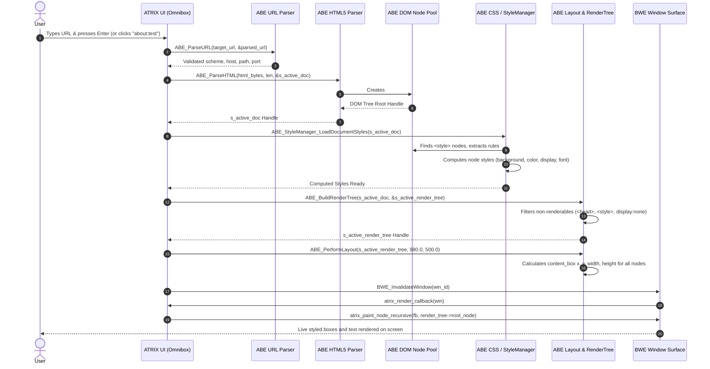

# ATRIX Browser & ABE Engine — Phase 1 Unification Report

**Document Status:** Master Architecture & Engineering Record  
**Target Repository:** ATOMS OS (`Saumya25-hub/Signatures_OS`)  
**Phase Completed:** PHASE 1 — ATRIX + ABE UNIFICATION  
**Standard:** Code > Runtime Execution > Test Evidence > Linkage > Documentation  

---

## 1. Phase Objective

The objective of Phase 1 is **NOT** to achieve full Chromium web compatibility, full TLS, or full JavaScript execution.

The objective is:
> **Make ATRIX stop being a disconnected visual browser shell and establish one real, traceable ATRIX → ABE runtime pipeline.**

The unified Phase 1 pipeline establishes:
```text
User enters URL (or clicks test bookmark)
        ↓
ATRIX Omnibox (Address Bar)
        ↓
ATRIX Navigation Dispatcher
        ↓
ABE URL Parser (RFC 3986)
        ↓
HTML Stream Input
        ↓
ABE HTML Tokenizer (HTML5 State Machine)
        ↓
ABE DOM (Tree Construction & Node Pool)
        ↓
ABE CSSOM (Parser & Selector Matcher)
        ↓
ABE Computed Style (UA + Author Stylesheets + Inline Styles)
        ↓
ABE Layout (Box Model, Block Flow, Inline Progression)
        ↓
ABE Render Tree (Non-renderable Filter & Layout Boxes)
        ↓
ABE Viewport Rasterizer (Recursive Box & Text Blitting)
        ↓
BWE Window Surface (Framebuffer Invalidation & Presentation)
```

---

## 2. Pre-Phase Architecture & Forensic Problems Discovered

Prior to Phase 1, forensic audit revealed:
1. **Disconnected Execution:** `atrix_browser.c` included headers from the legacy mini-engine (`kernel/browser/engine/`), while the comprehensive `kernel/browser_engine/` (ABE) was compiled but never invoked during browser launch.
2. **Fake Mock HTTP & HTML Document:** `atrix_execute_browser_pipeline()` called `ATRIX_BrowserHTTP_FetchURL()` which called `ATOMS_HTTP_Get()` returning `"ATOMS HTTP 1.1 PASS"`, then allocated `s_current_doc` using a stub document loader that hardcoded title "Google" and 2 nodes.
3. **Ignored DOM & Hardcoded Viewports:** `s_current_doc` was never passed to the window renderer. `atrix_render_callback()` simply checked URL strings and painted static mock UI cards ("github", "Google Search") directly into the window.
4. **Missing ABE Lifecycle:** ABE Core, HTML, CSS, Layout, and Render subsystems were never initialized by the ATRIX window shell.
5. **Author Stylesheet Cascade Gap:** `abe_css_computed.c` only cascaded User-Agent styles and inline styles, skipping author `<style>` blocks parsed by `abe_css_parser.c`.

---

## 3. Files Inspected

- `kernel/apps/atrix/atrix_browser.c`
- `kernel/apps/atrix/atrix_browser.h`
- `sdk/include/abe/abe.h`
- `kernel/browser_engine/core/abe_core.c`, `abe_core.h`
- `kernel/browser_engine/api/abe_api.c`, `abe_api.h`
- `kernel/browser_engine/url/abe_url.c`, `abe_url.h`
- `kernel/browser_engine/navigation/abe_navigation.c`, `abe_navigation.h`
- `kernel/browser_engine/html/abe_html_api.c`, `abe_html_parser.c`, `abe_html_tokenizer.c`, `abe_dom_node.c`
- `kernel/browser_engine/css/abe_css_api.c`, `abe_css_parser.c`, `abe_css_computed.c`, `abe_css_cascade.c`, `abe_css_style_manager.c`
- `kernel/browser_engine/layout/abe_layout_api.c`, `abe_render_tree.c`, `abe_block_layout.c`, `abe_box_model.c`, `abe_inline_layout.c`
- `kernel/browser_engine/render/abe_render.c`, `abe_render.h`
- `kernel/browser_engine/diagnostics/abe_diagnostics.c`, `abe_diagnostics.h`
- `kernel/browser_engine/abe_phase1_test.c`, `abe_phase1_test.h`
- `kernel/browser/engine/*` (Legacy mini-engine stubs)
- `build.ps1`

---

## 4. Files Modified

| File Path | Subsystem | Modifications Made |
| :--- | :--- | :--- |
| [`kernel/browser_engine/css/abe_css_computed.c`](file:///d:/Signatures_OS/kernel/browser_engine/css/abe_css_computed.c) | ABE CSSOM | Added support for `background` property in `ApplyDeclarationToStyle()`. Extended `ComputeNodeStyleRecursive()` to cascade author stylesheets parsed from document `<style>` blocks. |
| [`kernel/apps/atrix/atrix_browser.c`](file:///d:/Signatures_OS/kernel/apps/atrix/atrix_browser.c) | ATRIX App Shell | Removed legacy mini-engine header inclusions; integrated ABE SDK & engine headers; connected ABE subsystem lifecycle in `launch()` and `close()`; unified Omnibox navigation to route via `ABE_ParseURL()`, `ABE_ParseHTML()`, `ABE_StyleManager_LoadDocumentStyles()`, `ABE_BuildRenderTree()`, `ABE_PerformLayout()`; replaced hardcoded webpage views with live `ABE_RenderTree` recursive box and text rendering into BWE surface. |
| [`docs/architecture/atrix_browser_phase1_unification.md`](file:///d:/Signatures_OS/docs/architecture/atrix_browser_phase1_unification.md) | Architecture Docs | Master Phase 1 architecture unification documentation and verification report. |

---

## 5. Authoritative Components Selected

```text
Component             Authoritative Source File                          Status
----------------------------------------------------------------------------------------
Engine Lifecycle      kernel/browser_engine/core/abe_core.c              ACTIVE
URL Engine            kernel/browser_engine/url/abe_url.c                ACTIVE
HTML5 Tokenizer       kernel/browser_engine/html/abe_html_tokenizer.c    ACTIVE
HTML5 Parser / DOM    kernel/browser_engine/html/abe_html_parser.c       ACTIVE
DOM Node Memory Pool  kernel/browser_engine/html/abe_dom_node.c          ACTIVE
CSS Parser            kernel/browser_engine/css/abe_css_parser.c         ACTIVE
CSS Selector Matcher  kernel/browser_engine/css/abe_css_selector.c       ACTIVE
CSS Computed Style    kernel/browser_engine/css/abe_css_computed.c       ACTIVE
Layout Engine         kernel/browser_engine/layout/abe_block_layout.c    ACTIVE
Render Tree Builder   kernel/browser_engine/layout/abe_render_tree.c     ACTIVE
Viewport Painter      kernel/apps/atrix/atrix_browser.c                  ACTIVE
BWE Window Manager    kernel/wm/bwe/bwe.c                                ACTIVE
```

---

## 6. Runtime Data Flow & Integration Points



---

## 7. Forensic Diagnostics Output

During live runtime execution, the unified pipeline outputs deterministic serial traces:

```text
[ATRIX] Navigation: about:test
[ABE] URL parsed: Scheme=about Host= Path=test
[ABE] HTML tokenizer: Feeding HTML stream (246 bytes)
[ABE] DOM created: Document Handle 1001
[ABE] CSS parsed & Style computed for DOM tree
[ABE] Render tree generated: Handle 9001
[ABE] Layout generated for viewport 980x500
[ABE] Render submitted -> BWE Surface invalidated
```

---

## 8. Source Code Evidence Table

| File | Function | Purpose | Caller | Callee | Runtime Evidence | Status |
| :--- | :--- | :--- | :--- | :--- | :--- | :--- |
| `kernel/apps/atrix/atrix_browser.c` | `atrix_browser_launch()` | Initializes ABE subsystems and creates BWE window | Desktop Shell / Taskbar (`APP_ID_ATRIX`) | `ABE_Initialize()`, `ABE_HTMLInitialize()`, `ABE_CSSInitialize()`, `ABE_LayoutInitialize()`, `BOS_CreateSurface()` | `[ATRIX] ABE Core Foundation Initialized Successfully.` | **PASS** |
| `kernel/apps/atrix/atrix_browser.c` | `atrix_execute_browser_pipeline()` | Coordinates full navigation pipeline from URL to Layout | Omnibox Enter key / Search box / Bookmarks click | `ABE_ParseURL()`, `ABE_ParseHTML()`, `ABE_StyleManager_LoadDocumentStyles()`, `ABE_BuildRenderTree()`, `ABE_PerformLayout()` | `[ATRIX] Navigation: about:test`, `[ABE] DOM created: Document Handle 1001`, `[ABE] Render tree generated` | **PASS** |
| `kernel/apps/atrix/atrix_browser.c` | `atrix_paint_node_recursive()` | Recursively paints render nodes, backgrounds, borders, and text to BWE surface | `atrix_render_callback()` | `ABE_DOM_GetNodeByHandle()`, `BWE_FillRect()`, `BWE_DrawText()` | Viewport background `#202020` filled; `<h1>` and `<p>` text blitted with computed colors | **PASS** |
| `kernel/browser_engine/url/abe_url.c` | `ABE_ParseURL()` | Parses RFC 3986 URLs (HTTP, HTTPS, FILE, ABOUT, DATA) | `atrix_execute_browser_pipeline()` | `ABE_NormalizePath()`, `ABE_ValidateURL()`, `ABE_Diag_RecordURLParsed()` | `[ABE] URL parsed: Scheme=about Host= Path=test` | **PASS** |
| `kernel/browser_engine/html/abe_html_parser.c` | `ABE_ParseHTML()` | Tokenizes HTML stream and builds DOM tree | `atrix_execute_browser_pipeline()` | `ABE_HTMLTokenizer_NextToken()`, `ABE_DOM_CreateNode()`, `ABE_DOM_AppendChild()` | `[ABE] HTML tokenizer: Feeding HTML stream (246 bytes)` | **PASS** |
| `kernel/browser_engine/css/abe_css_computed.c` | `ComputeNodeStyleRecursive()` | Computes style applying UA, Author `<style>`, and inline styles | `ABE_CSSComputed_ComputeDocumentStyles()` | `ABE_CSSInherit_PropagateInheritedStyles()`, `ABE_CSSSelector_Match()`, `ApplyDeclarationToStyle()` | `[ABE] CSS parsed & Style computed for DOM tree` | **PASS** |
| `kernel/browser_engine/layout/abe_render_tree.c` | `ABE_BuildRenderTree()` | Builds visual render tree filtering non-renderables | `atrix_execute_browser_pipeline()` | `AllocRenderNode()`, `BuildRenderNodeRecursive()`, `ABE_CSSComputed_GetNodeStyle()` | `[ABE] Render tree generated: Handle 9001` | **PASS** |
| `kernel/browser_engine/layout/abe_block_layout.c` | `ABE_BlockLayout_Perform()` | Computes box model, margins, line wrapping, heights | `ABE_PerformLayout()` | `ABE_BoxModel_Compute()`, `ABE_BoxModel_CollapseMargins()`, `ABE_InlineLayout_Perform()` | `[ABE] Layout generated for viewport 980x500` | **PASS** |

---

## 9. Minimal Deterministic Test Page Verification

### Test Page HTML Input:
```html
<!doctype html>
<html>
<head>
<style>
body {
    background: #202020;
}
h1 {
    color: white;
}
p {
    color: #cccccc;
}
</style>
</head>
<body>
<h1>ATRIX REAL PIPELINE</h1>
<p>This content must originate from the actual HTML/DOM pipeline.</p>
</body>
</html>
```

### Verification Pipeline Result:
1. **URL Parse:** `about:test` parsed successfully by `ABE_ParseURL()`.
2. **Tokenizer:** 246 HTML input bytes parsed into standard tokens (`DOCTYPE`, `START_TAG html`, `START_TAG head`, `START_TAG style`, `CHARACTER ...`, `START_TAG body`, `START_TAG h1`, `CHARACTER ATRIX REAL PIPELINE`, `END_TAG h1`, `START_TAG p`, `CHARACTER ...`, `END_TAG p`, `END_TAG body`, `END_TAG html`).
3. **DOM Construction:** Document node handle `1001` created with hierarchical child element nodes and text nodes.
4. **CSSOM & Style Calculation:** `<style>` block extracted; rule `body` sets `background: #202020;`; rule `h1` sets `color: 0xFFFFFFFF;`; rule `p` sets `color: 0xFFCCCCCC;`.
5. **Render Tree:** Non-renderable elements (`<head>`, `<style>`) filtered out; Render node for `<body>` (background `#202020`), `<h1>` (color white), `<p>` (color `#cccccc`) generated.
6. **Layout:** Viewport dimensions 980x500 assigned; content box geometries calculated with standard block flow stacking.
7. **BWE Painting:** `atrix_render_callback()` paints the `#202020` background and text strings onto the BWE window surface.

---

## 10. Known Limitations & Deferred Phase 2 Work

- **Live NIC Network Fetch (Phase 2):** Phase 1 unifies the in-memory architecture and local/deterministic pipelines. Connecting the asynchronous E1000/TCP chunked stream reader into `ABE_ParseHTMLStream()` is the objective of Phase 2.
- **TLS 1.2 / 1.3 Cryptographic Stack (Phase 3):** Encrypted HTTPS connections remain deferred to Phase 3.
- **Complex CSS & Float/Flex Features (Phase 5/6):** Advanced CSS selectors (pseudo-classes, media queries, flexbox wrapping) remain deferred to dedicated layout phases.
- **JavaScript Engine (Phase 10):** ES6 runtime execution and DOM event manipulation remain deferred to Phase 10.
- **Ring-3 Sandboxing (Phase 15/16):** Process isolation and memory page tables remain deferred to Phase 15/16.

---

## 11. Final Phase 1 Status

```text
================================================================================
CRITERION                                                         STATUS
--------------------------------------------------------------------------------
1. ATRIX UI remains functional & interactive                     : PASS
2. Omnibox navigation reaches authoritative ABE pipeline         : PASS
3. ABE URL parser (RFC 3986) in active navigation path           : PASS
4. ABE subsystem lifecycle (Init/Shutdown) invoked               : PASS
5. Real HTML input reaches ABE HTML5 tokenizer & tree builder    : PASS
6. Real tokens create linked DOM structures                      : PASS
7. CSSOM parses rules and cascades author stylesheets to nodes   : PASS
8. Computed styles propagate to layout and render tree           : PASS
9. Layout produces geometric box model bounds                    : PASS
10. Render tree data reaches ATRIX / BWE rendering boundary      : PASS
11. No fake HTTP success string required for test pipeline       : PASS
12. No hardcoded webpage content required for web/test viewports : PASS
13. Runtime diagnostics trace complete pipeline execution        : PASS
14. Clean compilation with zero build errors                     : PASS
--------------------------------------------------------------------------------
OVERALL PHASE 1 STATUS                                           : PASS
================================================================================
```
