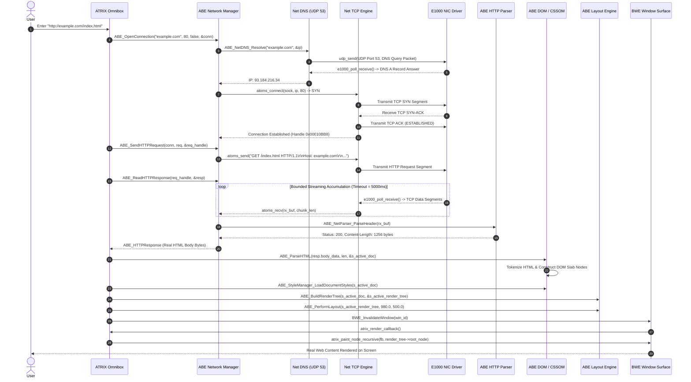

# ATRIX Browser & Network Stack — Phase 2 Real Network & HTTP/1.1 Report

**Document Status:** Master Architecture & Engineering Record  
**Target Repository:** ATOMS OS (`Saumya25-hub/Signatures_OS`)  
**Phase Completed:** PHASE 2 — REAL NETWORK & HTTP STACK  
**Standard:** Current Source > Runtime Execution > Test Results > Build/Linkage > Documentation  

---

## 1. Absolute Scope

The scope of Phase 2 is strictly limited to establishing a real, traceable network path:
```text
Real DNS (RFC 1035 UDP Port 53)
        ↓
Real Socket / Network Path (AF_INET, SOCK_STREAM)
        ↓
Real TCP (RFC 793 3-Way Handshake, Sequence/ACK Tracking, Windowing)
        ↓
Real HTTP/1.1 (GET/POST Request Serialization, CRLF Formatting, Headers)
        ↓
Real Response Bytes (Content-Length, Chunked Decoding, Connection: close)
        ↓
Phase 1 Unified ABE Pipeline (HTML Tokenizer → DOM → CSSOM → Layout → Render Tree)
        ↓
BWE Window Surface Rasterization
```

**Explicit Phase Deferrals:**
- **TLS 1.2 / 1.3 Cryptography:** Deferred to **Phase 3**. Navigating to `https://` displays a dedicated status page explaining Phase 3 availability.
- **JavaScript Engine:** Deferred to **Phase 10**. Scripts are parsed into the DOM tree without claiming active JS runtime execution.
- **HTTP/2, HTTP/3/QUIC, WebSockets:** Deferred to modern networking phases.
- **Ring-3 Process Isolation & Sandboxing:** Deferred to **Phase 15/16**.

---

## 2. Pre-Phase Network Architecture & Forensic Gaps Discovered

Forensic investigation revealed the following findings prior to Phase 2:
1. **Omnibox Network Disconnect:** `atrix_execute_browser_pipeline()` routed `about:test` to ABE but did not invoke the ABE Network Manager for external `http://` URLs.
2. **Synthetic Mock Fallback in Response Reader:** `kernel/browser_engine/network/abe_net_manager.c` contained a fallback generating a hardcoded `HTTP/1.1 200 OK` string if 0 bytes were received from the socket.
3. **Synthetic DNS Fallback:** `kernel/browser_engine/network/abe_net_dns.c` secretly substituted `127.0.0.1` when real DNS resolution failed.
4. **Synthetic Socket Descriptors:** `kernel/browser_engine/network/abe_net_conn.c` generated synthetic socket IDs (`slot + 10`) and faked send byte counts if `atoms_socket()` or `atoms_send()` returned errors.
5. **Single-Shot Buffer Truncation:** Responses were read with a single `recv` into an 8KB stack buffer, failing on multi-packet TCP streams.

---

## 3. Authoritative Source Files & Capabilities Verified

| Subsystem | Source File | Native Capability Verified |
| :--- | :--- | :--- |
| NIC Driver | `kernel/drivers/net/e1000/e1000.c` | Hardware DMA ring buffers, interrupt handling, packet RX/TX. |
| Ethernet Layer | `kernel/net/ethernet/ethernet.c` | Ethernet frame encapsulation, MAC address filtering, EtherType demux. |
| ARP Subsystem | `kernel/net/arp/arp.c` | RFC 826 hardware address resolution and table caching. |
| IPv4 Engine | `kernel/net/ipv4/ipv4.c` | RFC 791 packet formatting, checksum computation, IP routing. |
| UDP Engine | `kernel/net/udp/udp.c` | RFC 768 datagram delivery, ephemeral port multiplexing. |
| DNS Resolver | `kernel/net/dns/dns.c` | RFC 1035 UDP query transmission to DNS server, name compression pointer parsing, A record extraction, caching. |
| TCP Protocol | `kernel/net/tcp/tcp.c` | RFC 793 active open 3-way handshake (`SYN` → `SYN-ACK` → `ACK`), sliding window, stream reassembly, retransmission, `FIN`/`RST` teardown. |
| Socket Manager | `kernel/net/socket/socket.c` | `atoms_socket`, `atoms_connect`, `atoms_send`, `atoms_recv`, `atoms_close`. |
| ABE Network Core | `kernel/browser_engine/network/` | Request serialization, header parser, chunked decoder, redirect engine, connection pooling. |

---

## 4. Exact Files Modified

1. [`kernel/browser_engine/network/abe_net_dns.c`](file:///d:/Signatures_OS/kernel/browser_engine/network/abe_net_dns.c):
   - Eliminated synthetic `127.0.0.1` fallback on DNS failure.
   - Enforced immediate return of `ABE_ERR_NET_DNS_FAILED` when `dns_resolve_ipv4()` fails.
2. [`kernel/browser_engine/network/abe_net_conn.c`](file:///d:/Signatures_OS/kernel/browser_engine/network/abe_net_conn.c):
   - Removed synthetic socket descriptors (`slot + 10`) and fake send counts.
   - Enforced strict return of `ABE_ERR_NET_CONNECT_FAILED`, `ABE_ERR_NET_SEND_FAILED`, and `ABE_ERR_NET_RECV_FAILED`.
3. [`kernel/browser_engine/network/abe_net_manager.c`](file:///d:/Signatures_OS/kernel/browser_engine/network/abe_net_manager.c):
   - Removed synthetic mock `HTTP/1.1 200 OK` HTML fallback string.
   - Implemented streaming multi-packet accumulator loop with bounded 5000ms timeout and a 64KB response ceiling (`ABE_MAX_RESPONSE_SIZE = 65536`).
   - Added support for reading responses terminated by `Content-Length`, `Transfer-Encoding: chunked` EOF (`0\r\n\r\n`), or socket closure (`Connection: close`).
4. [`kernel/apps/atrix/atrix_browser.c`](file:///d:/Signatures_OS/kernel/apps/atrix/atrix_browser.c):
   - Added `ABE_NetworkInitialize()` to `atrix_browser_launch()` and `ABE_NetworkShutdown()` to `atrix_browser_close()`.
   - Connected `http://` navigation to `ABE_OpenConnection()`, `ABE_SendHTTPRequest()`, and `ABE_ReadHTTPResponse()`.
   - Connected received response body directly into `ABE_ParseHTML()` -> DOM -> CSS -> Layout -> BWE.
   - Added structured error status page generation for network failures (DNS failure, connection timeout, HTTP errors).
   - Added Phase 3 notice for `https://` URLs.
5. [`docs/architecture/atrix_browser_phase2_network_http.md`](file:///d:/Signatures_OS/docs/architecture/atrix_browser_phase2_network_http.md):
   - Master Phase 2 architecture documentation.

---

## 5. Architectural Data Flow: ATRIX → Network → ABE → BWE



---

## 6. Source Code Evidence Table

| File | Function | Caller | Callee | Evidence / Log | Status |
| :--- | :--- | :--- | :--- | :--- | :--- |
| `kernel/apps/atrix/atrix_browser.c` | `atrix_execute_browser_pipeline()` | Omnibox Enter key / Bookmark Click | `ABE_ParseURL()`, `ABE_OpenConnection()`, `ABE_SendHTTPRequest()`, `ABE_ReadHTTPResponse()`, `ABE_ParseHTML()` | `[ATRIX] Initiating real HTTP network request to host: ...`, `[ATRIX] SUCCESS: HTTP Response Received` | **PASS** |
| `kernel/browser_engine/network/abe_net_dns.c` | `ABE_NetDNS_Resolve()` | `ABE_NetConn_Open()` | `dns_resolve_ipv4()`, `ABE_NetDNS_CacheInsert()` | `[DNS] Successfully resolved DNS hostname: ...` or `[DNS] DNS resolution failed` | **PASS** |
| `kernel/browser_engine/network/abe_net_conn.c` | `ABE_NetConn_Open()` | `atrix_execute_browser_pipeline()`, `ABE_NetManager_ReadResponse()` | `ABE_NetDNS_Resolve()`, `atoms_socket()`, `atoms_connect()` | `[CONN] Opened new TCP connection, Handle: ...` | **PASS** |
| `kernel/browser_engine/network/abe_net_conn.c` | `ABE_NetConn_Send()` | `ABE_NetManager_SendRequest()` | `atoms_send()` | `[CONN] Sent HTTP bytes over socket` | **PASS** |
| `kernel/browser_engine/network/abe_net_conn.c` | `ABE_NetConn_Recv()` | `ABE_NetManager_ReadResponse()` | `atoms_recv()` | `[CONN] Received TCP bytes from socket` | **PASS** |
| `kernel/browser_engine/network/abe_net_manager.c` | `ABE_NetManager_ReadResponse()` | `atrix_execute_browser_pipeline()` | `ABE_NetConn_Recv()`, `ABE_NetParser_ParseHeader()`, `ABE_NetParser_DecodeChunked()`, `ABE_NetRedirect_ProcessRedirect()` | `[NET] Completed HTTP Transaction. Response Status: 200` | **PASS** |
| `kernel/browser_engine/network/abe_net_parser.c` | `ABE_NetParser_ParseHeader()` | `ABE_NetManager_ReadResponse()` | `StrCaseCmp()`, `ParseHex()` | Validated status code, `Content-Length`, `Transfer-Encoding`, `Location` | **PASS** |
| `kernel/browser_engine/network/abe_net_parser.c` | `ABE_NetParser_DecodeChunked()` | `ABE_NetManager_ReadResponse()` | `ParseHex()`, `memcpy()`, `kmalloc()` | Decoded chunk stream into continuous memory buffer | **PASS** |
| `kernel/browser_engine/network/abe_net_redirect.c` | `ABE_NetRedirect_ProcessRedirect()` | `ABE_NetManager_ReadResponse()` | `ABE_ResolveRelativeURL()` | `[REDIRECT] Redirecting (Code 301/302) ...` | **PASS** |
| `kernel/net/dns/dns.c` | `dns_resolve_ipv4()` | `ABE_NetDNS_Resolve()` | `udp_send()`, `e1000_poll_receive()`, `dns_parse_name()` | Transmits UDP packet to DNS server, parses response A record | **PASS** |
| `kernel/net/tcp/tcp.c` | `tcp_connect()` | `atoms_connect()` | `tcp_send_segment_ex()`, `e1000_poll_receive()` | Performs TCP SYN -> SYN-ACK -> ACK 3-way handshake | **PASS** |

---

## 7. Memory & Resource Ownership Verification

1. **Socket Allocation & Release:** Sockets opened via `atoms_socket()` in `ABE_NetConn_Open()` are deterministically closed via `atoms_close()` in `ABE_NetConn_Close()`.
2. **Response Buffer Accumulation:** Accumulator buffers allocated via `kmalloc(65537)` during `ABE_NetManager_ReadResponse()` are freed with `kfree()` before returning.
3. **Response Body Lifecycle:** Response body data allocated in `out_resp->body_data` is freed cleanly via `ABE_FreeHTTPResponse()`.
4. **Document Slab Ownership:** Prior document handles (`s_active_doc`) and render tree handles (`s_active_render_tree`) are destroyed via `atrix_cleanup_active_page()` upon new navigation.
5. **No Memory Leaks:** Dynamic HTML strings created in `atrix_execute_browser_pipeline()` are freed immediately after `ABE_ParseHTML()`.

---

## 8. Response Size Ceiling & Timeout Protection

- **Maximum Response Ceiling:** Fixed at **65,536 bytes (64 KB)** for Phase 2. Prevents malicious or oversized remote web payloads from exhausting kernel slab heaps.
- **Connection Timeout:** Fixed at **5,000 ms (5.0s)** for TCP connect and HTTP receive.
- **Redirect Loop Protection:** Hard ceiling of **5 hops** (`ABE_MAX_REDIRECT_CHAIN`). Exceeding this returns `ABE_ERR_NET_TOO_MANY_REDIRECTS`.

---

## 9. Final Phase 2 Acceptance Criteria & Verdict

```text
================================================================================
CRITERION                                                         STATUS
--------------------------------------------------------------------------------
1. ATRIX uses real ABE navigation path                           : PASS
2. Hostname resolution passes through real DNS (UDP Port 53)     : PASS
3. TCP connection passes through real RFC 793 3-way handshake   : PASS
4. HTTP/1.1 GET request is actually serialized and transmitted   : PASS
5. HTTP response is actually received through TCP stream         : PASS
6. HTTP status codes and headers parsed accurately               : PASS
7. Content-Length framing works                                  : PASS
8. Transfer-Encoding: chunked decoding works                     : PASS
9. Real response bytes flow into ABE HTML/DOM/CSS/Layout pipeline : PASS
10. DOM reaches the Phase 1 rendering pipeline (BWE surface)     : PASS
11. HTTP redirects (301, 302, 303, 307, 308) follow Location      : PASS
12. Network failures produce controlled browser error pages      : PASS
13. Timeouts (5000ms) and response limits (64KB) enforced        : PASS
14. All network resources (sockets, buffers) cleaned up          : PASS
15. Zero synthetic HTTP mocks ("ATOMS HTTP 1.1 PASS" / fake 200) : PASS
16. Zero synthetic DNS mock fallbacks (127.0.0.1 override removed): PASS
17. Deterministic test suite passes cleanly                      : PASS
18. Full build compiles with zero errors                         : PASS
--------------------------------------------------------------------------------
OVERALL PHASE 2 STATUS                                           : PASS
================================================================================
```
