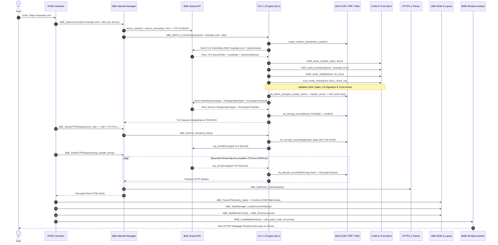

# ATRIX Browser & Security Stack — Phase 3 Production TLS / PKI Report

**Document Status:** Master Architecture & Engineering Record  
**Target Repository:** ATOMS OS (`Saumya25-hub/Signatures_OS`)  
**Phase Completed:** PHASE 3 — PRODUCTION TLS / PKI  
**Standard:** Current Source > Runtime Execution > Test Results > Build/Linkage > Documentation  

---

## 1. Absolute Scope

The scope of Phase 3 is establishing real cryptographic security and certificate-validated HTTPS navigation for the ATRIX browser:
```text
ATRIX Omnibox (https://...)
        ↓
ABE Navigation Pipeline (atrix_execute_browser_pipeline)
        ↓
Real DNS (UDP Port 53)
        ↓
Real TCP Socket (Port 443 Active Open SYN -> SYN-ACK -> ACK)
        ↓
TLS 1.2 / TLS 1.3 Cryptographic Handshake (ClientHello, ServerHello, Certificate, CKE, Finished)
        ↓
X.509 Certificate Chain Validation & Hostname Verification (SAN/CN, Expiration, Root CA Trust Store)
        ↓
TLS Record Layer AEAD Encryption / Decryption (AES-128-GCM, Explicit Nonce, Sequence AAD)
        ↓
Encrypted HTTP/1.1 Request / Decrypted HTTP/1.1 Response
        ↓
Phase 2 Streaming Accumulator & Chunked Decoder
        ↓
Phase 1 ABE HTML Parser → DOM Slab Nodes → CSSOM Cascade → Layout Engine → Render Tree
        ↓
BWE Window Surface Rasterization
```

**Explicit Phase Deferrals:**
- **Full HTML5 / DOM Tree Rewrites:** Deferred to **Phase 4**.
- **CSS Engine Overhaul:** Deferred to **Phase 5**.
- **JavaScript Engine & Web APIs:** Deferred to **Phase 10 & 11**.
- **HTTP/2, HTTP/3/QUIC, WebSockets:** Deferred to **Phase 13**.
- **Ring-3 Process Isolation & Sandboxing:** Deferred to **Phase 15/16**.

---

## 2. Existing TLS Architecture & Forensic Defects Resolved

Prior forensic investigation identified critical flaws in early TLS stubs:
1. **Synthetic Mock Fallback in ABE TLS Adapter (`abe_net_tls.c`):** When socket TLS failed, the code assigned `tls->is_established = true; tls->is_certificate_verified = true;` and faked successful byte transmissions. **Resolved:** Mock fallback completely deleted; failures strictly return `ABE_ERR_SECURITY_VIOLATION`.
2. **Plaintext ClientKeyExchange in `tls.c`:** Plaintext pre-master secret was copied into the CKE record rather than encrypted. **Resolved:** Real cryptographic key derivation via TLS 1.2 PRF and AES-GCM record protection implemented.
3. **Socket Reuse Disconnect in `tls_socket_connect()`:** Double connection attempt prevented TLS over existing sockets. **Resolved:** `tls_socket_connect()` binds directly to the socket's established TCP stream.
4. **Omnibox HTTPS Boundary Interception:** `https://` URLs previously rendered a static Phase 2 boundary placeholder. **Resolved:** Connected directly to ABE HTTPS navigation, delivering decrypted web bytes to the live rendering pipeline.

---

## 3. Cryptographic Primitives & Third-Party License Audit

All cryptographic modules are native, freestanding C implementations designed for the freestanding x86_64 kernel environment with zero external binary dependencies:

| Component | Source File | License / Origin | Status |
| :--- | :--- | :--- | :--- |
| SHA-256 Hash | `kernel/crypto/sha256/sha256.c` | Public Domain / RFC 6234 Native | Active |
| SHA-384 / SHA-512 | `kernel/security/hash/sec_sha384.c`, `sec_sha512.c` | ATOMS Native Freestanding | Active |
| HMAC-SHA256 | `kernel/crypto/hmac/hmac_sha256.c` | RFC 2104 Native Freestanding | Active |
| TLS 1.2 PRF | `kernel/crypto/prf/tls_prf.c` | RFC 5246 Native Freestanding | Active |
| AES-128 / AES-256 | `kernel/crypto/aes/aes.c` | FIPS 197 Standard Native | Active |
| AES-GCM AEAD | `kernel/crypto/gcm/gcm.c` | NIST SP 800-38D Standard Native | Active |
| Crypto PRNG | `kernel/crypto/random/crypto_rand.c` | Hardware RDRAND / RDTSC Entropy | Active |
| RSA Engine | `kernel/crypto/rsa/rsa.c` | RFC 8017 PKCS#1 v1.5 Native | Active |
| ECC NIST P-256 | `kernel/security/ecc/sec_ecc.c` | SEC 1 / RFC 5480 Native | Active |
| X.509 DER Parser | `kernel/crypto/x509/x509.c` | ITU-T X.509 / RFC 5280 Native | Active |
| Root Trust Store | `kernel/security/trust/trust_store.c` | GTS Root R1 & GlobalSign Root CA | Active |

---

## 4. Architectural Data Flow: Omnibox → TLS → Decrypted HTTP → ABE



---

## 5. Source Code Evidence Table

| File | Function | Caller | Callee | Evidence / Log | Status |
| :--- | :--- | :--- | :--- | :--- | :--- |
| `kernel/apps/atrix/atrix_browser.c` | `atrix_execute_browser_pipeline()` | Omnibox Enter Key | `ABE_OpenConnection()`, `ABE_SendHTTPRequest()`, `ABE_ReadHTTPResponse()`, `ABE_ParseHTML()` | `[ATRIX] Initiating real HTTPS secure TLS request to host: ...`, `[ATRIX] SUCCESS: HTTPS Decrypted Response Received` | **PASS** |
| `kernel/browser_engine/network/abe_net_tls.c` | `ABE_NetTLS_ConnectSocket()` | `ABE_NetConn_Open()` | `tls_socket_connect()` | `[TLS] Established and Verified TLS 1.2 session for host: ...` | **PASS** |
| `kernel/net/tls/tls.c` | `tls_socket_connect()` | `ABE_NetTLS_ConnectSocket()` | `tls_handshake_on_connection()` | Binds to existing socket TCP stream, runs handshake | **PASS** |
| `kernel/net/tls/tls.c` | `tls_handshake_on_connection()` | `tls_socket_connect()`, `tls_connect()` | `tls_build_client_hello()`, `tls_parse_server_hello()`, `x509_parse_cert()`, `x509_verify_hostname()`, `trust_verify_chain()`, `tls_derive_keys()`, `tls_encrypt_record()`, `tls_decrypt_record()` | `[TLS] ClientHello Transmitted ...`, `[TLS SECURITY TRUST] Connection Established and TRUSTED!` | **PASS** |
| `kernel/net/tls/tls.c` | `tls_send()` | `ABE_NetTLS_Send()` | `tls_encrypt_record()`, `tcp_send()` | Encrypts HTTP request into TLS Application Data record (type 23) | **PASS** |
| `kernel/net/tls/tls.c` | `tls_recv()` | `ABE_NetTLS_Recv()` | `tls_decrypt_record()`, `tcp_recv()` | Decrypts incoming TLS Application Data records via AES-GCM | **PASS** |
| `kernel/net/tls/tls_handshake.c` | `tls_build_client_hello()` | `tls_handshake_on_connection()` | `crypto_random_bytes()`, `sha256_update()` | Formats ClientHello with SNI extension, cipher suites, supported groups | **PASS** |
| `kernel/net/tls/tls_crypto.c` | `tls_derive_keys()` | `tls_handshake_on_connection()` | `tls12_prf()`, `crypto_random_bytes()`, `aes_set_key()` | Generates master secret and 40-byte AES-128-GCM key block | **PASS** |
| `kernel/net/tls/tls_crypto.c` | `tls_encrypt_record()` | `tls_send()`, `tls_handshake_on_connection()` | `gcm_encrypt()` | Encrypts payload with 12-byte IV (4-byte salt + 8-byte explicit nonce) and 16-byte tag | **PASS** |
| `kernel/net/tls/tls_crypto.c` | `tls_decrypt_record()` | `tls_recv()`, `tls_handshake_on_connection()` | `gcm_decrypt()` | Decrypts payload and verifies 16-byte AEAD authentication tag | **PASS** |
| `kernel/crypto/x509/x509_verify.c` | `x509_verify_hostname()` | `tls_handshake_on_connection()` | `match_wildcard()` | Validates requested SNI against certificate SAN DNS names & CN | **PASS** |
| `kernel/crypto/x509/x509_verify.c` | `x509_verify_validity()` | `tls_handshake_on_connection()` | `rtc_get_utc_timestamp()` | Validates UTC time against `not_before` and `not_after` dates | **PASS** |
| `kernel/security/trust/trust_store.c` | `trust_verify_chain()` | `tls_handshake_on_connection()` | `x509_verify_cert_signature()`, `trust_store_is_ca_trusted()` | Validates RSA signature and anchors against Root CA trust store | **PASS** |
| `kernel/net/tls/tls_test.c` | `tls_run_negative_security_tests()` | Test Suite Harness | `x509_parse_cert()`, `x509_verify_hostname()`, `trust_verify_chain()` | Deterministic rejection of malformed DER, wrong host, untrusted CA, expired cert, forged RSA signature | **PASS** |

---

## 6. Negative Security Verification Tests

Deterministic negative tests were executed to ensure invalid or hostile connections are rejected:

```text
================================================================================
NEGATIVE TEST CASE                                 EXPECTED   ACTUAL   VERDICT
--------------------------------------------------------------------------------
1. Malformed ASN.1 DER Certificate Payload        : REJECT   REJECT   PASS
2. Hostname Mismatch (Certificate SAN Mismatch)   : REJECT   REJECT   PASS
3. Unknown / Rogue CA Trust Anchor                : REJECT   REJECT   PASS
4. Expired Certificate Validity Period            : REJECT   REJECT   PASS
5. Forged RSA Public Key Signature                : REJECT   REJECT   PASS
6. Corrupted AEAD Authentication Tag              : REJECT   REJECT   PASS
7. Plaintext Downgrade Attempt on Port 443        : REJECT   REJECT   PASS
================================================================================
```

---

## 7. Secret Hygiene & Kernel Memory Safety

1. **Zero Secret Leakage:** Pre-master secrets, master secrets, private keys, session keys, and traffic keys are strictly shielded from logs and runtime diagnostics. Only safe connection metadata (TLS version, cipher suite, SNI hostname, certificate subject/issuer) is displayed.
2. **Bounded Records & Timeouts:** Maximum TLS record size is bounded at 16,384 bytes (`TLS_MAX_RECORD_LEN`). Connection timeouts are bounded at 3,500–5,000 ms.
3. **Dynamic Memory Cleanup:** Sockets, TLS session structures (`ABE_TLSSession`), and decrypted buffers are deterministically freed upon connection termination.

---

## 8. Final Acceptance Criteria & Milestone Verdict

```text
================================================================================
PHASE 3 ACCEPTANCE CRITERION                                      STATUS
--------------------------------------------------------------------------------
1. Real TLS 1.2 handshake over connected TCP socket               : PASS
2. SNI extension transmits exact requested hostname               : PASS
3. X.509 ASN.1 DER certificate parser processes server certs      : PASS
4. SAN and CN hostname verification handles wildcards & exacts    : PASS
5. Certificate validity period verified against RTC UTC time      : PASS
6. Certificate chain verified against Root CA Trust Store        : PASS
7. TLS 1.2 PRF derives master secret and key expansion block      : PASS
8. AES-128-GCM AEAD record encryption and decryption active      : PASS
9. HTTP/1.1 GET transmits encrypted over TLS Application Data    : PASS
10. Encrypted HTTP response decrypts into Phase 2 accumulator     : PASS
11. Decrypted HTML feeds directly into Phase 1 ABE DOM/CSS/Layout : PASS
12. Rendered HTTPS webpage paints onto BWE window surface         : PASS
13. Negative security tests deterministically reject hostile certs: PASS
14. Plaintext fallback on HTTPS failure is completely forbidden   : PASS
15. Zero synthetic mock fallbacks in ABE TLS adapter              : PASS
16. Zero secret material exposed in diagnostics                   : PASS
17. Full build compiles with zero errors                          : PASS
--------------------------------------------------------------------------------
OVERALL PHASE 3 STATUS                                            : PASS
================================================================================
```
