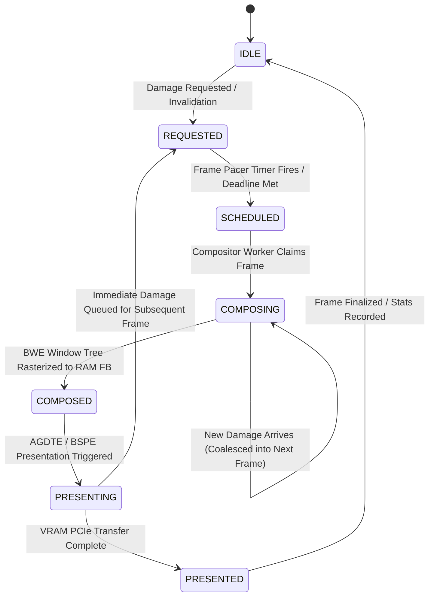

# BOS Composition Manager (BCM) — Architecture Specification

**Document ID:** `docs/architecture/bcm_architecture.md`  
**Classification:** Core System Architecture Specification (Phase 0 Design)  
**Status:** **DESIGN & ARCHITECTURE ONLY — NO SOURCE MODIFICATION**  

---

## 1. Executive Purpose & Scope

The **BOS Composition Manager (BCM)** is the authoritative kernel subsystem responsible for governing the lifecycle, scheduling, damage coalescing, frame pacing, and execution context boundaries of visual rendering in ATOMS OS.

### The Problem BCM Solves
In the legacy ATOMS OS pipeline, hardware timer ticks (`timer_tick_handler`, IRQ 0) synchronously invoke `BRE_DispatchPending()` $\to$ `BWE_PumpEvents()` $\to$ `BWE_Compose()` $\to$ `BWE_ComposeFrame()`. When multiple applications are active and damage occurs (e.g. clicking a Calculator button or dragging a window), the full multi-window Z-order traversal, text/glyph rasterization, and 8.29 MB PCIe MMIO VRAM copy run synchronously inside the interrupt handler with `RFLAGS.IF = 0`. This causes:
1. **ISR Overruns:** 39.6 ms to 67.9 ms spent inside a single 1.0 ms timer interrupt.
2. **APIC Starvation:** Hardware timer ticks held pending, triggering hypervisor watchdogs and VMware vCPU shutdown.
3. **Catastrophic Hardware Faults:** Deep in-ISR call stacks triggering uncontained faults that escalate to Triple Faults on bare-metal hardware.

### BCM Scope
BCM establishes a strict architectural decoupling:
- **Fast Invalidation / Damage Request Path:** Lightweight, non-blocking, non-rendering, non-allocating, safe to call from IRQ and userspace.
- **Asynchronous Composition & Presentation Path:** Scheduled and executed strictly in cooperative task/thread context outside the hardware interrupt handler with `RFLAGS.IF = 1`.

```text
+-----------------------------------------------------------------------------+
|                          INPUT / DRIVERS / APPS / THEMES                    |
|       (Timer IRQ, Mouse IRQ12, Syscalls, App Invalidation, Theme Mutex)     |
+-----------------------------------------------------------------------------+
                                       │
                                       ▼ (Non-blocking damage requests)
+-----------------------------------------------------------------------------+
|                     BOS COMPOSITION MANAGER (BCM)                          |
|  - Damage Coalescing & Bounding Box Merging                                |
|  - Frame State Machine (IDLE -> REQUESTED -> SCHEDULED -> COMPOSING...)    |
|  - Frame Budgeting & Rate Limiting (Target 60 FPS / 16.6 ms)               |
|  - Execution Context Guard (Enforces Task Context for Heavy Pipeline)       |
+-----------------------------------------------------------------------------+
                                       │
                                       ▼ (Scheduled outside IRQ)
+-----------------------------------------------------------------------------+
|                   BWE COMPOSITOR & AGDTE / BSPE PRESENTATION               |
|  - Multi-window Z-order Traversal (compose_window_recursive)                |
|  - RAM Framebuffer Composition (ram_fb)                                     |
|  - Font Glyph Atlas Rasterization (BOImage / BOFont)                        |
|  - VRAM Presentation (BSPE_VRAM_CopyEffectiveDamage / PCIe MMIO)            |
+-----------------------------------------------------------------------------+
```

---

## 2. BCM Responsibilities vs. Non-Responsibilities

### BCM Core Responsibilities (What BCM Owns)
1. **Damage Collection & Coordination:** Ingests bounding box damage requests from windows, controls, taskbar, cursor, and shell.
2. **Dirty Region Coalescing:** Merges overlapping and adjacent rectangles into bounded damage sets, avoiding redundant full redraws.
3. **Composition Request Scheduling:** Deferring frame generation so multiple simultaneous events (e.g. 5 mouse moves + 2 button clicks) produce exactly **one** cohesive frame.
4. **Frame State Machine Authority:** Manages states (`IDLE`, `REQUESTED`, `SCHEDULED`, `COMPOSING`, `COMPOSED`, `PRESENTING`, `PRESENTED`).
5. **Frame Budget & Pacing:** Enforces target frame rate intervals (e.g. 60 FPS / 16.6 ms budget) and prevents compositor starvation.
6. **Execution Context Firewall:** Enforces that actual frame rendering and PCIe MMIO presentation occur **strictly outside hardware IRQ handlers**.
7. **Re-entrancy & Concurrency Protection:** Guarantees that while a frame is composing or presenting, incoming damage requests are safely queued without nesting or recursion.

### BCM Non-Responsibilities (What BCM MUST NOT Own)
- ❌ **Window Management Hierarchy:** BWE (`bwe_window.c`) remains the sole authority for window trees, Z-order arrays, parent-child links, and focus tracking.
- ❌ **Pixel Painting & Control Drawing:** Control renderers (`bwe_button.c`, `bwe_textbox.c`, `bwe_label.c`, `explorer_view.c`) continue drawing actual pixels.
- ❌ **Text & Font Rasterization:** `BOFont` and `BOImage` continue managing font atlases and glyph blitting.
- ❌ **Physical Framebuffer Allocations:** VBE driver (`vbe.c`) and GOP continue owning physical VRAM mappings and RAM backbuffers.
- ❌ **Application Business Logic:** Apps (`apps.c`, `explorer.c`, `terminal.c`) remain isolated in their event callbacks and data models.

---

## 3. Existing System Architectural Audit

### Authoritative Component Map

| Component | Primary Source File | Core Responsibility | Current Caller | Current Execution Context |
|---|---|---|---|---|
| **Timer Driver** | `kernel/core/timer/src/timer.c` | IRQ 0 Handler (1000 Hz), context save/restore | Hardware Vector 32 | **Ring 0 Hardware ISR (`IF=0`)** |
| **IRQ Manager** | `kernel/core/interrupt/src/irq.c` | Routes vectors 32–47, sends PIC/APIC EOI | `isr_common_handler` | **Ring 0 Hardware ISR (`IF=0`)** |
| **BRE (Reflex Engine)**| `kernel/core/brtsl/bre.c` | Fast callback service dispatcher | `timer_tick_handler` | **Ring 0 Hardware ISR (`IF=0`)** |
| **BWE Event Pump** | `kernel/wm/bwe/src/bwe_core.c` | Pops input events, dispatches to controls | `bre_input_pump_callback` | **Ring 0 Hardware ISR (`IF=0`)** |
| **BWE Window Core** | `kernel/wm/bwe/src/bwe_window.c`| Window registry, Z-order stack, focus | Apps, Syscalls | Mixed (ISR + Task) |
| **BWE Compositor** | `kernel/wm/bwe/renderer/bwe_compositor.c` | Multi-window dirty rect rasterizer | `BWE_Compose` | **Ring 0 Hardware ISR (`IF=0`)** |
| **BWE Controls** | `kernel/ui/controls/*/bwe_*.c` | Control event handling & rasterization | `BWE_PumpEvents` | **Ring 0 Hardware ISR (`IF=0`)** |
| **Explorer Shell** | `kernel/shell/apps/explorer.c` | BSOM authority, drive cards, file views | Window Manager | Task Context / In-ISR Render |
| **Task Panel** | `kernel/ui/task_panel.c` | Taskbar icons, running tags, system clock | Window Manager | Task Context / In-ISR Render |
| **AGDTE Presenter** | `kernel/graphics/AGDTE/src/agdte_presenter.c`| Display pacing queue, layer registration | `BOVISUAL_Graphics_SwapFull` | **Ring 0 Hardware ISR (`IF=0`)** |
| **BSPE Engine** | `kernel/graphics/BSPE/Present/vram_copy.c` | Partial/Full VRAM PCIe MMIO transfer | AGDTE / Graphics | **Ring 0 Hardware ISR (`IF=0`)** |
| **Scheduler Core** | `kernel/core/scheduler/src/scheduler.c` | Round-robin / Priority Aging Task Switcher | `timer_tick_handler` | Ring 0 Kernel Mode |

---

## 4. Current Call Graph vs. BCM Target Call Graph

### Current (Flawed) Call Graph
```text
[Hardware Timer IRQ 0] -> IF=0
  └── timer_tick_handler()
        └── BRE_DispatchPending()
              └── bre_input_pump_callback()
                    └── BWE_PumpEvents()
                          ├── calc_btn_clicked()
                          │     └── BWE_InvalidateWindow() -> Adds dirty rects
                          └── if (dirty) BWE_Compose()
                                └── BWE_ComposeFrame() -> 45ms rasterization
                                      └── BOVISUAL_Graphics_SwapFull()
                                            └── BSPE PCIe MMIO memcpy (8.29 MB)
```

### BCM Target Call Graph
```text
[Hardware Timer IRQ 0 / Mouse IRQ 12 / Syscall / App Invalidation]
  ├── timer_tick_handler()
  │     ├── Input polling & Queue push
  │     ├── BCM_RequestTick() [Non-blocking, marks tick]
  │     ├── scheduler_on_tick()
  │     ├── Send PIC/APIC EOI
  │     └── Return from IRQ (< 0.05 ms) -> IF=1
  │
[Desktop Compositor Task / Cooperative Task Loop] (Outside IRQ, IF=1)
  └── BCM_Process()
        ├── Step 1: Check frame state & pacing deadline (Target 60 FPS)
        ├── Step 2: Ingest & Coalesce all pending damage rects (BWE damage + cursor + shell)
        ├── Step 3: Transition state: SCHEDULED -> COMPOSING
        ├── Step 4: Call BWE_ComposeFrame(ram_fb) -> Multi-window clipped rasterization
        ├── Step 5: Transition state: COMPOSING -> PRESENTING
        ├── Step 6: Route to AGDTE / BSPE -> VRAM PCIe MMIO Transfer
        └── Step 7: Transition state: PRESENTING -> IDLE
```

---

## 5. BCM Formal IRQ Safety Contract

Every BCM API accessible from interrupt context (`IF=0`) must adhere to the **Atomic Non-Blocking Contract**:

1. **Zero Dynamic Memory Allocation:** No `kmalloc`, `kcalloc`, or `pmm_alloc_pages` may be invoked inside IRQ-callable BCM functions. All state structures, damage queues, and request masks are statically allocated.
2. **Zero Pixel Rasterization:** No glyph plotting, line drawing, gradient filling, or memory blitting may occur.
3. **Zero VRAM Transfers:** No PCIe MMIO copies or AGDTE presentation bridge executions.
4. **Zero Blocking or Busy-Waits:** Operations must complete in $O(1)$ constant time (atomic bitmask or fixed array ring push).
5. **Execution Guarantee:** Maximum execution time for any IRQ-facing BCM entry point must be **< 1 microsecond**.

---

## 6. BCM Damage Management Architecture

### Damage Ingestion Pipeline
BCM unifies four damage channels into a single coherent damage model:

1. **Window Damage Channel:** Emitted by `BWE_InvalidateWindow(win_id)`. BCM captures `win->screen_bounds`.
2. **Sub-Region Damage Channel:** Emitted by control updates (e.g. textbox caret blink, progress bar increment). BCM captures local sub-rect `(x, y, w, h)`.
3. **Cursor Damage Channel:** Emitted on mouse motion. BCM captures old 32×32 cursor bounds + new 32×32 cursor bounds.
4. **Global Damage Channel:** Emitted by theme changes, display resolution switches, or window minimize/maximize operations. BCM marks full-screen damage `(0, 0, screen_w, screen_h)`.

### Damage Coalescing Policy
- **Maximum Coalesced Bounding Boxes:** 32 rectangles (`BCM_MAX_DIRTY_RECTS = 32`).
- **Coalescing Rule:** If incoming damage causes dirty rect count to exceed 32, BCM merges overlapping bounding boxes. If total damaged area exceeds **65% of screen area**, BCM automatically coalesces into a single full-frame damage rectangle.

---

## 7. BCM Frame State Machine



### State Definitions
- **`BCM_STATE_IDLE`:** No pending damage. Compositor is asleep/yielding.
- **`BCM_STATE_REQUESTED`:** Damage has been registered. Awaiting frame pacing window.
- **`BCM_STATE_SCHEDULED`:** Pacing deadline met. Frame is scheduled for next compositor task quantum.
- **`BCM_STATE_COMPOSING`:** `BWE_ComposeFrame` is actively rasterizing dirty rects to RAM backbuffer.
- **`BCM_STATE_COMPOSED`:** RAM backbuffer is finalized; glyph batches flushed.
- **`BCM_STATE_PRESENTING`:** BSPE / AGDTE is performing PCIe MMIO transfer to physical GPU VRAM.
- **`BCM_STATE_PRESENTED`:** Hardware presentation complete; telemetry updated.

---

## 8. BCM Frame Budgeting & Rate Pacing

- **Target Pacing Interval:** 16,666 µs (60.0 FPS).
- **Minimum Inter-Frame Gap:** 10,000 µs (caps peak composition at 100 FPS under continuous mouse drag).
- **Composition Time Budget:** 8,000 µs (8.0 ms).
- **Presentation Time Budget:** 4,000 µs (4.0 ms).
- **Idle Headroom:** 4,666 µs reserved for user/kernel tasks.

---

## 9. Failure Handling & Concurrency Defense

1. **Re-entrancy Guard:** BCM maintains an atomic state flag `s_bcm_active`. If `BCM_Process()` is invoked while already in `BCM_STATE_COMPOSING` or `BCM_STATE_PRESENTING`, it returns immediately with `BCM_BUSY`, recording incoming damage for the next frame.
2. **Window Destruction Safety:** If a window is destroyed while its damage rectangle is pending in BCM, BCM retains the bounding box damage to ensure the desktop background underneath the destroyed window is properly redrawn.
3. **Hardware Presentation Fallback:** If BSPE partial VRAM transfer fails or coordinates corrupt, BCM automatically falls back to full-frame presentation.

---

## 10. Future Extension Points
- **Hardware Cursor Plane Integration:** BCM will forward cursor updates directly to hardware overlay registers when hardware cursor planes are active, eliminating cursor-induced dirty rects.
- **Multi-Monitor AGDTE Scheduling:** BCM frame state machine supports independent damage queues and composition budgets per physical display ID.
