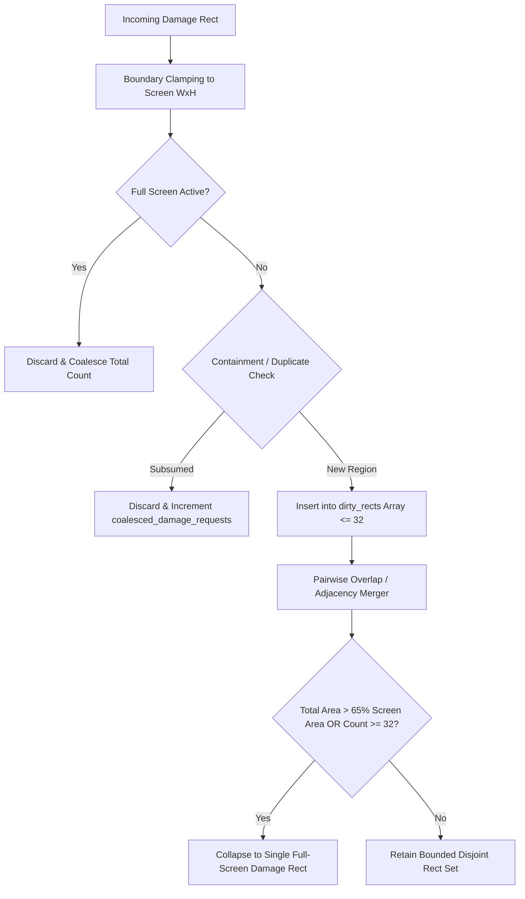

# BOS Composition Manager (BCM) — Phase 3 Damage Pipeline Architecture

## 1. Executive Summary
Phase 3 establishes BCM as the authoritative, IRQ-safe receiver, filter, and coalescer of all visual damage events across ATOMS OS. It decouples UI damage notification from visual rendering and provides a bounded, static bounding-box envelope with zero heap allocations.

---

## 2. Damage Ingestion Contract

### Invariant Rules:
1. **$O(1)$ Complexity**: Every damage ingestion API executes in bounded constant time.
2. **Zero Allocation**: Strictly $0$ bytes of dynamic heap (`kmalloc`/`malloc`) or physical page (`pmm_alloc`) allocations are performed.
3. **Non-Blocking & Non-Rendering**: Ingestion only records coordinates in static state; no rasterization, glyph rendering, or framebuffer copying occurs.
4. **Context Agnostic**: Safe to call from Hardware ISRs (`timer_tick_handler`), Reflex Engine callbacks (`BRE`), Syscalls (Ring 3 `sys_service_gui_invalidate`), and Kernel Tasks.

---

## 3. Real Damage Sources Integrated

| Source | File Location | Mechanism |
| :--- | :--- | :--- |
| **Window Invalidation** | `kernel/wm/bwe/src/bwe_core.c:L215` | `BCM_RequestWindowDamage(win_id)` |
| **Control Invalidation** | `kernel/wm/bwe/src/bwe_window.c` | Via `BWE_InvalidateWindow` |
| **Cursor Displacement** | `kernel/wm/bwe/src/bwe_core.c:L521` | `BCM_RequestCursorDamage(old_x, old_y, new_x, new_y)` |
| **Explicit Syscall (21)**| `kernel/core/syscall/src/services.c:L370` | `sys_service_gui_invalidate` |
| **Full Repaint Requests**| `kernel/wm/bwe/renderer/bwe_compositor.c:L145` | `BCM_RequestFullRepaint()` |
| **Timer Tick Heartbeat** | `kernel/core/timer/src/timer.c:L33` | `BCM_NotifyTimerTick(system_ticks)` |

---

## 4. Geometric Coalescing & Bounding Envelope

### Key Parameters:
- **Max Rect Capacity**: 32 rectangles (`BCM_MAX_DIRTY_RECTS`).
- **Inflation Threshold**: Bounding box merge allowed if union area $\le 140\%$ of component sum.
- **Collapse Threshold**: Total dirty area $> 65\%$ of screen dimensions triggers instantaneous full-screen damage mode.

---

## 5. Telemetry Instrumentation
- `total_damage_requests`: Total raw damage calls received.
- `coalesced_damage_requests`: Ingestions successfully merged or eliminated.
- `full_repaint_count`: Total full-screen collapse events.
- `dropped_invalid_count`: Requests rejected due to invalid dimensions ($\le 0$) or out-of-bounds coordinates.
- `irq_damage_requests`: Requests originated with `IF=0`.
- `task_damage_requests`: Requests originated with `IF=1`.
- `max_rect_count_observed`: Peak dirty rectangle queue occupancy.
- `last_damage_area`: Cumulative dirty pixel area of the last frame pass.
