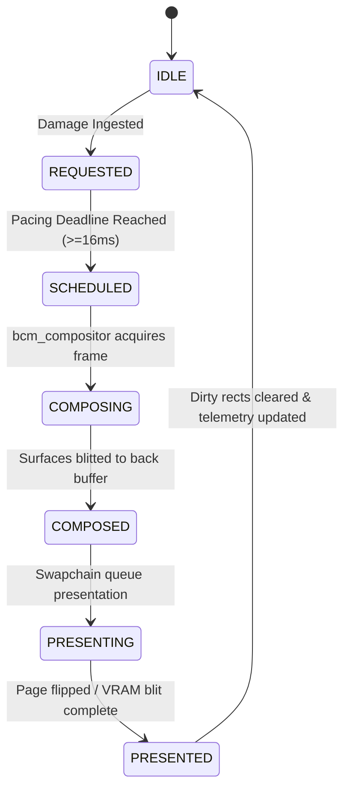

# BOS Composition Manager (BCM) — Phase 4 Frame Scheduling & Pacing Architecture

## 1. Executive Summary
Phase 4 implements the authoritative Frame Scheduler, Pacer, and State Lifecycle Machine in BCM. It governs **when** a composition frame should be generated, enforces a strict 60 FPS nominal frame rate (~16.666 ms cadence), coalesces burst input events, and ensures zero busy-spinning on the dedicated `bcm_compositor` kernel thread.

---

## 2. Frame Lifecycle State Machine

### State Definitions:
- `BCM_STATE_IDLE`: No visual damage pending. Compositor thread sleeps (`scheduler_sleep(5)`).
- `BCM_STATE_REQUESTED`: Damage has arrived, but pacing window (~16 ms interval) has not elapsed. Additional damages are coalesced.
- `BCM_STATE_SCHEDULED`: Frame interval elapsed; ready for immediate composition pass.
- `BCM_STATE_COMPOSING`: Surface composition active under preemptible task context (`IF=1`).
- `BCM_STATE_COMPOSED`: Back-buffer composition complete.
- `BCM_STATE_PRESENTING`: Transfer to hardware presentation stage active.
- `BCM_STATE_PRESENTED`: Hardware presentation complete.

---

## 3. Real Clock Source & Frame Pacer Mechanics

- **Monotonic Clock**: `timer_get_ticks()` providing $1\text{ ms}$ resolution from PIT IRQ 0.
- **Target Interval**: $16\text{ ms}$ ($\approx 60\text{ FPS}$).
- **Minimum Inter-Frame Gap**: $10\text{ ms}$ (enforces hard cap of $\le 100\text{ FPS}$ during continuous user interaction).
- **Deadline Evaluation**:
  $$\text{DeadlineReached} = (\text{now} - \text{last\_compose\_tick}) \ge \text{pacing\_interval\_ms}$$
- **Non-Busy Sleeping**:
  - Idle state: `scheduler_sleep(5)` yields CPU to applications.
  - Pending damage within interval: `scheduler_sleep(2)` allows pending damages to coalesce.
  - Deadline met: `BCM_Process()` followed by `scheduler_yield()`.

---

## 4. Execution Context Firewall

`BCM_Process()` enforces strict execution preconditions:
1. `RFLAGS.IF == 1`: Interrupts enabled. Rejects any invocation from ISR context with `BCM_ERR_INVALID_STATE` and logs `[BCM_FIREWALL_BLOCK]`.
2. `is_composing == false`: Guards against recursive or nested composition passes with `BCM_ERR_BUSY`.

---

## 5. Frame Telemetry & Performance Instrumentation

- `frames_requested`: Total frame requests generated from damage events.
- `frames_scheduled`: Total frames admitted to scheduled execution.
- `frames_composed`: Total frames successfully composed.
- `frames_presented`: Total frames presented to display hardware.
- `frames_coalesced`: Frame requests combined into a single frame during pacing interval.
- `frames_skipped`: Redundant frames skipped when no net damage was observed.
- `current_fps`: Rolling 1-second frames-per-second measurement.
- `last_frame_duration_us`: Duration of the most recent composition pass in microseconds.
- `worst_frame_duration_us`: Peak composition duration observed.
- `average_frame_duration_us`: Exponential moving average of frame composition time.
