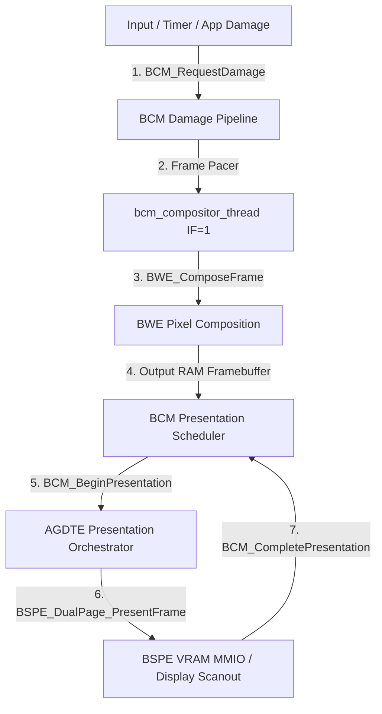

# ATOMS OS — BCM Phase 6: Presentation Scheduling Architecture

## 1. Executive Summary

BCM Phase 6 establishes an authoritative **Presentation Scheduling** layer between frame composition (`BWE_ComposeFrame()`) and physical VRAM / display scanout (`AGDTE` / `BSPE`). 

Prior to Phase 6, composed frames were immediately and synchronously presented without explicit presentation state tracking, in-flight protection, or separation of damage arriving during presentation. Phase 6 formalizes the presentation boundary, enforces strict ownership, and isolates in-flight frames from concurrent damage.

---

## 2. Subsystem Ownership & Boundaries



### Responsibility Matrix

| Subsystem | Authority & Responsibility | Execution Context |
| :--- | :--- | :--- |
| **BCM** | Owns frame lifecycle, frame IDs, presentation eligibility, and in-flight protection | Task Context (`IF=1`) |
| **BWE** | Owns pixel composition, window layering, widget rendering into `ram_fb` | Task Context (`IF=1`) |
| **AGDTE** | Owns display surface orchestration, layer assignment, refresh synchronization | Task Context (`IF=1`) |
| **BSPE** | Owns physical VRAM double-buffering, damage translation, and PCIe MMIO transfers | Task Context (`IF=1`) |
| **VBE / Display HAL** | Owns physical display controller modes and hardware base address pointers | Kernel / HAL |

---

## 3. Frame Lifecycle & State Machine

BCM Phase 6 extends the formal frame lifecycle:

```text
       [IDLE]
         │  Damage Requested
         ▼
    [REQUESTED]
         │  Pacing Deadline Reached
         ▼
    [SCHEDULED]
         │  Composition Begins
         ▼
    [COMPOSING]
         │  BWE_ComposeFrame Complete
         ▼
     [COMPOSED]
         │  BCM_SchedulePresentation()
         ▼
 [PRESENT_QUEUED]
         │  BCM_BeginPresentation() (Frame In-Flight)
         ▼
    [PRESENTING] ─── New Damage Arrives ───► Accumulated in Next Frame Envelope
         │  VRAM Copy Complete
         ▼
[PRESENT_COMPLETE]
         │  BCM_CompletePresentation()
         ▼
    [PRESENTED]
         │  Resources Retired
         ▼
       [IDLE]
```

---

## 4. In-Flight Frame Protection & Next-Frame Damage Isolation

When Frame $N$ enters `PRESENTING`:
1. `g_bcm_state.is_presenting = true`
2. `g_bcm_state.in_flight_frame_id = N`
3. Any new damage arriving via `BCM_RequestDamage()`, `BCM_RequestCursorDamage()`, or `BCM_RequestWindowDamage()` while `is_presenting == true` is directed to `pending_damage_next_frame[]`.
4. Frame $N$'s staging frame and dirty rects are completely immutable and protected from mutation.
5. Upon `BCM_CompletePresentation()`, the next-frame damage is promoted to the active dirty envelope, transitioning the state directly to `REQUESTED` for Frame $N+1$.

---

## 5. Execution-Context Firewall

Every presentation API entry point enforces:
```c
if (!bcm_is_interrupt_enabled()) {
    com1_puts("[BCM][SECURITY] PRESENTATION BLOCKED: IF=0\r\n");
    return BCM_ERR_INVALID_STATE;
}
```
- Hardware ISRs (`timer_tick_handler`, `mouse_irq_handler`, keyboard, etc.) NEVER execute presentation.
- Presentation runs exclusively on `bcm_compositor_thread` (Priority 31, Preemptible Kernel Context with `RFLAGS.IF = 1`).
