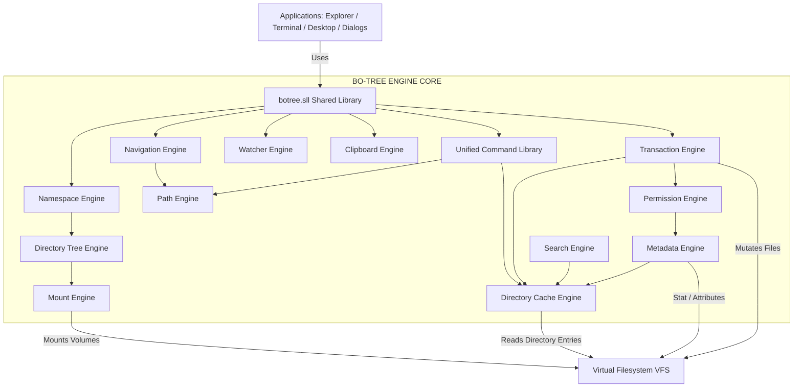
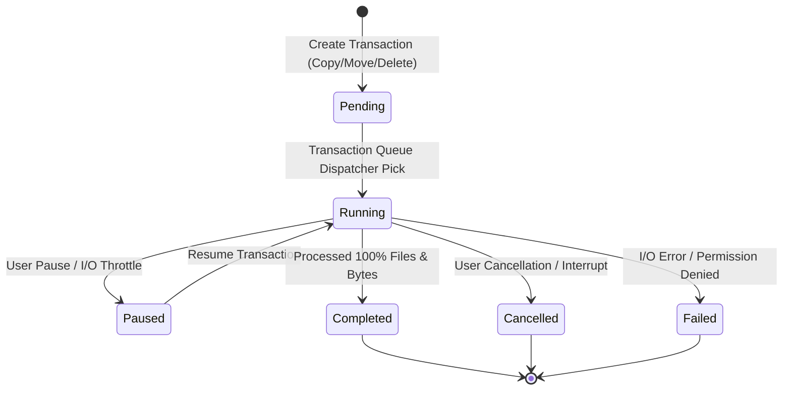
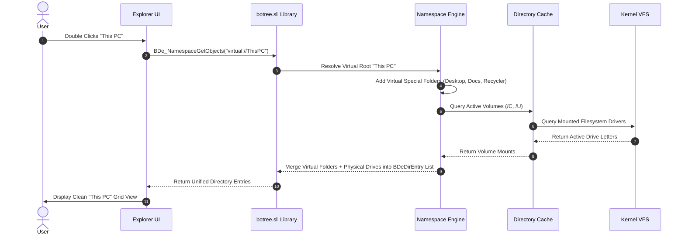

# 🏛️ BO-TREE ENGINE (BDE) V1.0 — MASTER ARCHITECTURE & DESIGN SPECIFICATION

> **Subsystem Name:** BO-TREE Engine (BOS Directory Engine / BDE)  
> **Library Interface:** `botree.sll` / `libbotree.a`  
> **Status:** Production Operating System Architecture Specification  
> **Target Subsystems:** Explorer, Desktop, Terminal, AI Engine, Browser, File Dialogs, Settings, Installer  

---

## 1. Executive Summary & Comparative OS Research (Phase 0)

### 1.1 The Single Filesystem Authority Paradigm
In Signatures OS, **BO-TREE Engine (BDE)** serves as the **sole filesystem authority**. Direct calls to VFS routines or manual string path manipulations from Explorer, Terminal, Desktop, File Dialogs, AI Engine, or Browser are prohibited.

Every application interacts exclusively through the official shared library **`botree.sll`**:

```
+-----------------------------------------------------------------------------------+
|                            APPLICATIONS & SHELL LAYER                             |
|  Explorer  |  Terminal  |  Desktop  |  AI Engine  |  Browser  |  File Dialogs | Settings |
+-----------------------------------------------------------------------------------+
                                          │
                                          ▼
+-----------------------------------------------------------------------------------+
|                        OFFICIAL PUBLIC LIBRARY (botree.sll)                       |
|   BDe_Open()       BDe_Close()         BDe_ReadDirectory()    BDe_PathNormalize() |
|   BDe_PathJoin()   BDe_PathCanonicalize() BDe_Find()          BDe_Copy()          |
|   BDe_Move()       BDe_Delete()        BDe_CreateDirectory() BDe_GetMetadata()   |
|   BDe_Command()    BDe_Watch()         BDe_Transaction()     BDe_Namespace()     |
|   BDe_Recycle()    BDe_Clipboard()     BDe_Permission()      BDe_Shortcut()      |
+-----------------------------------------------------------------------------------+
                                          │
                                          ▼
+-----------------------------------------------------------------------------------+
|                         BO-TREE ENGINE CORE (kernel/botree/)                      |
|  ┌─────────────┐  ┌─────────────┐  ┌─────────────┐  ┌─────────────┐  ┌──────────┐ |
|  │ Path        │  │ Tree        │  │ Namespace   │  │ Navigation  │  │ Cache    │ |
|  └─────────────┘  └─────────────┘  └─────────────┘  └─────────────┘  └──────────┘ |
|  ┌─────────────┐  ┌─────────────┐  ┌─────────────┐  ┌─────────────┐  ┌──────────┐ |
|  │ Command     │  │ Search      │  │ Mount       │  │ Watch       │  │ Clipboard│ |
|  └─────────────┘  └─────────────┘  └─────────────┘  └─────────────┘  └──────────┘ |
|  ┌─────────────┐  ┌─────────────┐  ┌─────────────┐  ┌─────────────┐  ┌──────────┐ |
|  │ Transactions│  │ Permissions │  │ Metadata    │  │ Recycle     │  │ Shortcut │ |
|  └─────────────┘  └─────────────┘  └─────────────┘  └─────────────┘  └──────────┘ |
+-----------------------------------------------------------------------------------+
                                          │
                                          ▼
+-----------------------------------------------------------------------------------+
|                            VIRTUAL FILESYSTEM LAYER (VFS)                         |
|   vfs_readdir  │  vfs_mkdir  │  vfs_rename  │  vfs_delete  │  vfs_open  │  vfs_stat  |
+-----------------------------------------------------------------------------------+
                                          │
                                          ▼
+-----------------------------------------------------------------------------------+
|                         PHYSICAL & DRIVER FILESYSTEMS                             |
|       NTFS      │      FAT32      │      USB Storage      │    Future Filesystems |
+-----------------------------------------------------------------------------------+
```

---

### 1.2 Deep OS Architecture Research

#### A. Windows NT Object Manager & Shell Namespace
1. **Windows NT Object Manager (`\Device`, `\DosDevices`):** Virtualizes hardware drivers and mounts under a single kernel object directory. Drive letters (`C:`, `D:`) are symbolic links to volume objects (`\Device\HarddiskVolume1`). BO-TREE adopts this model via `bde_namespace` and `bde_mount`.
2. **Windows Shell Namespace (`IShellFolder`, `PIDL`):** Windows Explorer displays virtual namespace objects ("This PC", "Control Panel", "Recycle Bin", "Network") alongside physical drive paths. BO-TREE implements the **Namespace Engine**, allowing Explorer to render virtual namespaces natively without mixing raw filesystem paths with shell folders.
3. **Win32 Path APIs & Shell Library (`PathCch`, `SHLWAPI`):** Consolidates all string canonicalization, relative path calculation, and segment parsing. BO-TREE's **Path Engine** replaces ad-hoc string operations across the entire OS.

#### B. Linux VFS & Dentry Architecture
1. **Dentry Cache (`dentry` & `inode`):** Linux separates directory name lookup from inode storage via the dentry hash table. Path lookup performs lockless dentry traversal. BO-TREE's **Directory Cache Engine** uses a MurmurHash3 dentry hash lookup table with zero duplicate allocations.
2. **Mount Namespaces (`vfsmount`):** Enables dynamic attachment of filesystems at arbitrary tree points. BO-TREE's **Mount Engine** maps volume mounts to target namespace nodes.

#### C. Transactional Filesystems & Event Watching
1. **Transactional File Operations (TxF / Queue Model):** Every file modification operation (Copy, Move, Delete, Rename) in BO-TREE is treated as a trackable **Transaction** (`BDeTransaction`). This grants progress reporting (0–100%), pause/cancel, undo/redo, and progress dialogs automatically.
2. **Directory Watcher Notifications (`inotify` / `ReadDirectoryChangesW`):** Subscriptions to folder modification events trigger asynchronous broadcasts, ensuring Explorer, Desktop, and File Dialogs auto-refresh instantly when files change.

---

## 2. Directory Structure (`kernel/botree/`)

```
kernel/botree/
├── include/                  # Public & Internal API Headers
│   ├── botree.h              # Master Public Library Header (botree.sll)
│   ├── botree_types.h        # Data Structures, Handles, & Enum Definitions
│   ├── botree_path.h         # Path Engine API
│   ├── botree_tree.h         # Directory Tree Engine API
│   ├── botree_nav.h          # Navigation & History Engine API
│   ├── botree_cache.h        # Directory & Dentry Cache Engine API
│   ├── botree_namespace.h    # Shell Namespace Engine API
│   ├── botree_cmd.h          # Unified Command Library API (Windows/Linux)
│   ├── botree_search.h       # Search Engine API
│   ├── botree_mount.h        # Mount Manager & Volume API
│   ├── botree_watch.h        # Watcher Engine & Auto-Refresh API
│   ├── botree_clipboard.h    # Filesystem Clipboard API
│   ├── botree_tx.h           # Transaction Engine API (Copy/Move Queue)
│   ├── botree_perm.h         # Permission Engine API (ACL & Roles)
│   ├── botree_metadata.h     # Metadata & File Attribute Engine API
│   ├── botree_recycle.h      # Recycle Bin Engine API
│   └── botree_shortcut.h     # Shortcut Resolver (.boslink) API
├── core/                     # Core Initialization & Context Management
│   ├── botree_init.c         # Subsystem Initialization & Shutdown
│   ├── botree_context.c      # Process & Session Context Pool
│   └── botree_lock.c         # Concurrency Locks & Read/Write Synchronization
├── path/                     # 1. Path Engine
│   ├── bde_path_normalize.c  # Slash cleanup, relative segment resolution
│   ├── bde_path_canonical.c  # Absolute canonical path calculation
│   ├── bde_path_split.c      # Dirname, Basename, Extension parsing
│   └── bde_path_compare.c    # Case-insensitive path equivalence
├── tree/                     # 2. Directory Tree Engine
│   ├── bde_tree_node.c       # Node creation, parent-child links
│   └── bde_tree_lazy.c       # Lazy directory branch expansion
├── navigation/               # 3. Navigation Engine
│   └── bde_nav_session.c     # History back/forward/up stack session manager
├── cache/                    # 4. Directory Cache Engine
│   ├── bde_cache_dentry.c    # MurmurHash3 Dentry hash table
│   └── bde_cache_dir.c       # Enumeration & metadata LRU cache
├── namespace/                # 5. Namespace Engine (Shell Namespace)
│   ├── bde_namespace_core.c  # Virtual namespace object tree
│   └── bde_namespace_folders.c# Special folders (This PC, Desktop, Recycler)
├── commands/                 # 6. Command Engine
│   ├── bde_cmd_registry.c    # Unified command table & alias mapping
│   ├── bde_cmd_handlers.c    # Combined C implementation (cd, ls, cp, mv, rm)
│   └── bde_cmd_compat.c      # Windows (dir, del, copy) & Linux (ls, rm, cp) aliases
├── search/                   # 7. Search Engine
│   └── bde_search_engine.c   # Multithreaded recursive wildcard walker
├── mount/                    # 8. Mount Engine
│   └── bde_mount_manager.c   # Volume table & drive letter mapping (NTFS, FAT32, USB)
├── clipboard/                # 9. Clipboard Engine
│   └── bde_clipboard_store.c # System filesystem copy/cut path buffer
├── transactions/             # 10. Transaction Engine
│   └── bde_transaction_queue.c# Job queue (Copy/Move/Delete), progress %, undo/redo
├── watch/                    # 11. Watcher Engine
│   └── bde_watcher_hub.c     # Folder modification subscription & auto-refresh
├── metadata/                 # 12. Metadata Engine
│   └── bde_metadata_query.c  # Attributes, sizes, timestamps, type detection
├── recycle/                  # 13. Recycle Engine
│   └── bde_recycle_bin.c     # Trash namespace management & .recycinfo metadata
├── shortcut/                 # 14. Shortcut Engine
│   └── bde_shortcut_resolver.c# .boslink target & argument resolution
├── permissions/              # 15. Permission Engine
│   └── bde_permission_acl.c  # Owner/User/Admin/Guest ACL role evaluation
├── diagnostics/              # Diagnostics & Memory Leak Profiling
│   └── bde_diagnostics.c
├── tests/                    # Automated Unit Tests
│   └── bde_unit_tests.c
└── docs/                     # Documentation
    └── botree_engine.md      # Master Architecture Specification
```

---

## 3. The 15 Specialized Engines

### 3.1 Path Engine (`bde_path`)
* Normalization: Cleans slashes (`\` $\rightarrow$ `/`), strips redundant consecutive slashes (`//` $\rightarrow$ `/`), strips trailing slashes except root.
* Canonicalization: Resolves `.` (current) and `..` (parent) segments deterministically.
* Operations: `BDe_PathNormalize()`, `BDe_PathCanonicalize()`, `BDe_PathJoin()`, `BDe_PathGetDirname()`, `BDe_PathGetBasename()`, `BDe_PathGetExtension()`, `BDe_PathEquals()`.

### 3.2 Navigation Engine (`bde_nav`)
* Session-based navigation context (`BDeNavSession`) providing ring-buffer history stacks for Back, Forward, Up, Open, and Refresh operations.
* Independent sessions per Explorer window, Terminal instance, or File Dialog instance.

### 3.3 Directory Tree Engine (`bde_tree`)
* Maintains a dynamic hierarchical node tree (`BDeTreeNode`) for directory navigation.
* Supports lazy loading: Child branches are populated only when expanded.

### 3.4 Namespace Engine (`bde_namespace`) ⭐⭐⭐⭐⭐
* **Windows Shell Namespace & Linux Mount Namespace Virtualization:** Replaces raw disk path rendering with virtual namespace objects (`BDeNamespaceObject`).
* **Virtual Namespace Objects:**
  - `virtual://ThisPC` ("This PC" virtual root)
  - `virtual://Desktop` (User Desktop)
  - `virtual://Documents` (User Documents)
  - `virtual://Downloads` (Downloads)
  - `virtual://Pictures`, `virtual://Music`, `virtual://Videos`
  - `virtual://RecycleBin` (Recycle Bin Namespace)
  - `virtual://Network` (Network Locations)
  - `virtual://USB` (Removable Storage Drives)
  - `virtual://ControlPanel` (System Control Panel)
  - `virtual://Settings` (OS Settings)
* **Unified Merge Rendering:** Explorer requests `BDe_NamespaceOpen("virtual://ThisPC")`, and the Namespace Engine merges mounted physical drives (`/C`, `/U`), virtual folders, and system devices into a single clean list of shell objects.

### 3.5 Directory Cache Engine (`bde_cache`)
* MurmurHash3 Dentry Hash Table for $O(1)$ path-to-dentry resolution.
* LRU Enumeration Cache (`BDeDirCache`) storing item lists, metadata, and icon role bindings.
* Zero duplicate memory allocations.

### 3.6 Command Engine (`bde_cmd`)
* Single C implementation backing both Windows and Linux command aliases:
  - `cd` / `chdir` / `pwd`
  - `ls` / `dir` / `vdir` / `tree`
  - `cp` / `copy` / `xcopy`
  - `mv` / `move` / `ren`
  - `rm` / `del` / `erase` / `unlink`
  - `mkdir` / `md` / `rmdir` / `rd`
  - `touch` / `cat` / `type` / `find` / `findstr` / `where` / `which` / `stat`

### 3.7 Search Engine (`bde_search`)
* Multithreaded recursive tree walking with wildcard matching (`*.txt`, `proj_*`) and extension filtering.
* Supports cancelable search jobs.

### 3.8 Mount Engine (`bde_mount`)
* Volume Manager mapping physical filesystems (NTFS, FAT32, USB) to drive letters (`C:`, `U:`) and mount points.

### 3.9 Clipboard Engine (`bde_clipboard`)
* Global filesystem clipboard storing source paths and operation types (`BDE_CLIPBOARD_COPY` or `BDE_CLIPBOARD_CUT`).

### 3.10 Transaction Engine (`bde_tx`) ⭐⭐⭐⭐⭐
* **Async Job Queue:** Every structural filesystem operation (Copy, Move, Delete, Rename, Restore) is executed as a trackable **Transaction** (`BDeTransaction`).
* **Progress & State Tracking:** Tracks total items, processed bytes, percentage completion (0–100%), transaction status (`RUNNING`, `PAUSED`, `COMPLETED`, `CANCELLED`, `FAILED`).
* **Undo / Redo Buffer:** Maintains transaction logs to allow multi-file operation undos.
* **Progress Dialog Support:** Explorer, File Dialogs, or Desktop can bind progress bars directly to `Transaction #ID`.

### 3.11 Watcher Engine (`bde_watch`)
* Directory notification subscription hub (`BDe_WatchSubscribe`).
* Automatically broadcasts modification events to trigger instant UI refresh in Explorer, Desktop, and File Dialogs.

### 3.12 Metadata Engine (`bde_metadata`)
* Provides unified file statistics (`BDeStat`): Size, Creation/Modification/Access timestamps, Attributes (ReadOnly, Hidden, System, Directory, Archive), Type classification.

### 3.13 Recycle Engine (`bde_recycle`)
* Manages `virtual://RecycleBin` (`/RECYCLE`). Moves deleted items into trash storage with `.recycinfo` metadata for restoration or permanent purge.

### 3.14 Shortcut Engine (`bde_shortcut`)
* Implements `.boslink` file format parsing and target resolution.

### 3.15 Permission Engine (`bde_perm`) ⭐⭐⭐⭐
* Access Control List (ACL) and Role Evaluation Engine.
* Roles: `BDE_PERM_OWNER`, `BDE_PERM_ADMIN`, `BDE_PERM_USER`, `BDE_PERM_GUEST`, `BDE_PERM_SYSTEM`.
* Flags: Read, Write, Execute, Delete, Protected, Hidden. Future NTFS ACL integration ready.

---

## 4. Public API Design (`botree.sll` Header: `botree.h`)

```c
#ifndef BOTREE_H
#define BOTREE_H

#include <stdint.h>
#include <stdbool.h>
#include <stddef.h>

// Handle Definitions
typedef uint32_t BDeNavHandle;
typedef uint32_t BDeWatchHandle;
typedef uint64_t BDeTxHandle;
typedef struct BDeTreeNode BDeTreeNode;
typedef struct BDeNamespaceObj BDeNamespaceObj;

// File Attribute & Permission Flags
#define BDE_ATTR_READONLY    (1 << 0)
#define BDE_ATTR_HIDDEN      (1 << 1)
#define BDE_ATTR_SYSTEM      (1 << 2)
#define BDE_ATTR_DIRECTORY   (1 << 3)
#define BDE_ATTR_ARCHIVE     (1 << 4)
#define BDE_ATTR_VIRTUAL     (1 << 5)

typedef enum {
    BDE_PERM_ROLE_GUEST  = 0,
    BDE_PERM_ROLE_USER   = 1,
    BDE_PERM_ROLE_ADMIN  = 2,
    BDE_PERM_ROLE_SYSTEM = 3
} BDePermRole;

// Transaction Status
typedef enum {
    BDE_TX_STATUS_PENDING   = 0,
    BDE_TX_STATUS_RUNNING   = 1,
    BDE_TX_STATUS_PAUSED    = 2,
    BDE_TX_STATUS_COMPLETED = 3,
    BDE_TX_STATUS_CANCELLED = 4,
    BDE_TX_STATUS_FAILED    = 5
} BDeTxStatus;

typedef struct {
    BDeTxHandle tx_id;
    uint32_t    op_type;        // Copy, Move, Delete, Rename
    uint32_t    total_files;
    uint32_t    processed_files;
    uint64_t    total_bytes;
    uint64_t    processed_bytes;
    uint32_t    progress_percent;
    BDeTxStatus status;
    char        current_source[256];
    char        current_target[256];
} BDeTxProgress;

// Unified Directory Entry Structure
typedef struct {
    char     name[256];
    char     full_path[512];
    uint64_t size_bytes;
    uint32_t attributes;
    uint64_t time_created;
    uint64_t time_modified;
    bool     is_directory;
    bool     is_virtual;
    uint32_t icon_role;
} BDeDirEntry;

// --- 1. Path Engine Public API ---
int32_t BDe_PathNormalize(const char* in_path, char* out_buf, size_t max_len);
int32_t BDe_PathCanonicalize(const char* base_path, const char* rel_path, char* out_buf, size_t max_len);
int32_t BDe_PathJoin(const char* path_a, const char* path_b, char* out_buf, size_t max_len);
int32_t BDe_PathGetDirname(const char* in_path, char* out_buf, size_t max_len);
int32_t BDe_PathGetBasename(const char* in_path, char* out_buf, size_t max_len);
int32_t BDe_PathGetExtension(const char* in_path, char* out_buf, size_t max_len);
bool    BDe_PathEquals(const char* path_a, const char* path_b);

// --- 2. Navigation Engine Public API ---
BDeNavHandle BDe_NavCreateSession(uint32_t owner_pid);
void         BDe_NavDestroySession(BDeNavHandle handle);
int32_t      BDe_NavOpen(BDeNavHandle handle, const char* path);
int32_t      BDe_NavBack(BDeNavHandle handle, char* out_path, size_t max_len);
int32_t      BDe_NavForward(BDeNavHandle handle, char* out_path, size_t max_len);
int32_t      BDe_NavUp(BDeNavHandle handle, char* out_path, size_t max_len);
const char*  BDe_NavGetCurrentDir(BDeNavHandle handle);

// --- 3. Directory & Cache Public API ---
int32_t BDe_ReadDirectory(const char* path, BDeDirEntry** out_entries, uint32_t* out_count);
void    BDe_FreeDirectoryListing(BDeDirEntry* entries);
void    BDe_InvalidateCache(const char* path);

// --- 4. Namespace Engine Public API ---
int32_t BDe_NamespaceResolve(const char* virtual_uri, char* out_physical_path, size_t max_len);
int32_t BDe_NamespaceGetObjects(const char* namespace_uri, BDeDirEntry** out_entries, uint32_t* out_count);

// --- 5. Unified Command Engine Public API ---
int32_t BDe_ExecuteCommand(const char* command_line, void (*output_sink)(const char* text, void* ctx), void* ctx);

// --- 6. Transaction Engine Public API ---
BDeTxHandle BDe_TransactionCopy(const char* src_path, const char* dest_dir);
BDeTxHandle BDe_TransactionMove(const char* src_path, const char* dest_dir);
BDeTxHandle BDe_TransactionDelete(const char* path, bool send_to_recycle);
int32_t     BDe_TransactionGetProgress(BDeTxHandle tx_id, BDeTxProgress* out_progress);
int32_t     BDe_TransactionCancel(BDeTxHandle tx_id);
int32_t     BDe_TransactionUndo(void);

// --- 7. Watcher Engine Public API ---
typedef void (*BDeWatchCallback)(const char* path, uint32_t event_flags, void* user_data);
BDeWatchHandle BDe_WatchSubscribe(const char* path, BDeWatchCallback callback, void* user_data);
void           BDe_WatchUnsubscribe(BDeWatchHandle handle);

// --- 8. Clipboard Engine Public API ---
int32_t BDe_ClipboardCopy(const char** paths, uint32_t count);
int32_t BDe_ClipboardCut(const char** paths, uint32_t count);
int32_t BDe_ClipboardPaste(const char* target_dir);

// --- 9. Permission Engine Public API ---
bool BDe_PermissionCheck(const char* path, BDePermRole role, uint32_t required_flags);

// --- 10. Shortcut & Metadata Public API ---
int32_t BDe_ShortcutResolve(const char* link_path, char* out_target, size_t max_len);
int32_t BDe_GetMetadata(const char* path, BDeDirEntry* out_stat);

#endif // BOTREE_H
```

---

## 5. Subsystem Dependency & Concurrency Graph



---

## 6. State & Sequence Diagrams

### 6.1 Transaction Queue State Machine



### 6.2 Application Virtual Namespace Resolution Call Flow



---

## 7. Lock Hierarchy & Thread Safety

To ensure zero deadlocks across multithreaded transactions, cache reads, and watcher broadcasts, lock acquisition follows a strict hierarchy:

$$\text{1. Mount Lock} \longrightarrow \text{2. Namespace Lock} \longrightarrow \text{3. Tree Lock} \longrightarrow \text{4. Cache Lock} \longrightarrow \text{5. Session/Transaction Lock}$$

* **Reader-Writer Locks (`BDeRwLock`):** Cache lookups (`BDe_ReadDirectory`) and Path Canonicalization use concurrent reader locks. Directory writes and transaction executions acquire exclusive writer locks.
* **Non-Blocking GUI Dispatch:** Watcher notifications dispatch event structures to application queues asynchronously, preventing thread contention on UI rendering loops.

---

## 8. Integration & Phase 1 Roadmap

1. **Phase 1 (Core Infrastructure):** Implement `kernel/botree/` core modules: `bde_path`, `bde_cache`, `bde_cmd`, `bde_nav`, and `bde_namespace`. Build `botree.sll`.
2. **Phase 2 (Subsystem Wiring):** Refactor Explorer (`explorer.c`, `explorer_cache.c`) and Terminal (`apps.c`, `commands_bodh.c`) to remove all VFS calls and delegate 100% of operations to `botree.sll`.
3. **Phase 3 (Transactions & UI Dialogs):** Connect `bde_transaction` queue to progress dialogs in File Dialogs and Explorer.
