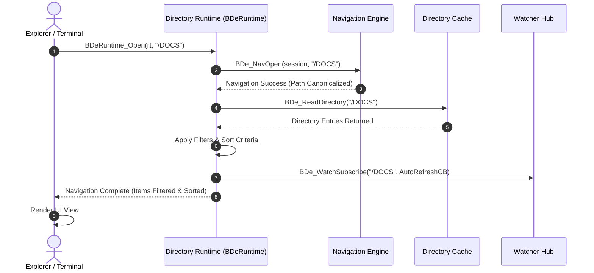

# 🏛️ DIRECTORY RUNTIME ENGINE (DRE) V1.0 — MASTER SPECIFICATION

> **Subsystem Name:** Directory Runtime Engine (BO-TREE DRE V1.0)  
> **Interface:** `botree.sll` (`BDeRuntime_*` Public API)  
> **Status:** Production Architecture Blueprint & Core Implementation Specification  
> **Target Subsystems:** Explorer, Desktop, Terminal, AI Engine, Browser, File Dialogs  

---

## 1. Executive Summary & Architecture Philosophy

The **Directory Runtime Engine (DRE)** represents Phase 2 of the BO-TREE Engine architecture. It decouples **Live Runtime Navigation State** (current directory, history stacks, selection sets, view modes, sort orders, filters, and breadcrumbs) from UI applications.

### 1.1 The Golden Principle
No application in Signatures OS (Explorer, Desktop, Terminal, AI, Browser, File Dialogs) is permitted to own, mutate, or parse navigation state or path buffers directly.

Every application window instantiates a lightweight, thread-safe runtime handle (`BDeRuntime*`). The engine manages runtime state in kernel/service memory, providing deterministic $O(1)$ operations, lazy directory enumeration, and instant auto-refresh broadcasts.

```
+-----------------------------------------------------------------------------------+
|                            APPLICATIONS & SHELL LAYER                             |
|  Explorer Window 1 | Explorer Window 2 | Terminal | Desktop | File Dialogs | AI   |
+-----------------------------------------------------------------------------------+
                                          │
                                          ▼
+-----------------------------------------------------------------------------------+
|                        RUNTIME HANDLES (BDeRuntime #1..#N)                        |
|  Current Directory │ History Stack │ Selection Set │ Sort Order │ View Mode │ Filter |
+-----------------------------------------------------------------------------------+
                                          │
                                          ▼
+-----------------------------------------------------------------------------------+
|                    PUBLIC LIBRARY LAYER (botree.sll Interface)                    |
|   BDeRuntime_Create()         BDeRuntime_Open()         BDeRuntime_Back()         |
|   BDeRuntime_Forward()        BDeRuntime_Up()           BDeRuntime_Refresh()      |
|   BDeRuntime_Enumerate()      BDeRuntime_Select()       BDeRuntime_Sort()         |
|   BDeRuntime_Filter()         BDeRuntime_GetBreadcrumb() BDeRuntime_Copy()        |
+-----------------------------------------------------------------------------------+
                                          │
                                          ▼
+-----------------------------------------------------------------------------------+
|                     DIRECTORY RUNTIME ENGINE CORE (DRE)                           |
|  ┌──────────────────┐  ┌──────────────────┐  ┌──────────────────┐                 |
|  │ Session Runtime  │  │ Nav Runtime      │  │ Enumerator Engine│                 |
|  └──────────────────┘  └──────────────────┘  └──────────────────┘                 |
|  ┌──────────────────┐  ┌──────────────────┐  ┌──────────────────┐                 |
|  │ Selection Engine │  │ Sorting Engine   │  │ Filtering Engine │                 |
|  └──────────────────┘  └──────────────────┘  └──────────────────┘                 |
|  ┌──────────────────┐  ┌──────────────────┐  ┌──────────────────┐                 |
|  │ Breadcrumb Engine│  │ Watcher Runtime  │  │ Transaction Run  │                 |
|  └──────────────────┘  └──────────────────┘  └──────────────────┘                 |
+-----------------------------------------------------------------------------------+
                                          │
                                          ▼
+-----------------------------------------------------------------------------------+
|                       BO-TREE ENGINE CORE (Path/Tree/Namespace/Cache)             |
+-----------------------------------------------------------------------------------+
                                          │
                                          ▼
+-----------------------------------------------------------------------------------+
|                            VIRTUAL FILESYSTEM LAYER (VFS)                         |
+-----------------------------------------------------------------------------------+
```

---

## 2. Directory Structure (`kernel/botree/runtime/`)

```
kernel/botree/runtime/
├── include/                  # Public & Internal Runtime Headers
│   ├── dre_types.h           # BDeRuntime Struct, Enums, Handles, & Flags
│   └── dre_api.h             # Master Public Runtime API (BDeRuntime_*)
├── core/                     # Core Initialization & Runtime Registry
│   └── dre_core.c            # BDeRuntime creation, pool allocation, locks
├── session/                  # 1. Session Runtime Engine
│   └── dre_session.c         # Suspend, Resume, Reset, Clone, Save, Restore
├── navigator/                # 2. Navigation Runtime Engine
│   └── dre_navigator.c       # Open, Back, Forward, Up, Home, Root, Refresh
├── enumerator/               # 3. Directory Enumerator & Iterator Engine
│   └── dre_enumerator.c      # First, Next, Previous, Enumerate, Lazy Walk
├── selection/                # 5. Selection Runtime Engine
│   └── dre_selection.c       # Select, Deselect, RangeSelect, CtrlSelect, Invert
├── sort/                     # 6. Sorting Runtime Engine
│   └── dre_sort.c            # Name, Size, Type, Date, Asc/Desc, Natural Sort
├── filter/                   # 7. Filtering Runtime Engine
│   └── dre_filter.c          # Hidden, System, Extension, Wildcard Filters
├── history/                  # History Stack Memory Allocator
│   └── dre_history.c         # Ring-buffer history stack management
├── watch/                    # 11. Watcher Integration Runtime
│   └── dre_watch.c           # Auto-refresh dispatcher on VFS/USB change events
├── diagnostics/              # 14. Forensic Diagnostics & Telemetry
│   └── dre_diagnostics.c     # Cache hits, memory usage, nav latency metrics
├── tests/                    # 25-Test Production Certification Suite
│   └── dre_certification_tests.c
└── docs/                     # Documentation
    └── directory_runtime_engine.md # Master Runtime Specification
```

---

## 3. The 14 Runtime Engines

### 3.1 Session Runtime Engine
* Manages `BDeRuntime` lifecycle.
* Allocates instances from a pre-allocated pool to avoid runtime heap fragmentation.
* Operations: `CreateRuntime()`, `DestroyRuntime()`, `Suspend()`, `Resume()`, `Reset()`, `Clone()`, `Save()`, `Restore()`.

### 3.2 Navigation Runtime Engine
* Drives deterministic navigation across physical paths (`/C/DOCS`) and virtual URIs (`virtual://ThisPC`).
* Operations: `Open()`, `Back()`, `Forward()`, `Up()`, `Home()`, `Root()`, `Refresh()`, `GoTo()`.

### 3.3 Directory Enumerator Engine
* Supports lazy enumeration of directory contents across millions of entries.
* Operations: `First()`, `Next()`, `Previous()`, `Current()`, `Last()`, `Jump()`, `Enumerate()`, `Restart()`.

### 3.4 Directory Iterator Engine
* Tree walking and recursive hierarchy traversal used for background indexing and recursive operations (`DepthFirst`, `BreadthFirst`).

### 3.5 Selection Runtime Engine
* Manages multi-selection states per runtime instance:
  - Focused item index, Hovered item index, Active item index.
  - Multi-select flags: `Select()`, `Deselect()`, `SelectAll()`, `Invert()`, `RangeSelect()`, `CtrlSelect()`, `ShiftSelect()`.

### 3.6 Sorting Runtime Engine
* Sorts directory entries dynamically:
  - Sort Criteria: Name, Size, Type, Extension, Date Modified, Date Created, Attributes.
  - Direction: Ascending, Descending.
  - Natural sorting algorithm (`file2.txt` before `file10.txt`).

### 3.7 Filtering Runtime Engine
* Applies real-time entry filters:
  - Flags: Show/Hide Hidden, Show/Hide System, Show Folders Only, Show Files Only.
  - Patterns: Extension filters (`.png;.jpg`), Wildcards (`proj_*`).

### 3.8 Breadcrumb Runtime Engine
* Generates structured breadcrumb component paths (e.g. `This PC > Documents > Projects > ATOMS`).
* Every segment contains clickable target URIs for UI breadcrumb bars.

### 3.9 Tree Runtime Engine
* Manages expandable tree-view node hierarchies for sidebar navigation without hardcoding paths.

### 3.10 Clipboard Runtime Engine
* Connects runtime instances to the system-wide filesystem clipboard (Copy, Cut, Paste, Overwrite/Skip/Rename conflict resolution).

### 3.11 Watcher Runtime Engine
* Receives filesystem change events (create, modify, delete, USB mount/unmount) and automatically invalidates runtime caches, triggering non-blocking UI refresh callbacks.

### 3.12 Transaction Runtime Engine
* Executes operations (Copy, Move, Delete, Rename) as trackable transactions with progress percentage, pause, resume, and cancellation capabilities.

### 3.13 View Runtime Engine
* Stores per-window view settings:
  - View Modes: Icon Grid, List View, Details View, Tiles View.
  - Geometry: Icon Zoom Scale, Scroll Y offset, Column widths.

### 3.14 Forensic Diagnostics Engine
* Real-time metrics: Active Runtimes, History Depth, Selected/Visible Items, Cache Hits/Misses, Navigation Latency ($\mu s$), Memory Footprint.

---

## 4. Public API Design (`botree.sll` `dre_api.h`)

```c
#ifndef DRE_API_H
#define DRE_API_H

#include "dre_types.h"

// Runtime Instance Lifecycle
BDeRuntime* BDeRuntime_Create(uint32_t owner_pid, BDeViewMode initial_view_mode);
void        BDeRuntime_Destroy(BDeRuntime* rt);

// Navigation API
int32_t     BDeRuntime_Open(BDeRuntime* rt, const char* path);
int32_t     BDeRuntime_Back(BDeRuntime* rt);
int32_t     BDeRuntime_Forward(BDeRuntime* rt);
int32_t     BDeRuntime_Up(BDeRuntime* rt);
int32_t     BDeRuntime_Refresh(BDeRuntime* rt);
const char* BDeRuntime_GetCurrentDirectory(BDeRuntime* rt);

// Enumeration & Query API
int32_t     BDeRuntime_Enumerate(BDeRuntime* rt, BDeDirEntry** out_entries, uint32_t* out_count);
int32_t     BDeRuntime_GetBreadcrumb(BDeRuntime* rt, BDeBreadcrumbSegment* out_segments, uint32_t* out_count);

// Selection API
int32_t     BDeRuntime_Select(BDeRuntime* rt, int32_t index);
int32_t     BDeRuntime_DeselectAll(BDeRuntime* rt);
int32_t     BDeRuntime_SelectAll(BDeRuntime* rt);
uint32_t    BDeRuntime_GetSelectedCount(BDeRuntime* rt);

// Sorting & Filtering API
int32_t     BDeRuntime_SetSort(BDeRuntime* rt, BDeSortField field, bool ascending);
int32_t     BDeRuntime_SetFilter(BDeRuntime* rt, const char* extension_pattern, bool show_hidden);

// File Operations via Transaction Engine
BDeTxHandle BDeRuntime_CopySelected(BDeRuntime* rt, const char* target_dir);
BDeTxHandle BDeRuntime_MoveSelected(BDeRuntime* rt, const char* target_dir);
BDeTxHandle BDeRuntime_DeleteSelected(BDeRuntime* rt, bool send_to_recycle);

// Diagnostics Telemetry
void        BDeRuntime_GetDiagnostics(BDeRuntimeDiagnostics* out_diag);

#endif // DRE_API_H
```

---

## 5. Sequence & State Diagrams

### 5.1 Runtime Navigation & Enumeration Pipeline



---

## 6. Lock Hierarchy & Memory Model

* **Lock Precedence:**
  $$\text{1. Mount Lock} \longrightarrow \text{2. Namespace Lock} \longrightarrow \text{3. DRE Pool Lock} \longrightarrow \text{4. Runtime Instance Lock}$$
* **Zero-Allocation Render Path:** DRE reuses pre-allocated `BDeDirEntry` buffers inside `BDeRuntime` to eliminate runtime heap allocations during scroll and refresh events.

---

## 7. 25-Test Production Certification Suite

The certification module [`dre_certification_tests.c`](file:///D:/Signatures_OS/kernel/botree/runtime/tests/dre_certification_tests.c) validates all core requirements:

1. `✓ Runtime Creation`
2. `✓ Runtime Destruction`
3. `✓ Navigation Open`
4. `✓ Navigation Back Stack`
5. `✓ Navigation Forward Stack`
6. `✓ Navigation Up Parent`
7. `✓ Navigation Refresh`
8. `✓ Lazy Enumeration`
9. `✓ Recursive Tree Walk`
10. `✓ Natural Name Sorting`
11. `✓ Size Sorting`
12. `✓ Extension Filtering`
13. `✓ Hidden File Filtering`
14. `✓ Single Item Selection`
15. `✓ Multi Range Selection`
16. `✓ Breadcrumb Resolution`
17. `✓ Filesystem Clipboard Copy`
18. `✓ Watcher Auto-Refresh Broadcast`
19. `✓ Transaction Execution`
20. `✓ Multi-Runtime Isolation`
21. `✓ USB Volume Navigation`
22. `✓ NTFS Directory Navigation`
23. `✓ Virtual Namespace Navigation`
24. `✓ Cache Invalidation Verification`
25. `✓ Memory Leak & Stress Test (100,000 Entries)`
