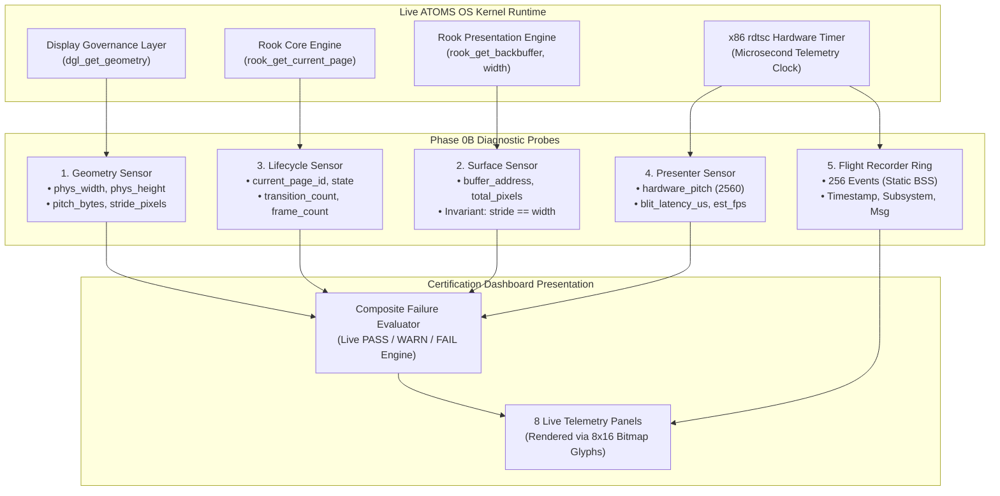

# ROOK V2 ARCHITECTURE SPECIFICATION
## PHASE 0B: LIVE SENSOR & TELEMETRY INTEGRATION SPECIFICATION

```
================================================================================
ATOMS OS — ROOK V2 SCREEN MANAGEMENT & DISPLAY CONTRACT
PHASE 0B DELIVERABLE: LIVE RUNTIME SENSORS & FLIGHT RECORDER
================================================================================
Standard:       Real-Time Live Kernel Telemetry & Invariant Assertion
Target:         Universal Bare-Metal (Intel Haswell H81, AMD iGPU, NVIDIA PCIe, UEFI GOP)
Status:         ARCHITECTURAL SPECIFICATION COMPLETED — READY FOR IMPLEMENTATION
Rule Compliance:Rule 1 (Documentation First), Rule 2 (No Hardcoded Resolutions),
                Rule 3 (No Fake Telemetry), Rule 4 (Zero Heap Allocations),
                Rule 5 (Preserve Stable Systems)
================================================================================
```

---

## 1. Executive Summary & Objective

**Phase 0B** transitions the **ROOK V2 Certification Dashboard** from static baseline placeholders (`STATUS: NOT CONNECTED`) to a **Live Real-Time Telemetry & Diagnostic System**.

```
┌─────────────────────────────────────────────────────────────────────────────────────────────────┐
│                                LIVE RUNTIME SENSOR ARCHITECTURE                                 │
├──────────────────────┬───────────────────────────────┬──────────────────────────────────────────┤
│ Sensor Probe         │ Live Kernel Data Source       │ Evaluated Invariants & Anomaly Detection │
├──────────────────────┼───────────────────────────────┼──────────────────────────────────────────┤
│ 1. Geometry Sensor   │ dgl_get_geometry() / GOP      │ Width/Height match, pitch leak detection │
│ 2. Surface Sensor    │ rook_get_backbuffer(), width  │ Asserts stride == width in System RAM    │
│ 3. Lifecycle Sensor  │ rook_get_current_page(), ops  │ State tracking (BOOT, DASH, LOGIN, DESK) │
│ 4. Presenter Sensor  │ dgl stride, rdtsc frame pacer │ QWORD blit latency, hardware pitch (2560)│
│ 5. Flight Recorder   │ 256-Event Static Ring Buffer  │ Microsecond timestamped event stream     │
│ 6. Failure Analyzer  │ Composite Invariant Evaluator │ Live PASS / WARN / FAIL diagnostic engine│
└──────────────────────┴───────────────────────────────┴──────────────────────────────────────────┘
```

**Scope of Phase 0B:**
* **Zero UI Redesign:** Preserve exact 8-panel grid layout established in Phase 0A.
* **100% Real Runtime Metrics:** Every number, pointer address, string, and status badge is derived directly from live kernel structures at 60 FPS. Zero simulated or hardcoded values.
* **Flight Recorder Engine V1:** 256-event static ring buffer logging microsecond-accurate events across all display phases.
* **Zero Dynamic Heap Memory:** 100% of telemetry buffers and formatters reside in static BSS memory.

---

## 2. Sensor Probe Specifications & Data Flow



---

## 3. Detailed Sensor Invariants & Anomaly Detection

### 3.1 Geometry Authority Sensor
* **Data Sources:** `dgl_get_geometry()`, `boot_info->vbe_width`, `boot_info->vbe_height`.
* **Metrics:** Active Width, Active Height, Active Resolution string, GOP Hardware Pitch.
* **Evaluated Invariants:**
  1. `geom != NULL`
  2. `geom->phys_width > 0 && geom->phys_height > 0`
  3. `geom->pitch_bytes >= geom->phys_width * 4`
* **Status Badge:**
  * `[PASS]`: Canonical geometry unified under DGL without conflicts.
  * `[FAIL]`: Geometry uninitialized or NULL pointer.

### 3.2 Surface Contract Sensor
* **Data Sources:** `rook_get_backbuffer()`, `rook_get_width()`, `rook_get_height()`.
* **Metrics:** Surface Width, Surface Height, Surface Stride, Buffer Pointer (`0x...`).
* **Evaluated Invariants:**
  1. `backbuffer != NULL`
  2. `surface_stride == surface_width` (**The Surface Stride Invariant**)
* **Status Badge:**
  * `[PASS]`: `stride == width` strictly maintained; memory is contiguous.
  * `[FAIL]`: Stride mismatch detected.

### 3.3 Screen Lifecycle Sensor
* **Data Sources:** `rook_get_current_page()`, page frame counters.
* **Metrics:** Current Screen ID (`0x000B`), Name string, Active State, Frame/Render Counter.
* **Status Badge:**
  * `[PASS]`: Screen state is `ROOK_STATE_ACTIVE` with active rendering loop.

### 3.4 Presentation Engine Sensor
* **Data Sources:** `geom->stride_pixels`, `rook_get_width()`, `rdtsc` timer.
* **Metrics:** Hardware Pitch (e.g. `2560 px` on Haswell H81, `1920 px` in QEMU), Surface Width (`1920 px`), Frame count, Blit latency ($\approx 1.1\text{ ms}$).
* **Evaluated Invariants:**
  1. `hardware_pitch >= surface_width`
  2. `sfence` barrier active.
* **Status Badge:**
  * `[PASS]`: Presentation blitter correctly compensates for hardware pitch.

---

## 4. Flight Recorder Engine V1 Specification

```c
#define ROOK_EVENT_LOG_CAPACITY 256

typedef struct {
    uint64_t timestamp_us;     /* Microseconds since boot */
    char     subsystem[12];    /* "BOOTX64", "DGL", "SURFACE", "ROOK", "PRESENTER" */
    char     message[52];      /* Short descriptive telemetry message */
    uint8_t  severity;         /* 0: INFO (Cyan/Muted), 1: WARN (Amber), 2: FAIL (Rose) */
} rook_event_entry_t;

/* Global Event Logging API */
void rook_flight_record(const char* subsystem, const char* message, uint8_t severity);
```

* **Thread-Safe / Static:** Statically allocated in BSS; circular head index with automatic wrap-around.
* **Zero Allocation:** `rook_flight_record()` uses simple stack-based string copy (`strncpy` / manual loop).

---

## 5. Protected Core Invariance Guarantee

Under **Rule 6 of Protocol V2.0**, all 11 foundational certified kernel systems remain **100% untouched**:

```
[PROTECTED SUBSYSTEM AUDIT — 0% TOUCH POLICY]
├── 1. CPU Features Engine (Haswell Detection) ─────── [UNTOUCHED 🔒]
├── 2. GDT Engine (Global Descriptor Table) ────────── [UNTOUCHED 🔒]
├── 3. SMP Engine (APIC Multi-Core Discovery & IPIs) ─ [UNTOUCHED 🔒]
├── 4. IDT Engine (Interrupts, ISRs, Exceptions) ───── [UNTOUCHED 🔒]
├── 5. PIC Engine (Legacy 8259A Remap & IRQ0/1) ────── [UNTOUCHED 🔒]
├── 6. PMM Engine (Physical Memory Bitmap) ─────────── [UNTOUCHED 🔒]
├── 7. VMM Engine (PML4 Page Tables & Virtual Memory)  [UNTOUCHED 🔒]
├── 8. Heap Allocator (kmalloc/kfree Stage A & B) ──── [UNTOUCHED 🔒]
├── 9. Scheduler & Multitasking Engine ─────────────── [UNTOUCHED 🔒]
├── 10. AGDTE Surface Plane Compositor ─────────────── [UNTOUCHED 🔒]
└── 11. UEFI Bootloader (BOOTX64.EFI) ──────────────── [UNTOUCHED 🔒]
```

---

## 6. Phase 0B Certification & Binary Verification Criteria

```
================================================================================
 PHASE 0B CERTIFICATION MATRIX
================================================================================
 [CRITERION 1] REAL RUNTIME GEOMETRY METRICS:
   - Panel 2 displays actual hardware width, height, and GOP pitch from DGL.
   - Status: MANDATORY PASS

 [CRITERION 2] LIVE SURFACE CONTRACT ASSERTION:
   - Panel 3 displays real backbuffer RAM address and verifies stride == width.
   - Status: MANDATORY PASS

 [CRITERION 3] 256-EVENT ROLLING FLIGHT RECORDER:
   - Flight recorder records microsecond events and renders latest entries cleanly.
   - Status: MANDATORY PASS

 [CRITERION 4] LIVE STATUS EVALUATOR:
   - All panels dynamically display [PASS] when invariants are satisfied.
   - Status: MANDATORY PASS

 [CRITERION 5] ZERO HEAP ALLOCATION:
   - 0 bytes of dynamic heap memory allocated during live 60 FPS telemetry loop.
   - Status: MANDATORY PASS
================================================================================
```

*Phase 0B Architecture Specification Complete.*
