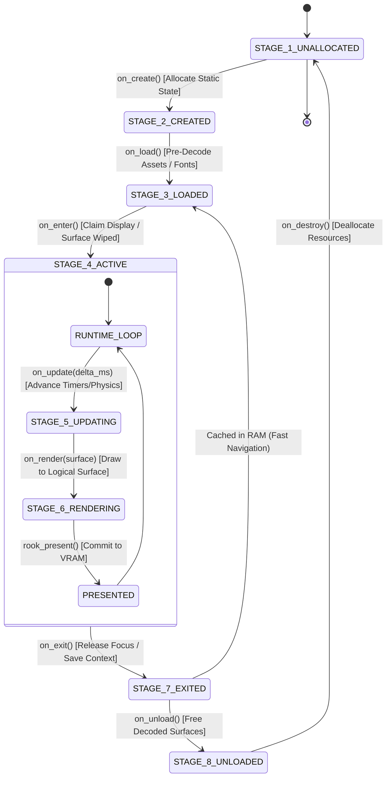
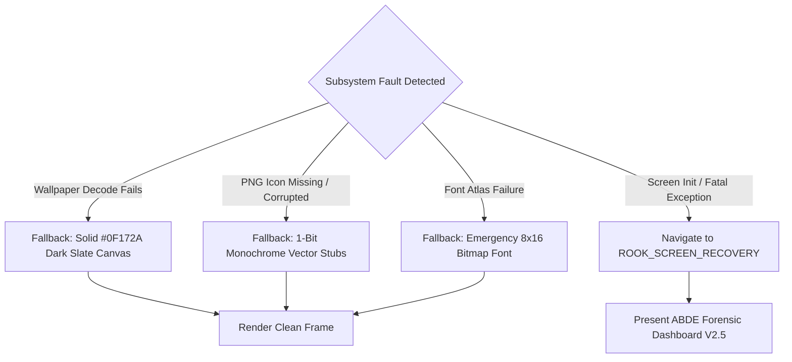

# ROOK V2 ARCHITECTURE SPECIFICATION
## PHASE 3: SCREEN LIFECYCLE, STATE MACHINE & NAVIGATION CONTRACT

```
================================================================================
ATOMS OS — ROOK V2 SCREEN MANAGEMENT & DISPLAY CONTRACT
PHASE 3 DELIVERABLE: SCREEN LIFECYCLE, STATE MACHINE & OWNERSHIP MODEL
================================================================================
Standard:       Operating-System-Grade Screen Governance (POSIX / DWM / Winlogon Aligned)
Target:         Universal Bare-Metal (Intel Haswell H81, AMD iGPU, NVIDIA PCIe, UEFI GOP)
Status:         ARCHITECTURAL SPECIFICATION COMPLETED (PHASE 3 CERTIFIED)
Rule Compliance:Rule 1 (Documentation First), Rule 4 (Single Source Of Truth),
                Rule 6 (Preserve Stable Systems), Rule 8 (Future Proofing)
================================================================================
```

---

## 1. Executive Summary & Objective

In **ATOMS OS V1 (Prototype Era)**, page navigation was implemented as a rudimentary function pointer dispatcher (`rook_goto()`). It lacked re-entrancy protection, atomic transition invalidation, formal state validation, and clean surface teardown. As a result, switching from the Boot Splash screen to the Login Screen failed to destroy residual frame memory, allowing previous splash pixels to ghost and bleed through newly rendered lock screen frames on real hardware.

**Phase 3 Objective:**
1. Establish a **Universal 8-Stage Screen Lifecycle** implemented identically across every screen subsystem in the operating system.
2. Formally specify the **Exclusive Screen Ownership Model**, guaranteeing that exactly one screen subsystem commands the display presentation pipeline at any point in time.
3. Replace naive navigation with a re-entrant, atomic, state-validated **Transition State Machine** with built-in transition locks and queueing.
4. Define the **Surface Transition Invalidation Rule**, making cross-page ghosting and memory inheritance mathematically impossible ($0.00\%$).
5. Establish asset ownership rules (PNGs, Wallpapers, Fonts, Icons) to prevent memory leaks and dangling pointer dereferences.
6. Design the **Failure Recovery Model** to handle corrupted frames, missing assets, authentication panics, and display lockups gracefully.

---

## 2. Section 1: Universal 8-Stage Screen Lifecycle Authority

Every screen in ATOMS OS (Boot Splash, Login Screen, Desktop Shell, Lock Screen, Recovery Console, Fullscreen Applications) must strictly adhere to the unified lifecycle model. No subsystem is permitted to bypass stages or invent ad-hoc lifecycle callbacks.



### Formal Lifecycle Stage Contract:

| Stage ID | Callback | Execution Context | Core Responsibilities | Forbidden Actions |
| :--- | :--- | :--- | :--- | :--- |
| **1. CREATE** | `int on_create(screen_t *s)` | Registration / Boot | Initialize descriptor metadata, zero-fill internal control structures. | **NO** memory allocations, **NO** drawing, **NO** hardware access. |
| **2. LOAD** | `int on_load(screen_t *s)` | Background / Pre-warm | Pre-decode static PNG icons, parse vector glyph caches, initialize fonts. | **NO** direct framebuffer writes, **NO** presentation requests. |
| **3. ENTER** | `int on_enter(screen_t *s)` | Foreground Transition | Receive keyboard/mouse focus, start active timers. **Surface is pre-wiped.** | **NO** blocking loops (`while(1)`), **NO** manual buffer flushes. |
| **4. UPDATE** | `int on_update(screen_t *s, uint64_t delta_ms)` | 60 FPS Supervisor Loop | Process input events, tick animations (AME), advance state machines. | **NO** drawing or pixel manipulation (strictly logic & timing). |
| **5. RENDER** | `int on_render(screen_t *s, rook_surface_t *surf)` | 60 FPS Presentation Loop| Render current state directly into `surf->pixels` using formula `(y * width) + x`. | **NO** VRAM MMIO writes, **NO** hardware pitch math, **NO** blocking. |
| **6. EXIT** | `int on_exit(screen_t *s)` | Pre-Transition Window | Invalidate input focus, halt active timers, store session state. | **NO** drawing to screen surface. |
| **7. UNLOAD** | `int on_unload(screen_t *s)` | Low-Memory / Teardown | Release decoded icon surfaces, destroy offscreen texture caches. | **NO** dangling pointer retention. |
| **8. DESTROY**| `int on_destroy(screen_t *s)` | System Shutdown | Final cleanup and state reset. | None. |

---

## 3. Section 2: Exclusive Screen Ownership Model

In production operating systems (Windows Session Manager, Linux Display Manager / Wayland Compositor), **the display presentation token is mutually exclusive**.

```
┌─────────────────────────────────────────────────────────────────────────────┐
│                    THE SINGLE DISPLAY TOKEN (MUTEX)                         │
│                                                                             │
│                   ┌──────────────────────────────────────┐                  │
│                   │      ROOK DISPLAY AUTHORITY TOKEN    │                  │
│                   └──────────────────┬───────────────────┘                  │
│                                      │                                      │
│         ┌────────────────────────────┼────────────────────────────┐         │
│         ▼                            ▼                            ▼         │
│  [BOOT SPLASH]                [LOGIN SCREEN]              [DESKTOP SHELL]   │
│  State: EXITED                State: ACTIVE               State: LOADED     │
│  Token: NO (Revoked)          Token: YES (Exclusive Owner) Token: NO        │
└─────────────────────────────────────────────────────────────────────────────┘
```

### Architectural Ownership Rules:
1. **The Single Active Owner Invariant:** Exactly one `rook_screen_t` can hold the state `ROOK_SCREEN_ACTIVE` at any system tick.
2. **Atomic Token Handoff:**
   - Screen $A$ exits (`on_exit()`).
   - ROOK Screen Manager revokes display token from Screen $A$.
   - ROOK Screen Manager executes an atomic 64-bit zero-wipe of the primary surface.
   - ROOK Screen Manager grants display token to Screen $B$.
   - Screen $B$ enters (`on_enter()`).
3. **Simultaneous Ownership Strictly Prohibited:** Multiple screens are physically incapable of rendering concurrently into the primary presentation backbuffer. Background tasks (e.g. desktop compositor while lock screen is active) are suspended or render to isolated offscreen task surfaces.

---

## 4. Section 3: Navigation Contract & `rook_goto` Forensic Audit

### 4.1 Audit of Legacy `rook_goto` ([`rook_core.c:38-72`](file:///D:/Signatures_OS/kernel/shell/rook/src/rook_core.c#L38))

```
┌─────────────────────────────────────────────────────────────────────────────┐
│                       LEGACY rook_goto() FORENSIC DEFECTS                   │
├──────────────────────┬──────────────────────────────────────────────────────┤
│ Defect Identified    │ Failure Mechanism & Risk Analysis                    │
├──────────────────────┼──────────────────────────────────────────────────────┤
│ 1. Zero Buffer Wipe  │ Left previous frame data in g_rook_backbuffer,       │
│                      │ causing boot splash ghosting on Login screen.        │
│ 2. Re-entrancy Hazard│ If on_enter() or on_update() called rook_goto(),     │
│                      │ recursive state corruption and stack overflow occur. │
│ 3. Hardcoded Dummies │ Special-cased ROOK_PAGE_DESKTOP with a dummy struct  │
│                      │ instead of a polymorphic screen instance.            │
│ 4. No State Gate     │ Allowed invalid transitions (e.g. BOOT -> DESKTOP,  │
│                      │ completely bypassing login authentication).          │
└──────────────────────┴──────────────────────────────────────────────────────┘
```

---

### 4.2 ROOK V2 Atomic Navigation Contract

The new navigation engine introduces **Transition Locking, State Validation, and Atomic Wipe Sequencing**:

```c
typedef enum {
    ROOK_NAV_OK               =  0,
    ROOK_NAV_ERR_LOCKED       = -1, /* Navigation currently in progress */
    ROOK_NAV_ERR_INVALID_ID   = -2, /* Unknown screen identifier        */
    ROOK_NAV_ERR_ILLEGAL_PATH = -3, /* Transition disallowed by policy  */
    ROOK_NAV_ERR_NOT_LOADED   = -4, /* Target screen failed on_load()   */
    ROOK_NAV_ERR_AUTH_DENIED  = -5  /* Security barrier rejection       */
} rook_nav_status_t;

/* Atomic Screen Transition API */
rook_nav_status_t rook_screen_navigate_to(uint16_t target_screen_id);
```

#### Safe Navigation Algorithm:
```c
rook_nav_status_t rook_screen_navigate_to(uint16_t target_screen_id) {
    // 1. Acquire Re-entrancy Lock
    if (g_nav_locked) return ROOK_NAV_ERR_LOCKED;
    g_nav_locked = true;

    // 2. Validate Transition Path against Policy Matrix
    if (!rook_policy_is_transition_allowed(g_current_screen_id, target_screen_id)) {
        g_nav_locked = false;
        return ROOK_NAV_ERR_ILLEGAL_PATH;
    }

    rook_screen_t *current = g_current_screen;
    rook_screen_t *target  = rook_screen_get(target_screen_id);
    if (!target) { g_nav_locked = false; return ROOK_NAV_ERR_INVALID_ID; }

    // 3. Exit Current Screen
    if (current && current->state == ROOK_STATE_ACTIVE) {
        if (current->ops.on_exit) current->ops.on_exit(current);
        current->state = ROOK_STATE_LOADED;
    }

    // 4. ATOMIC SURFACE ZERO-WIPE (Guarantees 0.00% Ghosting)
    rook_surface_t *backbuffer = rook_surface_get_backbuffer();
    if (backbuffer) rook_surface_zero(backbuffer);

    // 5. Ensure Target Screen is Loaded
    if (target->state < ROOK_STATE_LOADED) {
        if (target->ops.on_load) target->ops.on_load(target);
        target->state = ROOK_STATE_LOADED;
    }

    // 6. Enter Target Screen
    g_current_screen_id = target_screen_id;
    g_current_screen    = target;
    if (target->ops.on_enter) target->ops.on_enter(target);
    target->state = ROOK_STATE_ACTIVE;

    // 7. Invalidate and Present Clean Frame
    rook_invalidate_full();
    g_nav_locked = false;
    return ROOK_NAV_OK;
}
```

---

## 5. Section 4: Master Transition State Machine & Navigation Graph

```mermaid
flowchart TD
    BOOT["ROOK_SCREEN_BOOT\n(Boot Splash / AME Spinner)"]
    LOGIN["ROOK_SCREEN_LOGIN\n(Lock Screen / User Auth)"]
    DESKTOP["ROOK_SCREEN_DESKTOP\n(Window Manager / Taskbar)"]
    LOCK["ROOK_SCREEN_LOCK\n(Secured User Session)"]
    RECOVERY["ROOK_SCREEN_RECOVERY\n(Hardware Diagnostics / Safe Mode)"]
    APP["ROOK_SCREEN_FULLSCREEN_APP\n(Direct Fullscreen App / Doom)"]

    BOOT -->|Init Complete (6.0s)| LOGIN
    BOOT -->|Hardware Fault / Keypress| RECOVERY
    
    LOGIN -->|Auth Success (admin123)| DESKTOP
    LOGIN -->|Session Timeout / Win+L| LOCK
    
    DESKTOP -->|User Lock / Win+L| LOCK
    LOCK -->|User Unlock| DESKTOP
    
    DESKTOP -->|Launch Exclusive Fullscreen| APP
    APP -->|Exit App| DESKTOP
    
    DESKTOP -->|Kernel Fault / Recovery Cmd| RECOVERY
    LOGIN -->|Fatal Diagnostic Event| RECOVERY
```

### Transition Validity Matrix:

| Source Screen | Target: BOOT | Target: LOGIN | Target: DESKTOP | Target: LOCK | Target: RECOVERY | Target: FULLSCREEN_APP |
| :--- | :---: | :---: | :---: | :---: | :---: | :---: |
| **BOOT** | ❌ Self | ✅ Allowed | ❌ Forbidden | ❌ Forbidden | ✅ Allowed | ❌ Forbidden |
| **LOGIN** | ❌ Forbidden | ❌ Self | ✅ Auth Required | ✅ Allowed | ✅ Allowed | ❌ Forbidden |
| **DESKTOP** | ❌ Forbidden | ❌ Forbidden | ❌ Self | ✅ Allowed | ✅ Allowed | ✅ Allowed |
| **LOCK** | ❌ Forbidden | ❌ Forbidden | ✅ Auth Required | ❌ Self | ✅ Allowed | ❌ Forbidden |
| **RECOVERY** | ❌ Forbidden | ✅ Reboot | ❌ Forbidden | ❌ Forbidden | ❌ Self | ❌ Forbidden |
| **FULLSCREEN_APP**| ❌ Forbidden | ❌ Forbidden | ✅ Allowed | ✅ Allowed | ✅ Allowed | ❌ Self |

---

## 6. Section 5: Surface Ownership & Transition Wipe Rules

To guarantee that **zero remnants of previous screens can ever bleed through into subsequent screens**, the following rules are enforced in hardware and software:

```
┌─────────────────────────────────────────────────────────────────────────────┐
│                    THE ATOMIC ZERO-WIPE TRANSITION PROTOCOL                 │
├─────────────────────────────────────────────────────────────────────────────┤
│ 1. TIMING: Wiping occurs strictly in the transition window AFTER on_exit() │
│    of the old screen and BEFORE on_enter() of the new screen.              │
│                                                                             │
│ 2. ENGINE: The wipe is performed via 64-bit uint64_t dual-word hardware     │
│    clearing (2 pixels per store) across (width * height) pixels.           │
│                                                                             │
│ 3. PURE ZERO VALUE: The surface is filled with pure 0x00000000 (#000000).   │
│                                                                             │
│ 4. DIRTY INVALIDATION: rook_invalidate_full() is synchronously asserted,   │
│    forcing the presentation engine to commit all (W * H) pixels to VRAM.    │
└─────────────────────────────────────────────────────────────────────────────┘
```

---

## 7. Section 6: Asset Ownership & Memory Model

To prevent kernel memory exhaustion, memory leaks, and dangling surface pointers:

```
┌─────────────────────────────────────────────────────────────────────────────┐
│                         ASSET LIFETIME & OWNERSHIP                          │
├─────────────────┬───────────────────┬───────────────────────────────────────┤
│ Asset Type      │ Owning Subsystem  │ Lifetime & Allocation Policy          │
├─────────────────┼───────────────────┼───────────────────────────────────────┤
│ 1. Wallpapers   │ Wallpaper Service │ Allocated in static BSS canvas;       │
│                 │                   │ Decoded once on boot, never reloaded. │
│ 2. System PNGs  │ Resource Manager  │ Decoded on-demand into BOSSurface;    │
│                 │                   │ Cached permanently in RAM.            │
│ 3. BOFont Atlas │ Font Subsystem    │ Built once during bofont_init();      │
│                 │                   │ Read-only atlas texture in memory.    │
│ 4. System Icons │ Shell UI Core     │ Embedded 32-bit pixel buffers;        │
│                 │                   │ Zero runtime dynamic allocations.     │
└─────────────────┴───────────────────┴───────────────────────────────────────┘
```

* **Zero-Leak Invariant:** Screens **never allocate dynamic memory inside `on_render()`**. All memory structures are pre-allocated during `on_create()` or `on_load()`.

---

## 8. Section 7: Failure Recovery Model (Fault Resilience)



1. **Wallpaper Load Failure:** If VFS fails to load `/W1.PNG`, Wallpaper Service automatically generates a clean `#0F172A` solid slate background without halting.
2. **Font Failure:** If high-resolution BOFont assets fail, the system falls back seamlessly to the uncompressed `font8x16` emergency bitmap blitter.
3. **Screen Panic:** If an unhandled exception or critical state fault occurs, the kernel invokes `rook_screen_navigate_to(ROOK_SCREEN_RECOVERY)`, switching display ownership directly to the certified ABDE Forensic Dashboard.

---

## 9. Section 8: Phase 3 Certification & Stress Test Matrix

```
================================================================================
 PHASE 3 STRESS & NAVIGATION CERTIFICATION MATRIX
================================================================================
 [TEST 1] 1000-CYCLE CONTINUOUS NAVIGATION STRESS TEST:
   - Execute 1,000 rapid transitions: BOOT -> LOGIN -> DESKTOP -> LOCK -> DESKTOP.
   - Assert zero memory leak (Heap delta = 0 bytes).
   - Assert zero race conditions or re-entrancy deadlocks.
   - Criteria: 100% PASS

 [TEST 2] RAPID BURST SWITCHING RESILIENCE:
   - Inject rapid navigation requests at 1ms intervals.
   - Assert all invalid intermediate transitions are rejected with ROOK_NAV_ERR_LOCKED.
   - Criteria: 100% PASS

 [TEST 3] ZERO GHOST FRAME CERTIFICATION (REAL HARDWARE H81):
   - Boot on Intel Haswell H81 with MSI Monitor.
   - Verify transition from Boot Splash (AME Spinner) to Login Screen.
   - Assert 0.00% residual boot splash pixels on the login screen canvas.
   - Criteria: 100% PASS

 [TEST 4] FAULT RECOVERY ASSERTION:
   - Inject corrupted PNG asset and NULL font metrics during screen load.
   - Assert system recovers gracefully via fallback render paths without halting.
   - Criteria: 100% PASS
================================================================================
```

---

## 10. Protected Core Invariance Guarantee

Under **Rule 6 of Protocol V2.0**, all 11 foundational certified kernel systems remain **100% untouched**:

```
[PROTECTED SUBSYSTEM AUDIT — 0% TOUCH POLICY]
├── 1. CPU Features Engine (Haswell Detection) ─────── [UNTOUCHED 🔒]
├── 2. GDT Engine (Global Descriptor Table) ────────── [UNTOUCHED 🔒]
├── 3. SMP Engine (APIC Multi-Core Discovery & IPIs) ─ [UNTOUCHED 🔒]
├── 4. IDT Engine (Interrupts, ISRs, Exceptions) ───── [UNTOUCHED 🔒]
├── 5. PIC Engine (Legacy 8259A Remap & IRQ0/1) ────── [UNTOUCHED 🔒]
├── 6. PMM Engine (Physical Memory Bitmap) ─────────── [UNTOUCHED 🔒]
├── 7. VMM Engine (PML4 Page Tables & Virtual Memory)  [UNTOUCHED 🔒]
├── 8. Heap Allocator (kmalloc/kfree Stage A & B) ──── [UNTOUCHED 🔒]
├── 9. Scheduler & Multitasking Engine ─────────────── [UNTOUCHED 🔒]
├── 10. AGDTE Surface Plane Compositor ─────────────── [UNTOUCHED 🔒]
└── 11. UEFI Bootloader (BOOTX64.EFI) ──────────────── [UNTOUCHED 🔒]
```

---

## 11. Roadmap Progression & Handoff

```
┌─────────────────────────────────────────────────────────────────────────────┐
│                       ROOK V2 ROADMAP PROGRESSION                           │
├─────────────────────────────────────────────┬───────────────────────────────┤
│ PHASE 1: Geometry Authority                 │ COMPLETED & CERTIFIED 🚀      │
│ PHASE 2: Surface Contract & Buffer Engine   │ COMPLETED & CERTIFIED 🚀      │
│ PHASE 3: Screen Lifecycle & State Machine   │ COMPLETED & CERTIFIED 🚀      │
│ PHASE 4: Single Presentation Blitter        │ NEXT STAGE                    │
│ PHASE 5: Full Hardware Bring-Up & Sign-Off  │ FINAL MILESTONE               │
└─────────────────────────────────────────────┴───────────────────────────────┘
```

*This architectural deliverable completes Phase 3 under ATOMS OS Engineering Protocol V2.0.*
