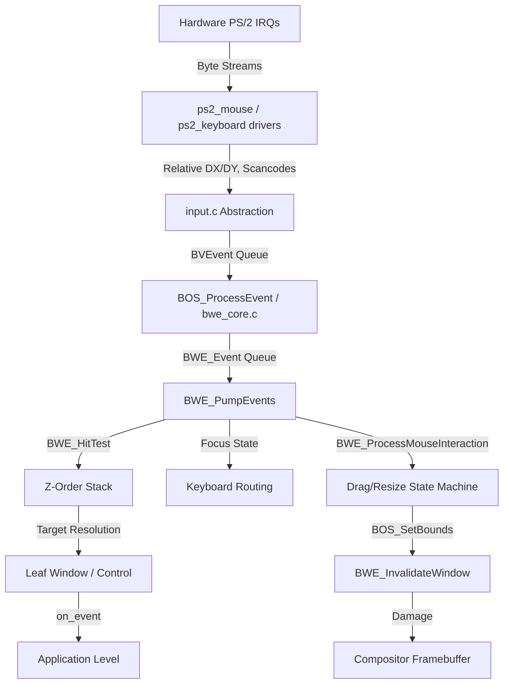

# Dependency Graph

## Top-to-Bottom Flow

## Circular Dependencies & Coupling
- **Input & Display:** The `input.c` layer relies directly on `g_kernel_screen_width` and `g_kernel_screen_height` from the VBE driver to clamp mouse coordinates.
- **BWE Core & BWE Window:** `bwe_core.c` calls `BWE_ProcessMouseInteraction` (in `bwe_window.c`), which accesses the Z-order globals defined in `bwe_core.c`.
- **Keyboard & Input:** `keyboard.c` uses a callback to `input.c` which relies on global mouse variables (`global_mouse_x`, etc.) to perfectly pack a `BVEvent` with both keyboard and mouse state.
