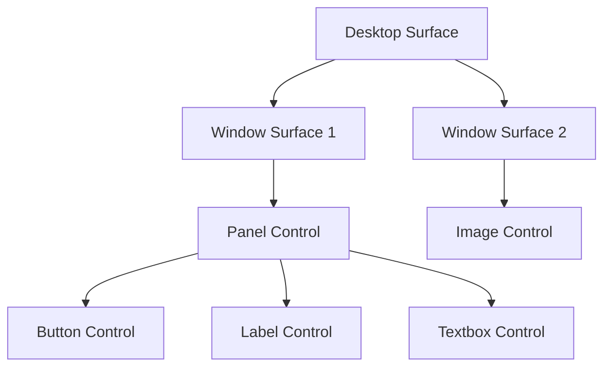
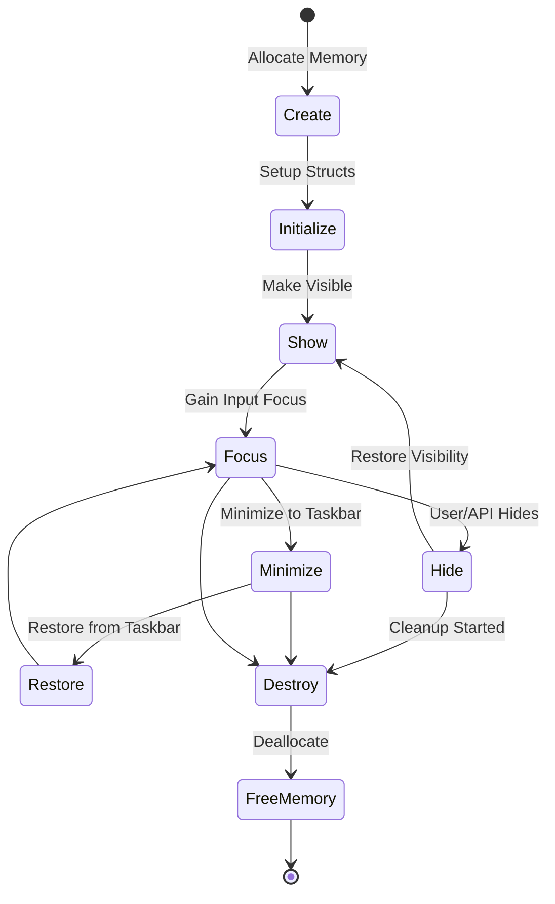
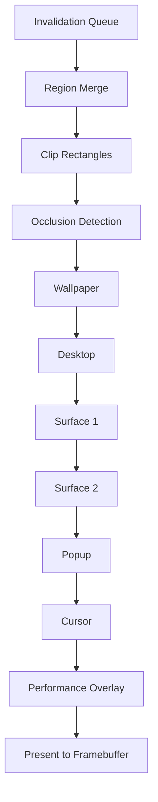
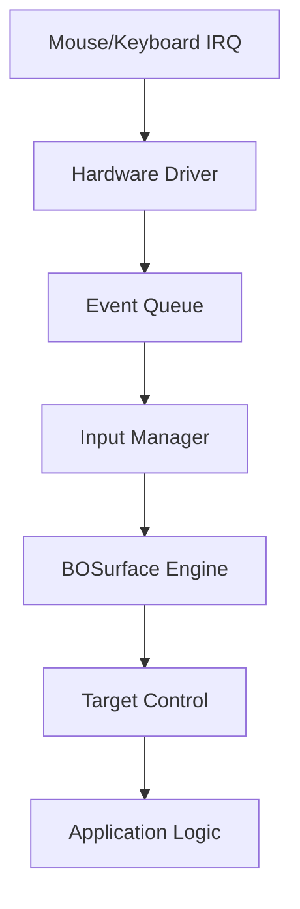
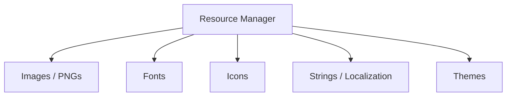
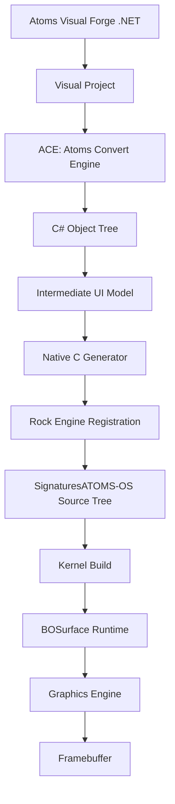

# BWE Architecture

**Version:** 1.0  
**Status:** Frozen  
**Compatibility:** ACE Version 1.x | SDK Version 1.x | Rock Version 1.x

This document defines the internal architecture of the BOSurface Window Engine (BWE). 
**NO IMPLEMENTATION CODE** should be written until this architecture is fully frozen and reviewed.

---

## 1. Surface Tree (Object Hierarchy)

The Surface Tree defines the hierarchical relationship between surfaces and controls. This tree structure enables event propagation, coordinate translation, and clipping.

---

## 2. Surface Properties & IDs

Every Surface is uniquely identified and holds critical metadata for debugging and ownership.

**Example Structure:**
- `SurfaceID`: 1001 (Unique Global ID)
- `ParentID`: 1000
- `OwnerProcess`: "Explorer" (PID/Name)
- `Flags`: `Visible | Focused | DoubleBuffered | Alpha`

---

## 3. Surface Lifecycle

Every BOSurface object must strictly follow this lifecycle from allocation to destruction.

---

## 4. Surface States

To prevent bugs and ensure correct rendering/interaction, a surface must always be in a well-defined state.

- `Created`
- `Visible`
- `Hidden`
- `Focused`
- `Inactive`
- `Dragging`
- `Resizing`
- `Minimized`
- `Maximized`
- `Destroyed`

---

## 5. Render Pipeline (Surface Composition Engine)

The rendering flow ensures minimal draw calls by utilizing occlusion detection, region merging, clip rectangles, and an invalidation queue.

---

## 6. Controls & Theme Engine Flow

Controls **never** directly draw pixels. They delegate rendering to the Theme Engine to ensure a unified UI aesthetic and abstraction.

---

## 7. Event Pipeline (With Queue)

Hardware interrupts are translated into abstract events, queued to prevent drops during fast movement, and routed to the correct focused surface.

---

## 8. Resource Manager

BWE includes a unified Resource Manager to support modern UI assets required by Visual Forge.

---

## 9. Data & Memory Flow (Object Ownership)

- **Kernel Heap**: Owns the BWE Internal Structures (Surface List, Render Queue).
- **Surface Object**: Owns its Backing Buffer (if double buffered) and its Children list.
- **Controls**: Owned by their Parent Surface. 
- **Destruction**: Freeing a parent automatically recursively frees children.

---

## 10. Visual Forge Compatibility Specification

**Goal:** Design the BOSurface SDK so every API can be automatically generated by Atoms Visual Forge through ACE. The BOSurface SDK acts as the native runtime for all generated UI. **Visual Forge is the PRIMARY CONSUMER of this architecture.**

### Ecosystem Pipeline

### SDK and API Rules
- **Rule 1**: No generated code shall directly access the framebuffer.
- **Rule 2**: Generated applications must communicate ONLY through the BOSurface SDK.
- **Rule 3**: All rendering is performed strictly by the BOSurface runtime.

**Allowed APIs (Abstracted):**
See `BWE_API_SPECIFICATION.md`

**Strictly Forbidden in Generated Code:**
`DrawPixel()`, `DrawRect()`, `DrawText()`

---

## 11. Rock Engine Specification

The Rock Engine manages application and screen transitions loaded during boot or application startup via a unified screen registry.

**Screen Registry Indices:**
- `Index 0` → Splash
- `Index 1` → Login
- `Index 2` → Welcome
- `Index 3` → Desktop
- `Index 4` → Explorer
- `Index 5` → Settings

Rock Engine requests a screen from the registry, which then leverages BOSurface to populate its views.

---

## 12. Threading Plan (Future)

Currently, BWE runs within the single-threaded or kernel context. In the future:
- **Input Thread**: Handles IRQs and queues events.
- **Compositor Thread**: Processes the Invalidation Queue and pushes to VBE/GPU.
- **App Threads**: Push render requests to BWE IPC.

---

## 13. Error Codes

Return values and logs use structured error codes:

| Code | Description |
|---|---|
| `BWE0001` | Invalid Surface Pointer |
| `BWE0002` | Invalid Parent |
| `BWE0003` | Render Failed |
| `BWE0004` | Memory Allocation Failed |
| `BWE0005` | Focus Error |
| `BWE0006` | Dirty Region Overflow |
| `BWE0007` | Invalid Control |
| `BWE0008` | Surface Already Exists |

---

## 14. Debugging Levels

The debugging system supports granular output levels to avoid log spam while retaining critical diagnostic data.

**Log Levels:** `BWE_INFO`, `BWE_WARN`, `BWE_ERROR`, `BWE_FATAL`

**Subsystem Tags:** `BWE_RENDER`, `BWE_INPUT`, `BWE_EVENT`, `BWE_LAYOUT`, `BWE_MEMORY`, `BWE_PERFORMANCE`

---

## 15. Performance Overlay

A built-in diagnostic overlay for tracking composition efficiency (similar to BMDE).

**Metrics Tracked:** FPS, Surface Count, Dirty Regions Count, Render Time, Clip Rects Count, Memory Usage, Events/sec, CPU ms, Draw Calls.
